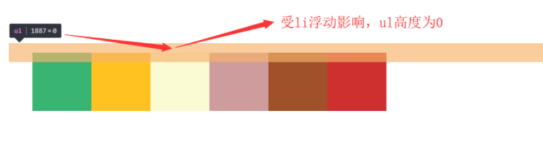
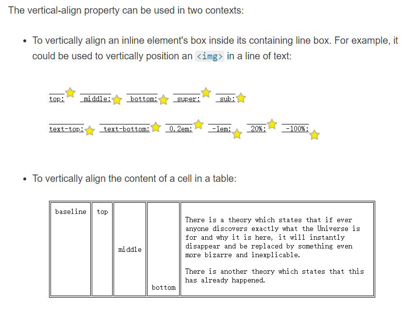

## 为什么height:100%不生效

对于`height`属性，如果父元素`height`为`auto`，只要子元素在文档流中（即`position`不等于`fixed`或者`absolute`），其百分比值完全就被忽略了。

```html
<style>
    .box {
      width: 100%; // 这是多余的
      height: 100%; // 这是无效的
      background: #000;
    }
  </style> 
<body>
  <div class="box"></div>
</body>
```

### solution

1.设定显式的高度值。

```CSS
html, body {
 height: 100%;
}
```

2，使用绝对定位

```html
  <style>
    body {
      position: absolute;
      top: 0;
      bottom: 0;
      left: 0;
      right: 0;
    }

    .box {
      width: 100%;
      height: 100%;
      background: #000;
    }
  </style>

<body>
  <div class="box">
  </div>
</body>
```


## ul高度显示为0（内容撑不开）



### 推荐方法一

```html
<div class="fuqin">
    <ul>
        <li>内容1</li>
        <li>内容1</li>
         <div class="clearfloat"></div>
    </ul>
</div> 
<style>
.clearfloat{
    clear:both;
    height:0;
    font-size: 1px;
    line-height: 0px;} 
</style>
```

### 推荐方法二

利用伪元素:after,给ul清除浮动

```css
#box>ul:after{
    content: "";
    display: block;
    clear: both;
}
```

在:after为元素里面用到了content属性，这样这条样式的意思是在ul元素后面生成指定的内容，这里生成的内容是一个空字符串，因为只是让它来消除ul标签的高度折叠，并不让它显示出来。还有，这条样式里有display属性，要将他设置成block，这样clear属性才会起作用，因为清除操作只作用于块级元素，它的原理是为要执行清除操作的元素添加上边距，以此让元素降到浮动元素的下面，而操作行内元素的上边距不起作用。

### 方法三

 利用overflow属性 
可以包含元素设置overflow属性，并设置属性值为auto或者hidden。

```css
ul { 
list-style-type: none; 
width: 800px; background: blue; 
overflow: hidden; /*添加overflow属性，可以设置为auto或者hidden*/ }
```

## 元素对齐



- vertical-align ： 设置元素的垂直对齐方式。

- vertical-align注意点:

- - text-align是设置给需要对齐元素的父元素
  - vertical -align是设置给需要对齐的那个元素本身
  - vertical -align只对行内元素和单元格元素垂直居中生效

- 默认情况下图片和一行文字的基线对齐
- 基线就是一行文字中最短那个文字的底部

有宽度的块级元素居中对齐，是margin: 0 auto;

让文字居中对齐，是 text-align: center;

设置元素内容的垂直方式(只对行内元素,单元格元素生效,块级元素不生效).

特别是行内块元素， **通常用来控制图片/表单与文字的对齐;**

## 选择器

### 相邻兄弟选择器 （有识别器紧跟的一个）

 给指定选择器后面紧跟的那个选择器选中的标签设置属性.

```css
check1+check2{ //目的是设置check1后面紧跟屁股的check2 
    attr: value;
}
```

- 相邻兄弟选择器必须通过+连接;
- 相邻兄弟选择器只能选中紧跟其后的那个标签, 不能选中被隔开的标签.

### 通用兄弟选择器

 给指定选择器后面的所有选择器选中的所有标签设置属性.

```css
选择器1~选择器2{ //设置选择器1后面的全部选择器2
    属性:值;
}
```

- 通用兄弟选择器必须用~连接;
- 通用兄弟选择器选中的是指定选择器后面某个选择器选中的所有标签, 无论有没有被隔开都可以选中;

```html
<style>
    h1~p{
        color: chocolate;
    }
</style>

<h1>我是标题1</h1>
<a href="#">我是一个超链接</a>
<p>我是一个段落</p>
<p>我是一个段落</p>
<p>我是一个段落</p>
<h1>我是标题1</h1>
```

### 序选择器

- **同级别的第几个**

- -  注意点：不区分类型;

```css
:first-child 选中同级别中的第一个标签
:last-child 选中同级别中的最后一个标签
:nth-child(n) 选中同级别中的第n个标签
:nth-last-child(n) 选中同级别中的倒数第n个标签
:only-child 选中父元素中唯一的标签
```

- **同类型的第几个**

```css
:first-of-type 选中同级别中同类型的第一个标签
:last-of-type  选中同级别中同类型的最后一个标签
:nth-of-type(n) 选中同级别中同类型的第n个标签
:nth-last-of-type(n)  选中同级别中同类型的倒数第n个标签
:only-of-type 选中父元素中唯一类型的某个标签
```

- ## **同级别同类型的奇偶个**

```css
:nth-child(odd) 同级别奇数
:nth-child(even)同级别偶数
:nth-of-type(odd)同类型奇数
:nth-of-type(even)同类型偶数
```


## a标签的伪类选择器

 a标签的伪类选择器是专门用来修改a标签不同状态的样式的.

```css
:link 修改从未被访问过状态下的样式
:visited 修改被访问过的状态下的样式
:hover 修改鼠标悬停在a标签上状态下的样式
:active 修改鼠标长按状态下的样式
```