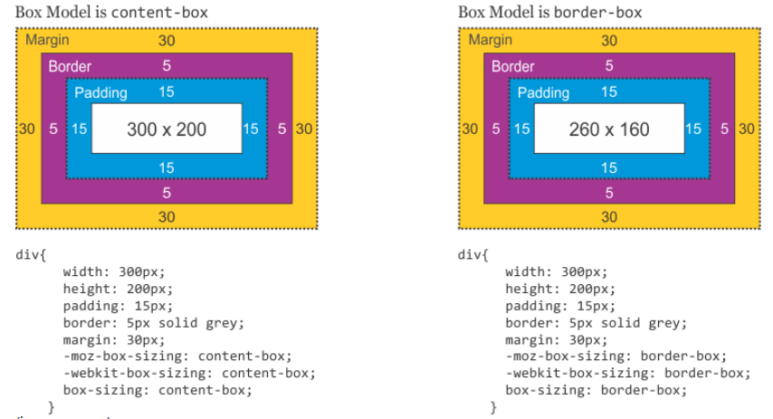
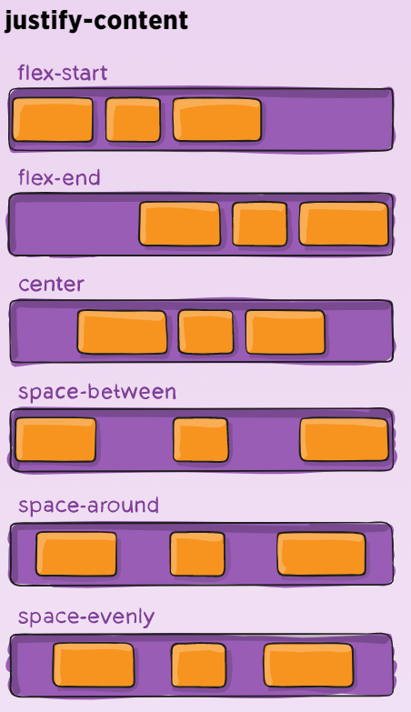
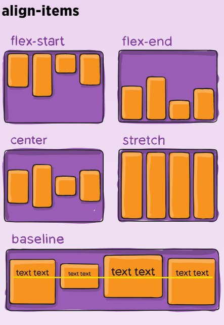
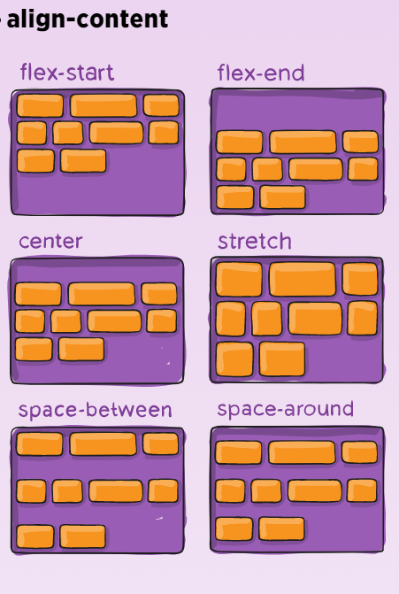

## P1

### 盒模型的理解

##### 什么是html盒子

盒子(block box) 和 内联盒子 (inline box)

块级： 换行 长宽会变化 边距无效

行类：一行 长宽无效 边距有效

Display ： inline block block inline

##### css盒子模型分类


盒模型组成：content box  padding box border box margin box

```
box-sizing: border-box;
```

##### CSS 选择器及其权重

行内样式 id选择器 类 伪类 元素 伪元素

 256进制

##### 实现居中

[参考1](https://louiszhai.github.io/2016/03/12/css-center/#%E6%B0%B4%E5%B9%B3%E5%B1%85%E4%B8%AD)

https://juejin.cn/post/6844903601479876622

>这里经常容易弄混淆
>
>position: absolute;    top: 50%;    left: 50%;    transform: translate(-50%, -50%);
>
>这里的top left 是相对于上面元素的边界，进行的移动。

 

##### line height & text aligen

[原理](https://www.zhangxinxu.com/wordpress/2015/08/css-deep-understand-vertical-align-and-line-height/)

### 总结居中办法

水平居中较为简单, 共提供了8种方法, 一般情况下 text-align:center,marin:0 auto; 足矣

- ① text-align:center;

- ② margin:0 auto;
- ③ width:fit-content;
- ④ flex
- ⑤ 盒模型
- ⑥ transform
- ⑦ ⑧ 两种不同的绝对定位方法

垂直居中, 共提供了8种方法.

- ① 单行文本, line-height
- ② 行内块级元素, 使用 display: inline-block, vertical-align: middle; 加上伪元素辅助实现（少说 ，这个深）
- ③ vertical-align
- ④ flex
- ⑤ 盒模型
- ⑥ transform
- ⑦ ⑧ 两种不同的绝对定位方法（或者负外边距）

## p2

### BFC 以及 清除浮动办法

#### BFC 块格式化上下文

BFC(Block Formatting Context)，块级格式化上下文，是一个独立的渲染区域，让处于 BFC 内部的元素与外部的元素相互隔离，使内外元素的定位不会相互影响

**BFC是一个容器，用于管理块级元素**

**触发条件 (以下任意一条)**

- `float`的值不为`none`
- `overflow`的值不为`visible`
- `display`的值为`table-cell`、`tabble-caption`和`inline-block`之一
- `position`的值不为`static`或`releative`中的任何一个

**开发中的应用**

- 阻止`margin`重叠（父子 兄弟）
- 可以包含浮动元素 （高度塌陷）—— 清除内部浮动(清除浮动的原理是两个 `div`都位于同一个 `BFC` 区域之中)
- 自适应两栏布局
- 可以阻止元素被浮动元素覆盖

#### 清除浮动的方法

##### 1. 利用clear样式

```css
.textDiv {
    clear: left;// 在浮动元素的方便（左右方向是指清左边或者清理右边的浮动元素）
    clear: both；//在整个父元素的最后
}
```

##### 2. 父元素结束标签之前插入清除浮动的块级元素

##### 3. 利用伪元素（clearfix）

```css
//clearfix 父元素的class
.clearfix:after {
    content: '.';
    height: 0;
    display: block;
    clear: both;
}
```

> 其实前面三个的原理是一样的

##### 4. overflow 不为visible

```css
.parent {
    overflow: auto;
}
```

在父级元素上添加了一个值为auto的overflow属性，父元素的高度立即被撑起，将浮动元素包裹在内

##### 5.  display: inline-block

```css
.parent {
    display: inline-block;
}
```

[清除浮动的原理](https://juejin.cn/post/6844903504545316877)

> **触发BFC的方式：**
>
> 1. float 不为 none，浮动元素所在的区域就是一个 BFC 区域。
> 2. position 的值不是 static 或 relative 的元素所在的区域就是一个 BFC 区域 (fix absolute static)
> 3. display为 table-cell 的表格单元格元素所在的区域也是一个 BFC 区域
> 4. overflow 不为 visible 的元素所在的区域也是一个 BFC 区域

### flex

flex容器

定义了display: flex  inline-flex(行内元素)的元素，默认存在两根轴，横向主轴，垂直交叉轴，默认沿主轴排列，以下为容器属性：

1. flex-direction:  row（默认） | row-reverse | column | column-reverse  项目排列方向

2. flex-wrap:  nowrap（默认） | wrap | wrap-reverse  排列方向是否换行

3. flex-flow:  `<flex-direction>` || `<flex-wrap>`  上面两个(方向、换行)属性的间写，默认值为row   nowrap

4. justify-content:  flex-start（默认） | flex-end | center | space-between | space-around  主轴对齐方式
    说明：如果direction设置为coloumn，主轴则为垂直方向，此属性则为垂直方向对齐方式； flex-start、flex-end、center的项目间隔为0，可以自身控制；space-between 两端对齐，项目间隔相等；space-around 项目两侧的间隔相等，项目之间的间隔比项目与边框的间隔大一倍

   

5. align-items:   flex-start | flex-end | center | baseline | stretch（默认）  交叉轴对齐方式
    说明：baseline目的第一行文字的基线对齐; stretch项目未设置高度或设为auto，将占满整个容器的高度

   

6. align-content：flex-start | flex-end | center | space-between | space-around | stretch（默认）  多根轴线的交叉轴对齐方式。如果项目只有一根轴线，该属性不起作用

   

flex项目

1. order: `<integer>`  项目的排列顺序 ；默认为0 ；数值越小，排列越靠前
2. flex-grow：`<number>`  项目的放大比例；默认为0；存在剩余空间，也不放大
3. flex-shrink： `<number>`  项目的缩小比例 ；默认为1；空间不足，该项目将缩小
4. flex-basis：`<length>` | auto（默认）分配多余空间之前，项目占据的主轴空间；默认auto  项目本身大小
    说明：可以设为跟width或height属性一样的值（比如350px），则项目将占据固定空间
5. flex:   <'flex-grow'> <'flex-shrink'><'flex-basis'> | auto（1 1 auto） | none（0 0 auto）；默认值为0 1 auto ；后两个属性可选
6. align-self:   auto（默认） | flex-start | flex-end | center | baseline | stretch  单个项目有与其他项目不一样的对齐方式，可覆盖align-items属性
    说明：auto，表示继承父元素的align-items属性

## p3

### css 动画

1. **CSS3动画**
- Transform（变形）
    - Transition（过渡）
    - Animation（动画）
2. **JS动画（操作DOM、修改CSS属性值）**
2. **Canvas动画** （切换速度非常快的静态画面）
3. **SVG动画**（**svg**的描边**动画**就是利用stroke-dasharray和stroke-dashoffset两个属性值的变化来实现的。 为path，则可以实现任意复杂图形的描边**动画**）---**这个注意要会用！！！**
4. **以Three.js为首的3D动画**

#### **1. transition过渡** 


 **transition: `<property> <duration> <timing-function> <delay>`; 属性 时长 速度**


将变化按照设置的时间长度缓慢执行完毕，而不是立即执行。

`delay`的真正意义在于，它指定了动画发生的顺序，使得多个不同的transition可以连在一起，形成复杂效果。

transition的值是简写，扩展开依次是：

1. transition-property：过渡属性
2. transition-duration：过渡时间长度
3. transition-delay：延迟几秒执行
4. transition-timing-function
   - linear：匀速
   - ease-in：加速
   - ease-out：减速
   - cubic-bezier函数：自定义速度模式，最后那个cubic-bezier，可以使用[工具网站](http://cubic-bezier.com/)来定制。

```css
/* 变化在1s过渡 */
transition: 1s;
/* 指定过渡属性 */
transition: 1s height;
/* 指定多个属性同时发生过渡 */
transition: 1s height, 1s width;
/* 指定delay延时时间 */
transition: 1s height, 1s 1s width;
/* 指定状态变化速度 */
transition: 1s height ease;
/* 指定自定义移状态变化速度 */
transition: 1s height cubic-bezier(.83,.97,.05,1.44);

//下面就是hover 之后width加长
div
{
	width:100px;
	height:100px;
	background:red;
	transition-property:width;
	transition-duration:1s;
	transition-timing-function:linear;
	transition-delay:2s;
	/* Safari */
	-webkit-transition-property:width;
	-webkit-transition-duration:1s;
	-webkit-transition-timing-function:linear;
	-webkit-transition-delay:2s;
}

div:hover
{
	width:200px;
}
```

##### **transition的局限** 

transition的优点在于简单易用，但是它有几个很大的局限。

1. transition需要**事件触发**，所以没法在网页加载时自动发生。
2. transition是**一次性的**，不能重复发生，除非一再触发。
3. transition只能**定义开始状态和结束状态**，不能定义中间状态，也就是说只有两个状态。
4. 一条transition规则，只能**定义一个属性的变化**，不能涉及多个属性。

CSS Animation就是为了解决这些问题而提出的。

- Transition 强调过渡，Transition ＋ Transform ＝ 两个关键帧的Animation
- Animation 强调流程与控制，Duration ＋ TransformLib ＋ Control ＝ 多个关键帧的Animation

#### **2. [animation动画](https://developer.mozilla.org/zh-CN/docs/Web/CSS/CSS_Animations/Using_CSS_animations)**

`animation`和关键帧配合使用【@keyframes】

```css
.element:hover {
  animation: 1s rainbow;
  /*
  animation: 1s rainbow infinite; 关键字infinite让动画无限次播放
  animation: 1s rainbow 3; 指定动画播放次数
  */
}
@keyframes rainbow
{
    from {background: red;}
    to {background: yellow;}
}
@keyframes rainbow {
  0% { background: #c00; }
  50% { background: orange; }
  100% { background: yellowgreen; }
}
@keyframes myfirst
{
    0%   {background: red; left:0px; top:0px;}
    25%  {background: yellow; left:200px; top:0px;}
    50%  {background: blue; left:200px; top:200px;}
    75%  {background: green; left:0px; top:200px;}
    100% {background: red; left:0px; top:0px;}
}
```

其中animation的值是简写，扩展开依次是：

1. animation-name: 指定一个 @keyframes 的名称，动画将要使用这个@keyframes定义。
2. animation-duration: 整个动画需要的时长。
3. animation-timing-function: 动画进行中的时速控制，比如 ease 或 linear.
4. animation-delay: 动画延迟时间。
5. animation-direction: 动画重复执行时运动的方向。
6. animation-iteration-count: 动画循环执行的次数。
7. animation-fill-mode: 设置动画执行完成后/开始执行前的状态，比如，你可以让动画执行完成后停留在最后一幕，或恢复到初始状态。
8. animation-play-state: 暂停/启动动画。

- 参考：[CSS动画简介](http://www.ruanyifeng.com/blog/2014/02/css_transition_and_animation.html)

#### 3. transform

这种就只是变形

[语法](https://developer.mozilla.org/en-US/docs/Web/CSS/transform#syntax)

#### 4. CSS3 2D

2D变换方法：

- translate()
- rotate()
- scale()
- skew()
- matrix()

```css
div
{
transform: rotate(30deg);
-ms-transform: rotate(30deg); /* IE 9 */
-webkit-transform: rotate(30deg); /* Safari and Chrome */
}
/*
translate值（50px，100px）是从左边元素移动50个像素，并从顶部移动100像素
rotate值（30deg）元素顺时针旋转30度。
scale（2,3）转变宽度为原来的大小的2倍，和其原始大小3倍的高度。
skew(30deg,20deg) 元素在X轴和Y轴上倾斜20度30度
*/
```

2D 转换方法

| 函数                            | 描述                                     |
| :------------------------------ | :--------------------------------------- |
| matrix(*n*,*n*,*n*,*n*,*n*,*n*) | 定义 2D 转换，使用六个值的矩阵。         |
| translate(*x*,*y*)              | 定义 2D 转换，沿着 X 和 Y 轴移动元素。   |
| translateX(*n*)                 | 定义 2D 转换，沿着 X 轴移动元素。        |
| translateY(*n*)                 | 定义 2D 转换，沿着 Y 轴移动元素。        |
| scale(*x*,*y*)                  | 定义 2D 缩放转换，改变元素的宽度和高度。 |
| scaleX(*n*)                     | 定义 2D 缩放转换，改变元素的宽度。       |
| scaleY(*n*)                     | 定义 2D 缩放转换，改变元素的高度。       |
| rotate(*angle*)                 | 定义 2D 旋转，在参数中规定角度。         |
| skew(*x-angle*,*y-angle*)       | 定义 2D 倾斜转换，沿着 X 和 Y 轴。       |
| skewX(*angle*)                  | 定义 2D 倾斜转换，沿着 X 轴。            |
| skewY(*angle*)                  | 定义 2D 倾斜转换，沿着 Y 轴。            |

#### 4. CSS 3D

```css
div
{
    transform: rotateX(120deg);
    -webkit-transform: rotateX(120deg); /* Safari 与 Chrome */
}
```

| 函数                                                         | 描述                                      |
| :----------------------------------------------------------- | :---------------------------------------- |
| matrix3d(*n*,*n*,*n*,*n*,*n*,*n*, *n*,*n*,*n*,*n*,*n*,*n*,*n*,*n*,*n*,*n*) | 定义 3D 转换，使用 16 个值的 4x4 矩阵。   |
| translate3d(*x*,*y*,*z*)                                     | 定义 3D 转化。                            |
| translateX(*x*)                                              | 定义 3D 转化，仅使用用于 X 轴的值。       |
| translateY(*y*)                                              | 定义 3D 转化，仅使用用于 Y 轴的值。       |
| translateZ(*z*)                                              | 定义 3D 转化，仅使用用于 Z 轴的值。       |
| scale3d(*x*,*y*,*z*)                                         | 定义 3D 缩放转换。                        |
| scaleX(*x*)                                                  | 定义 3D 缩放转换，通过给定一个 X 轴的值。 |
| scaleY(*y*)                                                  | 定义 3D 缩放转换，通过给定一个 Y 轴的值。 |
| scaleZ(*z*)                                                  | 定义 3D 缩放转换，通过给定一个 Z 轴的值。 |
| rotate3d(*x*,*y*,*z*,*angle*)                                | 定义 3D 旋转。                            |
| rotateX(*angle*)                                             | 定义沿 X 轴的 3D 旋转。                   |
| rotateY(*angle*)                                             | 定义沿 Y 轴的 3D 旋转。                   |
| rotateZ(*angle*)                                             | 定义沿 Z 轴的 3D 旋转。                   |
| perspective(*n*)                                             | 定义 3D 转换元素的透视视图。              |


