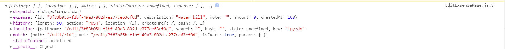
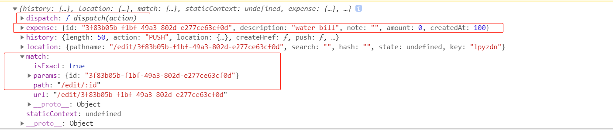

 做expensifyApp所遇到的基本笔记

## TOGGLE

```jsx
{visibility && < p>you got it</ p>}
const showSomething=()=>{
    visibility=!visibility;
}
```

## PROPS & MAP( need key)

```jsx
return (
        <Options options={options}/>
        <AddOption />
 )
and now options comp will have access by using this.props.options
-----------------------------------------------------
class Options extends React.Component{
 render(){
     return (
        <div>
            {this.props.options.map((option)=>{
                return <Option key={option} optionText={option}/> ;
            })}
        </div>
        );
    }
}
```

## 改变state

```jsx
firstly a state is defined in conctructor in the app component
        constructor(props){
                super(props);
                this.state={
                    options:[]
                }
                this.handleDeleteOptions=this.handleDeleteOptions.bind(this);
            }
        
 Then create a function under the constructor with *****setState
    handleDeleteOptions(){
        this.setState(()=>{
         return{
            options:[]
         };
        });
    }
```
## 传function as props

```jsx
< Options options={this.state.options} handleDeleteOptions={this.handleDeleteOptions} />

class Options extends React.Component{ 
    render(){
     return (
            <div>
            
                {this.props.options.map((option)=>{
                    return <Option key={option} optionText={option}/> ;
                })}
                
                <button onClick={this.props.handleDeleteOptions}>remove all</button>
            </div>
        );
    }
}
```

## 无状态方程式组件

```
const User=(props)=>{
    return(
        <div>
          <p>Name:{props.name}</p>
          <p>age:{props.age}</p>
        </div>
    )
}
```

## DEFAULT PROPS （没有props时候 传进去）
```jsx
Header.defaultProps={
    title:'Decision'
    };
```

## LIFECYCLE METHODS

```jsx
    console.log("fetching data");
try{
    const options = JSON.parse(localStorage.getItem('options'));
    if(options){
        this.setState(()=>({options}));
    }
    } catch(e){

    }
}
componentDidUpdate(prevProps,prevState){
    if(prevState.options.length!==this.state.options.length)
    {   
        console.log("updated");
        const json =JSON.stringify(this.state.options);
        localStorage.setItem('options',json);
    } 
}

componentWillUnmount()
{
 fired when re-directed to other component
}
```

## 创建REDUX STORE 

```jsx
//create a store so that it can be accesible by any component, that's the sole purpose
const store =createStore((state={initState},action)=>{
    switch(action.type){
        case INCREMENT_EXAMPLE1:
        return{
           count:count+1
        };
        case DECREMENT_EXAMPLE2:
        return{
           count:count-1
        };
        }
}); 

export default ()=>{
    const store = createStore(
        combineReducers({
          expenses: expensesReducer,
          filters:filtersReducer
        })
    );
    return store;
}
```

## 执行dispactch

```jsx
store.dispatch(addExpense({description:'water bill'}));
```

## 将store给ALL REACT COMPONENTS （BETTER BE DONE IN MAIN APP.JS）

```
<Provider store={store}> 
      rest of components
   </Provider>
```

## 取 STATE 给A REACT COMPONENT

```jsx
import { connect } from 'react-redux';

const ExpenseList = (props) => (
    {props.expenses.length}
);

const mapStateToProps = (state) => {
  return {
    expenses: state.expenses
  };
};

export default connect(mapStateToProps)(ExpenseList);
```

## 对于页面props内容

```jsx

const EditExpensePage =(props)=> {
    console.log(props)
    return (
        <div> This  is edit expense, editing {props.match.params.id}  
        <ExpenseForm
            expense={props.expense} 
            onSubmit={(currentExpense)=>{
            props.dispatch(editExpense(props.match.params.id,currentExpense))
            props.history.push('/');//跳转回主页 不刷
        }} />
        </div>
    ) 
}
```



