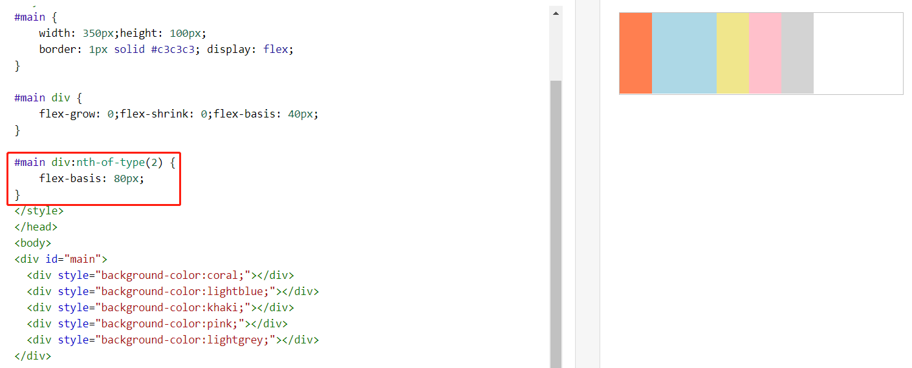
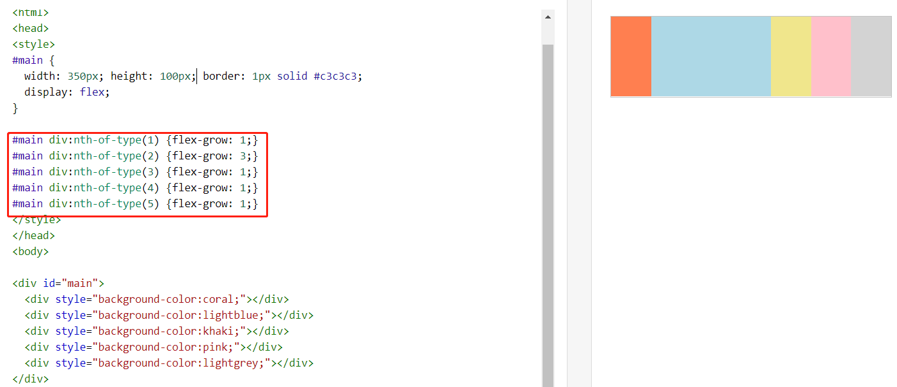
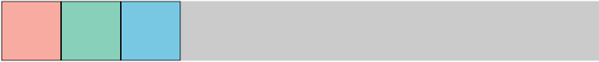
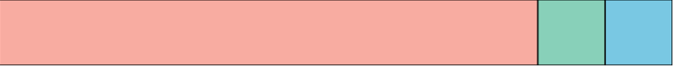
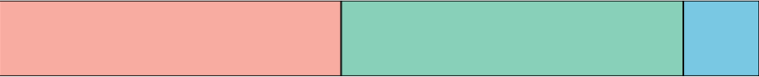
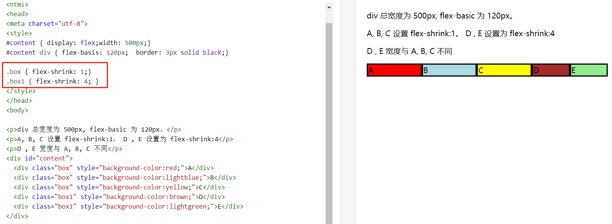
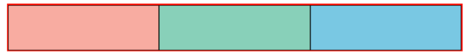
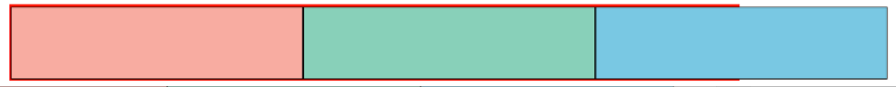
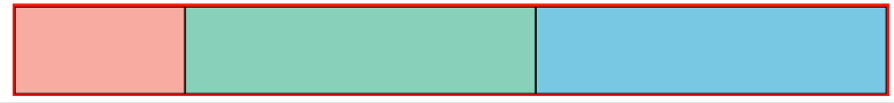

## Flex Layout Reference

flex 默认： 1 0 auto；（ `flex-grow,` `flex-shrink` and `flex-basis`）

控制等分： 1  1  0;

##  flex-basis 

 **flex-basis**  ，主要成分，flex-basis 預設值爲 auto，表示其預設分配到的空間，與 width 很像，但優先程度較高。



## flex-grow

**flex-grow**，扩大，扩展，增加,这就代表当父元素的宽度大于子元素宽度之和时，并且父元素有剩余，这时，flex-grow就会说我要成长，我要长大，怎么样才能成长呢，当然是分享父元素的空间了。



两个状况： 1大家一起分空间，2就是剩余会被大哥分掉

container 寬度爲 1000px，每個 box 寬度爲 100px。粉色綠色藍色方塊皆爲 100px，剩餘區域爲 700px。



接著設定粉色盒子 `flex-grow:1;` ，表示剩餘空間 700px，分爲 1 份，皆分配給粉色盒子，則粉色盒子寬度爲 800px。效果如下：



接著將綠色盒子也設定 `flex-grow:1;` ，表示剩餘空間 700px，分爲 2 份，分配給粉色盒子及綠色盒子各一份，各分 350px，粉色盒子及綠色盒子寬度皆爲 450px。效果如下：



##  flex-shrink

**flex-shrink**， 收缩，flex-shrink 是 flex-grow 的反向，有剩餘空間，就表示也有不夠空間的時候。flex-shrink 表示空間不夠時的壓縮比例。預設值爲 1。表示大家被壓縮的比例相同。



container 寬度維持 1000px，每個 box 寬度改爲 400px，總共 1200px，超出 container 寬度。則每個盒子因爲 flex-shrink 預設爲 1 的關係，不夠的空間分均分壓縮三個盒子。效果如下(爲了可視化 container，設置紅色框線)：



接著試試看把盒子皆設定 flex-shrink 爲 0，不要有任何壓縮，則三個盒子會爆出 container ，這也是 flex 爲了預防爆版，預設值爲 1 的用意，效果如下：



接著試試看粉色盒子 flex-shrink 爲 1，其他盒子爲 0，則不夠的部分只會壓縮粉色盒子，效果如下：



- flex-grow: 0.2 表示希望获得20%的蛋糕；
- flex-grow: 1 表示希望获得100%整个蛋糕（有点过分啊，不考虑其他兄弟）；
- flex-grow: 2 表示希望获得200%的蛋糕（这是明抢啊，态度很明确）。

## 赋值计算

> flex-basis（默认值为auto）
> flex-grow（默认值为0）
> 	可用空间 = (容器大小 - 所有相邻项目flex-basis的总和)
> 	可扩展空间 = (可用空间/所有相邻项目flex-grow的总和)
> 	每项伸缩大小 = (伸缩基准值flex-basis + (可扩展空间 x flex-grow值))
> flex-shrink（默认值为1）
> 	--.计算收缩因子与基准值乘的总和  
> 	  var a = 每一项flex-shrink*flex-basis之和
> 	 --.计算收缩因数
> 	  收缩因数=（项目的收缩因子*项目基准值）/第一步计算总和   
> 	   var b =  (flex-shrink*flex-basis)/a
> 	 --.移除空间的计算
> 	   移除空间= 项目收缩因数 x 负溢出的空间 
> 	    var c =  b * 溢出的空间    

## 选择判断

当元素的排列方向为**横**向：

​	元素的总宽度小于容器的宽度，使用flex-grow属性；

​	元素的总宽度大于容器的宽度，使用flex-shrink属性；

当元素排列的方向为**纵**向：

​	元素的总高度小于容器的高度，使用flex-grow属性；

​	元素的总高度小于容器的高度，使用flex-shrink属性；

## Demo：

<a href="/demo/quiz/html/flex.html">链接到demo1</a>

## 拓展一个css的灵活计算 cal()

```css
/* calc: 可以动态计算css的宽高， 运算符左右两侧必须加空格，否则计算会失效 */
/* 视口单位： vh vw  1vh = 1%的视口高度  1vw = 1%的视口宽度*/
height: calc(100vh - 152rpx);
/*height: calc(100vh - 100rpx); 用来测试页面上拉触底*/
```

