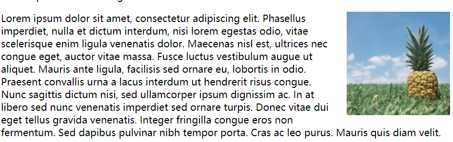
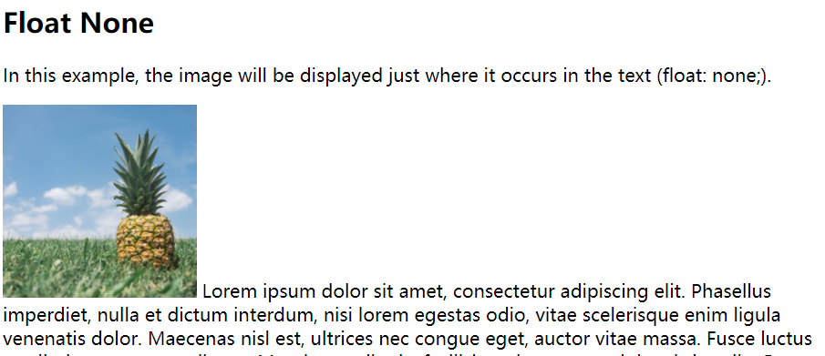
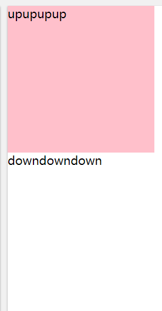
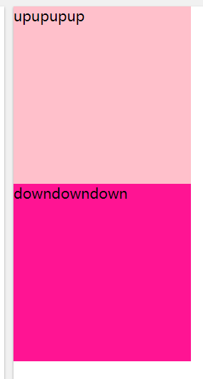
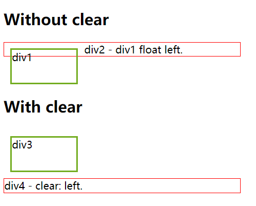
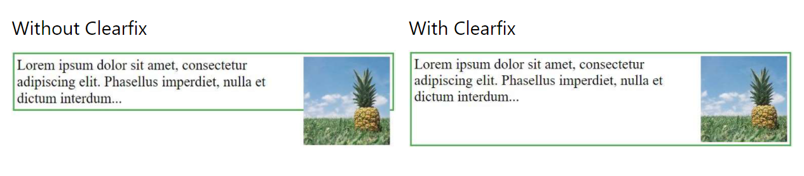

## Float 

float属性设计的初衷：仅仅是让文字像流水一样环绕浮动元素

- float:  left, right, none, inherit
- 將原本上下排列的元素改成左右排列,使元素向左或向右移动，只能左右,不能上下
- 要用margin保持間距，不然會黏再一起







但是注意float 在网页中的布局影响，例子如下： 

```html
<!DOCTYPE html>
<html>
    <head>
        <meta charset="UTF-8">
        <style type="text/css">
            *{ margin: 0;
                padding: 0;}
            div{
                width: 200px;
                height: 200px;
            }
            #up{
                float: left;//使用图一；不使用图二
                background: pink;
            }
            #down{
                background: deeppink;
            }
        </style>
    </head>
    <body>
        <div id="up"> upupupup</div>
        <div id="down"> downdowndown</div>
    </body>
</html>
```





## Clear ( 清浮动 )

- clear:left应该是"清除左浮动影响"
  官方对clear属性的解释是："元素盒子的边不能和**前面的**浮动元素相邻"。

- clear:  left, right, none, inherit

- float會造成文繞圖，clear可以讓清掉不需要文繞圖的地方。

  

> 这里有一个 子元素撑开父元素 （父元素高度为0）
> 可以通过清除浮动 让父元素的告诉为子元素的高度
> 但是实际上 由于页面很大 最好的做法是直接利用伪元素以及clear
>
> ```css
> .clear ::after{
> content:"";display:block;clear:both
> }
> ```
>
> 这里拓展一下 解决这个问题 除了这个方法，也可以使用overflow 建立BFC
> ```css
> overflow:hiddren
>```

## The clearfix Hack（ 清浮动 ）

```css
.clearfix::after {
  content: "";
  clear: both;
  display: table;
}
```




Reference:   https://www.w3schools.com/css/css_float.asp