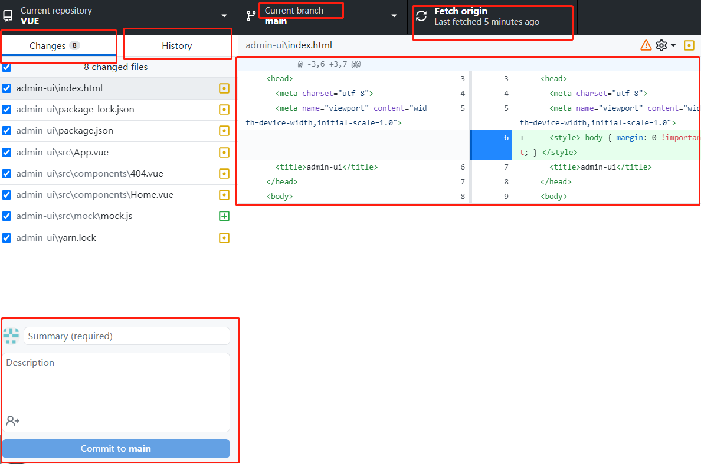
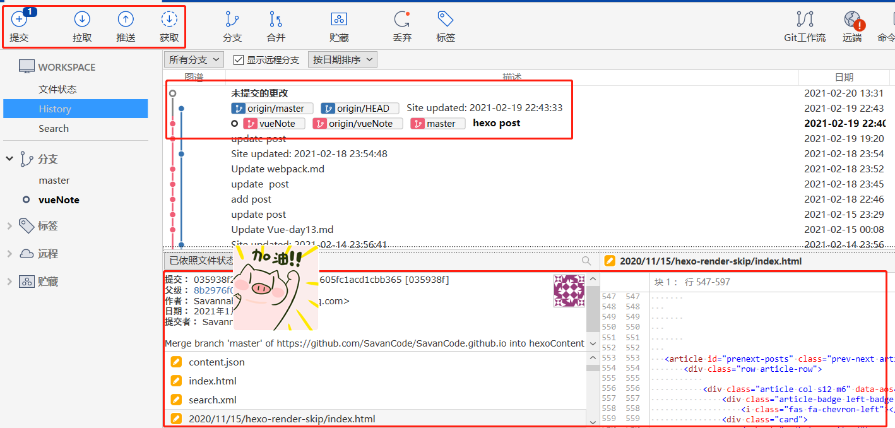
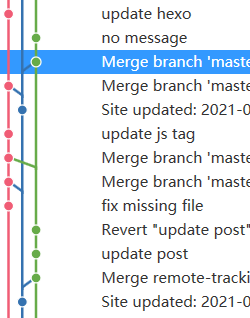

## git版本控制 推荐软件
- gitHub desktop 

- SourceTree

为什么不用commandLine,因为..

  

Source Tree的好处的,处理这种复杂的(因为当时比这个还多几个分支).不在话下, 一点也不怕晕(((φ(◎ロ◎;)φ)))

## commit之后，想撤销commit

**git reset --soft HEAD^**

这样就成功的撤销了你的cmmit

注意，仅仅是撤回commit操作，您写的代码仍然保留。

HEAD^的意思是上一个版本，也可以写成HEAD~1

如果你进行了2次commit，想都撤回，可以使用HEAD~2

## 至于这几个参数：

## --mixed 

意思是：不删除工作空间改动代码，撤销commit，并且撤销git add . 操作

这个为默认参数,git reset --mixed HEAD^ 和 git reset HEAD^ 效果是一样的。

## --soft  

不删除工作空间改动代码，撤销commit，不撤销git add . 

## --hard

删除工作空间改动代码，撤销commit，撤销git add . 

注意完成这个操作后，就恢复到了上一次的commit状态。

### 如果commit注释写错了，只是想改一下注释，只需要：

git commit --amend

此时会进入默认vim编辑器，修改注释完毕后保存就好了。

## 解决git中upstream丢失问题Your branch is based on 'origin/xxxx', but the upstream is gone.

https://blog.csdn.net/limengke123/article/details/77850134

## Reference 

https://blog.csdn.net/w958796636/article/details/53611133

