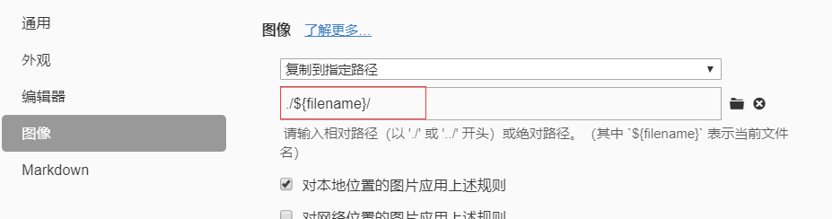

# Hexo本地图片显示问题

使用`hexo`生成静态资源后,由于`url`的问题会出现图片加载的问题,现在网上的文章及官方的解决方案大概分为三种:

1. 将图片放入`source/images`目录下,每次`generate`都会生成图片,在使用相对或绝对路径进行引用
2.  配置`hexo`的`_config.yml`文件, 将 `post_asset_folder` 设置为`true`, 这样每次new 生成一个文章时都会同步生成一个同名的文件夹,然后设置相对或绝对路径.  
3.  使用`hexo`官方的解决方案,使用模版变量, ` `  

解决方法:

```html
设置post_asset_folder  为 true, 安装插件 asset-image
npm install https://github.com/CodeFalling/hexo-asset-image
设置图片为相对路径(详细步骤在下面图片)
hexo clean && hexo generate && hexo s 运行查看
```

打开Typora的 `文件 > 偏好设置`，进行配置`typora`的相对路径



注意：一定要先设置了图片根目录后再插入图片，否则图片路径会不正确