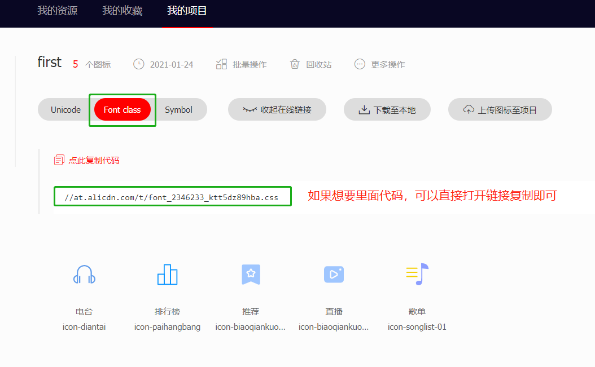

## iconfont 字体图标使用 （小程序为例）

### iconfont 官网

https://www.iconfont.cn/



对于小程序 不可以直接用css，所以将css文件中代码，复制到本地的wxss文件，之后import引用

### 练习例子


```html
<view
 class="navContainer"
 hover-class="none"
 hover-stop-propagation="false"
>
	<view
	 class="navItem"
	 hover-class="none"
	 hover-stop-propagation="false"
	>
		<view class="iconfont icon-biaoqiankuozhan_tuijian-121"></view>
		<text>歌曲推荐</text>
	</view>
	<view
	 class="navItem"
	 hover-class="none"
	 hover-stop-propagation="false"
	>
		<view class="iconfont icon-songlist-01"></view>
		<text>歌单</text>
	</view>
	<view
	 class="navItem"
	 hover-class="none"
	 hover-stop-propagation="false"
	>
		<view class="iconfont icon-paihangbang"></view>
		<text>排行榜</text>
	</view>
	<view
	 class="navItem"
	 hover-class="none"
	 hover-stop-propagation="false"
	>
		<view class="iconfont icon-diantai"></view>
		<text>电台</text>
	</view>
	<view
	 class="navItem"
	 hover-class="none"
	 hover-stop-propagation="false"
	>
		<view class="iconfont icon-biaoqiankuozhan_zhibo-342"></view>
		<text>直播</text>
	</view>
</view>
```

```css
.navContainer{
 display: inline-flex;
 justify-content: space-around;
}
.navItem{
  display: flex;
  flex-direction: column;
  align-items: center;
  margin-top: 10rpx;
}
.iconfont{
  font-size: 60rpx;
  border-radius: 60%;
  padding: 15rpx;
  background-color: cornflowerblue;
  color: white;
}
.navItem > text{
  margin-top: 15rpx;
 font-size: small;
}
```

### icon的颜色渐变

这里直接按照下面的例子变形使用- 想知道原理的话 看[这里](https://www.sohu.com/a/169212424_575744)

#### icon的本身变色

```html
<i @click="close" class="icon iconfont icon-delete"></i>
```

```css
.icon-delete{
    font-size: 50px;
    background-image: -webkit-linear-gradient(90deg, #28bb59 0%, #ffffff 94%);
    -webkit-background-clip: text;
    -webkit-text-fill-color: transparent;
}
```

#### icon本身透明，背景渐变

```css
color: transparent;                             /* 将iconfont的颜色改为透明 */
-webkit-background-clip: text;                  /* 将背景图的绘画仅作用在文字上 */
background-image: linear-gradient(225deg, #4158D0 0%, #C850C0 46%, #FFCC70 100%);     /* 你的渐变色 */
```

