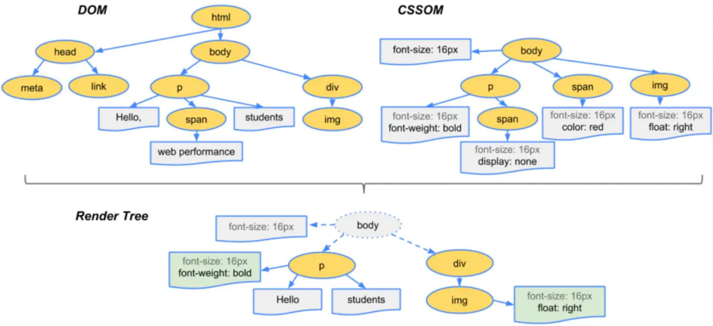
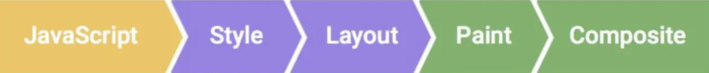
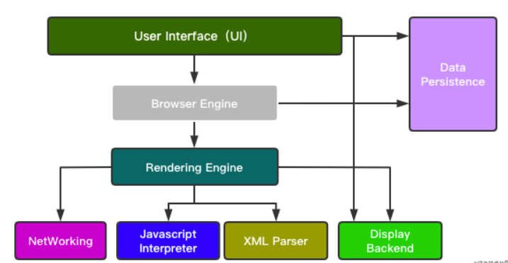
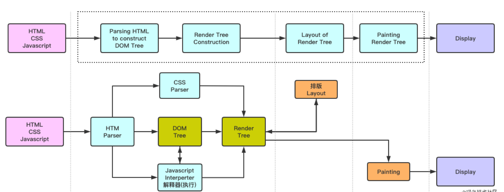

[TOC]


## CSS 不定宽高的垂直水平居中（最全 9 种）

### 1、flex

大家的第一反应，可能就是 flex 了。因为它的写法够简单直观，兼容性也没什么问题。是手机端居中方式的首选。

```css
<div class="wrapper flex-center">
    <p>horizontal and vertical</p>
</div>

.wrapper {
    width: 300px;
    height: 300px;
    border: 1px solid #ccc;
}

.flex-center {
    display: flex;
    justify-content: center;
    align-items: center;
}

```

利用到了 2 个关键属性：`justify-content` 和 `align-items`，都设置为 `center`，即可实现居中。

需要注意的是，一定要把这里的 `flex-center` 挂在父级元素，才能使得其中 `唯一的` 子元素居中。

### 2、flex + margin

这是 flex 方法的变种。父级元素设置 flex，子元素设置 `margin: auto;`。可以理解为子元素被四周的 margin “挤” 到了中间。

```html
<div class="wrapper">
    <p>horizontal and vertical</p>
</div>
.wrapper {
    width: 300px;
    height: 300px;
    border: 1px solid #ccc;
    display: flex;
}
.wrapper > p {
    margin: auto;
}
```

### 3、transform + absolute

这个组合，常用于图片的居中显示。

```html
<div class="wrapper">
    
</div>

.wrapper {
    width: 300px;
    height: 300px;
    border: 1px solid #ccc;
    position: relative;
}

.wrapper > img {
    position: absolute;
    left: 50%;
    top: 50%;
    transform: translate(-50%, -50%);
}

```

当然，也可以将父元素 wrapper 的相对定位，移入子元素 img 中，替换掉绝对定位。效果是一样的。

### 4、table-cell

利用 table 的单元格居中效果展示。与 flex 一样，需要写在父级元素上。

```html
<div class="wrapper">
    <p>horizontal and vertical</p>
</div>

.wrapper {
    width: 300px;
    height: 300px;
    border: 1px solid #ccc;

    display: table-cell;
    text-align: center;
    vertical-align: middle;
}

```

5、absolute + 四个方向的值相等

使用绝对定位布局，设置 `margin:auto;`，并设置 top、left、right、bottom 的 `值相等即可`（不一定要都是 0）。

```html
<div class="wrapper">
    <p>horizontal and vertical</p>
</div>

.wrapper {
    width: 300px;
    height: 300px;
    border: 1px solid #ccc;
    position: relative;
}

.wrapper > p {
    width: 170px;
    height: 20px;
    margin: auto;
    position: absolute;
    top: 0;
    left: 0;
    right: 0;
    bottom: 0;
}
```

这种方法一般用于弹出层，需要设置弹出层的宽高。

### 6、writing-mode

这个方法可以改变文字的显示方向，比如让文字的显示变为垂直方向。

```html
<div class="wrapper">
    <div class="wrapper-inner">
        <p>horizontal and vertical</p>
    </div>
</div>

.wrapper {
    width: 300px;
    height: 300px;
    border: 1px solid #ccc;

    writing-mode: vertical-lr;
    text-align: center;
}

.wrapper > .wrapper-inner {
    writing-mode: horizontal-tb;
    display: inline-block;
    text-align: center;
    width: 100%;
}

.wrapper > .wrapper-inner > p {
    display: inline-block;
    margin: auto;
    text-align: left;
}
```

兼容性上还有些小瑕疵，但大部分浏览器，包括手机端已支持 writing-mode 的写法了。

### 7、grid

像表格一样，网格布局让我们能够按行或列来对齐元素。 然而在布局上，网格比表格更可能做到或更简单。

```html
<div class="wrapper">
    <p>horizontal and vertical</p>
</div>

.wrapper {
    width: 300px;
    height: 300px;
    border: 1px solid #ccc;

    display: grid;
}

.wrapper > p {
    align-self: center;
    justify-self: center;
}
```

但它在兼容性上不如 flex，特别是 IE 浏览器，只支持 IE10 及以上。

### 8、::after

伪元素也能用来实现居中么？感觉还是挺神奇的，看下面这个例子：奇技淫巧

```html
<div class="wrapper">
     
</div>

.wrapper {
    width: 300px;
    height: 300px;
    border: 1px solid #ccc;

    text-align: center;
}

.wrapper::after {
    content: '';
    display: inline-block;
    vertical-align: middle;
    height: 100%;
}

.wrapper > img {
    vertical-align: middle;
}
```

水平方向很好理解。垂直方向，可以理解为 ::after 把 img 往下拉到了中间。

### 9、::before

另一种是配合 `font-size: 0;` 共同施展的魔法。

```html
<div class="wrapper">
    
</div>

.wrapper {
    width: 300px;
    height: 300px;
    border: 1px solid #ccc;

    text-align: center;
    font-size: 0;
}

.wrapper::before {
    display: inline-block;
    vertical-align: middle;
    font-size: 14px;
    content: '';
    height: 100%;
}

.wrapper > img {
    vertical-align: middle;
    font-size: 14px;
}
```

`font-size: 0;` 的神秘之处在于，可以消除标签之间的间隙。另外，因为伪元素搭配的，都是最基础的 CSS 写法，所以不存在兼容性的风险。

### 9、text-align

```html
<style>
body { 
  text-align: center;
}
</style>

<body>
<div class="wrapper">
    
</div>
</body>
```

## 行内元素可以设置padding和margin吗？

行内元素的padding-top、padding-bottom、margin-top、margin-bottom属性设置是无效的; 从显示的效果上是增加的，但其实设置的是无效的。并不会对他周围的元素产生任何影响。

行内元素的padding-left、padding-right、margin-left、margin-bottom属性设置是有效的


##  深入理解BFC

### 一、什么是BFC

**Block formatting context直译为"块级格式化上下文"。它是一个独立的渲染区域，只有Block-level box参与，并且与这个区域外部毫不相干**。

**BFC是一个容器，用于管理块级元素。**

### 二、如何创建BFC

- float为 left|right
- overflow为 hidden|auto|scroll
- display为 table-cell|table-caption|inline-block|inline-flex|flex（FFC）
- position为 absolute|fixed
- 根元素

### 三、 BFC有哪些特性

#### 特性1：BFC会阻止垂直外边距折叠

##### ①相邻兄弟元素margin重叠问题

```
<style>
p{
        color: #fff;
        background: #888;
        width: 200px;
        line-height: 100px;
        text-align:center;
        margin: 100px;
  }
</style>
<body>
    <p>ABC</p>
    <p>abc</p>
</body>
```


 **只需要在p外面包裹一层容器，并触发该容器生成一个BFC。那么两个P便不属于同一个BFC，就不会发生margin重叠了**。

```
<style>
p{
        color: #fff;
        background: #888;
        width: 200px;
        line-height: 100px;
        text-align:center;
        margin: 100px;
    }
.wrap{
  overflow:hidden;
}
</style>
<body>
   <p>ABC</p>
  <div class="wrap">
    <p>abc</p>
  </div>
</body>
```


##### ②父子元素margin重叠问题

```html
<style>
.box{
width:100px;
height:100px;
background:#ccc;
}
.wrap {
  background:yellow;
}
.wrap h1{
  background:pink;
  margin:40px;
}
</style>
<body>
<div class="box">box</div>
<div class="wrap">
  <h1>h1</h1>
</div>
</body>
```


**在wrap元素中添加:overflow:hidden;或者overflow：auto；使其父元素形成一个BFC；也可以在wrap元素中添加border：1px solid；或是padding：1px；**这些都可以有效解决父子元素margin重叠问题。


#### 特性2：BFC不会重叠浮动元素

利用这个特性，我们可以创造**自适应两栏布局**。

```html
<style>
.box1{
  height: 100px;
  width: 100px;
  float: left;
  background: lightblue;
}
.box2{width: 200px;
  height: 200px;
  background: #eee;
}
</style>
<body>
<div class="box1">我是一个左浮动的元素</div>
<div class="box2">喂喂喂!大家不要生气嘛，生气会犯嗔戒的。悟空你也太调皮了，
我跟你说过叫你不要乱扔东西，你怎么又……你看，我还没说完你就把棍子给扔掉了!
月光宝盒是宝物，你把它扔掉会污染环境，要是砸到小朋友怎么办，就算砸不到小朋友，
砸到花花草草也是不对的。</div>
</body>
```


**box2元素的样式加上overflow:hidden；使其建立一个BFC,让其内容消除对外界浮动元素的影响**。


这个方法可以用来实现两列自适应布局，效果不错，此时左边的宽度固定，右边的内容自适应宽度。如果我们改变文字的大小或者左边浮动元素的大小，两栏布局的结构依然没有改变！

#### 特性3：BFC可以包含浮动----清除浮动

```html
<style>
.box1{
  width:100px;
  height:100px;
  float:left;
  border: 1px solid #000;
}
.box2{
  width:100px;
  height:100px;
  float:left;
  border: 1px solid #000;
}
.box{
  background:yellow
}
</style>
<body>
<div class="box">
  <div class="box1"></div>
  <div class="box2"></div>
</div> 
```


由于容器内两个div元素浮动，脱离了文档流，父容器内容宽度为零（即发生高度塌陷），未能将子元素包裹住。解决这个问题，只需要把把父元素变成一个BFC就行了。常用的办法是给父元素设置overflow:hidden。


## 清除浮动的几种方式（解决高度塌陷问题）

子元素无法撑起父元素的高度，就会产生父元素高度塌陷问题

### 一、什么是父元素高度塌陷

上面我们提到了父元素出现高度塌陷问题的原因，那我们就先来了解什么是父元素高度塌陷问题

 HTML 的DOM结构代码：
```html
<div class="parent-box">
<div class="son-box"></div>   
</div>
<div class="another-box"></div>
```

 css样式

```css
. {      
    margin: 0;      
    padding: 0;    
}    
.parent-box {      
    width: 200px;      
    background: gray;      
    border: 5px solid;    
}    
.son-box {      
    width: 100px;      
    height: 100px;      
    background: blue;
    float: right;
}    
.another-box {      
    width: 100px;      
    height: 100px;      
    background: greenyellow;    
}  
```
预计效果如图：


 但是实际结果却得到下图：


这就是父元素高度塌陷问题，父元素高度塌陷导致父元素下方元素向上移，覆盖了父元素原有的位置

###  二、清除浮动的方法（解决高度问题）

#### 通过开启（BFC）块级格式化上下文（overfloat : hidden ; zoom : 1 ; )

4. 设置元素浮动：不能解决高度塌陷问题，反而导致高度塌陷

5. 设置元素绝对定位：同上

6. 设置元素为inline-block：可以解决高度塌陷问题，但是会导致父元素宽度丢失，不推荐使用这种方式

7. 将元素的overfloat属性设置为一个非visible的值：推荐设置为hidden，这是开启BFC副作用最小的方式；但是这样会将溢出的内容隐藏，看情况采用

   但是在IE6及以下的浏览器并不支持BFC，所以使用这种方式不能兼容部分浏览器。然而在IE6中虽然不支持BFC.
   
   但也具有另一个隐含属性叫**hasLayout**，该属性的作用和BFC类似，开启方式也有多种，
   
   **一个副作用最小的方式：将元素设置 overflow: hidden; zoom : 1**  如下：

```css
.parent-box {
  width: 200px;
  background: gray;
  border: 5px solid;
  overflow: hidden; //这里
  zoom: 1;//这里
}
```

#### 在高度塌陷的父元素后面添加一个空的div元素

添加` <div style="clear: both;"></div>   `这样由于这个空的div并没浮动，所以可以撑开父元素高度，基本没有副作用。**但是会在页面中添加多余的结构，不建议使用**。

```html
<body>
   <div class="parent-box">
       <div class="son-box"></div>
       <div style="clear: both;"></div>   //这里
   </div>
   <div class="another-box"></div>
<body>
```
#### 给浮动的父元素设定高度（拓展性差）

可以通过直接给父元素设定一个高度。但这种方法拓展性；

另外一种，父容器的高度可以通过内容撑开（比如img图片），实际当中此方法用的比较多。

#### 通过::after伪元素来清除浮动（推荐）

我们可以通过设置::after伪元素来清除浮动。是目前最为通用的清除浮动的方法，推荐使用。

```css
.parent-box {
  width: 200px;
  background: gray;
  border: 5px solid;
}
.parent-box::after {//这里
  content: "";
  display: block;
  clear: both;
}
```

但是IE6 7是不支持伪元素的，为了兼容大多数浏览器，我们可以与上面提到的IE6 7及以下的浏览器支持的hasLayout相结合，可完美解决高度塌陷问题。

#### br标签清除浮动

在br标签中设置属性clear，并赋值all，即能清除浮动。**但这种方法与第二种一样，同样会使页面结构冗余。**

```
<body>
   <div class="parent-box">
       <div class="son-box"></div>
       <br clear="all" />  
   </div>
   <div class="another-box"></div>
<body>
```

## CSS选择器优先级

CSS选择器的优先级关系是:

> 内联 > ID选择器 > 类选择器 > 标签选择器。

## CSS3 与HTML 5 新特性的列表

##  动画性能分析

浏览器对页面的渲染原理，可分为以下步骤： 

1. 根据HTML构建DOM树； 
2. 根据CSS构建CSSOM树； 
3. 将DOM树与CSSOM树合成一个渲染树（render tree）;
4. Layout布局，包括文档流、盒模型、计算大小和位置； 
5. Paint绘制，包括边框颜色、文字颜色、阴影等画出来； 
6. Compose合成，根据层叠关系展示画面；





## 现代浏览器结构与渲染过程

###  现代浏览器的结构

- 用户界面 User Interface（UI）
- 浏览器引擎 Browser Engine
- 渲染引擎 Rendering Engine
- 网络 NetWorking
- XML解析器 XML Parser
- 显示后端 Display Backend
- 数据持久层 Data Persistence：缓存、证书等（**数据存储在磁盘**）



### 渲染引擎结构与工作流程



- 1. 获取DOM 分割层
- 2. 计算CSS样式
- 3. 重排，放置dom的位置(layout)
- 4. 节点填充 重绘(paint)
- 5. GPU生成纹理展现到页面(元素偏移、缩放)
- 6. GPU参与网页合成层(compsite) => 屏幕最终图像

## 网页生成的重绘渲染

- 网页生成时，至少会渲染(paint)一次，用户访问过程中，还会不断重新渲染(paint) (修改DOM、修改样式表、用户事件)
- 重绘(paint)不一定引起重排(layout)，但重排(layout)一定会引起重绘(paint)
- 重排(layout): 页面初始化、引起的盒子变化

> - 添加或者删除可见的DOM元素
> - 元素位置改变
> - 元素尺寸改变
> - 元素内容改变（例如：一个文本被另一个不同尺寸的图片替代）
> - 页面渲染初始化（无法避免）
> - 浏览器窗口尺寸改变
> - 读取CSS相关属性也会触发重排：clientHeight、clientLeft、offsetHeight、innerText...

- 尽量不触发Layout

> - 使用transform代替top，left的动画

- 重绘：外观改变

> - 当修改border-radius,box-shadow,color,backgroud等展示相关属性时候,会触发重绘
> - 在经常paint的区域，要避免代价太高style
> - 不要用gif图，或者在不需要时，display:none，
> - 减少绘制区域，为引起大范围Paint的元素生成独立的Layer(比如将动画部分设置position:absolute)

###  深层次理解重排与重绘

浏览器执行线程: 主线程 和 排版线程

1. 主线程: 通常情况下，主线程主要负责以下工作：运行JavaScript、计算HTML元素的CSS样式、布局页面、把页面元素绘制成一个或多个位图、把这些位图移交给排版线程
2. 排版线程: 通过GPU把位图绘制到了屏幕上

### 如何减少重排、重绘

- 样式表越简单，重排、重绘就越快
- 重排和重绘的DOM元素层级越高、成本就越高
- table元素的重排和重绘成本，高于div元素
- 尽量不要把读操作和写操作，放在一个语句里面
- 统一改变样式
- 缓存重排结果
- 离线DOM Fragment/clone
- 虚拟DOM
- 必要的时候 display:none，不可见元素不影响重排、重绘。visibility 影响重排，不影响重绘

## HTML标签上的title 和 alt 两个属性的区别是?

注意：title 属性并不是img标签特有的属性，大部分的标签都有。

title：是大部分标签都有的属性，是鼠标移上去时的提示信息 alt：是img标签的属性，是图片资源加载异常时显示的类容