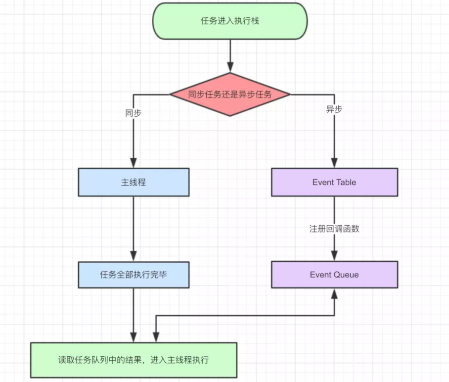
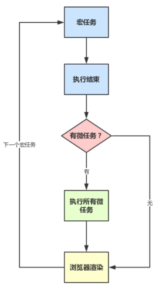

[TOC]

## 8大基本数据类型

- 空值（null)
- 未定义(undefined)
- 布尔值（boolean)
- 数字（number)
- 字符串（string)
- 对象 (object) - 包括 function 
- 符号（symbol, ES6中新增)
- 大整数（BigInt, ES2020 引入）

## for in 和 for of 的区别？

1. 推荐在循环对象属性的时候，使用`for...in`,for...of 循环可以用来遍历数组、类数组对象，字符串、Set、Map 以及 Generator 对象。
2. `for...in`循环出的是key，`for...of`循环出的是value
3. 注意，`for...of`是ES6新引入的特性。修复了ES5引入的`for...in`的不足

## 如何防止重复发送ajax请求？

参考，不用都答出来，一般答出防抖节流即可：

https://blog.csdn.net/xgangzai/article/details/108413909

## axios拦截器是什么？有什么用？

在vue项目中，我们通常使用axios与后台进行数据交互，axios是一款基于promise封装的库，可以运行在浏览器端和node环境中。它有很多优秀的特性，例如拦截请求和响应、取消请求、转换json、客户端防御XSRF等。所以vue官方开发组放弃了对其官方库vue-resource的维护，直接推荐我们使用axios库。

页面发送http请求，很多情况我们要对请求和其响应进行特定的处理；例如每个请求都附带后端返回的token，拿到response之前loading动画的展示等。如果请求数非常多，这样处理起来会非常的麻烦，程序的优雅性也会大打折扣。在这种情况下，axios为开发者提供了这样一个API：拦截器。拦截器分为 请求（request）拦截器和 响应（response）拦截器。

## localStorage和sessionStorage的区别？

HTML5的WebStorage提供了两种API：localStorage（本地存储）和sessionStorage（会话存储）。

1、生命周期：localStorage:localStorage的生命周期是永久的，关闭页面或浏览器之后localStorage中的数据也不会消失。localStorage除非主动删除数据，否则数据永远不会消失。

​		sessionStorage的生命周期是在仅在当前会话下有效。sessionStorage引入了一个“浏览器窗口”的概念，sessionStorage是在同源的窗口中始终存在的数据。只要这个浏览器窗口没有关闭，即使刷新页面或者进入同源另一个页面，数据依然存在。但是sessionStorage在关闭了浏览器窗口后就会被销毁。同时独立的打开同一个窗口同一个页面，sessionStorage也是不一样的。

2、存储大小：localStorage和sessionStorage的存储数据大小一般都是：5MB

3、存储位置：localStorage和sessionStorage都保存在客户端，不与服务器进行交互通信。

4、存储内容类型：localStorage和sessionStorage只能存储字符串类型，对于复杂的对象可以使用ECMAScript提供的JSON对象的stringify和parse来处理

5、获取方式：localStorage：window.localStorage;；sessionStorage：window.sessionStorage;。

6、应用场景：localStoragese：常用于长期登录（+判断用户是否已登录），适合长期保存在本地的数据。sessionStorage：敏感账号一次性登录；

## 写一个方法把分钟转化为时分，例如：150->02:30？

```
let minuteConversion= (minutes)=>{
   let hours = parseInt(minutes/60)
    let minute = minutes%60
   console.log(minutes+'分钟转换成时分是'+hours+'：'+minute)
}
```

## 什么是 CDN，为什么它能提高速度？

DN的全称是Content Delivery Network，即[内容分发网络](https://baike.baidu.com/item/内容分发网络/4034265)。CDN是构建在现有网络基础之上的智能虚拟网络，依靠部署在各地的边缘服务器，通过中心平台的负载均衡、内容分发、调度等功能模块，使用户就近获取所需内容，降低网络拥塞，提高用户访问响应速度和命中率。CDN的关键技术主要有内容存储和分发技术。

##  requestAnimationFrame

`requestAnimationFrame`，**「request - 请求」**，**「Animation - 动画」**， **「Frame - 帧率;框架」**

> window.requestAnimationFrame() 告诉浏览器——你希望执行一个动画，并且要求浏览器在下次重绘之前调用指定的回调函数更新动画。该方法需要传入一个回调函数作为参数，该回调函数会在浏览器下一次重绘之前执行

request 会把每一帧中的所有DOM操作集中起来，在一次重绘或回流中就完成（这点很像虚拟DOM不是~），并且重绘或回流的时间间隔紧紧跟随浏览器的刷新频率,这样就不会出现过度渲染的问题，保证了流畅的需求以及浏览器的完美渲染。

### [例子](https://css-tricks.com/using-requestanimationframe/)

###  为什么不使用settimeout，setinterval？

setTimeout通过设定一个时间间隔来不断的更新屏幕图像，从而完成动图。 它的优点是可控性高，可以进行编码式的动画效果实现。

setTimeout缺点：

1. **「造成无用的函数运行开销：」**

也就是过度绘制，同时因为更新图像的频率和屏幕的刷新重绘制步调不一致，会产生丢帧，在低性能的显示器动画看起来就会卡顿。

1. **「当网页标签或浏览器置于后台不可见时，仍然会执行，造成资源浪费」**
2. **「API本身达不到毫秒级的精确：」**

如果使用 setTimeout或者setInterval 那么需要我们制定时间 假设给予 （1000/60）理论上就可以完成60帧速率的动画。所以事实是浏览器可以“强制规定时间间隔的下限（clamping th timeout interval）”,一般浏览器所允许的时间再5-10毫秒，也就是说即使你给了某个小于10的数，可能也要等待10毫秒。

1. **「浏览器不能完美执行：」**

当动画使用10ms的settimeout绘制动画时，您将看到一个时序不匹配，如下所示。


我们的显示屏一般是**「16.7ms（即60FPS）的显示频率」**，上图的第一行代表大多数监视器上显示的**「16.7ms显示频率」**，上图的第二行代表**「10ms的典型setTimeout」**。由于在显示刷新间隔之前发生了另一个绘制请求，因此无法绘制每次的第三个绘制（红色箭头指示）。这种透支会导致动画断断续续，**「因为每三帧都会丢失」**。计时器分辨率的降低也会对电池寿命产生负面影响，并降低其他应用程序的性能。

> 如果使用requestAnimationFrame可以解决setTimeout的丢帧问题，因为它使应用程序时通知（且仅当）的浏览器需要更新页面显示，渲染时间由系统处理。因此，应用程序与浏览器绘画间隔完全一致，并且仅使用适当数量的资源。

### requestAnimationFrame的好处

相比于`setTimeout`的在固定时间后执行对应的动画函数，`requestAnimationFrame`用于指示浏览器在下一次重新绘制屏幕图像时, 执行其提供的回调函数。

- **「使浏览器画面的重绘和回流与显示器的刷新频率同步」**它能够保证我们的动画函数的每一次调用都对应着一次屏幕重绘，从而避免`setTimeout`通过时间定义动画频率，与屏幕刷新频率不一致导致的丢帧。
- **「节省系统资源，提高性能和视觉效果」**在页面被置于后台或隐藏时，会自动的停止，不进行函数的执行，当页面激活时，会重新从上次停止的状态开始执行，因此在性能开销上也会相比`setTimeout`小很多。

## 箭头函数能访问原型嘛?

不能 箭头函数 不能使用new 也没有super 没有原型

## [promise 原理解释](https://gitee.com/cpeng1314/laochenqianduan/blob/master/99-%E7%AC%94%E8%AF%95%E5%92%8C%E9%9D%A2%E8%AF%95%E9%A2%98/02-JavaScript/04-%E8%AF%A6%E8%A7%A3Promise.md)

## Promise和AsyncAwait区别

async/await相比较Promise来说，是优化了堆栈处理的，也就是说，在这一点上，Async/await是比Promise性能好的
与直接使用Promise相比，使用Async/Await不仅可以提高代码的可读性，同时也可以优化JavaScript引擎的执行方式

### 为什么是优化

Async/Await与Promise最大区别在于：await b()会暂停所在的async函数的执行；而Promise.then(b)将b函数加入回调链中之后，会继续执行当前函数。对于堆栈来说，这个不同点非常关键。

当一个Promise链抛出一个未处理的错误时，无论我们使用await b()还是Promise.then(b)，JavaScript引擎都需要打印错误信息及其堆栈。对于JavaScript引擎来说，两者获取堆栈的方式是不同的。

#### Promise.then()

观察下面代码, 假设b()返回一个promise

```js
const a = () => {
    b().then(() => c())
}
```

当调用a()函数时，这些事情同步发生，b()函数产生一个promise对象，调用then方法，Promise会在将来的某个时刻resolve，也就是把then里的回调函数添加到回调链。(如果这一块不太明白，可以仔细学习promise，或者读一读promise源码并尝试写一写，相信你更通透)，这样，a()函数就执行完了，在这个过程中，a()函数并不会暂停，因此在异步函数resolve的时候，a()的作用域已经不存在了，那要如何生成包含a()的堆栈信息呢？ 为了解决这个问题，JavaScripts引擎要做一些额外的工作；它会及时记录并保存堆栈信息。对于V8引擎来说，这些堆栈信息随着Promise在Promise链中传递，这样c()函数在需要的时候也能获取堆栈信息。但是这无疑造成了额外的开销，会降低性能；保存堆栈信息会占用额外的内存。

#### Await

我们可以用Async/await来实现一下

```js
const a = () => {
    await b()
    c()
}
```

使用await的时候，无需存储堆栈信息，因为存储b()到a()的指针的足够了。当b()函数执行的时候，a()函数被暂停了，因此a()函数的作用域还在内存可以访问。如果b()抛出一个错误，堆栈通过指针迅速生成。如果c()函数抛出一个错误，堆栈信息也可以像同步函数一样生成，因为c()是在a()中执行的。不论是b()还是c()，我们都不需要去存储堆栈信息，因为堆栈信息可以在需要的时候立即生成。而存储指针，显然比存储堆栈更加节省内存

## Async如何捕获异常?

## 防抖节流

##  宏任务和微任务

- 什么是 宏任务和微任务? 分别有哪些?
- 如何判断顺序

## JS EventLoop

### 进程和线程是什么?

> 进程和线程的主要差别在于它们是不同的操作系统资源管理方式。进程有独立的地址空间，一个进程崩溃后，在保护模式下不会对其它进程产生影响，而线程只是一个进程中的不同执行路径。

一个程序运行，至少有一个进程，一个进程至少有一个线程，打个比方，进程好比一个工厂，线程就是里面的工人，工厂内有多个工人

### 浏览器渲染进程的理解

**浏览器渲染进程是多线程的**，它包括下面几个线程：

- GUI 渲染线程
- JS 引擎线程 (这里是重点!! 他是单线程的!!!)
- 事件触发线程
- 定时触发器线程
- 异步 http 请求线程

### webwork 是什么? 以及它的特点

### 浏览器渲染页面的过程

- 用户输入 url ，DNS 解析成请求 IP 地址
- 浏览器与服务器建立连接（tcp 协议、三次握手），服务端处理返回html代码块
- 浏览器接受处理，解析 html 成 dom 树、解析 css 成 cssobj
- dom 树、cssobj 结合成 render 树
- JS 根据 render 树进行计算、布局、重绘
- GPU 合成，输出到屏幕

### 同步异步任务执行的 事件循环



### 宏任务和微任务执行流程




## clone的相关知识

- 深浅拷贝与赋值的区别
- 深浅拷贝分别有什么方式可以实现

## js 原型链

- 原型链的练习

- `typeof null` 为什么是 `”object“`

  typeof null 为"object", 原因是因为 不同的对象在底层都表示为二进制. `typeof`原理： **不同的对象在底层都表示为二进制，在Javascript中二进制前（低）三位存储其类型信息**
```
  - 000: 对象
  - 010: 浮点数
  - 100：字符串
  - 110： 布尔
  - 1： 整数
```
- 什么是`原型`，哪里是 `[[prototype]]`的 ”尽头“，为什么要这么设计

  **所有普通的 [[prototype]]链最终都会执行内置的 `Object.prototype`**这样设计主要的就是节省内存，如果属性和方法定义在原型上，那么所有的实例对象就能共享。

- `JavaScript`原型链的核心是什么

- `instanceof`的原理是什么

  `instanceof`原理： 检测 `constructor.prototype`是否存在于参数 object的 原型链上。`instanceof` 查找的过程中会遍历`object`的原型链，直到找到 `constructor` 的 `prototype` ,如果查找失败，则会返回`false`，告诉我们，`object` 并非是 `constructor` 的实例。 

##  href和src的区别

- 请求资源类型不同
（1）href 指向网络资源所在位置，建立和当前元素（锚点）或当前文档（链接）之间的联系。
（2）在请求 src 资源时会将其指向的资源下载并应用到文档中，比如 JavaScript 脚本，img 图片；

- 作用结果不同
（1）href 用于在当前文档和引用资源之间确立联系；
（2）src 用于替换当前内容；

- 浏览器解析方式不同
（1）若在文档中添加 ，浏览器会识别该文档为 CSS 文件，就会**并行下载资源并且不会停止对当前文档的处理。**这也是为什么建议使用 link 方式加载 CSS，而不是使用 @import 方式。
（2）当浏览器解析到 ，会**暂停其他资源的下载和处理，**直到将该资源加载、编译、执行完毕，图片和框架等也如此，类似于将所指向资源应用到当前内容。这也是为什么建议把 js 脚本放在底部而不是头部的原因。

## link和@import的区别

两者都是外部引用 CSS 的方式，但是存在一定的区别：

（1）link是XHTML标签，除了能够加载CSS，还可以定义RSS等其他事务；而@import属于CSS范畴，只可以加载CSS。

（2）link引用CSS时，在页面载入时同时加载；@import需要页面完全载入以后再加载。

（3）link是XHTML标签，无兼容问题；@import则是在CSS2.1提出的，低版本的浏览器不支持。

（4）link支持使用Javascript控制DOM改变样式；而@import不支持。

## [Ajax_Axios_Fetch区别与优缺点](https://gitee.com/cpeng1314/laochenqianduan/blob/master/99-%E7%AC%94%E8%AF%95%E5%92%8C%E9%9D%A2%E8%AF%95%E9%A2%98/02-JavaScript/23-Ajax_Axios_Fetch%E5%8C%BA%E5%88%AB%E4%B8%8E%E4%BC%98%E7%BC%BA%E7%82%B9.md)


https://gitee.com/cpeng1314/laochenqianduan/tree/master/99-%E7%AC%94%E8%AF%95%E5%92%8C%E9%9D%A2%E8%AF%95%E9%A2%98/02-JavaScript