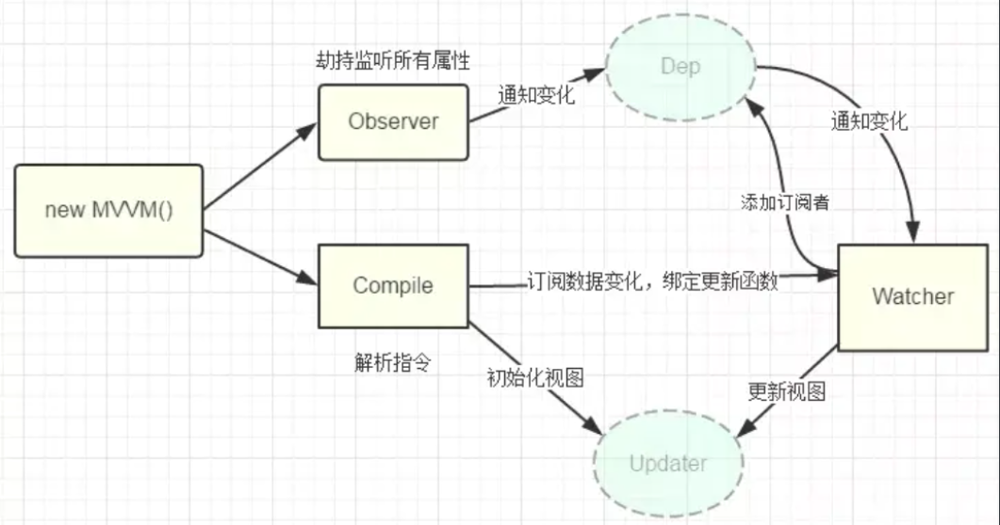
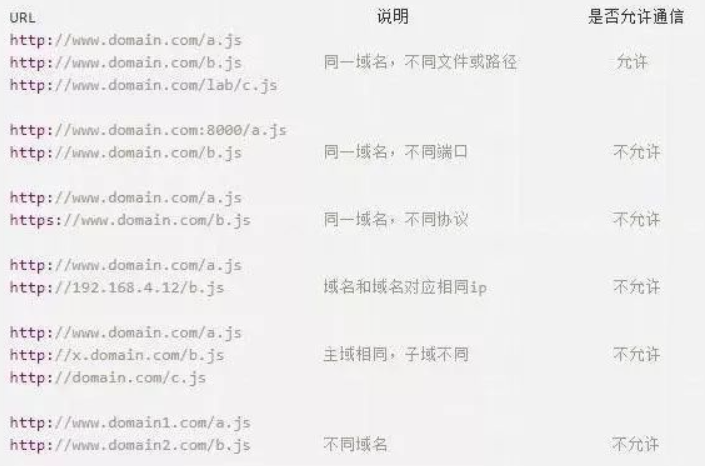
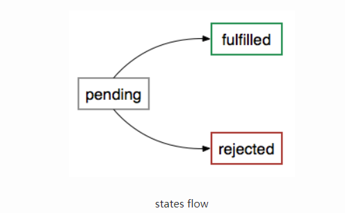

### **页面导入样式时，使用link和@import有什么区别？**

link 是HTML标签，@import 是css提供的。

link 同时加载内容和样式， @import 引入样式需要等待页面加载完，再加载CSS

link 可以引入除 CSS 外其他内容，例如`<link rel="icon" href="/favicon.ico">`。 @import只能引入css

link 引入的样式，JS 可以通过操作 DOM 来改变，而 @import 的则不行

link 没有兼容问题，而@import 不被 ie5 以下支持

### **如何制作一个进度条？**

无固定答案，回答可以多种多样。

html:

```
<progress max="100" value="0" id="pg"></progress>
```

js:

```
var pg=document.getElementById('pg'); 

setInterval(function(e){

   if(pg.value!=100) pg.value  ;      

   else pg.value=0;

},100);
```

### **浏览器是如何解析html的？**

看html_css面试题笔记

### **行内元素可以设置padding和margin吗？**

行内元素的padding-top、padding-bottom、margin-top、margin-bottom属性设置是无效的

行内元素的padding-left、padding-right、margin-left、margin-bottom属性设置是有效的

行内元素的padding-top、padding-bottom从显示的效果上是增加的，但其实设置的是无效的。并不会对他周围的元素产生任何影响。

### **for in 和 for of 的区别？**

1. 推荐在循环对象属性的时候，使用`for...in`,在遍历数组的时候的时候使用`for...of`。
2. `for...in`循环出的是key，`for...of`循环出的是value
3. 注意，`for...of`是ES6新引入的特性。修复了ES5引入的`for...in`的不足
4. `for...of`不能循环普通的对象，需要通过和`Object.keys()`搭配使用

### **如何防止重复发送ajax请求？**

防抖节流

https://blog.csdn.net/xgangzai/article/details/108413909

### **axios拦截器是什么？有什么用？**

在vue项目中，我们通常使用axios与后台进行数据交互，axios是一款基于promise封装的库，可以运行在浏览器端和node环境中。它有很多优秀的特性，例如拦截请求和响应、取消请求、转换json、客户端防御XSRF等。所以vue官方开发组放弃了对其官方库vue-resource的维护，直接推荐我们使用axios库。

页面发送http请求，很多情况我们要对请求和其响应进行特定的处理；例如每个请求都附带后端返回的token，拿到response之前loading动画的展示等。如果请求数非常多，这样处理起来会非常的麻烦，程序的优雅性也会大打折扣。在这种情况下，axios为开发者提供了这样一个API：拦截器。拦截器分为 请求（request）拦截器和 响应（response）拦截器。

### **localStorage和sessionStorage的区别？**

HTML5的WebStorage提供了两种API：localStorage（本地存储）和sessionStorage（会话存储）。

1、生命周期：localStorage:localStorage的生命周期是永久的，关闭页面或浏览器之后localStorage中的数据也不会消失。localStorage除非主动删除数据，否则数据永远不会消失。

          sessionStorage的生命周期是在仅在当前会话下有效。sessionStorage引入了一个“浏览器窗口”的概念，sessionStorage是在同源的窗口中始终存在的数据。只要这个浏览器窗口没有关闭，即使刷新页面或者进入同源另一个页面，数据依然存在。但是sessionStorage在关闭了浏览器窗口后就会被销毁。同时独立的打开同一个窗口同一个页面，sessionStorage也是不一样的。

2、存储大小：localStorage和sessionStorage的存储数据大小一般都是：5MB

3、存储位置：localStorage和sessionStorage都保存在客户端，不与服务器进行交互通信。

4、存储内容类型：localStorage和sessionStorage只能存储字符串类型，对于复杂的对象可以使用ECMAScript提供的JSON对象的stringify和parse来处理

5、获取方式：localStorage：window.localStorage;；sessionStorage：window.sessionStorage;。

6、应用场景：localStoragese：常用于长期登录（+判断用户是否已登录），适合长期保存在本地的数据。sessionStorage：敏感账号一次性登录；

### **写一个方法把分钟转化为时分，例如：150->02:30？**

```
let minuteConversion= (minutes)=>{
           let hours = parseInt(minutes/60)
            let minute = minutes%60
           console.log(minutes+'分钟转换成时分是'+hours+'：'+minute)
       }
```

### **什么是 CDN，为什么它能提高速度？**

DN的全称是Content Delivery Network，即[内容分发网络](https://baike.baidu.com/item/内容分发网络/4034265)。CDN是构建在现有网络基础之上的智能虚拟网络，依靠部署在各地的边缘服务器，通过中心平台的负载均衡、内容分发、调度等功能模块，使用户就近获取所需内容，降低网络拥塞，提高用户访问响应速度和命中率。CDN的关键技术主要有内容存储和分发技术。

### 谈谈你对浏览器事件机制的理解

关键词：**事件捕获、事件冒泡、DOM Level 0事件()、DOM Level 2事件**

DOM0 事件处理是发生在程序赋值时注册在事件流的冒泡阶段的

DOM2 事件处理程序通过在所有的 DOM 节点上通过 `addEventListener()` 和 `removeEventLinstener()` 来添加和移除事件处理程序。

### 什么是http状态码？常用的状态码有哪些？

### css的position定位有哪些？

- [static](https://www.runoob.com/css/css-positioning.html#position-static)
- [relative](https://www.runoob.com/css/css-positioning.html#position-relative)
- [fixed](https://www.runoob.com/css/css-positioning.html#position-fixed)
- [absolute](https://www.runoob.com/css/css-positioning.html#position-absolute)
- [sticky](https://www.runoob.com/css/css-positioning.html#position-sticky)

### z-index是什么作用？

### js获取DOM的API有哪些？有什么区别？

#### **（1） 通过顶层document节点获取：**

1. doument.getElementById(“elementId”)
2. document.getElementsByName(“elementsName”)
3. document.getElementByTagName(“tagName”)
4. document.getElementsClassName(“classname”)
5. document.querySelector(selectors)
6. querySelectorAll:该方法返回所有满足条件的元素，结果是个nodeList集合。

#### **（2） 通过父节点获取：**

1. parentObj.firstChild：如果节点为已知节点（parentObj）的第一个子节点就可以使用这个方法。这个属性是可以递归使用的，也就是支持parentObj.firstChild.firstChild.firstChild...的形式，如此就可以获得更深层次的节点。

2. parentObj.lastChild：很显然，这个属性是获取已知节点（parentObj）的最后一个子节点。与firstChild一样，它也可以递归使用。

3. parentObj.childNodes：获取已知节点的子节点数组，然后可以通过循环或者索引找到需要的节点。

4. parentObj.children：获取已知节点的直接子节点数组。

5. parentObj.getElementsByTagName(tagName)：使用方法不再赘述，它返回已知节点的所有子节点中类型为指定值的子节点数组。例如：parentObj.getElementsByTagName('A')返回已知的子节点中的所有超链接。

#### **（3） 通过临近节点获取：**

1. neighbourNode.previousSibling：获取已知节点（neighbourNode）的前一个节点，这个属性和前面的firstChild、lastChild一样都似乎可以递归使用的。

2. neighbourNode.nextSibling：获取已知节点（neighbourNode）的下一个节点，同样支持递归。

#### **（4） 通过子节点获取：**

childNode.parentNode：获取已知节点的父节点。

### 如何将类数组转换为数组 ？

> 什么是类数组?
>
> 拥有length属性 也拥有索引 但是没有数组具有的方法。
> 常见的类数组： arguments和DOM的方法返回的结果 class tag的筛选

转化为数组之后 就能调用shift unshift splice concat reverse sort
1、使用最原生的方法 使用一个新的数组

```js
var ss=document.getElementsByTagName("div");
  var res=[];
  for(var i=0;i<ss.length;i++){
      res.push(ss[i]);
  }
```

2、使用Array.prototype.slice.call(ArrayLike);

```js
var ss=document.getElementsByTagName("div");
ss=Array.prototype.slice.call(ss);
console.log(Object.prototype.toString.call(ss).slice(8,-1));//Array
```

3、使用es6的 新方法 Array.from(arr) 将类数组arr转化为数组

```js
var ss=document.getElementsByTagName("div");
var res=[];
res=Array.from(ss)
console.log(res);//Array
```

### 类数组和数组的区别 ？

**伪数组与真数组的区别**：

伪数组的原型链中没有 Array.prototype，而真数组的原型链中有 Array.prototype。因此伪数组没有 pop、join等属性。

### 实现一下防抖和节流？

### 队列和栈有什么区别？

从"数据结构"的角度看，它们都是线性结构，即数据元素之间的关系相同。但是队列先进先出，栈后进先出 

### [js继承有哪几种方式？](https://www.jianshu.com/p/8754c8f0b532)

原型链继承、构造函数继承、组合继承、寄生组合继承、ES6继承

### 使用settimeout实现setinterval函数？

```undefined
setTimeout(code,millisec)
setInterval(code,millisec)
```

```jsx
//用setTimeout实现setInterval
function mySetInterval(fn, millisec){
  function interval(){
    setTimeout(interval, millisec);
    fn();
  }
  setTimeout(interval, millisec)
}
```

### 谈谈什么是垃圾回收机制 ？

第一步：标记空间中「可达」值。
第二步：回收「不可达」的值所占据的内存。
第三步，做内存整理

### flex布局有哪些属性分别代表什么?flex:1是什么意思?

- [`flex-grow`](https://developer.mozilla.org/en-US/docs/Web/CSS/flex-grow)
- [`flex-shrink`](https://developer.mozilla.org/en-US/docs/Web/CSS/flex-shrink)
- [`flex-basis`](https://developer.mozilla.org/en-US/docs/Web/CSS/flex-basis)
- flex : 1 0 auto

### vue父组件套两层子组件,更新父组件,分别触发子组件什么生命周期钩子?

父beforeUpdate->子beforeUpdate->子updated->父updated

 [Vue中父子组件生命周期执行顺序回顾](https://juejin.cn/post/6844904113914773518)

### vue在哪个生命周期中进行数据请求?

一般在 created（或beforeRouter） 里面就可以，[如果涉及到需要页面加载完成之后的话就用 mounted](https://blog.csdn.net/CKT0816/article/details/107705606)

### vue双向绑定原理?



### 什么是跨域？有哪些解决方案？

**什么是跨域？**

跨域是指一个域下的文档或脚本试图去请求另一个域下的资源，这里跨域是广义的。

广义的跨域：

```javascript
1.) 资源跳转： A链接、重定向、表单提交
2.) 资源嵌入
3.) 脚本请求： js发起的ajax请求、dom和js对象的跨域操作等
```

其实我们通常所说的跨域是狭义的，是由浏览器同源策略限制的一类请求场景。

**什么是同源策略？**

同源策略/SOP（Same origin policy）是一种约定，由Netscape公司1995年引入浏览器，它是浏览器最核心也最基本的安全功能，如果缺少了同源策略，浏览器很容易受到XSS、CSFR等攻击。**所谓同源是指"协议+域名+端口"三者相同**，即便两个不同的域名指向同一个ip地址，也非同源。

同源策略限制以下几种行为：

```javascript
1.) Cookie、LocalStorage 和 IndexDB 无法读取
2.) DOM 和 Js对象无法获得
3.) AJAX 请求不能发送
```



### **跨域解决方案**

> 1、 通过jsonp跨域 
> 2、 document.domain + iframe跨域
>  3、 location.hash + iframe 
>  4、 window.name + iframe跨域 
>  5、 postMessage跨域 
>  6、 跨域资源共享（CORS） 
>  7、nginx代理跨域 
>  8、 nodejs中间件代理跨域
>  9、 WebSocket协议跨域

### var、let、const的区别？

全局作用域 块级作用域 常量

### 普通函数和箭头函数有什么区别？

- 箭头函数 没有this （call apply bind 失效）
- 不能用arguments，但是可以用参数以及参数解构
- 匿名函数，奴能作为构造函数，不可以new
- 箭头函数没有原型属性

### 输入url到页面内容呈现在眼前，在这期间发生了些什么？

1. DNS解析（网址--->IP地址）：首先查找访问的浏览器，看之前是否访问过这个地址，如果访问过，直接返回IP；如果没有就到操作系统中查找，分级查询：先查找本地的DNS服务器，根域名服务器，COM顶级域名服务器，google。com服务器

2. TCP连接（三次握手）

3. 发送http请求

4. 服务器处理请求，并且返回HTTP报文

5. 浏览器解析和渲染页面

6. 连接结束（四次挥手）

   [详细](https://gitee.com/cpeng1314/laochenqianduan/blob/master/99-%E7%AC%94%E8%AF%95%E5%92%8C%E9%9D%A2%E8%AF%95%E9%A2%98/09-%E5%89%8D%E7%AB%AF%E7%BB%BC%E5%90%88%E9%97%AE%E9%A2%98/01-%E6%B5%8F%E8%A7%88%E5%99%A8%E8%BE%93%E5%85%A5URL%E5%9B%9E%E8%BD%A6%E4%BC%9A%E5%8F%91%E7%94%9F%E4%BB%80%E4%B9%88.md)

### 解释一下前端跨域原理及解决方案；

### 箭头函数是怎样一个概念，它有哪些限制（注意事项）；

### 了解 `Object.defineProperty()` 吗；

### [描述一下 `ajax` 的过程；](https://blog.csdn.net/shuidinaozhongyan/article/details/71480872)

(1)创建`XMLHttpRequest`对象,也就是创建一个异步调用对象.

(2)创建一个新的`HTTP`请求,并指定该`HTTP`请求的方法、`URL`及验证信息.

(3)设置响应`HTTP`请求状态变化的函数.

(4)发送`HTTP`请求.

(5)获取异步调用返回的数据.

(6)使用JavaScript和DOM实现局部刷新.

### 描述一下 `Promise` 的原理；

Promise 存在三个互斥状态：pending、fulfilled、rejected



### 讲一下 CSS 样式权重的计算规则；

1、第一等：代表内联样式，如: style=””，权值为1000。
 2、第二等：代表ID选择器，如：#content，权值为0100。
 3、第三等：代表类，伪类和属性选择器，如.content，权值为0010。 （属性：[type="text"]; 伪类:hover）
 4、第四等：代表类型选择器和伪元素选择器，如div p，权值为0001。（为元素  ::first-line）
 5、通配符、子选择器、相邻选择器等的。如*、>、+,权值为0000。
 6、继承的样式没有权值。 

### 前端优化相关：[对于频率较高的事件，比如滚动事件，如何优化](https://www.cnblogs.com/coco1s/p/5499469.html)；

### 说一下 `debounce` 和 `throttle` 的区别；

### 算法：口述二叉树的非递归遍历方法；

### 工程相关：打包工具用 `webpack` 还是？

### 用 `nodejs` 写过后端的程序吗，用过哪些技术？

### `webpack` 打包的原理有了解吗？