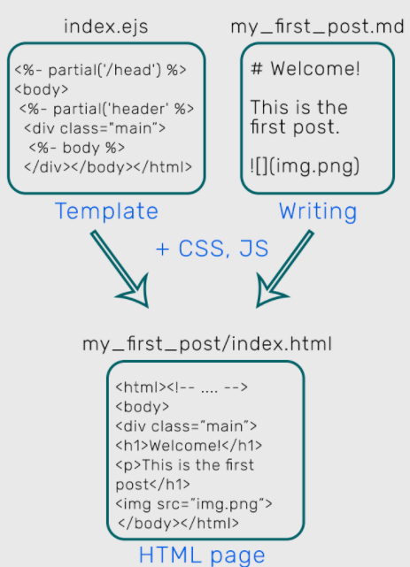

[TOC]

基本整理一些网上收集来的题库

##  [网上前端面试题库](https://gitee.com/LJ_PGSY/frontEndInterviewDB#https://gitee.com/LJ_PGSY/frontEndInterviewDB/blob/master/src/%E6%8A%80%E6%9C%AF%E7%9B%B8%E5%85%B3/HTML&CSS/HTML&CSS.md)

## [基础面试题库2](http://www.cpengx.cn/p/458.html)

https://leetcode-cn.com/circle/discuss/rnaUEw/

https://leetcode-cn.com/circle/discuss/SVKmhR/

https://leetcode-cn.com/circle/discuss/RzTspQ/

## hexo是怎么运行的

Hugo - better

思路来源:
https://www.sitepoint.com/premium/books/an-introduction-to-hexo/read/1
http://coderunthings.com/2017/08/20/howhexoworks/
