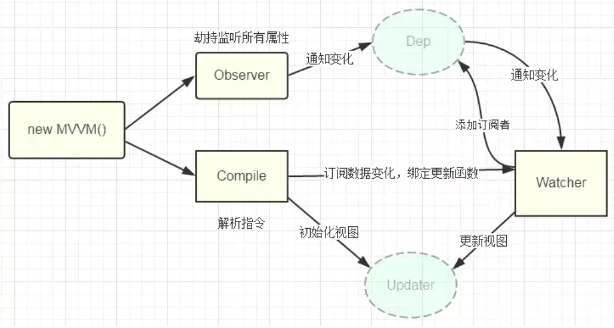
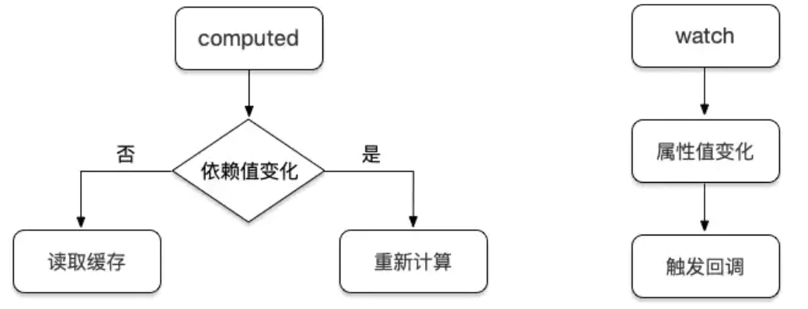
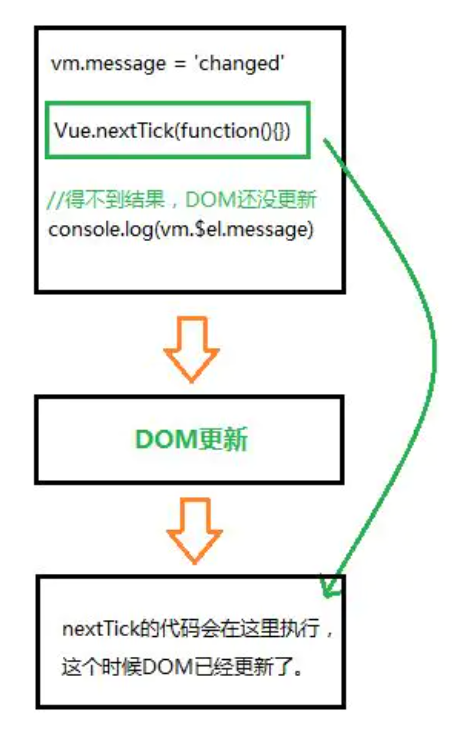

[TOC]

## vue的双向绑定原理

Object.defineProperty()这个API是实现双向绑定的核心，最主要的作用是重写数据的`get`,`set`方法。

### mvvm系列的双向绑定，关键步骤：

1. 实现数据监听器Observer，用`Object.defineProperty()`**重写数据的get、set，值更新就在set中通知订阅者更新数据**。
2. 实现模板编译Compile，深度遍历dom树，对每个元素节点的指令模板进行**替换数据以及订阅数据**。
3. 实现Watch用于连接Observer和Compile，**能够订阅并收到每个属性变动的通知，执行指令绑定的相应回调函数，从而更新视图**。
4. mvvm入口函数，整合以上三者。



###  双向绑定总结

1. vue2.x版本使用了`Object.defineProperty`来实现双向绑定，由于其功能的限制，只能绑定对象的某个属性，vue需要`递归遍历对象的所有属性`挨个进行绑定，功能上不是很完美。
2. vue3.0版本使用`proxy`进行双向绑定，proxy提供了可以定义对象基本操作的自定义行为的功能（如`属性查找、赋值`、枚举、函数调用），可以直接`拦截整个对象`，不需要再进行递归。本例中我们只使用到了proxy提供自定义`set`和`get`的能力。

## watch vs computed 区别



- watch：监测的是属性值， 只要属性值发生变化，其都会触发执行回调函数来执行一系列操作。
- computed：监测的是依赖值，依赖值不变的情况下其会直接读取缓存进行复用，变化的情况下才会重新计算。
- **计算属性不能执行异步任务，计算属性必须同步执行**

> - computed能做的，watch都能做，反之则不行
> - 能用computed的尽量用computed

### vue中实现防抖

```js
watch: {
firstName: function(val) {
  clearTimeout(this.firstTimeout);
  this.firstTimeOut = setTimeout(() => {
    this.fullName = val + " " + this.lastName;
  }, 1000);
},
lastName: function(val) {
  clearTimeout(this.lastTimeout);
  this.lastTimeOut = setTimeout(() => {
    this.fullName = this.firstName + " " + val;
  }, 1000);
}
```

## `$route`和`$router`有什么区别？

`$router`是VueRouter的实例对象，`$route`是当前路由对象，也就是说`$route`是`$router`的一个属性

##  vue中的nextTick 理解

Vue 在修改数据后，视图不会立刻更新，(因为视图的更新是一个异步的过程)，而是等同一事件循环中的所有数据变化完成之后，再统一进行视图更新。



> 数据的变化到 DOM 的重新渲染是一个异步过程，发生在下一个 tick。这就是我们平时在开发的过程中，比如从服务端接口去获取数据的时候，数据做了修改，**如果我们的某些方法去依赖了数据修改后的 DOM 变化，我们就必须在 nextTick 后执行。**

## 生命周期

## v-show和v-if有什么区别？使用场景分别是什么

### v-show与v-if的区别

1. 控制手段：`v-show`控制`css--display，`dom`元素依旧还在。`v-if`是将`dom`元素整个添加或删除
2. 编译过程：`v-if`切换有一个局部编译/卸载的过程（销毁/重建）；`v-show`只是简单的基于css切换
3. 编译条件：`v-if`是真正的条件渲染
    - `v-show` 由`false`变为`true`的时候不会触发组件的生命周期
    - `v-if`由`false`变为`true`的时候，触发组件的`beforeCreate`、`create`、`beforeMount`、`mounted`钩子，由`true`变为`false`的时候触发组件的`beforeDestory`、`destoryed`方法
4. 性能消耗：`v-if`有更高的切换消耗；`v-show`有更高的初始渲染消耗；

> 如果需要非常频繁地切换，则使用 v-show 较好；如果在运行时条件很少改变，则使用 v-if 较好

## vue中 key的作用是什么？

1、key的作用主要是为了高效的更新虚拟dom，其原理是vue在patch过程中通过key可以精准判断两个节点是否是同一个，从而避免频繁更新不同元素，使得整个patch过程更加高效，减少dom操作量，提高性能。 

2、另外，若不设置key还可能在列表更新时候引发一些隐藏的bug。 

3、vue中在使用相同标签名元素的过渡切换时，也会使用到key属性，其目的也是为了让vue可以区分它们，否则vue只会替换其内部属性而不会触发过渡效果。

> **不能用index做key！！！！**
> 影响性能：当用index作为key的时候，删除节点后面的所有节点都会导致重新渲染，因为index变化了，可以也就变化了