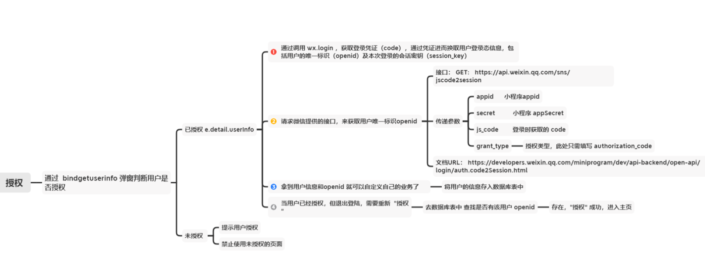

### 小程序有几个文件？

- `WXML`： 微信自己定义的一套组件
- `WXSS` : 用于描述 `WXML` 的组件样式
- `js` : 逻辑处理
- `json` : 小程序页面配置

### 小程序怎么跟随事件传值

> 在 页面标签上通过 绑定 `data-key = value` ， 然后绑定点击通过` e.currentTarget.dataset.key` 来获取标签上绑定的值。

```
<button bindtap="get"  data-name="测试"> 拿到传值</button>

get(e){
    console.log(e.currentTarget.dataset.name)
  }
```

### 小程序 `WXSS` 与 `CSS` 的区别

- `wxss` 背景图片只能引入外链，不能使用本地图片
- 小程序样式使用 `@import` 引入 外联样式文件，地址为相对路径。
- 尺寸单位为 `rpx` , `rpx` 是响应式像素,可以根据屏幕宽度进行自适应。

### 小程序的双向绑定和Vue哪里不一样。

小程序 直接使用`this.data.key = value` 是 不能更新到视图当中的。

必须使用 `this.setData({ key ： value })` 来更新值。

### 小程序的生命周期函数

> - `onLoad` : 页面加载时触发。一个页面只会调用一次，可以在 `onLoad`的参数中获取打开当前页面路径中的参数
> - `onShow` : 页面显示 / 切入前台时触发调用。
> - `onReady` : 页面初次渲染完成时触发,一个页面只会调用一次。
> - `onHide` : 页面隐藏 / 切入后台时触发，如 `navigateTo` 或底部` tab`切换到其他页面，小程序切入后台等
> - `onUnload` : 页面卸载时触发。如 `redirectTo`或 `navigateBack` 到其他页面时.

###  小程序怎么实现下拉刷新

#### 两种方案

##### 方案 一 ：

- 通过在 `app.json` 中， 将 `"enablePullDownRefresh": true,` 开启全局下拉刷新。
- 或者通过在 `组件 .json` ， 将 `"enablePullDownRefresh": true,` 单组件下拉刷新。

##### 方案二：

- `scroll-view` ： 使用该滚动组件 自定义刷新，通过 `bindscrolltoupper` 属性， 当滚动到顶部/左边，会触发 `scrolltoupper`事件，所以我们可以利用这个属性，来实现下拉刷新功能。

### 7`bindtap` 和 `catchtap` 区别

相同点： `都是点击事件`

不同点： `bindtap` 不会阻止冒泡， `catchtap` 可以阻止冒泡。

###  小程序有哪些传递数据的方法

#### 1. 使用全局变量

- 在 `app.js` 中的 `this.globalData = { }` 中放入要存储的数据。
- 在` 组件.js` 中， 头部 引入 `const app = getApp();` 获取到全局变量
- 直接使用 `app.globalData.key` 来进行赋值和获取值。

#### 2. 使用 路由

- `wx.navigateTo` 和 `wx.redirectTo` 时，可以通过在 `url` 后 拼接 + 变量， 然后在 `目标页面` 通过在 `onLoad` 周期中，通过参数来获取传递过来的值。

#### 3. 使用本地缓存

###  简述下 `wx.navigateTo()`, `wx.redirectTo()`, `wx.switchTab()`, `wx.navigateBack()`, `wx.reLaunch()` 区别

- `wx.navigateTo()` : 保留当前页面，跳转到应用内的某个页面。但是不能跳到 `tabbar` 页面
- `wx.redirectTo()` : 关闭当前页面，跳转到应用内的某个页面。但是不允许跳转到 `tabbar` 页面
- `wx.switchTab()` : 跳转到 `TabBar` 页面，并关闭其他所有非 `tabBar` 页面
- `wx.navigateBack()` : 关闭当前页面，返回上一页面或多级页面。可通过`getCurrentPages()` 获取当前的页面栈，决定需要返回几层
- `wx.reLaunch()` : 关闭所有页面，打开到应用的某个页面。

### 小程序 `wx:if` 和 `hidden` 的区别

- `wx:if` : 有更高的切换消耗。
- `hidden` : 有更高的初始渲染消耗。

#### 使用

- 频繁切换使用 `hidden`, 运行时条件变化使用` wx: if`

### `app.json` 全局配置文件描述

- `pages` : 用于存放当前小程序的所有页面路径
- `window` : 小程序所有页面的顶部背景颜色，文字颜色配置。
- `tabBar` : 小程序底部的` Tab` ,最多5个，最少2个。

### 如何封装小程序请求

- 封装 `wx.request` 请求传递需要的参数( `url` , `data` , `method` , `success 成功回调 `， `fail 失败回调` ) , 封装常用方法 `POST` , `GET` , `DELETE` , `PUT` .... 最后导出这些方法
- 然后新建一个 `api.js` 文件，导入封装好的方法，然后调取相应的方法，传递数据。

#### `wx.request 封装`

```js
var app = getApp(); //获取小程序全局唯一app实例
var host = '******************'; //接口地址
 
//POST请求
function post(url, data, success,fail) {
  request(url, postData, "POST", doSuccess, doFail);
}
 
//GET请求
function get(url, data, success, fail) {
  request(url, postData, "GET", doSuccess, doFail);
}
 
function request(url, data, method, success, fail) {
  wx.showLoading({
    title: "正在加载中...",
  })
  wx.request({
    url: host + url, //请求地址
    method: method, //请求方法
    header: { //请求头
      "Content-Type": "application/json;charset=UTF-8"
    },
    data: data, //请求参数    
    dataType: 'json', //返回数据格式
    responseType: 'text', //响应的数据类型
    success: function(res) {
      wx.hideLoading();
      //成功执行方法，参数值为res.data,直接将返回的数据传入
      success(res.data);
    },
    fail: function() {
      //失败执行方法
      fail();
    },
  })
}
module.exports = {
  postRequest: post,
  getRequest: get,
}
```

#### `组件使用 封装好的请求`

```js
var http = require('../../utils/request.js'); //相对路径

var params = {//请求参数
  id:this.data.userId
}
http.postRequest("user/delUser", params, function(res) {
  console.log("修改成功！");
  
}, function(res) {
  console.log("修改失败！！！")
})
```

### 小程序运行机制

- `热启动` ：假如用户已经打开了某个小程序，在一定时间内再次打开小程序的话，这个时候我们就不再需要重新启动了，这需要把我们的后台打开的小程序切换到前台来使用。
- `冷启动`：用户首次打开小程序或被微信主动销毁再次打开的情况，此时小程序需要重新加载启动。

### 小程序什么时候会主动销毁？

小程序在进入后台之后，客户端会帮我们在一定时间内维持我们的一个状态，超过五分钟后，会被微信主动销毁.
官方也没有明确说明 什么时候销毁， 在不同机型表现也不一样，

### 微信授权流程


