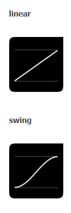
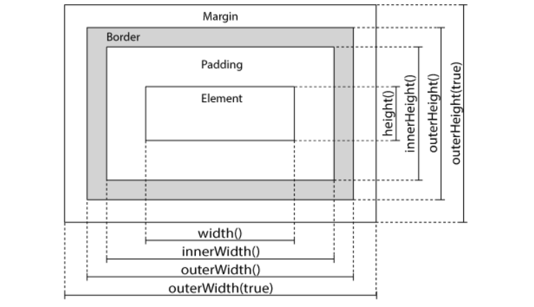

# 1. jQuery基础

**引入方法 - 国内**

```html
<head>
<script
  src="https://code.jquery.com/jquery-3.5.1.js"
  integrity="sha256-QWo7LDvxbWT2tbbQ97B53yJnYU3WhH/C8ycbRAkjPDc="
  crossorigin="anonymous"></script>
</head>
```

## 1.1 jQuery函数
```js
//最基础
jQuery(document).ready(function(){
    alert("jQuery(document).ready(function()");
});
/*	jQuery  简写成 $  */
$(document).ready(function(){
    alert("$(document).ready(function()");
});	
/*  最简单的写法  */
$(function(){
    alert("$(function(){");
});
```
> **`JQuery`的`ready`事件不等于`Js`的`load`：**
>
>   - 执行时机不同：`load`需要等外部图片和视频等全部加载才执行。`ready`是`DOM`绘制完毕后执行，先与外部文件
>   - 用法不同：`load`只可写一次，`ready`可以多次
>

**window.onload与$(document).ready()对比**

|          | window.onload                            | $(document).ready()                                          |
| -------- | ---------------------------------------- | ------------------------------------------------------------ |
| 执行时机 | 必须等网页中所有内容加载完后(图片)才执行 | 网页中的`DOM`结构绘制完后就执行,可能`DOM`元素相关的东西并没有加载完 |
| 编写个数 | 不能同时执行多个                         | 能同时执行多个                                               |
| 简化写法 | 无                                       | `$(document).ready(function(){ //.. });`<br />推荐写法：`$(function(){ });` |

## 1.2 jQuery对象

- jQuery对象是一个类数组对象，内部存放的元素是DOM对象
- jQuery对象的获取通常是使用选择器来获取  【eg: $(选择器字符串)】
- jQuery对象的操作实际上就是对jQuery数组中DOM对象的批量操作
```js
('div')[0];    //在jQuery对象后面添加数值下标即可选择其获取到的JQuery类数组对象中相应位置存放的DOM对象

var div = document.getElementsByTagName('div');    //多个div返回的是一个DOM类数组对象
var $div = $(div);    //将DOM对象作为jQuery函数的参数即可将该DOM对象转化为jQuery对象
```

## 1.3 jq选择器

[Slector Reference](https://www.runoob.com/jquery/jquery-ref-selectors.html)

### a、基本选择器

| 名称       | 用法               | 描述                                 |
| ---------- | ------------------ | ------------------------------------ |
| ID选择器   | $(“#id”);          | 获取指定ID的元素                     |
| 类选择器   | $(“.class”);       | 获取同一类class的元素                |
| 标签选择器 | $(“div”);          | 获取同一类标签的所有元素             |
| 并集选择器 | $(“div,p,li”);     | 使用逗号分隔，只要符合条件之一就可。 |
| 交集选择器 | $(“div.redClass”); | 获取class为redClass的div元素         |

所有选择器 *

#### **$()和document是相等的吗**

```html
<div id="a" class="aa"></div>
<div id="b" class="aa"></div>
<div id="c" class="aa"></div>
alert(document.getElementById("id") == $("#aa"));//返回结果为false
alert(document.getElementById("id") == $("#aa").get(0));//返回true
```


### b、层次选择器

| 名称       | 用法                 | 描述                                                        |
| ---------- | -------------------- | ----------------------------------------------------------- |
| 子代选择器 | $(“ul>li”);          | 使用>号，获取儿子层级的元素，注意，并不会获取孙子层级的元素 |
| 后代选择器 | $(“ul li”);          | 使用空格，代表后代选择器，获取ul下的所有li元素，包括孙子等  |
| 相邻选择器 | $("prev + next")     | 匹配所有紧接在`prev`元素后的`next`元素。                    |
| 兄弟选择器 | $("prev ~ siblings") | 匹配prev元素之后的所有`sibling`元素                         |

### c、兄弟选择器 - 状态和伪类    
| 名称         | 用法                               | 描述                                                        |
| ------------ | ---------------------------------- | ----------------------------------------------------------- |
| :eq（index） | $(“li:eq(2)”).css(“color”, ”red”); | 获取到的li元素中，选择索引号为2的元素，索引号index从0开始。 |
| :odd         | $(“li:odd”).css(“color”, ”red”);   | 获取到的li元素中，选择索引号为奇数的元素                    |
| :even        | $(“li:even”).css(“color”, ”red”);  | 获取到的li元素中，选择索引号为偶数的元素                    |
| :first       | $("p:first")                       | 选取第一个 `<p>` 元素                                       |
| :first-child | $("ul li:first-child")             | 选取每个 `<ul> `元素的第一个 `<li>` 元素                    |
| [href]       | $("[href]")                        | 选取带有 href 属性的元素                                    |
| :button      | $(":button")                       | 选取所有 type="button" 的 `<input> `元素 和 `<button>` 元素 |


## 1.4  jQuery过滤器

### 基本过滤器
```js
语法：  selector:过滤器
```
| 名称               | 用法                        | 描述                             |
| ------------------ | --------------------------- | -------------------------------- |
| children(selector) | $(“ul”).children(“li”)      | 相当于$(“ul>li”)，子类选择器     |
| find(selector)     | $(“ul”).find(“li”);         | 相当于$(“ul li”),后代选择器      |
| siblings(selector) | $(“#first”).siblings(“li”); | 查找兄弟节点，不包括自己本身。   |
| parent()           | $(“#first”).parent();       | 查找父亲                         |
| eq(index)          | $(“li”).eq(2);              | 相当于$(“li:eq(2)”),index从0开始 |
| next()             | $(“li”).next()              | 找下一个兄弟                     |
| prev()             | $(“li”).prev()              | 找上一次兄弟                     |

- selector:first           获取所有已选择到的元素中的第一个元素
  selector:last           获取所有已选择到的元素中的最后一个元素
  selector:even         获取所有已选择到的元素中的索引为偶数元素
  selector:odd           获取所有已选择到的元素中的索引为奇数元素
  selector:eq(index)     获取所有已选择到的元素中的索引为index的元素
  selector:lt(index)       获取所有已选择到的元素中索引值小于index的元素
  selector:gt(index)      获取所有已选择到的元素中索引值大于index的元素
  selector1:not(selector2)  获取所有已选择到的元素中不为selector2的元素
  selector:header                获取所有已选择到的元素中的标题元素【标题h1~h6】

### 内容过滤器

```js
语法：  selector:过滤器            
```
- selector:contains(text)    获取所有已选择到的元素中文本包含text的元素
  selector:empty                获取所有已选择到的元素中没有子节点的元素
  selector:parent                获取所有已选择到的元素中有子节点的元素
  selector:has(selector2)  获取所有已选择到的元素中包含selector2的元素

###  可见性过滤器

```js
语法：  selector:过滤器
```
隐藏类型分2种：
#### a.不占据屏幕空间

```css
    display:none;    //显示为none
    <input type="hidden">    //隐藏input标签
```
#### b.占据屏幕空间
```css
    visibility:hidden;    // 可见度为隐藏
    opacity:0;    //透明度为0
    使用：    
        :visible    选择所有占据屏幕空间的元素
        :hidden        选择所有不占据屏幕空间的元素
```
### 属性过滤器

```js
语法：  selector[属性过滤器]
```
- selector[attr]  		获取所有已选择到的元素中具有属性attr的元素
  selector[attr=Val]   获取所有已选择到的元素中具有属性attr，并且属性值为Val的元素
  selector[attr^=Val]  获取所有已选择到的元素中具有属性attr，并且属性值为以Val开头的元素
  selector[attr$=Val]  获取所有已选择到的元素中具有属性attr，并且属性值为以Val结尾的元素
  selector[attr*=Val]  获取所有已选择到的元素中具有属性attr，并且属性值中包含Val的元素
  selector[attr!=Val]  获取所有已选择到的元素中具有属性attr，并且属性值不为Val的元素或者没有该属性attr的元素

### 后代过滤器
选择器一定要先选择到后代元素，是对选择到的后代元素的过滤
>**注意：**
>选择所有符合selector的后代中的相应元素【批处理】
>空格是表示所有后代      `>`是表示所有子代

#### 下面示例使用的是空格【可能存在多个层级关系】
- selector :nth-child(n)    //获取每个selector元素中所有后代且后代中作为别人的第n个孩子的元素
  selector :first-child   //获取每个selector元素中所有后代且后代中作为别人的第一个子元素【可能选择到一个或多个元素】

*注意与selector :first的区别，获取所有selector元素的所有后代元素中的第一个【只选择到一个元素】*

- selector :last-child     //获取每个selector元素中所有后代且后代中作为别人的最后一个子元素【每个父元素的最后一个子元素】
  selector :only-child 	// 获取每个selector元素中所有后代且后代中作为别人的作为别人的父元素且只有一个子元素【每个父元素如果只有一个孩子元素，获取该元素】
  selector :first-of-type  //获取每个selector元素中所有后代且后代中作为别人的每种类型子元素中的第一个
  Selector :last-of-type   //获取每个selector元素中所有后代且后代中作为别人的每种类型子元素中的最后一个  

### 表单过滤器    【对选择的表单元素进行过滤】
- :enabled   //选取所有可用元素该选择器仅可用于选择支持disabled属性(attribute)的HTML    元素【`<button>, <input>,<optgroup>,<option>,<select>,<textarea>`】
  :disabled   //选取所有不可用的元素该选择器也是仅可用于支持disabled属性的HTML元素
  :checked   //选取所有被选中的元素，用于复选框和单选框、下拉框
  :selected   //选取所有被选中的选项元素，该选择器只适用于<option>
  :focus    //选择当前获取焦点的元素
  :input    //选取所有的`<input>,<textarea>,<select>,<button>`元素。

*注意：**
    `$(":input")`是选择可以让用户输入的标签元素; 而`$("input")`是选择名字为input的所有标签*元素

- :text   //选取所有的单行文本框（`<input type="text">`）
  :password  //选取所有的密码框
  :radio  //选取所有的单选框
  :checkbox   //选取所有的多选框        
  :submit    //选取所有的提交按钮【有提交功能的按钮】
  :reset    //选取所有input类型为reset的表单元素     
  :image    //选取所有input类型为image的表单元素       
  :button    //选取所有input类型为button的表单元素    
  :file        //选取所有input类型为file的表单元素

# 2.jq节点操作

[节点操作reference](https://www.runoob.com/jquery/jquery-ref-traversing.html)

## 2.1 查找结点

`$`(选择器字符串);    

```js
$('div.one span:first');    //查询所有类名为one的div里面的所有后代span里面的第一个span元素
```

## 2.2 创建节点

`$`(HTML文本字符串); 

```js  
var $newNode = $("<span>hello<span>");    //创建一个span节点，里面内容为hello
```


## 2.3 插入子节点

### 插入节点作为最后孩子

`append() `在自身内部插入其它节点作为最后孩子

```js
var $node = $("<span>hello</span>");
$('div').append($node);        //将$node插入到所选取的div内容最后，作为div的最后一个孩子
```

`appendTo()`    将自身插入到其它节点内容中作为最后孩子

```js
$("<span>hello</span>").appendTo($('div'));    //将span节点插入到所有匹配的div中并作为div的最后孩子
```

### 插入节点作为开始孩子
`prepend()`    在自身内部插入其它节点作为开始孩子

```js
    $('div').appendTo($("<span>hello</span>"));    //将span节点插入到所有匹配的div中并作为div的开始孩子
```

`prependTo()`    将自身插入到其它节点内容中作为开始孩子

```js
$("<span>hello</span>").prependTo($('div'));    //将span节点插入到所有匹配的div中并作为div的开始孩子
```

## 2.4 插入兄弟节点

after()    将节点插入到自身后面作为自己后面的兄弟元素

insertAfter()   将自身插入到节点后面作为节点后面的兄弟元素

before()    将节点插入到自身前面作为自己前面的兄弟元素

insertBefore() 将自身插入到节点前面作为节点前面的兄弟元素


## 2.5 删除节点

remove([selector])  返回被删除的节点对象

```js
$('div').remove('.one');    //删除类名为one的div
$('div.one').remove();    //删除类名为one的div
```


detach([selector])    返回被删除的节点对象

```js
$('div:not(".one")').remove(':first');    //删除类名不为one的div中的第一个div
$('div.one').remove();    //删除类名为one的div
```


empty()   无参数，移除匹配元素的所有子节点

```js
$('div:contains("one")').empty();    //清空的div内容中包含文本one的div元素内容
```

## 2.6 复制节点

```js
$(selector).clone(false)   
```

-  返回克隆的节点对象
- 参数：
  false,浅复制,复制元素但不复制元素中所绑定的事件【默认为false】
  true,深复制,复制元素且复制元素中所绑定的事件

## 2.7 替换节点

replaceWith()    用参数节点替换自身,返回被替换的元素

```js
$('div').replaceWith('<span>hello<span>');    //使用span节点替换所有div节点【每个div均用span节点替换】
```


replaeAll()    自身替换参数中的节点

```js
$('<span>hello</span>').replaeAll('div')    //使用span节点替换所有div节点【每个div均用span节点替换】
```

## 2.8 包裹节点

 ` wrap([wrappingElement])`  在每个匹配的元素外层包上一个html元素。

`wrapAll([wrappingElement])` 将所有匹配的元素用一个元素来包裹，可以嵌套多层，但是最内层只能有一个元素; 所有匹配元素将会被当作是一个整体，在这个整体的外部用指定的HTML结构进行包裹。

`wrapInner([wrappingElement])`  每个匹配元素里面内容(子元素)都会被这种结构包裹【匹配元素里面需要有内容；如果为空则最后一个空元素也会出现包裹html元素】  

## 2.9 [节点遍历](https://www.runoob.com/jquery/jquery-ref-traversing.html)

children([selector])    获取匹配元素的子元素集合

```js
$(".content").children(".inner");    //获取类名content的所有子元素【有参数则再过滤出类名为inner的子元素】
$(".content>.inner");    //与上面效果是一样的
```

find(selector)　　获取所有匹配元素中符合参数的所有后代元素            

```js
$(".content").find(".inner");    //获取类名content的所有后代中类名为inner的元素
$(".content .inner");    //与上面效果是一样的
```

next([selector])    	获取下一个兄弟元素

nextAll([selector])    获取后面的兄弟元素

prev([selector])    	获取前一个兄弟元素

prevAll([selector])    获取前面所有的兄弟元素

siblings([selector])　获取所有兄弟元素

closest( selector)    获取最近的匹配元素,如果匹配不上继续向上查找父元素

filter(selector)    继续过滤原来匹配元素

parent([selector])    获取父元素

parents([selector])    获取祖先元素

# 3.jq事件

[event reference](https://www.runoob.com/jquery/jquery-ref-events.html) 

## 3.1.基本事件函数

### 3.1.1参数说明

```js
eventType：事件类型，字符串'click' 'submit'多个事件类型可以通过用空格隔开【一次性绑定'click submit'】
eventData：事件数据，一个对象
handler：事件处理函数
eventObjec：事件对象
data：传递给事件处理函数handler的额外数据
```

### 3.1.2绑定函数之类

#### 3.1.2.1 事件绑定

bind(eventType,[eventData ],handler(eventObject))   同时绑定多个事件类型/处理程序

```js
$("button").bind({
     click:function(){$("p").slideToggle();},    //点击按钮对p标签进行滑动显示隐藏
     mouseover:function(){$("div").css("background-color","red");}     //鼠标移入按钮时设置匹配div的背景颜色为红色
    });
```

#### 3.1.2.2 事件解绑

unbind([eventType],[handler(eventObject)])    
a、无参时,.unbind() 将移除指定元素上所有绑定的处理程序
b、参数为某事件类型时，移除该事件类型上的所有绑定的处理程序
c、参数为事件类型,事件处理函数时，移除该事件类型上绑定的该处理函数【处理函数在绑定时需单独定义出来赋予函数名】

#### 3.1.2.3 绑定一个或多个事件;(类似事件代理)

on( events,[selector],[data],handler(eventObject))    
a、有selector参数时,表示只能添加事件到指定元素的selector选择的后代元素上【函数内的事件对象target,currentTarget和this均为selector选中的元素】
b、无selector参数时,表示给指定元素绑定相应的events事件

#### 3.1.2.4 解除on上面绑定的一个或多个事件

off( events,[selector],[handler])    

与上面的unbind()函数类似,用于解除on()方法绑定的事件

#### 3.1.2.5 模拟事件执行,即让事件自动触发执行

trigger( eventType,[extraParams])   

根据绑定到匹配元素的给定的事件类型eventType执行该事件处理程序的行为。    extraParams传递给事件处理程序的额外参数,为数组类型。
eg:

```js
$("div").click(function(event,a,b){}).trigger("click", [123, 456]);    //模拟div点击事件自动执行并传递两个额外参数给执行函数
```

   

## 3.2.鼠标事件 &键盘事件

## 鼠标事件

| 触发器       | 触发条件                                                     |
| :----------- | :----------------------------------------------------------- |
| click()      | 单击                                                         |
| dblclick()   | 双击                                                         |
| mouseenter() | 鼠标移入 - 不支持子元素                                      |
| mouseleave() | 鼠标移出 - 不支持子元素                                      |
| mouseout()   | 鼠标移出 - 支持子元素                                        |
| mouseover()  | 鼠标移入 - 支持子元素                                        |
| mousedown()  | 鼠标摁下                                                     |
| mouseup()    | 鼠标抬起                                                     |
| mousemove()  | 鼠标移动事件                                                 |
| hover()      | 鼠标悬停 hover( inFunc, outFunc )                            |
| submit()     | 表单提交                                                     |
| focus()      | 当通过鼠标点击选中元素或通过 tab 键定位到元素时，发生 focus 事件。 |
| blur()       | 当元素失去焦点时，发生 blur 事件。                           |

**例子**

```js
$("selector").click(function(){
    // 动作触发后执行的代码!!
 });

$("#p1").hover(
    function(){
        alert("你进入了 p1!");
    },
    function(){
        alert("拜拜! 现在你离开了 p1!");
    }
);
```

## 键盘事件

- keypress()   按键按下事件
  keyup()         按键抬起事件
  keydown()    键按下的过程发生的事件  

## 3.3.表单事件

- focus()        聚焦事件
- blur()        失焦事件
- change()    元素的值改变时激发的事件
- select()      当textarea或文本类型的input元素中的文本被选择时触发的事件,绑定在单行文本框或多行文本框上
- submit()    表单提交事件，绑定在form

## 4.jq效果

[效果reference](https://www.runoob.com/jquery/jquery-ref-effects.html)

### 隐藏&显示

```js
$(selector).hide([speed][,easing][,callback]);
$(selector).show([speed][,easing][,callback]);
//隐藏&显示
$(selector).toggle([speed][,easing][,callback]);
```

```js
//第二个参数是一个字符串，表示过渡使用哪种缓动函数。（译者注：jQuery自身提供"linear" 和 "swing"，其他可以使用相关的插件）。
$(document).ready(function(){
  $(".hidebtn").click(function(){
    $("div").hide(1000,"linear",function(){
      alert("Hide() Done!");
    });
  });
});

$("button").click(function(){
  $("p").toggle();
})
```



> 对于可选的 callback 参数，有以下两点说明：
> 1.$(*selector*)选中的元素的个数为n个，则callback函数会执行n次；
> 2.callback 函数加上括号时，函数立即执行，只会调用一次， 如果不加括号，元素显示或隐藏后调用函数，才会调用多次。

[例子](https://c.runoob.com/codedemo/5659)

### 淡入淡出

```js
$(selector).fadeIn([speed][,easing][,callback]);
$(selector).fadeOut([speed][,easing][,callback]);
$(selector).fadeToggle([speed][,easing][,callback]);//淡入淡出之间转换
$(selector).fadeTo(speed,opacity[,callback]);
```

```js
//fadeIn fadeOut fadeToggle
$("button").click(function(){
  $("#div1").fadeIn();
  $("#div2").fadeIn("slow");
  $("#div3").fadeIn(3000);
});
//fadeTo()  没有默认参数，必须加上 slow/fast/Time &opacity
$("button").click(function(){
  $("#div1").fadeTo("slow",0.15);
  $("#div2").fadeTo("slow",0.4);
  $("#div3").fadeTo("slow",0.7);
});
```

### 滑动效果

```
$(selector).slideDown([speed][,callback]);
$(selector).slideUp([speed][,callback]);
$(selector).slideToggle([speed][,callback]);
```

```js
//三个都这样
$("#flip").click(function(){
  $("#panel").slideDown();
});
```

### 自定义动画

.animate(properties [, duration] [, easing] [, complete])

| **參數**   | **型別**      | **說明**                                                     |
| ---------- | ------------- | ------------------------------------------------------------ |
| properties | Object        | 一组包含最后 CSS 样式                                        |
| duration   | String,Number | 三种预定的速度 (slow, normal, fast)，或动画间隔的毫秒数值 (如一秒=1000) |
| easing     | String        | 缓和方式，预设是 linear 线性，还有 swing 可選选              |
| complete   | Function      | 每个元素在完成动画后要执行的函数                             |

> .animate() 只支援 "可數字化" 的屬性，如 height, width, left, top, opacity 等。


```js
//基本的
$("button").click(function(){
  $("div").animate({
    left:'250px',
    opacity:'0.5',
    height:'150px',
    width:'150px'
  });
}); 

//使用相对值
$("button").click(function(){
  $("div").animate({
    left:'250px',
    height:'+=150px',
    width:'+=150px'
  });
});
//属性预定值
$("button").click(function(){
  $("div").animate({
    height:'toggle'
  });
});
//队列功能
$("button").click(function(){
  var div=$("div");
  div.animate({height:'300px',opacity:'0.4'},"slow");
  div.animate({width:'300px',opacity:'0.8'},"slow");
  div.animate({height:'100px',opacity:'0.4'},"slow");
  div.animate({width:'100px',opacity:'0.8'},"slow");
});
```

#### 操作动画队列

jQuery提供了以下几种方法来操作动画队列。

1. stop([clearQuery],[gotoEnd]):停止当前jQuery对象里每个DOM元素上正在执行的动画。
2. queue([queueName,]callback):将callback动画数添加到当前jQuery对象里所有DOM元素的动画函数队列的尾部。
3.  queue([queueName,]naeQueue):用newQueue动画函数队列代替当前jQuery对象里所的DOM元素的动画函数队列。
4.  dequeue():执行动画函数队列头的第一个动画函数，并将该动画函数移出队列。
5.  clearQueue([queueName]):清空动画函数队列中的所有动画函数。


```html
<style>
	div {
		width: 60px; 
		height: 60px;
		position:absolute;
		top:60px; 
		background: #f0f;
		display:none;
	}
	</style> 
<body>
	<script type="text/javascript" src="../jquery-1.8.0.js">
	</script>
	<p>动画队列的长度是：<span></span></p>
	<div></div>
	<script type="text/javascript">
	var div = $("div");
	function runIt()
	{
		// 第1个动画：显示出来
		div.show("slow");
		// 第2个动画：自动动画，水平左移300px
		div.animate({left:'+=300'},2000);
		// 第3个动画：卷起来
		div.slideToggle(1000);
		// 第4个动画：放下来
		div.slideToggle("fast");
		// 第5个动画：自动动画，水平右移300px
		div.animate({left:'-=300'},1500);
		// 第6个动画：隐藏出来
		div.hide("slow");
		// 第7个动画：显示出来
		div.show(1200);
		// 第8个动画：卷起来，动画完成后回调runIt
		div.slideUp("normal", runIt);
	}
	// 控制每0.1秒调用一次该方法，该方法用于显示动画队列的长度
	function showIt()
	{
		var n = div.queue();
		$("span").text(n.length);
		setTimeout(showIt, 100);
	}
	runIt();
	showIt();
	</script>
```


### 停止动画

```
$(selector).stop(stopAll,goToEnd);
```

```js
$("#stop").click(function(){
  $("#panel").stop();
});
```

动画队列停止动画测试，只停止当前正在进行的动画，停止当前动画后，队列中的下一个动画开始进行：

```js
$(document).ready(function(){
  $("#flip").click(function(){
    $("#panel").slideDown(5000);
    $("#panel").slideUp(5000);
  });
  $("#stop").click(function(){
    $("#panel").stop();
  });
});
```

可以在 stop() 中设置 stopAll 的参数为 true，这样就可以停止所有动画效果而不是只停止当前动画：

```js
$(document).ready(function(){
  $("#flip").click(function(){
    $("#panel").slideDown(5000);
    $("#panel").slideUp(5000);
  });
  $("#stop").click(function(){
    $("#panel").stop(true);
  });
});
```

### jQuery链条 - chaining

```js
$("#p1").css("color","red").slideUp(2000).slideDown(2000);
```

## 5.jQuery HTML

### 获得内容与属性

#### text()、html() & val()

```js
$("#btn1").click(function(){
  alert("Text: " + $("#test").text()); 
  alert("HTML: " + $("#test").html());
  alert("值为: " + $("#test").val());
});
```

#### attr()

```js
$("button").click(function(){
  alert($("#runoob").attr("href"));
});
```

### prop() vs attr()

**prop()函数的结果:**

   1.如果有相应的属性，返回指定属性值。

   2.如果没有相应的属性，返回值是空字符串。

**attr()函数的结果:**

   1.如果有相应的属性，返回指定属性值。

   2.如果没有相应的属性，返回值是 undefined。

对于HTML元素本身就带有的固有属性，在处理时，使用prop方法。

对于HTML元素我们自己自定义的DOM属性，在处理时，使用 attr 方法。

具有 true 和 false 两个属性的属性，如 checked, selected 或者 disabled 使用prop()

例子

```html
<a href="https://www.runoob.com" target="_self" class="btn">菜鸟教程</a>
这个例子里 <a> 元素的 DOM 属性有: href、target 和 class，这些属性就是 <a> 元素本身就带有的属性，也是 W3C 标准里就包含有这几个属性，或者说在 IDE 里能够智能提示出的属性，这些就叫做固有属性。处理这些属性时，建议使用 prop 方法。

<a href="#" id="link1" action="delete" rel="nofollow">删除</a>
这个例子里 <a> 元素的 DOM 属性有: href、id 和 action，很明显，前两个是固有属性，而后面一个 action 属性是我们自己自定义上去的，<a> 元素本身是没有这个属性的。这种就是自定义的 DOM 属性。处理这些属性时，建议使用 attr 方法。
```

### 设置内容与属性

#### text()、html() & val()

```js
$("#btn1").click(function(){
    $("#test1").text("new contents");
    $("#test2").html("<b>new contents</b>");
    $("#test3").val("new contents");
});
```

#### attr()

```js
$("button").click(function(){  $("#runoob").attr("href","http://www.runoob.com/jquery"); });
```


### 回调函数

#### text()、html() & val()

```js
$("#btn1").click(function(){
    $("#test1").text(function(i,origText){
        return "旧文本: " + origText + " 新文本: Hello world! (index: " + i + ")"; 
    });
    $("#test2").html(function(i,origText){
        return "旧 html: " + origText + " 新 html: Hello <b>world!</b> (index: " + i + ")"; 
    });
});
```

#### attr()

```js
$("button").click(function(){
  $("#runoob").attr("href", function(i,origValue){
    return origValue + "/jquery"; 
  });
});
```


### 添加元素

- append() - 在被选元素的结尾插入内容
- prepend() - 在被选元素的开头插入内容
- after() - 在被选元素之后插入内容
- before() - 在被选元素之前插入内容

**append**

```html
<p>
  <span class="s1">s1</span>
</p>
<script>
$("p").append('<span class="s2">s2</span>');
</script>
```

结果是这样的:

```html
<p>
  <span class="s1">s1</span>
  <span class="s2">s2</span>
</p>
```

**after**

```html
<p>
  <span class="s1">s1</span>
</p>
<script>
$("p").after('<span class="s2">s2</span>');
</script>
```

结果是这样的:

```html
<p>
  <span class="s1">s1</span>
</p>
<span class="s2">s2</span>
```

增加多个元素

```js
function afterText(){
    var txt1="<b>I </b>";                    // 使用 HTML 创建元素
    var txt2=$("<i></i>").text("love ");     // 使用 jQuery 创建元素
    var txt3=document.createElement("big");  // 使用 DOM 创建元素
    txt3.innerHTML="jQuery!";
    $("img").after([txt1,txt2,txt3]);          // 在图片后添加文本
}
```


### append/prepend vs after/before

1. append/prepend 是在选择元素内部嵌入。
2. after/before 是在元素外面追加。

### 删除元素

- remove() - 删除被选元素（及其子元素）
- empty() - 从被选元素中删除子元素

```js
$("p").remove(".italic"); //删除 class="italic" 的所有 <p> 元素，不能删除带有过滤器的子元素。
```

### 操作css类

- addClass(className) - 向被选元素添加一个或多个类
- hasClass(className) - 确定任何一个匹配元素是否有指定的类。
- removeClass([className]) - 从被选元素删除一个或多个类
- toggleClass() - 对被选元素进行添加/删除类的切换操作
- css() - 设置或返回样式属性

```js
$(selector).css("*propertyname*","*value*");
$(selector)css({"propertyname":"value","propertyname":"value",...});
```

### jQuery 尺寸

- width()
- height()
- innerWidth()
- innerHeight()
- outerWidth()
- outerHeight()



例子

```js
$("button").click(function(){
  var txt="";
  txt+="div 的宽度是: " + $("#div1").width() + "</br>";
  txt+="div 的高度是: " + $("#div1").height();
  $("#div1").html(txt);
});
```

设置了 box-sizing 后，width() 获取的是 css 设置的 width 减去 padding 和 border 的值。

```css
.test{width:100px;height:100px;padding:10px;border:10px;box-sizing:border-box;}
```

-  width() 获取为: 60
-  innerWidth() 获取值为: 80
-  outWidth() 获取值为: 100

## 6.validation

1. [详细](https://blog.csdn.net/lhzjj/article/details/17378435?utm_medium=distribute.pc_relevant.none-task-blog-title-6&spm=1001.2101.3001.4242)
2. [document](https://jqueryvalidation.org/)
3. https://xiaohuochai.site/FELib/jq/validate/validation.html

# reference

1. https://docs.huihoo.com/jquery/jquery-fundamentals/zh-cn/book.html#N20CE6
2. https://www.jianshu.com/p/f8e3936b34c9

3. https://blog.csdn.net/owen_william/article/details/51339850?utm_medium=distribute.pc_relevant.none-task-blog-BlogCommendFromMachineLearnPai2-1.control&depth_1-utm_source=distribute.pc_relevant.none-task-blog-BlogCommendFromMachineLearnPai2-1.control
4. https://www.runoob.com/jquery/jquery-tutorial.html

