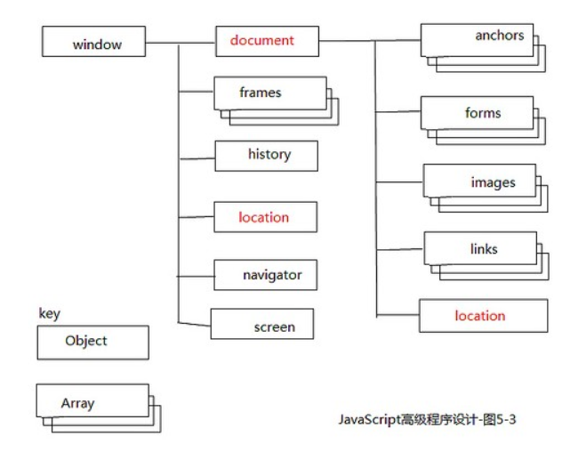

## 1. BOM 对象

#### 1.1 BOM 结构体系



#### 1.2 BOM 的作用

- BOM可实现功能
  - `弹出新的浏览器窗口`
  - `移动、关闭浏览器窗口以及调整窗口的大小`
  - `页面的前进、后退、刷新和重新加载`
  - `获取操作系统和浏览器的信息`

## 2. Window 对象

#### 2.1 常用属性

- **常用属性**

| 属性名称    | 说明                      |
| ----------- | ------------------------- |
| history     | 有关用户访问过的URL的信息 |
| location    | 有关当前 URL 的信息       |
| document    | 有关页面文档的信息        |
| navigator   | 有关浏览器的信息          |
| screen      | 有关显示器屏幕的信息      |
| innerHeight | 浏览器窗口的高度和宽度    |

浏览器高度和宽度

- window.innerWidth
- window.innerHeight

```js
var age = 18    //全局成员是window对象的属性
function myFun(){
    alert('我是函数！')
}
//UI响应式设计innerWidth发挥应用
console.log('浏览器窗口宽度：' + window.innerWidth)
console.log('浏览器窗口高度：' + window.innerHeight)
alert(window.age)
12345678
```

#### 2.2 常用方法

- **常用方法**

| 方法名称  | 说明                                              |
| --------- | ------------------------------------------------- |
| prompt()  | 显示可提示用户输入的对话框                        |
| alert()   | 显示带有一个提示信息和一个确定按钮的警示框        |
| confirm() | 显示一个带有提示信息、确定和取消按钮的对话框      |
| close()   | 关闭浏览器窗口                                    |
| open()    | 打开一个新的浏览器窗口，加载给定 URL 所指定的文档 |

###### 2.2.1 open 方法

- `window.open("弹出窗口的 url", "窗口名称", "窗口特征")`

| 属性名称      | 说明                                 |
| ------------- | ------------------------------------ |
| height、width | 窗口文档显示区的高度、宽度、以像素计 |
| left、top     | 窗口的 x 坐标、y 坐标，以像素计      |

#### 2.3 其他方法

- **其他方法**

| 方法名称      | 说明                                         |
| ------------- | -------------------------------------------- |
| resizeBy()    | 把窗口的大小尺寸调整指定的像素               |
| resizeTo()    | 把窗口的大小尺寸调整到指定的宽度和高度       |
| moveBy()      | 把当前窗口移动指定的像素距离                 |
| moveTo()      | 把窗口的左上角移动到指定的坐标               |
| scrollBy()    | 滚动指定的像素距离，内容必须大于窗口的尺寸   |
| scrollTo()    | 滚动到指定的坐标位置                         |
| setTimeout()  | 在指定的毫秒数后调用函数或计算表达式         |
| setInterval() | 按照指定的周期（以毫秒计）来调用函数或表达式 |

#### 2.4 方法案例

```html
<script>
    function Buy(){
        //涉及到安全、数据更改、删除操作
        if(confirm('您确定要下单吗？')){
            alert('用户已经确认，马上提交服务器。。。。。。')
        }else{
            alert('用户已经撤销，不再继续操作！')
        }
    }
    function closeWindow(){
        close()
    }
    function openWindow(){
        open('page1.html','myNewWin','width=300px,height=300px,left=100px,top=100px')
    }
    function moveWindow(){
        window.moveBy(100,100) //适用于open打开的窗口，其他没有效果
    }
    function scrollWindow(){
        window.scrollBy(0,10)       //实现页面滚动
        window.scrollTo(0,1000)       //实现页面滚动
    }
</script>
<body style="height: 2000px;">
    <form action="">
        <input type="button" value="下单" onclick="Buy()">
        <input type="button" value="关闭" onclick="closeWindow()">
        <input type="button" value="打开新窗口" onclick="openWindow()">
        <input type="button" value="移动窗口" onclick="moveWindow()">
        <input type="button" value="滚动窗口" onclick="scrollWindow()">
    </form>
</body>
```

## 3. 定时器方法

#### 3.1 设置定时器方法

###### 3.1.1.1 `setTimeout()`

- `功能`

  - 用于`在指定的毫秒数后调用函数或计算表达式`
  - `code 必需参数`，要调用的函数后要执行的 JavaScript 代码串
  - `millisec 必需参数`，在执行代码前需等待的毫秒数
  - setTimeout() `只执行 code 一次`

- **语法**

  ```js
  setTimeout("调用的函数",等待的毫秒数)
  ```

```html
//举例: 实现五秒后出现提示框
<script>
var num=100;
function startWork(){
      alert('我在准备中！')
      setTimeout(function(){
          alert('我开工了！');
          num=num+100;
           if( num > 200){
              clearInterval(timer);
              return false;
            }
     ,3000)
}
</script>
<body>
    <form action="">
        <input type="button" value="开始工作" onclick="startWork()">
    </form>
</body>                              
```

```js
var num=0;
var timer=setTimeout(function)(){
        console.log (num++);
    },3000);
};
```

 ###### 3.1.1.2 立即改变用户输入

```html
<input type="text" id="myInput">
<script>
myInput.onkeypress = function(event) {
    setTimeout(function(){
        myInput.value = myInput.value.toUpperCase();
    });
}
</script>
```

###### 3.1.1.3 js改变线性顺序

**js是单线程的**

所以我们看看

```js
setTimeout(function(){
 console.log(1);
}, 0);
console.log(2);
console.log(3);
//结果： 2 3 1
```

js是单线程的，单线程就意味着，所有任务需要排队，前一个任务结束，才会执行后一个任务。如果前一个任务耗时很长，后一个任务就不得不一直等着。

###### 3.1.2 `setInterval()`

- `功能`
  - 可`按照指定的周期(以毫秒计)来调用函数或计算表达式`
  - `code 必需`，要`调用的函数或要执行的代码串`
  - `millisec 必需`，周期性执行或调用 code 之间的`时间间隔`，以毫秒计
  - setInterval() 方法会不停地调用函数，`直到 clearInterval() 被调用或窗口被关闭`
  - 由 `setInterval() 返回的 ID 值可用作 clearInterval() 方法的参数`
- **语法**

```js
setInterval("调用的函数",间隔的毫秒数)
```

```html
<div id="mydiv"></div>
<script>
    setInterval(function(){
        var mydiv = document.getElementById('mydiv')
        mydiv.innerHTML = new Date().toLocaleString()
    }, 1000);
</script> 
```

```js
var num=1;
var timer = setInterval(function(){
    count.innerHTML=num++;
    if(num==11){
        clearInterval(timer);
    }
},500);
```


#### 3.2 清除定时器方法

###### 3.2.1 `clearTimeout()`

- `功能`
  - 可`取消`由 setTimeout() 方法设置的 timeout
  - id_of_setTimeout 由 `setTimeout() 返回的 ID 值`
  - 该值标识要取消的延迟执行代码块
- **语法**

```js
clearTimeout(id_of_setTimeout)
```
```html
举例: 实现开始/暂停计数（如果没有点击“暂停计数”则一直计数，点击“暂停计数”后仍然可以再点击“开始计数”继续计数）

<script type="text/javascript">
	var num = 0
    var timer = null //初始化定时器对象为空
    function startRecord() {
        if (timer == null) { // 判断是否已存在定时器，防止定时器累加
            //创建定时器
            timer = setInterval(function () {
                num++
                document.getElementById('mydiv').innerHTML = num
            }, 1000);
        }
    }
    function pauseRecord(){
        clearInterval(timer) //清除定时器，此时 timer 并没有为空
        timer = null
    }
</script>
<body>
	<div id="mydiv">0</div>
    <form action="">
        <input type="button" value="开始计数" onclick="startRecord()">
        <input type="button" value="暂停计数" onclick="pauseRecord()">
    </form>
</body>
```

###### 3.2.2 `clearInterval()`

- `功能`
  - 可`取消`由 setInterval() 设置的 timeout
  - id_of_setInterval `由 setInterval() 返回的 ID 值`
- **语法**

```html
clearInterval(id_of_setInterval)
````
````html
举例: 实现停在获取系统的时间（获取了系统的时间，点击暂停后计时会停止）

<input type="text" id="clock" size="35" />
<script language=javascript>
	 var int = self.setInterval("clock()",50)
	 function clock(){
	   var t=new Date()
	   document.getElementById("clock").value=t
	 }
</script>

<body>
	<button onclick="int = window.clearInterval(int)">暂停</button>
</body>                  
```

#### 3.3 定时器案例

###### 3.3.1 随机漂浮的广告窗口

```js
setInterval(function(){
	var direction = [-1,1]
	var x,y
	var index = Math.round(Math.random()) // 0,1
	
	x = Math.round(5*Math.random()) * direction[index] // 生成随机的水平偏移量
	y = Math.round(5*Math.random()) * direction[index] // 生成随机的垂直偏移量
	
	moveBy(x,y)
},2000) 
```

###### 3.3.2 自动轮播图

```html
<script>
	var loopPics = ['1.jpg','2.jpg','3.jpg']
	var index = 0
	setInterval(function(){
		var myImg = document.getElementById('loopPic')
		myImg.src = 'images/' + loopPics[index++]
		if(index > 2){
			index = 0
		}
	},3000)
</script>
<body>
	
</body> 
```

###### 3.3.2 手动轮播图

```js
var lis = document.getElementsByTagName('li')
for(var i = 0; i < lis.length; i++) {
	lis[i].onclick = function(){
		var myImg = document.getElementById('loopPic')
		var currentIndex = this.innerHTML // 获取点击标签内部的内容
		myImg.src = 'images/' + loopPic[currentIndex - 1]
	}
} 
```

## 4. Window 对象事件

#### 4.1 常用的事件

| 名称     | 说明                       |
| -------- | -------------------------- |
| onload   | 一个页面或一幅图像完成加载 |
| onresize | 窗口尺寸大小发生变化时触发 |
| onscroll | 一个页面或一幅图像完成加载 |
| onunload | 一个页面或一幅图像完成加载 |

###### 4.1.1 window.onload 事件

- window.onload表示`页面标签全部加载`

```html
<script>
	
	1. 不加 window.onload 会报错
	   代码是从头加载到尾，还没有加载到 body 中的元素，所以获取不到,会报错
	
		var btn = document.getElementById('btn')  
	    btn.onclick = function () {
	        alert('我被点击了！')
	    }

==========================================================================
	
	2. window.onload 表示页面标签全部加载
       
       window.onload = function () {
           var btn = document.getElementById('btn')  
           btn.onclick = function () {
               alert('我被点击了！')
           }
       }

==========================================================================

	3. 注意避免重复定义 onload 事件，以免覆盖
       
       window.onload = function(){
       	  alert('start!')
       }
    </script>
</head>

<body>
    <form action="">
        <input type="button" id="btn" value="点我">
    </form>
</body> 
```

#### 4.2 文档加载过程

###### 4.2.1 存在问题

- 浏览器在加载一个页面时，是按照`自上向下`的顺序加载的
- 如果将`script`标签写到`head`内部，在代码执行时，页面还没有加载，页面中的`DOM`对象也没有加载
- 导致在`js`中无法获取到页面中的`DOM`对象

```html
<script>
	var btn = document.getElementById("btn");
	btn.onclick = function(ev){
		alert("点我也没用");
	}
</script>
<body>
	<button id="btn">点我</button>
</body>

结果：报错 
```

###### 4.2.2 解决方案

- `onload`事件
  - `onload`事件会在`整个页面加载完成之后才触发`
  
- 为 `window`绑定一个`onload`事件
  
  - 该事件对应的响应函数将会在页面加载完成之后执
    - 这样可以确保我们的代码执行时所有的`DOM`对象已经加载完毕了

```js
window.onload = function(){
	...
} 
```

- 把`script`标签放在`body`尾部

```html
<body>
...
    <script></script>
</body> 
```

- 建议: `两者综合`

#### 4.3 window 事件练习

```js
- 实现以下的页面效果
	- 当浏览器窗口宽度在低于800px时，页面背景是红色
	- 当浏览器窗口宽度在800-1024px时，页面背景是蓝色
	- 当浏览器窗口宽度在1024-1280px时，页面背景是绿色
	- 当浏览器窗口宽度大于1280px时，页面背景是黄色

//适合做滚动监听的页面特效
window.onscroll = function(){
    console.log('页面开始滚动了')
}
//响应式设计的原理
window.onresize = function(){ // 监听浏览器窗口变化
    console.log('当前页面的宽度：' + innerWidth)
    if(innerWidth < 800){
        document.body.style.backgroundColor = '#ff0'
    }else if(innerWidth < 1024){
        document.body.style.backgroundColor = '#f0f'
    }else if(innerWidth < 1280){
        document.body.style.backgroundColor = '#0ff'
    }else{
        document.body.style.backgroundColor = '#0f0'
    }
}
```


## 实例

[BOM实例](https://www.runoob.com/js/js-ex-browser.html)

## reference:

https://www.shuzhiduo.com/A/WpdKA9AqJV/

