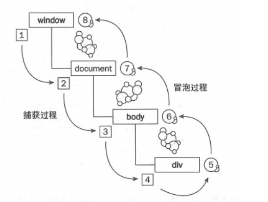

# DOM

## Dom Node NodeList  NodeCollection基本讲解

### dom&node

- （文档对象模型）Document Object Model
- 注意 DOM最小组成单位叫做节点 Node

> 常见的Node有`element`，`text`，`attribute`，`comment`，`document`等（所以要注意`节点`和`元素`的区别，`元素`属于`节点`的一种）。

#### Node关系


#### Node类型

| 节点                 | 类型                   | nodeName                 | nodeType | 含义         |                                    |
| :------------------- | :--------------------- | :----------------------- | -------- | ------------ | ---------------------------------- |
| **Document**         | Node.DOCUMENT_NODE     | #document                | 9        | 文档节点     | 整个文档(window.document)          |
| **Element**          | ELEMENT_NODE           | 大写的 HTML 元素名       | 1        | 元素节点     | HTML元素(比如<body>、等)           |
| **Attribute**        | ATTRIBUTE_NODE         | 等同于 Attr.name         | 2        | 属性节点     | HTML元素的属性(比如 class=”right”) |
| **Text**             | TEXT_NODE              | #text                    | 3        | 文本节点     | HTML 文档中出现的文本              |
| **DocumentType**     | DOCUMENT_TYPE_NODE     | 等同于 DocumentType.name | 10       | 文档类型节点 | 文档的类型(比如<!DOCTYPE html>)    |
| **DocumentFragment** | DOCUMENT_FRAGMENT_NODE | #document-fragment       | 11       | 文档碎片节点 | 文档的片段                         |

验证例子

```js
document.nodeName // "#document"
document.nodeType // 9
document.querySelector('a').nodeType === 1 // true
document.querySelector('a').nodeType === Node.ELEMENT_NODE // true
```

### nodeList

NodeList 对象是一个节点的集合，一般由`Node.childNodes`、`document.getElementsByName`和`document.querySelectorAll`返回的。

> 不过需要注意，`Node.childNodes`、`document.getElementsByName`返回的`NodeList`的结果是实时的（此时跟HTMLCollection比较类似），而`document.querySelectorAll`返回的结果是固定的，这一点比较特殊。
>
> NodeList 接口提供 length 属性和数字索引，因此可以像数组那样，使用数字索引取出每个节点，但是它本身并不是数组，不能使用 pop 或 push 之类数组特有的方法。当然可以转成数组。
>
> NodeList 部署了 Iterator 接口，因此还可以用 for…of 进行遍历。

```js
var childNodes = document.body.childNodes;
console.log(childNodes.length); // 如果假设结果是“2”
document.body.appendChild(document.createElement('div'));
console.log(childNodes.length); // 此时的输出是“3”
```

###  HTMLCollection

HTMLCollection是一个特殊的NodeList，表示包含了若干元素（元素顺序为文档流中的顺序）的通用集合，它是实时更新的，当其所包含的元素发生改变时，它会自动更新。另外，它是一个伪数组，如果想像数组一样操作它们需要像`Array.prototype.slice.call(nodeList, 2)`这样调用。

>   所以实际上针对不同的元素 有不同调用方法属性。 分为node HTML元素 document element text

getElementsByTagName() 方法返回 *HTMLCollection* 对象。

```js
var x = document.getElementsByTagName("p");
y = x[1];//获取集合中的第二个p元素
```

length 属性定义了 HTMLCollection 中元素的数量

```js
var myCollection = document.getElementsByTagName("p");
document.getElementById("demo").innerHTML = myCollection.length;
//另一个实际利用
var myCollection = document.getElementsByTagName("p");
var i;
for (i = 0; i < myCollection.length; i++) {
    myCollection[i].style.backgroundColor = "red";
}
```

> HTMLCollection 并非数组！


### HTMLCollection 与 NodeList 的区别

- HTMLCollection（前一章）是 HTML 元素的集合。
- NodeList 是文档节点的集合。
- NodeList 和 HTML 集合几乎完全相同。
- HTMLCollection 和 NodeList 对象都是类数组的对象列表（集合）。
- 它们都有定义列表（集合）中项目数的 length 属性。
- 它们都可以通过索引 (0, 1, 2, 3, 4, ...) 像数组那样访问每个项目。
- 访问 HTMLCollection 项目，可以通过它们的名称、id 或索引号。
- 访问 NodeList 项目，只能通过它们的索引号。
- 只有 NodeList 对象能包含属性节点和文本节点。
- 节点列表不是数组！
- 节点数组看起来像数组，但并不是。
- 您能够遍历节点列表并像数组那样引用其节点。
- 不过，您无法对节点列表使用数组方法，比如 valueOf()、push()、pop() 或 join()。

[HTMLCollection vs. NodeList](https://www.jianshu.com/p/f6ff5ebe45fd)


## 节点查找API

> document.getElementById ：根据ID查找元素，大小写敏感，如果有多个结果，只返回第一个；
>
> document.getElementsByClassName ：根据类名查找元素，多个类名用空格分隔，返回一个 HTMLCollection 。注意兼容性为IE9+（含）。另外，不仅仅是document，其它元素也支持 getElementsByClassName 方法；
>
> document.getElementsByTagName ：根据标签查找元素， * 表示查询所有标签，返回一个 HTMLCollection 
>
> document.getElementsByName ：根据元素的name属性查找，返回一个 NodeList 。
>
> document.querySelector ：返回单个Node，IE8+(含），如果匹配到多个结果，只返回第一个。
>
> document.querySelectorAll ：返回一个 NodeList ，IE8+(含）。
>
> document.forms ：获取当前页面所有form，返回一个 HTMLCollection ；

```html
<p>
  <!-- afterbegin -->
  foo
  <!-- beforeend -->
</p>
<!-- afterend -->
```

**4、Element.insertAdjacentElement()**

用法和上面类似，

```js
targetElement.insertAdjacentElement(position, element);
```

**5、removeChild**

removeChild用于删除指定的子节点并返回子节点，语法：

```js
var deletedChild = parent.removeChild(node);  
```

deletedChild指向被删除节点的引用，它仍然存在于内存中，可以对其进行下一步操作。另外，如果被删除的节点不是其子节点，则将会报错。一般删除节点都是这么删的：

```js
function removeNode(node)  
{  
    if(!node) return;  
    if(node.parentNode) node.parentNode.removeChild(node);  
}  
```

**6、replaceChild**

replaceChild用于将一个节点替换另一个节点，语法：

```js
parent.replaceChild(newChild, oldChild);  
```

## 节点关系API

**1、父关系API**

> parentNode ：每个节点都有一个parentNode属性，它表示元素的父节点。Element的父节点可能是Element，Document或DocumentFragment；
>
> parentElement ：返回元素的父元素节点，与parentNode的区别在于，其父节点必须是一个Element元素，如果不是，则返回null；

**2、子关系API**

> children ：返回一个实时的 HTMLCollection ，子节点都是Element，IE9以下浏览器不支持；
>
> childNodes ：返回一个实时的 NodeList ，表示元素的子节点列表，注意子节点可能包含文本节点、注释节点等；
>
> firstChild ：返回第一个子节点，不存在返回null，与之相对应的还有一个 firstElementChild ；
>
> lastChild ：返回最后一个子节点，不存在返回null，与之相对应的还有一个 lastElementChild ；
>
> childElementCount ：返回子元素节点的个数，相当于children.length

**3、兄弟关系型API**

> previousSibling ：节点的前一个节点，如果不存在则返回null。注意有可能拿到的节点是文本节点或注释节点，与预期的不符，要进行处理一下。
>
> nextSibling ：节点的后一个节点，如果不存在则返回null。注意有可能拿到的节点是文本节点，与预期的不符，要进行处理一下。
>
> previousElementSibling ：返回前一个元素节点，前一个节点必须是Element，注意IE9以下浏览器不支持。
>
> nextElementSibling ：返回后一个元素节点，后一个节点必须是Element，注意IE9以下浏览器不支持。

**4、包含关系查询**

> hasChildNodes()： 在包含一个或多个子节点时返回true，比查询childNodes列表的length属性更简单
>
> contains() ：接受一个节点作为参数，返回一个布尔值，表示参数节点是否为当前节点的后代节点。参数为后代节点即可，不一定是第一层子节点　

## 元素属性型API

**1、setAttribute 给元素设置属性：**

```
element.setAttribute(name, value);  
```

其中name是特性名，value是特性值。如果元素不包含该特性，则会创建该特性并赋值。

**2、getAttribute**

getAttribute返回指定的特性名相应的特性值，如果不存在，则返回null：

```js
var value = element.getAttribute("id"); 
```

**3、hasAttribute**

```js
var result = element.hasAttribute(name);

var foo = document.getElementById("foo"); 
if (foo.hasAttribute("bar")) { 
    // do something
}
```

**4、dataset**

获取html data-开头的属性，用法如下：

```js
<div id="user" data-id="1234567890" data-user="johndoe" data-date-of-birth>John Doe</div>

let el = document.querySelector('#user');

// el.id == 'user'
// el.dataset.id === '1234567890'
// el.dataset.user === 'johndoe'
// el.dataset.dateOfBirth === ''

el.dataset.dateOfBirth = '1960-10-03'; // set the DOB.

// 'someDataAttr' in el.dataset === false
el.dataset.someDataAttr = 'mydata';
// 'someDataAttr' in el.dataset === true
```

## 样式相关API

**1、直接修改元素的样式**

```js
elem.style.color = 'red';  
elem.style.setProperty('font-size', '16px');  
elem.style.removeProperty('color');  
```

**2、动态添加样式规则**

```js
var style = document.createElement('style');  
style.innerHTML = 'body{color:red} #top:hover{background-color: red;color: white;}';  
document.head.appendChild(style);  
```

**3、classList获取样式class**

```js
// div is an object reference to a <div> element with class="foo bar"
div.classList.remove("foo");
div.classList.add("anotherclass");

// if visible is set remove it, otherwise add it
div.classList.toggle("visible");

// add/remove visible, depending on test conditional, i less than 10
div.classList.toggle("visible", i < 10 );

alert(div.classList.contains("foo"));

// add or remove multiple classes
div.classList.add("foo", "bar", "baz");
div.classList.remove("foo", "bar", "baz");

// add or remove multiple classes using spread syntax
let cls = ["foo", "bar"];
div.classList.add(...cls); 
div.classList.remove(...cls);

// replace class "foo" with class "bar"
div.classList.replace("foo", "bar");
```

**4、window.getComputedStyle**

通过 element.sytle.xxx 只能获取到内联样式，借助 window.getComputedStyle 可以获取应用到元素上的所有样式，IE8或更低版本不支持此方法。

```
var style = window.getComputedStyle(element[, pseudoElt]);  
```

## 获取相关高度API

### getBoundingClientRect

getBoundingClientRect 用来返回元素的大小以及相对于浏览器可视窗口的位置，用法如下：

```
var clientRect = element.getBoundingClientRect();  
```

clientRect是一个 DOMRect 对象，包含width、height、left、top、right、bottom，它是相对于窗口顶部而不是文档顶部，滚动页面时它们的值是会发生变化的。


## DOM交互事件

[基本事件总结表](https://developer.mozilla.org/zh-CN/docs/Web/Events)

**当id中string中有数字，需要自己增加； 直接number++；（不用转换）**

**但是如果用number+=1/ number=number+1； 这样要praseInt（number）**

## DOM 事件监听程序

### 语法

```js
element.addEventListener(event, function, useCapture);
```

第一个参数是事件的类型（比如 "click" 或 "mousedown"）。

**(注意：事件名称前不加on; 使用内联onclick属性似乎只能传递自身而不能传递事件对象; 事件监听可以在一种事件上绑定多个方法)**

第二个参数是当事件发生时我们需要调用的函数。

第三个参数是布尔值，指定使用事件冒泡还是事件捕获。此参数是可选的。

**注意：**请勿对事件使用 "on" 前缀；请使用 "click" 代替 "onclick"。

### 添加单个或者多个监听

```js
//单个元素单个事件
element.addEventListener("click", function(){ alert("Hello World!"); });
```

```js
//单个元素
element.addEventListener("click", myFunction);
element.addEventListener("click", mySecondFunction);
```

```js
//单个元素多个不同事件
element.addEventListener("mouseover", myFunction);
element.addEventListener("click", mySecondFunction);
element.addEventListener("mouseout", myThirdFunction);
```

```js
//自定义
element.addEventListener("resize", function(){
    document.getElementById("demo").innerHTML = sometext;
});
```

```js
//有参数
element.addEventListener("click", function(){ myFunction(p1, p2); });
```

### 删除事件监听

```js
element.removeEventListener("mousemove", myFunction);
```

```js
var x = document.getElementById("myBtn");
x.addEventListener("mouseover", myFunction); 
x.removeEventListener("mouseover", myFunction); 
function myFunction() {
  document.getElementById("demo").innerHTML += "Moused over!<br>"
}
```

#### 解除绑定不能写全函数

解除绑定事件的时候一定要用函数的句柄，把整个函数写上是无法解除绑定的。

错误写法：

```js
btn.addEventListener("click",function(){
 alert(11);
});
btn.removeEventListener("click",function(){
 alert(11);
});
正确写法：

btn.addEventListener("click",eventTwo);
btn.removeEventListener("click",eventOne);
```


## 事件对象

事件对象自动传递给回调函数 element.onclick = function(e){}; // e就是事件对象

**注意： 注意listener的对象， this 是指拥有listener的对象，但是event.target是当时的event**

### e的常见属性：

- e.target; //获取触发此事件的元素（不一定是绑定元素）（e.target.style.backgroundColor=""）
- e.currentTarget //获取触发此事件的元素（一定是绑定元素）
- e.offsetX ||e.offsetY ; //获取鼠标基于target元素内部的偏移x和y
- e.clientX ||e.clientY ; //获取鼠标基于浏览器视窗的偏移x和y
- e.keyCode ||e.which; //返回键盘上的字符的代码
- 事件回调中的this：指向事件的触发元素
- ----如果事件处理函数的绑定在元素生成之前，则此元素不能绑定事件处理函数，需重新设置

### target、this、currentTarget区别

> - 先诉重点理论：
> - target:**触发**事件的某个具体对象，只会出现在事件流的目标阶段（谁触发谁命中，所以肯定是目标阶段）
> - currentTarget:**绑定**事件的对象，**恒等于this**，可能出现在事件流的任意一个阶段中
> - 通常情况下terget和currentTarget是一致的，我们只要使用terget即可，但有一种情况必须区分这三者的关系，那就是在父子嵌套的关系中，父元素绑定了事件，单击了子元素（根据事件流，在不阻止事件流的前提下他会传递至父元素，导致父元素的事件处理函数执行），这时候currentTarget指向的是父元素，因为他是**绑定事件的对象**，而target指向了子元素，因为他是**触发事件的那个具体对象**

```html
<div id="one">
   <div id="three"></div>
</div>
<script>
one.addEventListener('click',function(e){
    console.log(this);//one - 函数对应的区域
    console.log(e.target);  //three  - 多层套叠的时候，选中直接触发的区域
    console.log(e.currentTarget);  //one
},false);
</script>
```

## 捕获/阻止捕获、冒泡/阻止冒泡

### 原理

**DOM事件流**

这就要经过事件流，整个事件流分三个阶段：

- 第一阶段是 捕获，事件从上（window）往下的过程；
- 第二阶段是 目标阶段，如点击某个目标元素，事件通过捕获到达目标元素，就是目标阶段；
- 第三个阶段是 冒泡，从目标元素再上传到window对象，就是冒泡的过程。



### 语法

```js
document.getElementById("button").addEventListener("click",function(){
            alert("button");
        },true/false);
true:时间捕捉 外入内
false:事件冒泡 内到外
```


### 事件冒泡例子（内到外）

```html
<!DOCTYPE html>
<html lang="en">
<head>
    <meta charset="UTF-8">
    <title>bubble</title>
    <style>
        button{
            background: red;
            color:white;
        }
        #third{
            width: 50px;
            height: 50px;
            border:thin solid red;
        }
        #second{
            width: 100px;
            height: 100px;
            border:thin solid red;
        }
        #first{
            width:200px;
            height: 200px;
            border:thin solid red;
        }
    </style>
</head>
<body>
    <div id="first">
        <div id="second" >
            <div id="third" >
                <button id="button">事件冒泡</button>
            </div>
        </div>
    </div>
    <script>

        document.getElementById("button").addEventListener("click",function(){
            alert("button");
        },false);

        document.getElementById("third").addEventListener("click",function(){
            alert("third");
        },false);

        document.getElementById("second").addEventListener("click",function(){
            alert("second");
        },false);        

        document.getElementById("first").addEventListener("click",function(){
            alert("first");
        },false);

    </script>
</body>
</html>
```

### 阻止事件冒泡

```js
        document.getElementById("button").addEventListener("click",function(event){
            alert("button");
            event.stopPropagation();    
        },false);
```


### 事件捕获例子（外到内）

```html
<!DOCTYPE html>
<html lang="en">
<head>
    <meta charset="UTF-8">
    <title>bubble</title>
    <style>
        button{
            background: red;
            color:white;
        }
        #third{
            width: 50px;
            height: 50px;
            border:thin solid red;
        }
        #second{
            width: 100px;
            height: 100px;
            border:thin solid red;
        }
        #first{
            width:200px;
            height: 200px;
            border:thin solid red;
        }
    </style>
</head>
<body>
    <div id="first">
        <div id="second" >
            <div id="third" >
                <button id="button">事件冒泡</button>
            </div>
        </div>
    </div>
    <script>

        document.getElementById("button").addEventListener("click",function(){
            alert("button");
        },true);

        document.getElementById("third").addEventListener("click",function(){
            alert("third");
        },true);

        document.getElementById("second").addEventListener("click",function(){
            alert("second");
        },true);        

        document.getElementById("first").addEventListener("click",function(){
            alert("first");
        },true);

    </script>
</body>
</html>
```


> **stopPropagation()方法只能阻止事件的冒泡，而不能阻止事件捕获。**

### 阻止事件捕获


```js
document.getElementById("second").addEventListener("click",function(){
            alert("second");
            event.stopImmediatePropagation();
        },true); 
```


### stopImmediatePropagation() 和 stopPropagation()的区别 

　　**后者只会阻止冒泡或者是捕获。 但是前者除此之外还会阻止该元素的其他事件发生，但是后者就不会阻止其他事件的发生**


## js进行css操作

### 改变 HTML 样式

语法

```js
document.getElementById(id).style.property = new style
```

### 1.直接设置style属性

```js
 element.style.height = '100px';
document.getElementById("p2").style.color = "blue"; 
```

### 2.直接设置属性 
```js
element.setAttribute('height', '100px');
```
### 3.使用setAttribute设置style属性 
```js
element.setAttribute('style', 'height: 100px !important');
```

###  4.使用setProperty设置属性，通过第三个参数设置important 
```js
element.style.setProperty('height', '300px', 'important');
```

### 5.设置cssText 

```js
element.style.cssText = 'height: 100px !important';
element.style.cssText += 'height: 100px !important';
```

### 6. 改变class   

比如JQ的更改class相关方法

因JS获取不到css的伪元素，所以可以通过改变伪元素父级的class来动态更改伪元素的样式

```js
element.className = 'blue';
element.className += 'blue fb';
```

###  7. 创建引入新的css样式文件

```js
function addNewStyle(newStyle) {
            var styleElement = document.getElementById('styles_js');

            if (!styleElement) {
                styleElement = document.createElement('style');
                styleElement.type = 'text/css';
                styleElement.id = 'styles_js';
                document.getElementsByTagName('head')[0].appendChild(styleElement);
            }
            
            styleElement.appendChild(document.createTextNode(newStyle));
        }

        addNewStyle('.box {height: 100px !important;}');
```

### 8. 使用addRule、insertRule

```js
// 在原有样式操作
        document.styleSheets[0].addRule('.box', 'height: 100px');
        document.styleSheets[0].insertRule('.box {height: 100px}', 0);

        // 或者插入新样式时操作
        var styleEl = document.createElement('style'),
            styleSheet = styleEl.sheet;

        styleSheet.addRule('.box', 'height: 100px');
        styleSheet.insertRule('.box {height: 100px}', 0);

        document.head.appendChild(styleEl);        
```


## js node操作

- **appenChild()** - 接受一个节点对象作为参数，将其作为最后一个子节点，插入当前节点
- **removeChild()** - 接受一个子节点作为参数，用于从当前节点移除该节点
- **replaceChild(new, old)** - 将一个新的节点，替换当前节点的某一个子节点。它接受两个参数，第一个参数是用来替换的新节点，第二个参数将要被替换走的子节点
- **hasChildNodes()** - 返回一个布尔值，表示当前节点是否有子节点
- **cloneNode()** - 克隆一个节点。它接受一个布尔值作为参数，表示是否同时克隆子节点，默认是 false，即不克隆子节点
- **insertBefore(new, old)** - 将某个节点插入当前节点的指定位置。它接受两个参数，第一个参数是所要插入的节点，第二个参数是当前节点的一个子节点，新的节点将插在这个节点的前面
- **contains()** - 接受一个节点作为参数，返回一个布尔值，表示参数节点是否为当前节点的后代节点
- **isEqualNode()** - 返回一个布尔值，用于检查两个节点是否相等。所谓相等的节点，指的是两个节点的类型相同、属性相同、子节点相同

## html 元素

dataset属性，tabindex属性（遍历优先级），页面位置

## document

**document** 节点是文档的根节点，有不同的办法可以获取，且都部署了 Document 接口:

- 对于正常的网页，直接使用 document 或 window.document
- 对于 iframe 载入的网页，使用 iframe 节点的 contentDocument 属性
- 对 Ajax 操作返回的文档，使用 XMLHttpRequest 对象的 responseXML 属性
- 对于某个节点包含的文档，使用该节点的 ownerDocument 属性

Document 属性

- **doctype** - 包含了当前文档类型信息，对于 HTML5 文档，该节点就代表<!DOCTYPE html>
- **documentElement** - 表示当前文档的根节点，即 html
- **body** - 返回当前文档的 body 节点
- **head** - 返回当前文档的 head 节点
- **domain** - 返回当前文档的域名
- **lastModified** - 返回当前文档最后修改的时间戳，格式为字符串
- **location** - 返回一个只读对象，提供了当前文档的 URL 信息，具体[查看 MDN-location](https://developer.mozilla.org/zh-CN/docs/Web/API/Location)
- **title** - 返回当前文档的标题
- **readyState** - 表示页面的加载状态，可以在 **readystatechange** 中追踪页面的变化状态，可[点击查看页面生命周期一节](https://tate-young.github.io/2018/02/11/html-page-lifecycle.html)
- **cookie** - 返回当前网页的 cookie，可[点击查看 cookie 一节](https://tate-young.github.io/2018/03/02/cookie.html)

以下属性返回文档内部特定元素的动态集合(HTMLCollection)，可配合 namedItem 使用:

- **anchors** - 返回网页中所有指定了 name 属性的 a 节点元素
- **forms** - 返回页面中所有表单，即 form 标签
- **images** - 返回页面所有图片元素，即 img 标签
- **links** - 返回当前文档所有的链接元素，即具有 href 属性的元素，如 a 标签
- **scripts** - 返回当前文档的所有脚本，即 script 标签
- **styleSheets** - 返回一个类似数组的对象，包含了当前网页的所有样式表。该属性提供了样式表操作的接口

### Document 方法

- **write()** - open 方法新建一个文档；write 方法写入内容；close 方法关闭文档
- **querySelector()** - 返回第一个匹配指定的 CSS 选择器的元素节点
- **querySelectorAll()** - 返回所有匹配指定的 CSS 选择器的节点，返回的是 NodeList 类型的对象，静态集合
- **getElementById()** - 返回匹配指定 ID 属性的元素节点
- **getElementsByClassName()** - 返回一个类似数组的对象(HTMLCollection)，包括了所有 class 名字符合指定条件的元素，动态集合
- **getElementsByTagName()** - 返回一个类似数组的对象(HTMLCollection)，包括了所有指定标签的元素，动态集合
- **getElementsByName()** - 用于选择拥有 name 属性的 HTML 元素，返回的是 NodeList 类型的对象，静态集合

以下方法用于生成**元素节点**:

- **createElement()** - 生成 HTML 元素节点
- **createTextNode()** - 生成文本节点，参数为所要生成的文本节点的内容
- **createAttribute()** - 生成一个新的属性对象节点
- **createEvent()** - 生成一个事件对象，参数是事件类型，比如 UIEvents、MouseEvents、MutationEvents、HTMLEvents。IE 为 **createEventObject()**，不接受参数，返回通用 event 对象
- **adoptNode()** - 将某个节点，从其原来所在的文档移除，插入当前文档，并返回插入后的新节点
- **importNode()** - 用于创造一个外部节点的拷贝，然后插入当前文档。它的第一个参数是外部节点，第二个参数是一个布尔值，表示对外部节点是深拷贝还是浅拷贝，默认为 false 浅拷贝


## Element

**Element** 对象对应网页的 HTML 标签元素，元素节点的 nodeType 属性都是 1。

### Element 属性

- **id** - 返回指定元素的 id 标识

- **attributes** - 返回一个类似数组的对象 NamedNodeMap，成员是当前元素节点的所有属性节点，动态集合

- **tagName** - 返回指定元素的大写的标签名，与 nodeName 属性的值相等

- **innerHTML** - 返回该元素包含的 HTML 代码，该属性可读写，常用来设置某个节点的内容

- **outerHTML** - 返回一个字符串，内容为指定元素的所有 HTML 代码，包括它自身和包含的所有子元素

- **style** - 用来操作 CSS 样式，如 element.style.backgroundColor 等

- **className** - 用来读取和设置当前元素的 class 属性。它的值是一个字符串，每个 class 之间用空格分割

- classList

   

  \- 返回一个类似数组的对象 DOMTokenList，当前元素节点的每个 class 就是这个对象的一个成员

  - **add()** - 增加一个 class
  - **remove()** - 移除一个 class
  - **contains()** - 检查当前元素是否包含某个 class
  - **toggle()** - 将某个 class 移入或移出当前元素，可以接受第二个布尔值参数，true 则添加该属性
  - **item()** - 返回指定索引位置的 class
  - **toString()** - 将 class 的列表转为字符


获取 Element 节点相关的属性

- **children** - 返回一个动态的 HTMLCollection 集合，由当前节点的所有 Element 子节点组成
- **childElementCount** - 返回当前节点的所有 Element 子节点的数目
- **firstElementChild** - 返回当前节点的第一个 Element 子节点，否则为 null；**lastElementChild** 返回最后一个子 Element 节点
- **nextElementSibling** - 返回指定元素的后一个同级元素，否则为 null；**previousElementSibling** 为前一个同级元素

Element 位置信息

- **clientHeight** - 返回元素节点的可见高度，包括 padding、但不包括水平滚动条、 border 和 margin 的高度；对应为 clientWidth
- **clientLeft** - 返回元素节点左 border 的宽度，单位为像素，包括垂直滚动条的宽度，不包括左侧的 margin 和 padding；
- **clientTop** - 返回网页元素顶部 border 的宽度，不包括顶部的 margin 和 padding
- **scrollHeight** - 返回指定元素的总高度，包括由于溢出而无法展示在网页的不可见部分，包括 padding，但不包括 border 和 margin；对应为 scrollWidth
- **scrollLeft** - 设置或返回水平滚动条向右侧滚动的像素数量。它的值等于元素的最左边与其可见的最左侧之间的距离
- **scrollTop** - 设置或返回垂直滚动条向下滚动的像素数量。它的值等于元素的顶部与其可见的最高位置之间的距离

### Element 方法

- **hasAttribute()** - 返回一个布尔值，表示当前元素节点是否包含指定的 HTML 属性
- **getAttribute()** - 返回当前元素节点的指定属性
- **removeAttribute()** - 从当前元素节点移除属性
- **setAttribute()** - 为当前元素节点新增属性，或编辑已存在的属性
- **querySelector()** - 同 Document 方法，包括 querySelectorAll()、getElementBy…()
- **closest()** - 返回当前元素节点的最接近的父元素(或者当前节点本身)
- **matches()** - 返回一个布尔值，表示当前元素是否匹配给定的 CSS 选择器
- **remove()** - 用于将当前元素节点从 DOM 树删除
- **scrollIntoView()** - 滚动当前元素，进入浏览器的可见区域，可以接受一个布尔值作为参数。默认为 true，表示元素的顶部与当前区域的可见部分的顶部对齐(前提是当前区域可滚动)；false 则为两者尾部对齐。

## Text

Text 节点代表 Element 节点和 Attribute 节点的文本内容，可以使用 Document 节点的 createTextNode 方法创造一个 Text 节点。通过 firstChild、nextSibling 等获取 Text 节点。

### Text 属性

- **data** - 等同于 nodeValue 属性，用来设置或读取 Text 节点的内容
- **wholeText** - 将当前 Text 节点与毗邻的 Text 节点，作为一个整体返回。大多数情况下，wholeText 属性的返回值，与 data 属性和 textContent 属性相同
- **length** - 回当前 Text 节点的文本长度

### Text 方法

- **appendData()** - 在 Text 节点尾部追加字符串
- **deleteData()** - 删除 Text 节点内部的子字符串，第一个参数为子字符串位置，第二个参数为子字符串长度
- **insertData()** - 在 Text 节点插入字符串，第一个参数为插入位置，第二个参数为插入的子字符串
- **replaceData()** - 用于替换文本，第一个参数为替换开始位置，第二个参数为需要被替换掉的长度，第三个参数为新加入的字符串
- **subStringData()** - 用于获取子字符串，第一个参数为子字符串在 Text 节点中的开始位置，第二个参数为子字符串长度
- **remove** - 移除当前 Text 节点

### 返回当前节点的内容，几种方法的比较

- **nodeValue** - 一般只用在 Text 类型节点，其他大部分节点一律返回 null
- **textContent** - 返回当前节点和它的所有后代节点的文本内容，会获取 display:none 的节点的文本，且不会理会 html 格式，直接输出不换行的文本
- **innerText** - 返回当前节点和它的所有后代节点的文本内容，会忽略 display:none 的节点的文本
- **innerHTML** - 返回该元素包含的 HTML 代码，该属性可读写，常用来设置某个节点的内容

```HTML
<article>
  <div id="div-01">Here is div-01
    <div id="div-02">Here is div-02
      <div id="div-03" style="display: none;">Here is div-03</div>
    </div>
  </div>
</article>
var article = document.getElementsByTagName('article')[0];

article.innerText;
// "Here is div-01
// Here is div-02"

article.textContent;
// "
//   Here is div-01
//     Here is div-02
//       Here is div-03
// "

article.innerHTML;
// "
//   <div id="div-01">Here is div-01
//     <div id="div-02">Here is div-02
//       <div id="div-03" style="display: none;">Here is div-03</div>
//     </div>
//   </div>
// "
```

# DOM实例

## [例子集合](https://www.runoob.com/js/js-ex-dom.html)

## [查找集合](https://juejin.cn/post/6844903888886185998#heading-17)

## 多个监听事件覆盖

当同一个对象使用.onclick的写法触发多个方法的时候，后一个方法会把前一个方法覆盖掉，也就是说，在对象的onclick事件发生时，只会执行最后绑定的方法。而用事件监听则不会有覆盖的现象，每个绑定的事件都会被执行。如下：

```js
window.onload = function(){
 var btn = document.getElementById("yuanEvent");
 btn.onclick = function(){
  alert("第一个事件");
 }
 btn.onclick = function(){
  alert("第二个事件");
 }
 btn.onclick = function(){
  alert("第三个事件");
 }
}
```


最后只输出：第三个事件，因为后一个方法都把前一个方法覆盖掉了。
原生态的事件绑定函数addEventListener：

```js
var eventOne = function(){
 alert("第一个监听事件");
}
function eventTwo(){
 alert("第二个监听事件");
}
window.onload = function(){
 var btn = document.getElementById("yuanEvent");
 //addEventListener：绑定函数
 btn.addEventListener("click",eventOne);
 btn.addEventListener("click",eventTwo);
}
```


输出：第一个监听事件 和 第二个监听事件


## 一次性事件绑定(执行中松绑)

```js
// create a one-time event
function onetime(node, type, callback) {
    // create event
    node.addEventListener(type, function(e) {
        // remove event
        e.target.removeEventListener(e.type, arguments.callee);
        // call handler
        return callback(e);
    });
}
```

```html
<body>
<input type="button" id="btn">
</body>
<script>
var btn=document.getElementById('btn');
function f(){
alert(123);
btn.removeEvenListener('click',f);
}
btn.addEventListener('click',f);
</script>
```

## 批量绑定事件 js

```html
<body>  
<ul id="list">  
<li>1</li>  
<li>2</li>  
<li>3</li>  
<li>4</li>  
<li>5</li>  
</ul>  
<script>  
var list_obj = document.querySelectorAll('li');  
//var list_obj = document.getElementsByTagName('li'); 
for (let i = 0; i <= list_obj.length; i++) {        
  list_obj[i].onclick = function() {      
    alert(i);      
  }  
}  
</script>  
</body>  
```

**易错点**  

```js
var list_obj = document.getElementsByTagName('li');  
for (var i = 0; i <= list_obj.length; i++) {        
  list_obj[i].onclick = function() {      
    alert(i);      
  }  
}  

//当onclick事件发生的时候，会向上找到i对象的值。这个时候，由于已经循环完毕（编译），所以i的值是5
//所以注意闭包
```

**解决办法**

1. let是块作用域，而var是函数或者全局作用域
2. 利用闭包

```js
list_obj[i].onclick = (function(x) {      
    alert(x);   
    //return function(){ alert(i);}
 })(i) 
```


## 控制网页前进和后退（历史页面）

这个前进后退按钮是需要在特定环境下才有效果的，即你需要从另一个页面进入到这个页面后，点击这个后退按钮才有后退的效果，否则是没有的。

```html
<input type="button" value="后退" οnclick="javascript:history.go(-1);">

<input type="button" value="前进" οnclick="javascript:history.go(1);">
```


## 无刷新更改URL

data是你要存放的数据，可以使用history.state获取，title是标题，为空则不改变，url是新url

```js
window.history.pushState(data:json,title:string,url:string); // 会存储在url历史中
window.history.replaceState(data:json,title:string,url:string); // 不会存储。。。
```


## location

用来控制页面跳转

```js
location.replace("xx"); //跳转
location.href = 'xxxx'; //同上
location.reload(); //刷新页面
```


## 定时器

`setInterval`在执行完一次代码之后，经过了那个固定的时间间隔，它还会**自动重复**执行代码，而`setTimeout`**只执行一次**那段代码。

```js
var id = setInterval(callback/function,ms); //每隔ms毫秒执行一次函数（回调函数只写函数名）
var id = setTimeout(callback/function,ms); //在ms毫秒后执行一次函数
clearInterval(timer); //清理掉setInterval定时器
clearTimeout(timeout); //让setTimeout定时器失效
window.requestAnimationFrame(callBack/function); //专门为动画设置的定时器（效果比setInterval流畅，每秒执行60次，大部分浏览器中，每秒执行次数和显示器刷新率一致）
```


## 滚动动态加载内容

```js
window.onscroll = function(e){    // 页面滚动事件（一般加给window）
    // 页面被卷起来的高度距离顶部或底部的距离
    var juan = document.documentElement.scrollTop;    // 获取页面被卷起来的高度，documentElement相当于html标签
    var total = document.documentElement.scrollHeight;    // 获取页面总高度
    var visul = window.innerHeight;    // 获取可见区的高度（即浏览器显示出来的高度）
    var bot = total - juan - visul;    // bot就是可见区下面的高度（这是我们需要的）
    ........    // 当bot小于某值时，加载新元素
}
```

[详细讲解1](https://www.cnblogs.com/xiaohuochai/p/5294409.html)

[详细讲解2](https://www.cnblogs.com/xiaohuochai/p/5831640.html)

## 右键点击事件

oncontextmenu

 

## 表单绑定事件的触发

- onkeydown // 按下按键时立即触发，该事件一般绑定在document/window上，因为即使被绑定的表单没有获得焦点，该事件也会执行
- onkeypress // 按下按键时立即触发，只有被绑定的元素获得焦点了，才会执行事件（适用于动态search）
- onchange // 表单值改变时执行，按下按键时不是立即触发，而是等到输入完毕时才会触发（输入完毕指的是按下回车或表单失去焦点）
- oninput // 表单值改变时立即触发


## 动画事件

- animationend 该事件在 CSS 动画结束播放时触发
- animationiteration 该事件在 CSS 动画重复播放时触发
- animationstart 该事件在 CSS 动画开始播放时触发
- transitionend 该事件在 CSS 完成过渡后触发

## 阻止默认事件

建立onclick事件方法，加入var ev=window.event; ev.preventDefault();

阻止a标签的默认事件：

```js
<a href="javascript:void(0)">链接</a>
```

