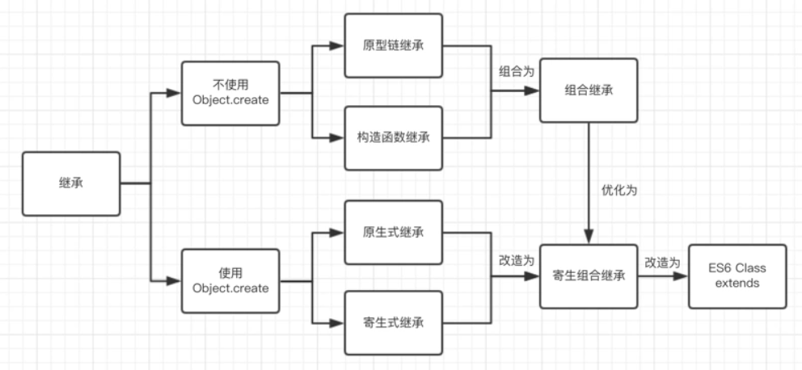
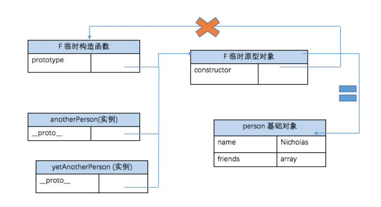

# JavaScript六种继承方式




## 1.原型链继承

> 原理：将子类的原型挂载到父类上；
>
> 优点：父类方法可以继承使用
>
> 缺点：子类new出来的实例不能向父类传递参数，父类的**引用属性**没有隔离，会相互影响；不能多继承

### 语法

```js
// 父类
function Parent() {}
// 子类
function Child(){}
// 继承
Child.prototype = new Parent();
Child.prototype.constructor=Child;
```

### 例子

```js
// 父类
function Person(name,age) {
 this.name = name;
 this.age = age|| 0;
}
// 为父类新增加一个方法
Person.prototype.say = function() { // 新增的代码
 console.log('I am a person')
}
// 子类
function Student(name){
 this.name = name;
 this.score = 80;
}
// 继承 注意,继承必须要写在子类方法定义的前面
// 所有涉及到原型链继承的继承方式都要修改子类构造函数的指向，否则子类实例的构造函数会指向Parent。
Student.prototype = new Person();
Student.prototype.constructor=Student;
// 为子类新增一个方法(在继承之后,否则会被覆盖)
Student.prototype.study = function () { // 新增的代码
 console.log('I am studing')
}
/* 下面是错误的写法！！！ 这样= 掐断原生链
Child.prototype = {
  getChildValue:function () {
   return this.Childproperty
  }
}
*/

//stu指向Student的原型，Student的原型又指向Person的原型
var stu = new Student('lucy');
var stu1 = new Student('savannah')
console.log(stu.name) // lucy --子类覆盖父类的属性
console.log(stu.age) // 0 --父类的属性
console.log(stu.score) // 80 --子类自己的属性
stu.say() // I am a person --继承自父类的方法
stu.study() // I am studing --子类自己的方法

stu.age=5;
console.log(stu1.name) // savannah --子类覆盖父类的属性
console.log(stu1.age) // 0 --父类的属性
console.log(stu.age) //5 --子类更改后属性
```

原型链继承有一个缺点,就是属性如果是引用类型的话,会共享引用类型

```js
// 父类
function Person() {
 this.hobbies = ['music','reading']
}
// 子类
function Student(){}
// 继承
Student.prototype = new Person()

var stu1 = new Student()
var stu2 = new Student()
stu1.hobbies.push('basketball')
console.log(stu1.hobbies) // music,reading,basketball
console.log(stu2.hobbies) // music,reading,basketball
```


## 2.借用构造函数(经典继承)

> 原理：在子类的构造函数里调用父类的构造函数，通过使用apply()和call()方法将父类构造函数的内容复制给了子类的构造函数。这是所有继承中唯一一个不涉及到 prototype的继承。
>
> 优点：  和原型链继承完全反过来 ; 父类的引用属性不会被共享 ; 子类构建实例时可以向父类传递参数，可以多继承（call 多个父类）
>
> 缺点：子类只是接用父类的构造函数，别的都没干

### 语法

```js
function Child(){
	Parent.call(this);//重新执行一遍parent函数
}
```


### 例子

```js
function Person(name){ 
    this.name = name;
    this.hobbies = ['music','reading'];
    this.say = function() {};
}
function Student(name){
    //继承了Person，同时还传递了参数 
    Person.call(this,name);
    this.age = 29;
}
var stu1 = new Student("Nicholas")
var stu2 = new Student("lucy")
stu1.hobbies.push('basketball')

alert(stu1.name);  //"Nicholas"
alert(stu1.age);  //29
console.log(stu1.hobbies) // music,reading,basketball
console.log(stu2.hobbies) // music,reading
console.log(stu1.say === stu2.say) // false 子类没有办法共享父类的函数
```


## 3.组合继承  ( 原型链+构造函数 ) - 最常用的模式

> 原理：原型式继承和构造函数继承的组合，兼具了二者的优点。
>
> 优点： 父类的方法可以被复用 ; 父类的引用属性不会被共享  ; 子类构建实例时可以向父类传递参数
>
> 缺点：多次调用父类构造函数；性能浪费

### 语法

```js
//父类
function Parent(){}
//子类
function Child(){ Parent.call(this)};
// 继承
Child.prototype = new Parent();
Child.prototype.constructor = Child;
```


### 例子

```js
// 父类
function Person(name) {
 	this.name=name;
 	this.hobbies = ['music','reading']
}
// 父类函数
Person.prototype.say = function() {console.log('I am a '+ this.name)}
// 子类
function Student(name,age){
 	Person.call(this,name) // 构造函数继承(继承属性) - 再一次调用父类构造函数
    this.age=age;
}
// 继承
Student.prototype = new Person() // 原型链继承(继承方法) - 调用了一次父类构造函数
Student.prototype.constructor = Student;

//子类函数
Student.prototype.sayAge = function(){  alert(this.age); }

// 实例化
var stu1 = new Student("Nicholas",23)
var stu2 = new Student("lucy",12)
stu1.hobbies.push('basketball')
console.log(stu1.hobbies) // music,reading,basketball
console.log(stu2.hobbies) // music,reading
console.log(stu1.say == stu2.say) // true

stu1.sayName();      //"Nicholas"
stu1.sayAge();       //23
```

### 组合继承优化1

> 原理:这种方式通过父类原型和子类原型指向同一对象
>
> 优点：子类可以继承到父类的公有方法当做自己的公有方法，而且不会初始化两次实例方法/属性，避免的组合继承的缺点。
>
> 缺点:没办法辨别是对象是子类还是父类实例化

#### 语法
```js
//父类
function Parent(){}
//子类
function Child(){ Parent.call(this)};
// 继承
Child.prototype = Parent.prototype;
```

#### 例子

```js
function Person(name, age) {
    this.name = name,
    this.age = age,
    this.setAge = function () { }
}
Person.prototype.setAge = function () {
    console.log("111")
}
function Student(name, age, price) {
    Person.call(this, name, age)
    this.price = price
    this.setScore = function () { }
}
Student.prototype = Person.prototype;
Student.prototype.sayHello = function () { }
var s1 = new Student('Tom', 20, 15000)
console.log(s1)
```

### 组合继承优化2 (推荐使用)

> 原理：借助原型可以基于已有的对象来创建对象，var B = Object.create(A)以A对象为原型，生成了B对象。B继承了A的所有属性和方法。

#### 语法
```js
//父类
function Parent(){}
//子类
function Child(){ Parent.call(this)};
// 继承
Child.prototype = Object.create(Parent.prototype)//核心代码
Child.prototype.constructor = Child//核心代码
```
#### 例子

```js
function Person(name, age) {
    this.name = name,
    this.age = age
}
Person.prototype.setAge = function () {
    console.log("111")
}
function Student(name, age, price) {
    Person.call(this, name, age)
    this.price = price
    this.setScore = function () {}
}
Student.prototype = Object.create(Person.prototype)//核心代码
Student.prototype.constructor = Student//核心代码
var s1 = new Student('Tom', 20, 15000)
console.log(s1 instanceof Student, s1 instanceof Person) // true true
console.log(s1.constructor) //Student
console.log(s1)
```


## 4.原型式继承

> 核心：原型式继承的object方法本质上是对参数对象的一个浅复制。
>
> 优点：父类方法可以复用
>
> 缺点：父类的引用属性会被所有子类实例共享 ；子类构建实例时不能向父类传递参数

### 图解与语法

```js
function object(o){ 
    function F(){};
    F.prototype = o; 
    return new F();
}
var Child = object(Parent);
//var Child = Object.create(Parent) 与上面的意思一样
```



### 例子

```js
/*clone 内部首先是创建了一个空的构造函数F,然后把F的prototype指向参数proto,最后返回一个F的实例对象,完成继承. 最好看图 */
//本质上讲，就是对传入的对象执行了一次浅复制
function object(o){
function F(){}
F.prototype = o;
return new F();
}
var person = { 
    name:"Nicholas", 
    friends:["Shelby","Court","Van"]
};

var anotherPerson = object(person);
anotherPerson.name = "Greg";
anotherPerson.friends.push("Rob");

var yetAnotherPerson = object(person);
yetAnotherPerson.name = "Linda";
yetAnotherPerson.friends.push("Barbie");

alert(person.friends);  //"Shelby,Court,Van,Rob,Barbie"
```

#### Object.create()方法

基本用法和上面的object一样，除了object不能接受第二个参数以外

```js
var person = {  name: ‘Jiang’,  friends: [‘Shelby’, ‘Court’]}
var anotherPerson = Object.create(person)
console.log(anotherPerson.friends)  // [‘Shelby’, ‘Court’]
```


## 5. 寄生式继承

```js
function createAnother(original){
    var clone = object(original);//object()函数创建对象
    // 或者用var clone =Object.create(original) 是一样的
    clone.sayHi = function(){    //增强这个对象 （就是给这个对象增加一些其他方法）
        alert("hi");
    };
    return clone;                //返回这个对象
}
var person = {
    name:"Nicholas";
    friends:["Shelby","Court","Van"];
}     //基础对象
var anotherPerson = createAnother(person);  //新对象（不仅拥有了person的属性和方法，而且还拥有了自己的sayHi方法）
anotherPerson.sayHi();   //"hi" 
```


## 6. 寄生组合式继承(推荐)

```js
function inheritPrototype(Child, Parent) {
  var prototype = Object.create(Parent.prototype);// 创建了父类原型的浅复制
  prototype.constructor = Child;// 修正原型的构造函数
  Child.prototype = prototype;// 将子类的原型替换为这个原型
}
//父类创建
function Parent(name) {
  this.name = name
  this.colors = [‘red’, ‘blue’, ‘green’]
}
Parent.prototype.sayName = function () {
  console.log(this.name)
}
//子类
function Child(name, job) {
  // 继承属性
  Parent.call(this, name)
  this.job = job
}

// 核心：因为是对父类原型的复制，所以不包含父类的构造函数，也就不会调用两次父类的构造函数造成浪费
inheritPrototype(Child, Parent);//继承

var instance = new Child(‘Jiang’, ‘student’)
instance.sayName()
```

## 7. ES6 Class extends

> 核心： ES6继承的结果和寄生组合继承相似，本质上，ES6继承是一种语法糖。但是，寄生组合继承是先创建子类实例this对象，然后
> 再对其增强；而ES6先将父类实例对象的属性和方法，加到this上面（所以必须先调用super方法），然后再用子类的构造函数修改
> this。

### 语法

```js
class A {}
class B extends A {
 constructor() {
 super();
 }
}
```

### 例子

```js
class Parent{
	constructor(){
  	this.name = 'Parent';
    this.arr = [1, 2, 3];
  }
  say(){
  	console.log(this.name);
  }
}
class Child extends Parent{
   constructor(){
    super(); //通过super()调用父类构造函数
    this.type="Child";
  }
}
let child_1 = new Child()
let child_2 = new Child()
child_1.arr.push(4);
console.log(child_1.say()) // Parent
console.log(child_1.arr, child_2.arr) // [1, 2, 3, 4]  [1, 2, 3]
console.log(child_1.constructor === Child) // true 
console.log(child_2.constructor === Parent) // false
```


# Reference

1. https://segmentfault.com/a/1190000014476341
2. 《JavaScript 高级程序设计》

 