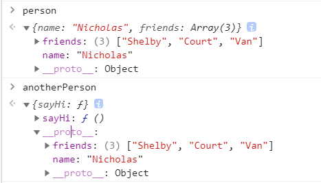

**如果使用了直接对象字面量方式，会破坏继承以及原型链**

> **这里我们提前讲一下 new 与 object.create()** [来源](https://stackoverflow.com/questions/4166616/understanding-the-difference-between-object-create-and-new-somefunction)
>
>  `new X` is `Object.create(X.prototype)` with additionally running the `constructor` function. (And giving the `constructor` the chance to `return` the actual object that should be the result of the expression instead of `this`.)
>
> `new Test()`:
>
> 1. create `new Object()` obj
> 2. set `obj.__proto__` to `Test.prototype`
> 3. `return Test.call(obj) || obj; // normally obj is returned but constructors in JS can return a value`
>
> ------
>
> ```js
> Object.create( Test.prototype )
> ```
>
> 1. create `new Object()` obj
> 2. set `obj.__proto__` to `Test.prototype`
> 3. `return obj;`
>
> ------
>
> So basically `Object.create` doesn't execute the constructor.

**对于继承！ 核心是 原型链**

## 1.原型链继承

> 原理：将子类的原型挂载到父类上；
>
> 优点：父类方法可以继承使用
>
> 缺点：
>
> 1. 子类new出来的实例不能向父类构造函数传递参数；
>2.  父类的**引用属性**没隔离，会相互影响；不能多继承
> 3. 子类对象不能指向自己constructor

### 语法

```js
// 父类
function Parent(){}
// 子类
function Child(){}
// 继承
Child.prototype = new Parent();
//Child.prototype.constructor =>>>>  ƒ Parent() {}
```


### 例子

```js
function parent(){
    this.flag = true
}
parent.prototype.getParentValue = function(){
    return this.flag
}
console.log(parent.prototype)

function child(){
    this.flag1 = false
} //创建一个构造函数child

child.prototype = new parent() //让child通过创建实例，继承parent
console.log(child.prototype) //child的原型就是parent函数

child.prototype.getChildValue = function(){
    return this.flag1
}
/* 下面是错误的写法！！！ 这样= 掐断原生链
Child.prototype = {
  getChildValue:function () {
   return this.Childproperty
  }
}
*/

let instance = new child()
console.log(instance.getParentValue()) //true 
```

原型链继承有一个缺点,就是属性如果是引用类型的话,会共享引用类型

```js
// 父类
function Person() {
 this.hobbies = ['music','reading']
}
// 子类
function Student(){}
// 继承
Student.prototype = new Person()

var stu1 = new Student()
var stu2 = new Student()
stu1.hobbies.push('basketball')
console.log(stu1.hobbies) // music,reading,basketball
console.log(stu2.hobbies) // music,reading,basketball
```


## 2.盗用构造函数(经典继承)

> 原理：在子类的构造函数里调用父类的构造函数，通过使用apply()和call()方法将父类构造函数的内容复制给了子类的构造函数。这是所有继承中**唯一一个不涉及到 prototype的继承**。
>
> 优点：  和原型链继承完全反过来 ; 父类的引用属性不会被共享 ; 子类构建实例时可以向父类传递参数，可以多继承（call 多个父类）
>
> 缺点：
>
> 1. 子类只是接用父类的构造函数，父类原型的属性方法对子类不可见 
> 2. 必须在构造函数中定义方法，函数不能重用（构造函数模式的缺点）

### 语法

```js
// 父类
function Parent() {}
//子类
function Child(){
	Parent.call(this);//重新执行一遍parent函数
}
```


### 例子

```js
function Person(name){ 
    this.name = name;
    this.hobbies = ['music','reading'];
    this.say = function() {};
}
function Student(name){
    Person.call(this,name);
    this.age = 29;
}
var stu1 = new Student("Nicholas")
var stu2 = new Student("lucy")
stu1.hobbies.push('basketball')

alert(stu1.name);  //"Nicholas"
alert(stu1.age);  //29
console.log(stu1.hobbies) // music,reading,basketball
console.log(stu2.hobbies) // music,reading
console.log(stu1.say === stu2.say) // false 子类没有办法共享父类的函数
```


## 3.组合继承  ( 原型链+构造函数 ) - 最常用的模式

> 原理：原型式继承和构造函数继承的组合，兼具了二者的优点。
>
> 优点： **传参和复用**：父类的方法可以被复用 ; 父类的引用属性不会被共享  ; 子类构建实例时可以向父类传递参数
>
> 缺点：多次调用父类构造函数，性能浪费

### 语法

```js
//父类
function Parent(name){ this.name=name}
//子类
function Child(name){ Parent.call(this,name)}
// 继承
Child.prototype = new Parent();
//Child.prototype.constructor === Child() //falase 是Parent
//Child.prototype.constructor = Child//这个本身没有 但是使用上基本优化还是要有 下面的图是没有的状况（这里是按照红宝石的书本）
```


### 例子

```js
// 父类
function Person(name) {
 	this.name=name;
 	this.hobbies = ['music','reading']
}
// 父类函数
Person.prototype.say = function() {console.log('I am a '+ this.name)}
// 子类
function Student(name,age){
 	Person.call(this,name) // 构造函数继承(继承属性) - 调用了1次父类构造函数
    this.age=age;
}
// 继承
Student.prototype = new Person() // 原型链继承(继承方法) - 调用了2次父类构造函数

//子类函数
Student.prototype.sayAge = function(){  alert(this.age); }

// 实例化
var stu1 = new Student("Nicholas",23)
var stu2 = new Student("lucy",12)
stu1.hobbies.push('basketball')
console.log(stu1.hobbies) // music,reading,basketball
console.log(stu2.hobbies) // music,reading
console.log(stu1.say == stu2.say) // true

stu1.sayName();      //"Nicholas"
stu1.sayAge();       //23
```

### 组合继承优化1?

> 原理:这种方式通过父类原型和子类原型指向同一对象
>
> 优点：子类可以继承到父类的公有方法当做自己的公有方法，而且不会初始化两次实例方法/属性，避免的组合继承的缺点。
>
> 缺点:没办法辨别是对象是子类还是父类实例化

#### 语法
```js
//父类
function Parent(){}
//子类
function Child(){ Parent.call(this)};
// 继承
Child.prototype = Parent.prototype;
```

#### 例子

```js
function Person(name, age) {
    this.name = name,
    this.age = age,
    this.setAge = function () { }
}
Person.prototype.setAge = function () {
    console.log("111")
}
function Student(name, age, price) {
    Person.call(this, name, age)
    this.price = price
    this.setScore = function () { }
}
Student.prototype = Person.prototype;
Student.prototype.sayHello = function () { }
var s1 = new Student('Tom', 20, 15000)
console.log(s1)
```

### 组合继承优化2 (推荐使用) - Object.create?

> 原理：借助原型可以基于已有的对象来创建对象，**var B = Object.create(A)以A对象为原型，生成了B对象**。B继承了A的所有属性和方法。

#### 语法
```js
//父类
function Parent(){}
//子类
function Child(){ Parent.call(this)};
// 继承
Child.prototype = Object.create(Parent.prototype)//核心代码
Child.prototype.constructor = Child//核心代码
```


#### 例子

```js
function Person(name, age) {
    this.name = name,
    this.age = age
}
Person.prototype.setAge = function () {
    console.log("111")
}
function Student(name, age, price) {
    Person.call(this, name, age)
    this.price = price
    this.setScore = function () {}
}
Student.prototype = Object.create(Person.prototype)//核心代码
Student.prototype.constructor = Student//核心代码
var s1 = new Student('Tom', 20, 15000)
console.log(s1 instanceof Student, s1 instanceof Person) // true true
console.log(s1.constructor) //Student
console.log(s1)
```


## 4.原型式继承 

> 核心：原型式继承的object方法本质上是对参数对象的一个浅复制。本方法的出发点是**即使不自定义类型也可以通过原型实现对象之间的信息共享**
>
> 优点：1. 不需要单独创建构造函数，但仍有对象之间的共享信息；2. 每一个新增对象有自己的属性
>
> 缺点： 对象的引用属性会被共享（跟原型模式一样)

### 图解与语法

```js
function object(o){ //一个临时构造函数
    function F(){};
    F.prototype = o; 
    return new F();
}
let parent = {name:"name",func1:function(){console.log("this is ")}}
var Child = object(parent);
//var Child = Object.create(parent) 同效果
```


### 例子

```js
/*clone 内部首先是创建了一个空的构造函数F,然后把F的prototype指向参数proto,最后返回一个F的实例对象,完成继承. 最好看图 */
//本质上讲，就是对传入的对象执行了一次浅复制

var person = { 
    name:"Nicholas", 
    friends:["Shelby","Court","Van"]
};

var anotherPerson = object(person);
anotherPerson.name = "Greg";
anotherPerson.friends.push("Rob");

var yetAnotherPerson = object(person);
yetAnotherPerson.name = "Linda";
yetAnotherPerson.friends.push("Barbie");

alert(person.friends);  //"Shelby,Court,Van,Rob,Barbie"
alert(anotherPerson.friends);  //"Shelby,Court,Van,Rob,Barbie"
alert(yetAnotherPerson.friends);  //"Shelby,Court,Van,Rob,Barbie"
```

#### Object.create()方法

基本用法和上面的object一样，除了object不能接受第二个参数以外

```js
var person = { 
    name:"Nicholas", 
    friends:["Shelby","Court","Van"]
};
var anotherPerson = Object.create(person,{name:{value:"Lily"}})
console.log(anotherPerson.friends)  // ["Shelby", "Court", "Van"]
console.log(anotherPerson.name)//"Lily"
```

## 5. 寄生式继承- parasitic inheritance

> 核心：主要考虑对象而 **不是自定义类型和构造函数的情况下**
>
> 原理：类似寄生构造函数与工厂模式，创建一个仅用于封装继承过程的函数，该函数在内部以某种形式来做增强对象，最后返回对象
>
> 优点： 不在乎类型与构造函数
>
> 缺点：跟借用构造函数模式一样，每次创建对象都会创建一遍方法。难复用函数
>

### 例子

```js
function createAnother(original){
    var clone = object(original);//object()函数创建对象
    // 或者用var clone =Object.create(original) 是一样的
    clone.sayHi = function(){    //增强这个对象 （就是给这个对象增加一些其他方法）
        alert("hi");
    };
    return clone;                //返回这个对象
}
var person = {
    name:"Nicholas",
    friends:["Shelby","Court","Van"]
}
var anotherPerson = createAnother(person);  //新对象（不仅拥有了person的属性和方法，而且还拥有了自己的sayHi方法）
anotherPerson.sayHi();   //"hi" 
```



## 6. 寄生组合式继承(推荐)

> 核心：通过借用构造函数来继承属性，通过原型链的混成（寄生办法）形式来继承方法
>
> 优点：这种方式的高效率体现它只调用了一次 Parent 构造函数，并且因此避免了在 Parent.prototype 上面创建不必要的、多余的属性。与此同时，原型链还能保持不变；因此，还能够正常使用 instanceof 和 isPrototypeOf。开发人员普遍认为寄生组合式继承是引用类型最理想的继承范式。
>
> 缺点：本来会出现至少两次调用parent 构造函数（一次是设置子类型实例的原型的时候；一次在创建子类型实例的时候；）；但是封装inheritPrototype()之后就不会有

### 语法 

```js
//封装前
function SuperType(name){
    this.name = name;
    this.colors = ["red", "blue", "green"];
}

SuperType.prototype.sayName = function(){
    alert(this.name);
};

function SubType(name, age){  
    // 继承属性
    SuperType.call(this, name); // 第二次调用SuperType（）
    this.age = age;
}

// 继承方法
SubType.prototype = new SuperType(); // 第一次调用 SuperType（）
SubType.prototype.constructor = SubType;
SubType.prototype.sayAge = function(){
    alert(this.age);
};
```


```js
//这里的例子是封装之后

//第一步 是创建父类原型的一个副本，然后给返回的prototype对象设置constructor属性
//第二步 是解决由于重写原型导致默认constructor丢失的问题，constructor的指向问题（改不改都不影响），原来返回的F.constructor指向parent，要修改为指向child
function inheritPrototype(Child, Parent) {// 这个函数是关键
  var prototype = Object.create(Parent.prototype);// 创建了父类原型的浅复制；或者之前的object（）方法
  console.log(prototype);
  prototype.constructor = Child;// 修正原型的构造函数
  Child.prototype = prototype;// 将子类的原型替换为这个原型
}
//父类创建
function Parent() {}
Parent.prototype.sayName = function () {}
//子类
function Child() {}

// 核心：因为是对父类原型的复制，所以不包含父类的构造函数，也就不会调用两次父类的构造函数造成浪费
//避免使用 child.prototype = new parent()来继承整个parent实例
inheritPrototype(Child, Parent);//继承

var instance = new Child()00
instance.sayName()
```


### 例子

```js
function inheritPrototype(Child, Parent) {// 这个函数是关键
  var prototype = Object.create(Parent.prototype);// 创建了父类原型的浅复制；或者之前的object（）方法
  prototype.constructor = Child;// 修正原型的构造函数
  Child.prototype = prototype;// 将子类的原型替换为这个原型
}
//父类创建
function Parent(name) {
  this.name = name
  this.colors = ["red", "blue", "green"]
}
Parent.prototype.sayName = function () {
  console.log(this.name)
}
//子类
function Child(name, job) {
  // 继承属性
  Parent.call(this, name)
  this.job = job
}

// 核心：因为是对父类原型的复制，所以不包含父类的构造函数，也就不会调用两次父类的构造函数造成浪费
//避免使用 child.prototype = new parent()来继承整个parent实例
inheritPrototype(Child, Parent);//继承

var instance = new Child("Jiang", "student")
instance.sayName()
```


## 7. ES6 Class extends

> 核心： ES6继承的结果和寄生组合继承相似，本质上，ES6继承是一种语法糖。但是，寄生组合继承是先创建子类实例this对象，然后再对其增强；而ES6先将父类实例对象的属性和方法，加到this上面（所以必须先调用super方法），然后再用子类的构造函数修改this。

### 定义

```js
// class declaration 
class Person {}
// class expression 
const Animal = class {};
```

### 语法

```js
class A {}
class B extends A {
 constructor() {
 super();
 }
}
```

### 例子

```js
class Parent{
	constructor(){
  	this.name = 'Parent';
    this.arr = [1, 2, 3];
  }
  say(){
  	console.log(this.name);
  }
}
class Child extends Parent{
   constructor(){
    super(); //通过super()调用父类构造函数
    this.type="Child";
  }
}
let child_1 = new Child()
let child_2 = new Child()
child_1.arr.push(4);
console.log(child_1.say()) // Parent
console.log(child_1.arr, child_2.arr) // [1, 2, 3, 4]  [1, 2, 3]
console.log(child_1.constructor === Child) // true 
console.log(child_2.constructor === Parent) // false
```

## 总结

- 原型链 的问题是所有继承的树形和方法都会在对象视力健共享，无法做到实例私有。
- 盗用构造函数 模式通过在子类构造函数中调用父类构造函数，可以避免这个问题。这样可以让每个实例竭诚的树形都是私有的，但要求类型只能通过构造函数模式来定义（因为子类不能访问父类原型上的方法）。
- 组合继承 最为流行，即通过原型链继承共享的属性和方法，通过盗用构造函数来继承实例属性。
- 原型式继承 可以无需明确定义构造函数二实现继承，本质上是对给定对象执行浅复制，这个操作的结构之后还可以再进一步增强。
- 寄生式继承 与原型式继承密切相关，即先基于一个对象创建一个新对象，然后再增强这个新对象，最后返回新对象，这个模式也被用在组合继承中，用于避免重复调用父类构造函数导致的浪费。
- 寄生组合继承 被认为是实现基于类型继承的最有效的方式。 

# Reference

1. https://segmentfault.com/a/1190000014476341
2. 《JavaScript 高级程序设计》

 