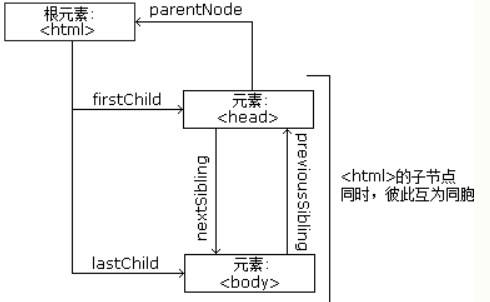

## DOM 节点基本理解

- 整个文档是文档节点
- 每个 HTML 元素是元素节点
- HTML 元素内的文本是文本节点
- 每个 HTML 属性是属性节点
- 所有注释是注释节点



## node根节点

- document.body - 文档的 body
- document.documentElement - 完整文档

## node基本节点

- **nodeName** ：**节点名** （只读）。对于元素类型，则是元素的标签名(均为大写)，如"SPAN"、"DIV"；对于其他类型会有不同的值，下面每个类型会分别指出。

- **nodeValue** ：**节点值**。对于元素类型为`null`；对于其他类型会有不同的值，下面每个类型会分别指出。

- **hasChildNodes**() ：布尔值，**是否含有子节点**。

- **childNodes** ：**NodeList 对象的集合**，是一个**类数组**，实际是基于 DOM 结构动态查询的结果。
- firstChild ：等效于 childNodes[0] ；
- lastChild ：等效于 childNodes[childNodes.length - 1] 。
- **parentNode** ：指向**父节点**。
- previousSibling ：前一个同胞节点；
- nextSibling ：后一个同胞节点。
- ownerDocument ：指向节点所在的整个文档节点。
- nodeType ：常量值，一共有 12 种，如 "Node.ELEMENT_NODE" 或 数字 1 ，下面每个类型会分别给出对象的值。。（只读）

## node方法

### 创建节点、追加节点

- createElement（标签名）创建一个元素节点（具体的一个元素）。
- appendChild（节点）追加一个节点。
- createTextNode（节点文本内容）创建一个文本节点

```js
var oDiv = document.createElement("div");//创建一个div元素，因为是document对象的方法。
var oDivText = document.createTextNode("666");//创建一个文本节点内容是“666”，因为是document对象的方法。
oDiv.appendChild(oDivText);//父级.appendChild(子节点);在div元素中添加“666”
document.body.appendChild(oDiv);//父级.appendChild(子节点);;document.body是指向<body>元素
document.documentElement.appendChild(createNode);//父级.appendChild(子节点);;document.documentElement是指向<html>元素
```

### 插入节点

- **appendChild(newNode)** 也是一种插入节点的方式，向 childNodes 集合的**末尾添加一个新节点**,还可以添加已经存在的元素，会将其元素从原来的位置移到新的位置。
- insertBefore（a,b）是参照节点，意思是a节点会插入b节点的前面（可为`null`后添加新节点），并返回新节点

```html
<div id="div1">
<p id="p1">这是一个段落。</p>
<p id="p2">这是另一个段落。</p>
</div>

<script>
var para = document.createElement("p");
var node = document.createTextNode("这是新文本。");
para.appendChild(node);

var element = document.getElementById("div1");
var child = document.getElementById("p1");
element.insertBefore(para, child);
</script>		

```

### 删除、移除节点

- removeChild(node) 删除一个节点，用于移除删除一个指定参数（节点），并返回的被移除的节点，被移除的节点仍在文档中，只是文档中已没有其位置了。

```js
var parent = document.getElementById("div1");
var child = document.getElementById("p1");
parent.removeChild(child);
```

### 替换节点

- replaceChild(newNode, node) ，用于替换节点，接受两个参数，第一参数是要插入的节点，第二个是要被替换的节点。返回的是被替换的节点。

```js
var para = document.createElement("p");
var node = document.createTextNode("这是新文本。");
para.appendChild(node);

var parent = document.getElementById("div1");
var child = document.getElementById("p1");
parent.replaceChild(para, child);
```

### 查找节点
- childNodes 包含文本节点和元素节点的子节点。
```js
for (var i = 0; i < oList.childNodes.length; i++) {//oList是做的ul的对象。
		//nodeType是节点的类型，利用nodeType来判断节点类型，再去控制子节点
		//nodeType==1 是元素节点
		//nodeType==3 是文本节点
			if (oList.childNodes[i].nodeType == 1) {//查找到oList内的元素节点
				console.log(oList.childNodes[i]);//在控制器日志中显示找到的元素节点
			}
		}
```

- 利用parentNode children 分别获取子节点父节点
```js
var oList = document.getElementById('list');//oList是做的ul的对象
		var oChild=document.getElementById('child');//oChild是做的ul中的一个li的对象
		//通过子节点查找父节点//parentNode：获取父节点
		console.log(oChild.parentNode);//在控制器日志中显示父节点
		console.log(oList.children);//在控制器日志中显示oList子节点
		console.log(children.length)//子节点的个数
```

- firstChild ; firstElementChild查找第一个子节点。此存在浏览器兼容问题：firstChild是IE兼容，firstElementChild是非IE兼容。

```js
//查找第一个子节点的封装函数
		function firstChild(ele) {
			if (ele.firstElementChild) {//如果该条件是true则在该浏览器（IE或非IE）中兼容
				return ele.firstElementChild;
			} else {
				return ele.firstChild;
			}
		}
		firstChild(oList).style.background = 'red';//将获得的节点的背景变成红色
```

- lastChild ; lastElementChild查找最后一个子节点。此存在浏览器兼容问题：lastChild 是IE兼容，lastElementChild是非IE兼容。

```js
		//查找最后一个子节点的封装函数		
function lastChild(ele) {			
    if (ele.lastElementChild) {//如果该条件是true则在该浏览器（IE或非IE）中兼容				
        return ele.lastElementChild;			
    } else {				
        return ele.lastChild;			
    }		
}		
lastChild(oList).style.background = 'red';//将获得的节点的背景变成红色
```

- nextSibling ; nextElementSibling查找下一个兄弟节点。也是存在兼容性问题。

```js

		//查找下一个兄弟节点的封装函数		
function nextSibling(ele) {			
    if (ele.nextElementSibling) {				
        return ele.nextElementSibling;			
    } else {				
        return ele.nextSibling;				
    }			
}		
nextSibling(oMid).style.background = 'red';
```

- previousSibling ; previousElementSibling查找上一个兄弟节点。也是存在兼容性问题。

```js
		//查找上一个兄弟节点的封装函数		
function previousSibling(ele) {			
    if (ele.nextElementSibling) {				
        return ele.previousElementSibling;			
    } else {				
        return ele.previousSibling;					
    }			
}		
previousSibling(oMid).style.background = 'red';
```

### 克隆节点

- **clone(isDeepClone?)** ：**克隆当前节点**，可以接收一个参数：是否深克隆，深克隆表示包含其所有子节点，否则只复制节点本身。

### 移除空的文本节点

- normalize() ：移除空的文本节点，并连接相邻的文本节点。


Reference：

https://juejin.cn/post/6844903807327928333 -- 详细内容