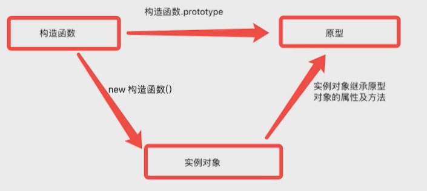
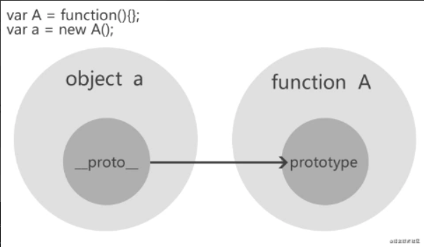
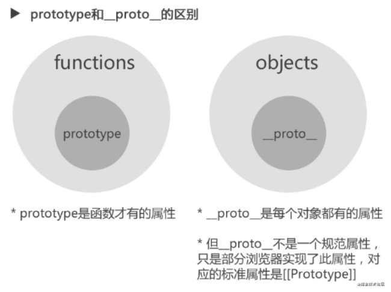
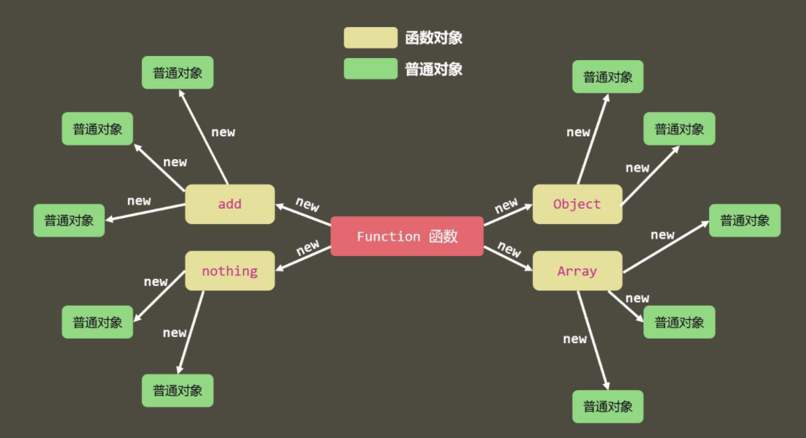
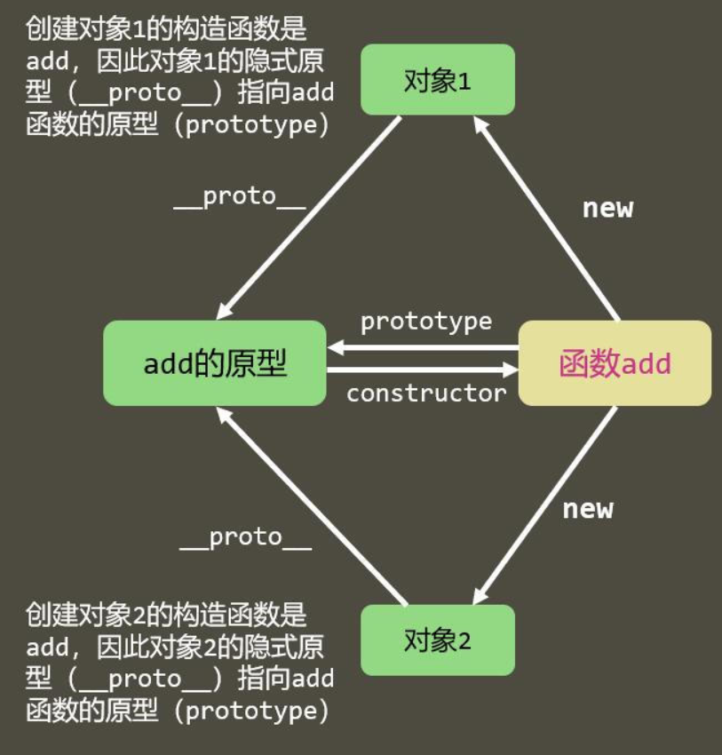
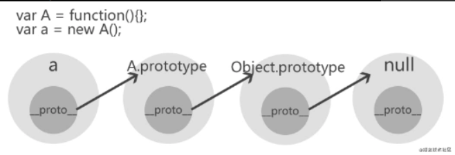
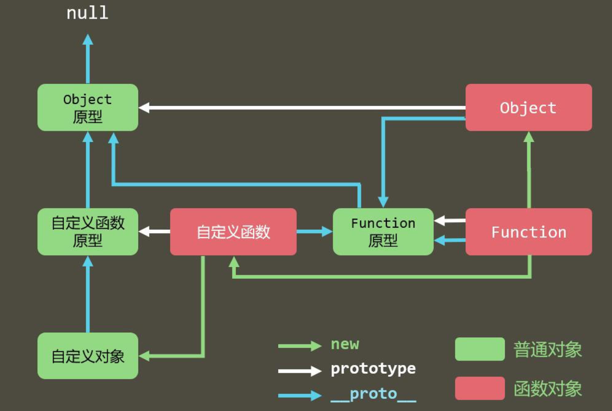
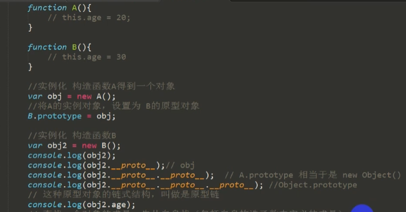

# 对象基础

object ：propert + method



## 构造函数

特点：

- 函数体内部使用了`this`关键字，代表了所要生成的对象实例。
- 生成对象的时候，必须使用`new`命令

```js
function Person(name, age, job) {
 this.name = name;
 this.age = age;
 this.job = job;
 this.sayName = function() { alert(this.name) }
}
var person1 = new Person('Zaxlct', 28, 'Software Engineer');
var person2 = new Person('Mick', 23, 'Doctor');
```

## new命令

1. 创建一个空对象，作为将要返回的对象实例。
2. 将这个空对象的原型，指向构造函数的`prototype`属性。
3. 将这个空对象赋值给函数内部的`this`关键字。
4. 开始执行构造函数内部的代码。

```js
var fn= function(){};//外部定义函数，根位置确定
var Vehicle = function () {
  this.price = 1000;
  this.function=fn;  //this.function =function(){}不要这样创建，多个函数暂用内存
};

var v = new Vehicle();
v.price // 1000
////////////////////////////////////////////
var fn= function(){};
function Cat (name, color) {
  this.name = name;
  this.color = color;
  this.function=fn;
}

var cat1 = new Cat('大毛', '白色');
cat1.name // '大毛'
cat1.color // '白色'

```

```js
var Vehicle = function (p) {
  this.price = p;
};

var v = new Vehicle(500);
```

## 构造函数中创建函数注意

### 单个函数

```js
var fn= function(){};//外部定义函数，根位置确定
var Vehicle = function () {
  this.price = 1000;
  this.function=fn;  //this.function =function(){}不要这样创建，多个函数暂用内存
};

var v = new Vehicle();
v.price // 1000
```

函数的方程不会因为多个对象的创建，而不断的创建。

### 那遇到多个(重名）函数，不同对象创建调用怎么办？

```js
//多个函数，防止取名撞，归类到一个对象
var obj={
	"fn":function(){},
    "fn1":function(){},
}

var Vehicle = function (num,function) {//1000;obj.fn
  this.price = num;
  this.function=function;
};


//多个重名函数，创建多个obj，从而调用
var obj1={
	"fn":function(){},
    "fn1":function(){},
}

var obj2={
	"fn":function(){},
    "fn1":function(){},
}

var Vehicle = function () {
  this.price = 1000;
  this.function=obj1.fn;
};

var person = function () {
  this.price = 1000;
  this.function=obj2.fn;
};
```

# 对象继承

## 基本继承

```js
function Cat (name, color) {
  this.name = name;
  this.color = color;
}

var cat1 = new Cat('大毛', '白色');

cat1.name // '大毛'
cat1.color // '白色'
```

同一个构造函数的多个实例之间，无法共享属性，从而造成对系统资源的浪费。

## 多个继承

```js
//parent
function Person(){

}
Person.prototype.say= function(){
    console.log("I am saying ....");
}
Person.prototype.walk=function(){
    console.log("I am walking...");
}

//child
function Female(){

}


Female.prototype =new Person();
Female.prototype.sing=function(){
    console.log("I am singing...");
}

var  obj= new Female();
obj.say();
obj.walk();
obj.sing();


function male(){

}
male.prototype=new Person();
male.prototype,play=function(){
    console.log("I am playing...");
}

var obj2=new Female();
obj2.say();
obj2.walk();
obj2.play();
```


# prototype 属性- 函数的原型对象

> 每个对象都有 **proto** 属性，但每个函数都有__proto__属性和prototype属性
>
> 对于函数的prototype，在函数定义之前，prototype 就已经创建了

一个最基本的例子 new constrcut()

```js
function person(name) {
       this.name = name;
    }
    var foo = new person("deen");
    //通过new创建了一个对象
    //new是一种语法糖，new person等价于
    var bar = (function(name) {
        var _newObj = {
            constructor : person,
            __proto__ : person.prototype,
        };
        _newObj.constructor(name);
        return _newObj;
    })();
```


```js
console.log(Animal.prototype);//已经存在
function Animal(name) {
  this.name = name;
}
console.log(Animal.prototype);//已经存在
Animal.prototype.color = 'white';

var cat1 = new Animal('大毛');
var cat2 = new Animal('二毛');

cat1.color // 'white'
cat2.color // 'white'

Animal.prototype.go = function () {
  return 'run';
}

var cat3 = new Animal('三毛');
cat1.go();//undefined
cat2.go();//undefined
cat3.go();//'run'
```

# `__`proto`__` - 对象&函数属性

> JS 在创建对象（不论是普通对象还是函数对象）的时候，都有一个叫做**proto** 的内置属性，用于指向创建它的构造函数的原型对象，也就是 prototype。
>
> 所有的对象都有一个属性：`__proto__`，称之为隐式原型



```js
function Person(name, age, job) {
 this.name = name;
 this.age = age;
 this.job = job;
 this.sayName = function() { alert(this.name) }
}
 
var person1 = new Person('Zaxlct', 28, 'Software Engineer');

Person.prototype.constructor == Person;//true
person1.__proto__ == Person.prototype;//true
person1.constructor == Person;
```

```js
function A() {}

var obj1 = new A();
var obj2 = new A();
obj1.abc = 123;
obj2.__proto__.bcd = 456;

//输出结果是多少
console.log(obj1.abc, obj2.abc); //123 undefined
console.log(obj1.__proto__.bcd, obj2.__proto__.bcd);//456  456
```

> __proto__不建议使用，可以用Object.getPrototypeOf()和Object.setPrototypeOf()代替；


##  **proto** 属性 与 prototype 属性 的区别



# 原型链

## 图解





> 原型链的形成是真正是靠**proto** 而非 prototype。
>
> 作用：用于实现继承，原型之间的继承，对象之间的继承
> 		注意：JS内部继承的实现就是靠原型链，没有原型链就没有继承

```js
person1.__proto__ === Person.prototype;
Person.prototype.__proto__ === Object.prototype;
Object.prototype.__proto__ === null;
//Object.prototype.__proto__ === null，保证原型链能够正常结束。

Person.__proto__ === Function.prototype;
Object.__proto__ === Function.prototype;
Function.prototype.__proto__ === Object.prototype;
```

所有函数对象的 proto 都指向 Function.prototype，它是一个空函数（Empty function）

## 原型链的例子

```js
let num = new Number();
num.__proto__ === Number.prototype;
Number.prototype.__proto__ === Function.prototype;
Funtion.prototype.__proto__ === Object.prototype;
Object.prototype.__proto__ === null;
```

 



> 特殊点：
>
> 1. Function的__proto__指向自身的prototype
> 2. Object的prototype的__proto__指向null

## 原型prototype

```js
function  f1(){};

console.log(f1. prototype) //f1 {}
console.log(typeof  f1. prototype) //object
console.log(typeof  Function. prototype) // function
console.log(typeof  Object. prototype) // object
console.log(typeof  Function. prototype. prototype) //undefined
```


## 原型链的深层例子



> 所有的对象最深层的prototype都是object

# 原型链的应用

## 基础方法

W3C不推荐直接使用系统成员__proto__

### **Object.getPrototypeOf(对象)**

​			获取对象的隐式原型

`Object.getPrototypeOf`方法返回参数对象的原型。这是获取原型对象的标准方法。

```js
var F = function () {};
var f = new F();
Object.getPrototypeOf(f) === F.prototype // true
```

上面代码中，实例对象`f`的原型是`F.prototype`。

下面是几种特殊对象的原型。

```js
// 空对象的原型是 Object.prototype
Object.getPrototypeOf({}) === Object.prototype // true

// Object.prototype 的原型是 null
Object.getPrototypeOf(Object.prototype) === null // true

// 函数的原型是 Function.prototype
function f() {}
Object.getPrototypeOf(f) === Function.prototype // true
```

### Object.setPrototypeOf(对象)

`Object.setPrototypeOf`方法为参数对象设置原型，返回该参数对象。它接受两个参数，第一个是现有对象，第二个是原型对象。

```js
var a = {};
var b = {x: 1};
Object.setPrototypeOf(a, b);

Object.getPrototypeOf(a) === b // true
a.x // 1
```

上面代码中，`Object.setPrototypeOf`方法将对象`a`的原型，设置为对象`b`，因此`a`可以共享`b`的属性。

`new`命令可以使用`Object.setPrototypeOf`方法模拟。

```js
var F = function () {
  this.foo = 'bar';
};

var f = new F();
// 等同于
var f = Object.setPrototypeOf({}, F.prototype);
F.call(f);
```

上面代码中，`new`命令新建实例对象，其实可以分成两步。第一步，将一个空对象的原型设为构造函数的`prototype`属性（上例是`F.prototype`）；第二步，将构造函数内部的`this`绑定这个空对象，然后执行构造函数，使得定义在`this`上面的方法和属性（上例是`this.foo`），都转移到这个空对象上。

### **Object.prototype.isPrototypeOf(对象)**

判断当前对象(this)是否在指定对象的原型链上

```js
function A() {};
var obj = new A();
var o = {};
o.isPrototypeOf(obj);//false
//换种写法
Object.getPrototypeOf(o).isPrototypeOf(obj); //true 

//例子2
var o1 = {};
var o2 = Object.create(o1);
var o3 = Object.create(o2);

o2.isPrototypeOf(o3) // true
o1.isPrototypeOf(o3) // true
```

因此o的隐式原型是Object.**proto**,正好它也在obj的原型链上，所以是true,具体可以看上图

### **对象 instanceof 函数**

判断函数的原型是否在对象的原型链上

### **Object.create(对象)**

生成实例对象的常用方法是，使用`new`命令让构造函数返回一个实例。但是很多时候，只能拿到一个实例对象，它可能根本不是由构建函数生成的，那么能不能从一个实例对象，生成另一个实例对象呢？

JavaScript 提供了`Object.create()`方法，用来满足这种需求。该方法接受一个对象作为参数，然后以它为原型，返回一个实例对象。该实例完全继承原型对象的属性。

```js
// 原型对象
var A = {
  print: function () {
    console.log('hello');
  }
};

// 实例对象
var B = Object.create(A);

Object.getPrototypeOf(B) === A // true
B.print() // hello
B.print === A.print // true
```

上面代码中，`Object.create()`方法以`A`对象为原型，生成了`B`对象。`B`继承了`A`的所有属性和方法。

下面三种方式生成的新对象是等价的。

```js
var obj1 = Object.create({});
var obj2 = Object.create(Object.prototype);
var obj3 = new Object();
```

`Object.create()`方法生成的新对象，动态继承了原型。在原型上添加或修改任何方法，会立刻反映在新对象之上。

```js
//例子1
var obj1 = { p: 1 };
var obj2 = Object.create(obj1);

obj1.p = 2;
obj2.p // 2

 //例子2
function A() {}
var a = new A();
var b = Object.create(a);

b.constructor === A // true
b instanceof A // true
```


### Object.prototype.__proto__ 

实例对象的`__proto__`属性（前后各两个下划线），返回该对象的原型。该属性可读写。

```js
var obj = {};
var p = {};

obj.__proto__ = p;
Object.getPrototypeOf(obj) === p // true

//例子2
var A = {
  name: '张三'
};
var B = {
  name: '李四'
};

var proto = {
  print: function () {
    console.log(this.name);
  }
};

A.__proto__ = proto;
B.__proto__ = proto;

A.print() // 张三
B.print() // 李四

A.print === B.print // true
A.print === proto.print // true
B.print === proto.print // true
```

### Object.getOwnPropertyNames()

`Object.getOwnPropertyNames`方法返回一个数组，成员是参数对象本身的所有属性的键名，不包含继承的属性键名。

```js
Object.getOwnPropertyNames(Date)
// ["parse", "arguments", "UTC", "caller", "name", "prototype", "now", "length"]
```

上面代码中，`Object.getOwnPropertyNames`方法返回`Date`所有自身的属性名。

对象本身的属性之中，有的是可以遍历的（enumerable），有的是不可以遍历的。`Object.getOwnPropertyNames`方法返回所有键名，不管是否可以遍历。只获取那些可以遍历的属性，使用`Object.keys`方法。

### **Object.prototype.hasOwnProperty(属性名)**

判断一个对象**自身**是否拥有某个属性,在循环遍历的时候经常使用

对象实例的`hasOwnProperty`方法返回一个布尔值，用于判断某个属性定义在对象自身，还是定义在原型链上。

```js
Date.hasOwnProperty('length') // true
Date.hasOwnProperty('toString') // false
```

上面代码表明，`Date.length`（构造函数`Date`可以接受多少个参数）是`Date`自身的属性，`Date.toString`是继承的属性。

另外，`hasOwnProperty`方法是 JavaScript 之中唯一一个处理对象属性时，不会遍历原型链的方法。


### 获取原型对象方法的比较

获取实例对象`obj`的原型对象，有三种方法。

- `obj.__proto__`（不稳）
- `obj.constructor.prototype`（不稳）
- `Object.getPrototypeOf(obj)`（推荐）

```js
var P = function () {};
var p = new P();

var C = function () {};
C.prototype = p;
var c = new C();

c.constructor.prototype === p // false
```

上面代码中，构造函数`C`的原型对象被改成了`p`，但是实例对象的`c.constructor.prototype`却没有指向`p`。所以，在改变原型对象时，一般要同时设置`constructor`属性。

```js
C.prototype = p;
C.prototype.constructor = C;

var c = new C();
c.constructor.prototype === p // true
```


## 应用

**类数组转换为真数组**

```js
Array.prototype.slice.call(类数组);
这个方法与[].slice.call(类数组)的区别：后者的[]是重新创建了一个数组从而得到slice方法，但是这是不必要的
```


# Reference

1. https://blog.csdn.net/qq_44197554/article/details/105438252
2. Dr. Axel Rauschmayer, [JavaScript properties: inheritance and enumerability](http://www.2ality.com/2011/07/js-properties.html)

