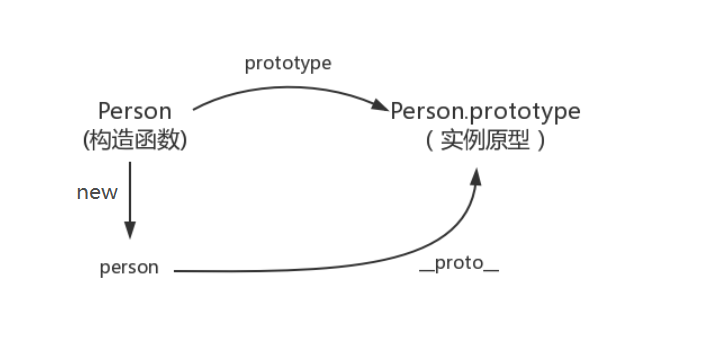
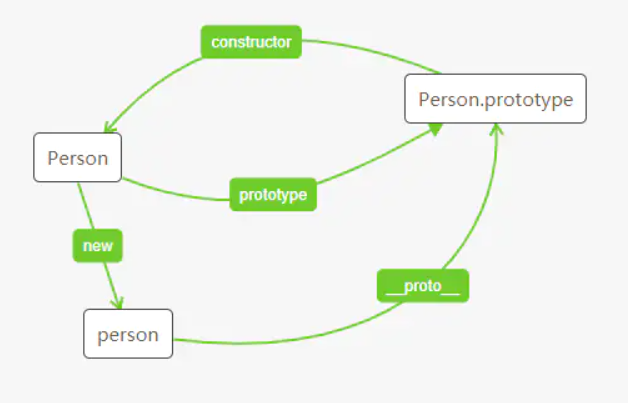
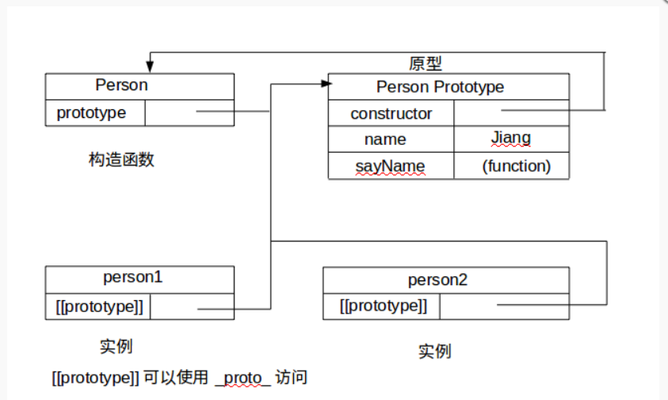
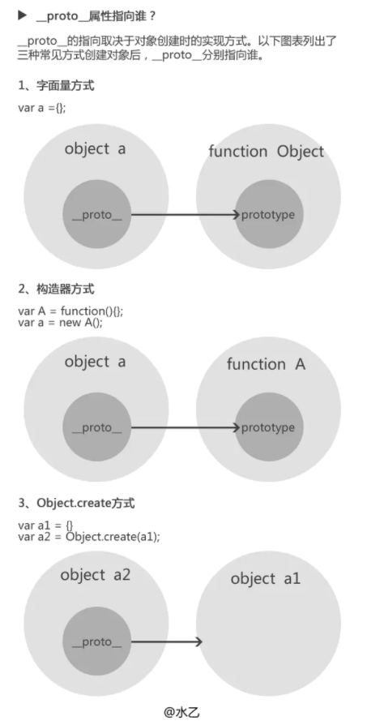
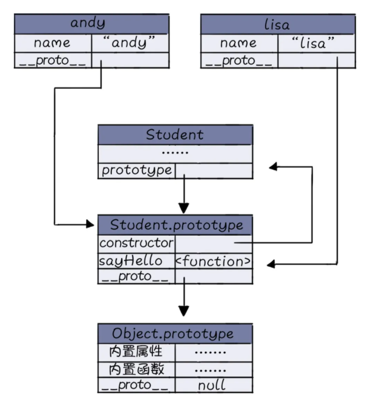
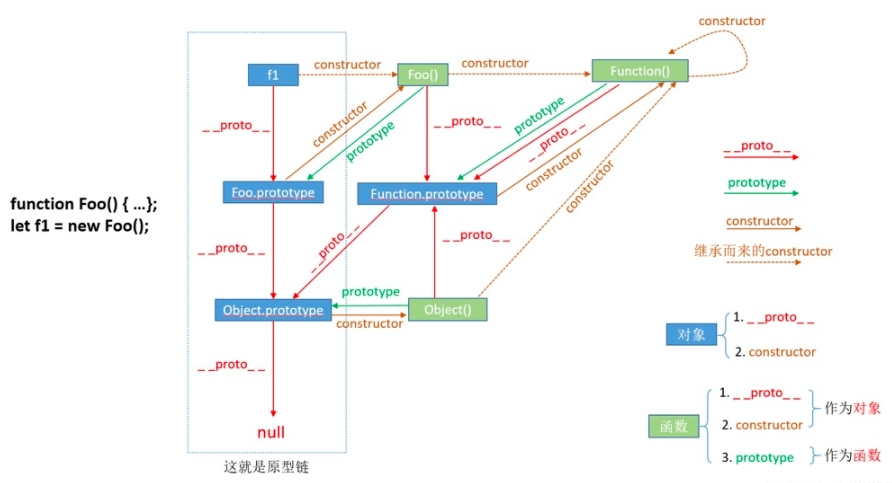
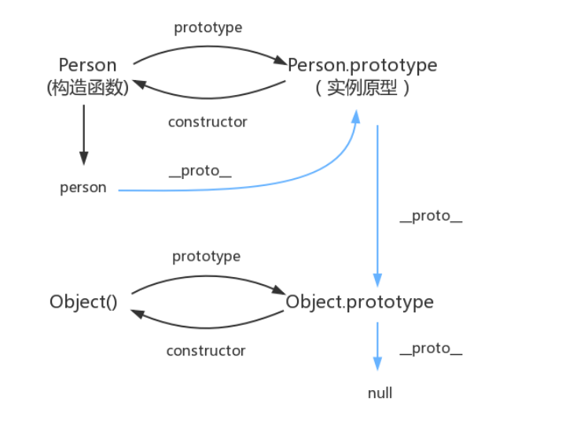

# 对象基础

object ：propert + method


## 构造函数constructor

**定义**： 属性 `constructor` 也是**对象**才拥有的，它是从**一个对象指向一个函数**，含义就是**指向该对象的构造函数**，每个对象都有构造函数（本身拥有或继承而来，继承而来的要结合 `__proto__` 属性查看会更清楚点）

>  **Function** 这个对象比较特殊，它的构造函数就是它自己（因为 Function 可以看成是一个函数，也可以是一个对象），所有函数和对象最终都是由 Function 构造函数得来，所以 `constructor` 属性的终点就是 **Function** 这个函数。（不理解的 可以先看下去，在最后解释深层原型链就可以搭配图理解）

特点：

- 函数体内部使用了`this`关键字，代表了所要生成的对象实例。
- 生成对象的时候，必须使用`new`命令
- constructor是原型对象上的一个属性，默认指向这个原型的构造函数

```js
// 比如一个构造函数：
function Foo() { }
// 声明一个函数后，默认就生成下面这条语句。
Foo.prototype.constructor === Foo // true
```

```js
function Person(name, age, job) {
 this.name = name;
 this.age = age;
 this.job = job;
 this.sayName = function() { alert(this.name) }
}
var person1 = new Person('Zaxlct', 28, 'Software Engineer');
var person2 = new Person('Mick', 23, 'Doctor');
console.log(person1 instanceof Person); //true
console.log(person1.__proto__ === Person.prototype); //true 
```

## new命令

1. 创建一个空对象，作为将要返回的对象实例。
2. 将这个空对象的原型，指向构造函数的`prototype`属性。
3. 将这个空对象赋值给函数内部的`this`关键字。
4. 开始执行构造函数内部的代码。

### 图解





> 注意这里的 constructor 是原型的一个属性，Constructor 指的才是真正的构造函数。两者名字不要弄混了😀

### 代码例子

```js
var fn= function(){};//外部定义函数，根位置确定
var Vehicle = function () {
  this.price = 1000;
  this.function=fn;  //this.function =function(){}不要这样创建，多个函数暂用内存
};

var v = new Vehicle();
v.price // 1000
////////////////////////////////////////////
var fn= function(){};
function Cat (name, color) {
  this.name = name;
  this.color = color;
  this.function=fn;
}

var cat1 = new Cat('大毛', '白色');
cat1.name // '大毛'
cat1.color // '白色'

```

```js
var Vehicle = function (p) {
  this.price = p;
};

var v = new Vehicle(500);
```

## 构造函数中创建函数注意

### 单个函数

```js
var fn= function(){};//外部定义函数，根位置确定
var Vehicle = function () {
  this.price = 1000;
  this.function=fn;  //this.function =function(){}不要这样创建，多个函数暂用内存
};

var v = new Vehicle();
v.price // 1000
```

函数的方程不会因为多个对象的创建，而不断的创建。

### 那遇到多个(重名）函数，不同对象创建调用怎么办？

```js
//多个函数，防止取名撞，归类到一个对象
var obj={
	"fn":function(){},
    "fn1":function(){},
}

var Vehicle = function (num,function) {//1000;obj.fn
  this.price = num;
  this.function=function;
};


//多个重名函数，创建多个obj，从而调用
var obj1={
	"fn":function(){},
    "fn1":function(){},
}

var obj2={
	"fn":function(){},
    "fn1":function(){},
}

var Vehicle = function () {
  this.price = 1000;
  this.function=obj1.fn;
};

var person = function () {
  this.price = 1000;
  this.function=obj2.fn;
};
```

# 对象继承(详细另外一篇)

# prototype 属性- 函数的原型对象

> 每个函数都有prototype属性，这个属性是一个指针，指向一个对象，记住只有函数才有,并且通过bind()绑定的也没有。
>
> 对于函数的prototype，在函数定义之前，prototype 就已经创建了
>
> **`prototype` 属性作用**：包含可以由特定类型的所有实例共享的属性和方法，也就是让该函数的实例化对象们都可以找到公用的属性和方法。



一个最基本的例子 new constrcut()

```js
function person(name) {
       this.name = name;
    }
var foo = new person("deen");
//通过new创建了一个对象
//new是一种语法糖，new person等价于
var bar = (function(name) {
    var _newObj = {
        constructor : person,
        __proto__ : person.prototype,
    };
    _newObj.constructor(name);
    return _newObj;
})();
```


```js
console.log(Animal.prototype);//已经存在
function Animal(name) {
  this.name = name;
}
console.log(Animal.prototype);//已经存在
Animal.prototype.color = 'white';

var cat1 = new Animal('大毛');
var cat2 = new Animal('二毛');

cat1.color // 'white'
cat2.color // 'white'

Animal.prototype.go = function () {
  return 'run';
}

var cat3 = new Animal('三毛');
cat1.go();//undefined
cat2.go();//undefined
cat3.go();//'run'
```

# `__`proto`__` - 对象&函数属性

> JS 在创建实例对象（不论是普通对象还是函数对象）的时候，都有一个叫做**proto** 的内置属性，用于指向创建它的构造函数的原型对象（ prototype）。
>
> 所有的对象都有一个属性：`__proto__`，称之为隐式原型，用来将对象与该对象的原型相连

```js
function Person(name, age, job) {
 this.name = name;
 this.age = age;
 this.job = job;
 this.sayName = function() { alert(this.name) }
}
 
var person1 = new Person('Zaxlct', 28, 'Software Engineer');

Person.prototype.constructor == Person;//true
person1.__proto__ == Person.prototype;//true
person1.constructor == Person;
```

```js
function A() {}

var obj1 = new A();
var obj2 = new A();
obj1.abc = 123;
obj2.__proto__.bcd = 456;

//输出结果是多少
console.log(obj1.abc, obj2.abc); //123 undefined
console.log(obj1.__proto__.bcd, obj2.__proto__.bcd);//456  456
```

> `__`proto`__`不建议使用，可以用Object.getPrototypeOf()和Object.setPrototypeOf()代替；

## 确定对象之间是否存在原型关系

1. instanceof,这个操作符只能处理对象(person1)和函数(带.prototype引用的Person)之间的关系
2. isPrototypeOf，如果[[prototype]]指向调用此方法的对象，那么这个方法就会返回true
3. Object.getPrototypeOf这个方法返回[[Prototype]]的值,可以获取到一个对象的原型

```js
person1 instanceof Person // true

Person.prototype.isPrototypeOf(person1) // true
Person.prototype.isPrototypeOf(person2) // true

Object.getPrototypeOf(person1) === Person.prototype // true
```

## `__`proto`__` 的指向



#  **proto** 属性 与 prototype 属性 的区别

| 显式原型对象                        | 隐式原型对象                                                 |
| ----------------------------------- | ------------------------------------------------------------ |
| 属性 `prototype`                    | 属性 `__proto__`                                             |
| 函数独有                            | 对象独有（函数也是对象，因此函数也有该属性）                 |
| 定义函数时被自动赋值，值默认为 `{}` | 在创建实例对象时被自动添加，并赋值为构造函数的 `prototype` 值 |
| 用于实现基于原型的继承与属性的共享  | 构成原型链，同样用于实现基于原型的继承                       |


例子中



### prototype、[[Prototype]]和__proto__的区别？

> 1、原型`prototype`是构造函数的属性，`__proto__`是 new 生成的对象的属性，`[[Prototype]]`是对象的内部属性。
>
> 2、构造函数的原型 `prototype` 和其对象的 `__proto__`指向同一个对象
>
> 3、`[[Prototype]]`指向它的构造函数的原型`prototype`，外部无法直接访问，可以通过`__proto__`来访问内部属性`[[Prototype]]`，

# 原型链 

> **定义**：从当前对象出发沿着原型对象（`__proto__`）构成的链条查找相关属性和方法直到结束，这些相互关联的对象组成的链条就是**原型链**

## 图解


> 原型链的形成是真正是靠**proto** 而非 prototype。
>
> 作用：用于实现继承，原型之间的继承，对象之间的继承
> 		注意：JS内部继承的实现就是靠原型链，没有原型链就没有继承

```js
person1.__proto__ === Person.prototype;
Person.prototype.__proto__ === Object.prototype;
Object.prototype.__proto__ === null;//保证原型链能够正常结束。

Person.__proto__ === Function.prototype;
Object.__proto__ === Function.prototype;
Function.prototype.__proto__ === Object.prototype;
//String, Array, Number,Object, Function这些其实都是 function
```

所有函数对象的 --proto-- 都指向 Function.prototype，它是一个空函数（Empty function）

**`Object.ptototype`是js原型链的最顶端，它的`__proto__`是`null`(有proto属性，但值是 null，因为这是原型链的最顶端)；**

## 原型链底层理解

数组、对象、函数都有一个属性：`__proto`__ 隐式原型; prototype 称作 显式原型。

```js
let num = new Number();
num.__proto__ === Number.prototype;
Number.prototype.__proto__ === Function.prototype;
Funtion.prototype.__proto__ === Object.prototype;
Object.prototype.__proto__ === null;
```

 



> 特殊点：
>
> 1. Function的__proto__指向自身的prototype
> 2. Object的prototype的__proto__指向null

## 原型链中实例属性（obj）和原型属性(constructor)

```js
function Person() {
}
// 原型属性
Person.prototype.name = ‘Jiang’
var person1 = new Person()
// 实例属性
person1.name = ‘J’
console.log(person1.name) // J
```

当我们读取一个属性的时候，如果在实例属性上找到了，就读取它，不会管原型属性上是否还有相同的属性，这其实就是**属性屏蔽**。即当实例属性和原型属性拥有相同名字的时候，实例属性会屏蔽原型属性，记住只是屏蔽，不会修改，原型属性那个值还在


## 原型prototype

```js
function  f1(){};

console.log(f1. prototype) //f1 {}
console.log(typeof  f1. prototype) //object
console.log(typeof  Function. prototype) // function
console.log(typeof  Object. prototype) // object
console.log(typeof  Function. prototype. prototype) //undefined
```

## 原型链的深层例子


> 所有的对象最深层的prototype都是object

图例：



# 原型链的应用

这里在实际操作上,因为有原型链的存在,所以数据的share也就成为了可能,但是当你并不想去深层寻找的时候hasOwnProperty()

> `hasOwnProperty (en-US)` 是 JavaScript 中唯一一个处理属性并且**不会**遍历原型链的方法。（译者注：原文如此。另一种这样的方法：`Object.keys()`）

## 基础方法

W3C不推荐直接使用系统成员__proto__

### **Object.getPrototypeOf(对象)**

获取对象的隐式原型

`Object.getPrototypeOf`方法返回参数对象的原型。这是获取原型对象的标准方法。

```js
var F = function () {};
var f = new F();
Object.getPrototypeOf(f) === F.prototype // true
```

上面代码中，实例对象`f`的原型是`F.prototype`。

下面是几种特殊对象的原型。

```js
// 空对象的原型是 Object.prototype
Object.getPrototypeOf({}) === Object.prototype // true

// Object.prototype 的原型是 null
Object.getPrototypeOf(Object.prototype) === null // true

// 函数的原型是 Function.prototype
function f() {}
Object.getPrototypeOf(f) === Function.prototype // true
```

### Object.setPrototypeOf(对象)

`Object.setPrototypeOf`方法为参数对象设置原型，返回该参数对象。它接受两个参数，第一个是现有对象，第二个是原型对象。

```js
var a = {};
var b = {x: 1};
Object.setPrototypeOf(a, b);

Object.getPrototypeOf(a) === b // true
a.x // 1
```

上面代码中，`Object.setPrototypeOf`方法将对象`a`的原型，设置为对象`b`，因此`a`可以共享`b`的属性。

`new`命令可以使用`Object.setPrototypeOf`方法模拟。

```js
var F = function () {
  this.foo = 'bar';
};

var f = new F();
// 等同于
var f = Object.setPrototypeOf({}, F.prototype);
F.call(f);
```

上面代码中，`new`命令新建实例对象，其实可以分成两步。第一步，将一个空对象的原型设为构造函数的`prototype`属性（上例是`F.prototype`）；第二步，将构造函数内部的`this`绑定这个空对象，然后执行构造函数，使得定义在`this`上面的方法和属性（上例是`this.foo`），都转移到这个空对象上。

### **Object.prototype.isPrototypeOf(对象)**

判断当前对象(this)是否在指定对象的原型链上

```js
function A() {};
var obj = new A();
var o = {};
o.isPrototypeOf(obj);//false
//换种写法
Object.getPrototypeOf(o).isPrototypeOf(obj); //true 

//例子2
var o1 = {};
var o2 = Object.create(o1);
var o3 = Object.create(o2);

o2.isPrototypeOf(o3) // true
o1.isPrototypeOf(o3) // true
```

因此o的隐式原型是Object.**proto**,正好它也在obj的原型链上，所以是true,具体可以看上图

### **对象 instanceof 函数**

判断函数的原型是否在对象的原型链上

### **Object.create(对象)**

生成实例对象的常用方法是，使用`new`命令让构造函数返回一个实例。但是很多时候，只能拿到一个实例对象，它可能根本不是由构建函数生成的，那么能不能从一个实例对象，生成另一个实例对象呢？

JavaScript 提供了`Object.create()`方法，用来满足这种需求。该方法接受一个对象作为参数，然后以它为原型，返回一个实例对象。该实例完全继承原型对象的属性。

```js
// 原型对象
var A = {
  print: function () {
    console.log('hello');
  }
};

// 实例对象
var B = Object.create(A);

Object.getPrototypeOf(B) === A // true
B.print() // hello
B.print === A.print // true
```

上面代码中，`Object.create()`方法以`A`对象为原型，生成了`B`对象。`B`继承了`A`的所有属性和方法。

下面三种方式生成的新对象是等价的。

```js
var obj1 = Object.create({});
var obj2 = Object.create(Object.prototype);
var obj3 = new Object();
```

`Object.create()`方法生成的新对象，动态继承了原型。在原型上添加或修改任何方法，会立刻反映在新对象之上。

```js
//例子1
var obj1 = { p: 1 };
var obj2 = Object.create(obj1);

obj1.p = 2;
obj2.p // 2

 //例子2
function A() {}
var a = new A();
var b = Object.create(a);

b.constructor === A // true
b instanceof A // true
```

### new与Object.create()区别

- new创建一个对象，执行构造函数。
- Object.create相当于创建一个对象，但是不执行构造函数。

### Object.prototype.__proto__ 

实例对象的`__proto__`属性（前后各两个下划线），返回该对象的原型。该属性可读写。

```js
var obj = {};
var p = {};

obj.__proto__ = p;
Object.getPrototypeOf(obj) === p // true

//例子2
var A = {
  name: '张三'
};
var B = {
  name: '李四'
};

var proto = {
  print: function () {
    console.log(this.name);
  }
};

A.__proto__ = proto;
B.__proto__ = proto;

A.print() // 张三
B.print() // 李四

A.print === B.print // true
A.print === proto.print // true
B.print === proto.print // true
```

### Object.getOwnPropertyNames()

`Object.getOwnPropertyNames`方法返回一个数组，成员是参数对象本身的所有属性的键名，不包含继承的属性键名。

```js
Object.getOwnPropertyNames(Date)
// ["parse", "arguments", "UTC", "caller", "name", "prototype", "now", "length"]
```

上面代码中，`Object.getOwnPropertyNames`方法返回`Date`所有自身的属性名。

对象本身的属性之中，有的是可以遍历的（enumerable），有的是不可以遍历的。`Object.getOwnPropertyNames`方法返回所有键名，不管是否可以遍历。只获取那些可以遍历的属性，使用`Object.keys`方法。

### **Object.prototype.hasOwnProperty(属性名)**

判断一个对象**自身**是否拥有某个属性,在循环遍历的时候经常使用

对象实例的`hasOwnProperty`方法返回一个布尔值，用于判断某个属性定义在对象自身，还是定义在原型链上。

```js
Date.hasOwnProperty('length') // true
Date.hasOwnProperty('toString') // false
```

上面代码表明，`Date.length`（构造函数`Date`可以接受多少个参数）是`Date`自身的属性，`Date.toString`是继承的属性。

另外，`hasOwnProperty`方法是 JavaScript 之中唯一一个处理对象属性时，不会遍历原型链的方法。

### 获取对象的所有可枚举的属性的名字

```js
var keys = Object.keys(person1)
console.log(keys) // ["name"]

var keys = Object.keys(Person.prototype)
console.log(keys) // ["age"]
```

### 获取原型对象方法的比较

获取实例对象`obj`的原型对象，有三种方法。

- `obj.__proto__`（不稳）
- `obj.constructor.prototype`（不稳）
- `Object.getPrototypeOf(obj)`（推荐）

```js
var P = function () {};
var p = new P();

var C = function () {};
C.prototype = p;
var c = new C();

c.constructor.prototype === p // false
```

上面代码中，构造函数`C`的原型对象被改成了`p`，但是实例对象的`c.constructor.prototype`却没有指向`p`。所以，在改变原型对象时，一般要同时设置`constructor`属性。

```js
C.prototype = p;
C.prototype.constructor = C;

var c = new C();
c.constructor.prototype === p // true
```

## 应用

**类数组转换为真数组**

```js
Array.prototype.slice.call(类数组);
//这个方法与[].slice.call(类数组)的区别：后者的[]是重新创建了一个数组从而得到slice方法，但是这是不必要的
```

## [错误实践：扩展原生对象的原型](https://developer.mozilla.org/zh-CN/docs/Web/JavaScript/Inheritance_and_the_prototype_chain#错误实践：扩展原生对象的原型)

同页面下面有 拓展原型对象原型的办法

## 拓展阅读 

[javascript最新方法创造对象和经典方式创造对象以及他们的优缺点详细得抠脚的总结](https://blog.csdn.net/weixin_43342105/article/details/105156751)

# Reference

1. https://blog.csdn.net/qq_44197554/article/details/105438252
2. Dr. Axel Rauschmayer, [JavaScript properties: inheritance and enumerability](http://www.2ality.com/2011/07/js-properties.html)
3. https://wangdoc.com/javascript/oop/prototype.html#%E6%9E%84%E9%80%A0%E5%87%BD%E6%95%B0%E7%9A%84%E7%BC%BA%E7%82%B9
4. https://mp.weixin.qq.com/s?__biz=MzAxOTc0NzExNg%3D%3D&chksm=80d66757b7a1ee41cd8bc2154baf7e8a15304d25bd289dda29061ebe1678eebaad4232557ec3&idx=1&mid=2665520916&scene=21&sn=76f110bb713ac67d0a678af0b088501e#wechat_redirect
