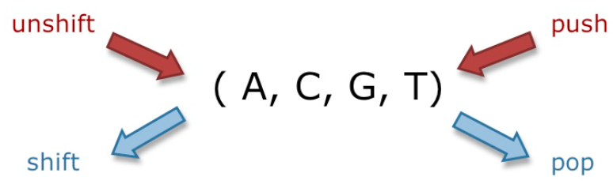
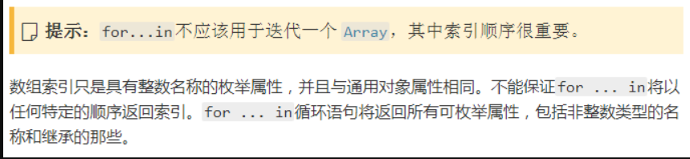

# 创建array

## 字面量

```js
var empty = [];                    //没有元素的数组
var primes = [2,3,5,7,11];         //有5个数值的数组
var misc = [1.1,true, "a"];           //3个不同类型的元素
```

## 构建函数

```js
var a = new Array();
```

# Array本质是对象

```js
o={};       //创建一个普通的对象
o[1]="one"; //用一个整数来索引它

//数值键名被自动转成字符串
var arr = ['a', 'b', 'c'];
arr['0'] // 'a'
arr[0] // 'a'
```

# Array 基本的进出

在数组最后增加一个元素,删除数组最后一个元素, 在数组头部增加一个元素,删除数组第一个元素

```js
arr.push(yourElement);
arr.pop();
arr.unshift(yourElement);
arr.shift()
```




# Array字符串化 - toString()

将数组字符串化。用逗号分割。相当于join(“,”);

```js
var num = 15;
var n = num.toString();
```

# 稀疏数组 （不连续索引的数组）

## 使用delete操作符

```js
var a = [1,2,3,4,5];
delete a[1];
console.log(a[1]);//undefined
console.log(1 in a);//false
```

## 省略元素值

```js
var a =[1,,3,4,5];
console.log(a[1]);//undefined
console.log(1 in a);//false
```

## undefined元素

```js
var a =[1,,3,4,5];
console.log(a[1]);//undefined
console.log(1 in a);//false

var a =[1,undefined,3,4,5];
console.log(a[1]);//undefined
console.log(1 in a);//true
```

# 数组乱序（shuffle）

sort()方法传入一个函数，此函数随机返回1或-1，达到随机排列数组元素的目的

```js
var array = [1,2,3,4,5];
console.log(array.sort(function(){return Math.random() - 0.5}));//[2,1,5,4,3]
```


# 数组max min

Math.max.apply 来查找数组中的最高值：

```js
function myArrayMax(arr) {
    return Math.max.apply(null, arr);
}
```


Math.min.apply 来查找数组中的最低值

```js
function myArrayMin(arr) {
    return Math.min.apply(null, arr);
}
```

# 数组排序办法

## reverse()

reverse()方法用于反转数组的顺序，返回经过排序之后的数组；而原数组顺序也发生改变

```js
var array = [1,2,4,3,5];
console.log(array,array.reverse());//[5,3,4,2,1] [5,3,4,2,1]
var array = ['str',true,3];
console.log(array,array.reverse());//[3,true,'str'] [3,true,'str']
```

## sort()

### 默认排序

　　默认情况下，sort()方法按字符串升序排列数组项，sort方法会调用每个数组项的toString()方法，然后比较得到的字符串排序，返回经过排序之后的数组，而原数组顺序也发生改变

> sort方法会调用每个数组项的`toString()`方法，得到字符串，然后再对得到的字符串进行排序。虽然数值15比3大，但在进行字符串比较时”15”则排在”3”前面。

```js
var array = [1,2,4,3,5];
console.log(array,array.sort());//[1,2,3,4,5] [1,2,3,4,5]
var array = ['3str',3,2,'2'];
console.log(array,array.sort());//[2, "2", 3, "3str"] [2, "2", 3, "3str"]
var array = [1,5,10,50];
console.log(array,array.sort());//[1, 10, 5, 50] [1, 10, 5, 50]
//强行要求
arr.sort((a, b) => a - b)
```

　　**如果数组包含undefined元素，它们会被排到数组的尾部**

```js
var array = ['3',3,undefined,2,'2'];
console.log(array,array.sort());//["2", 2, "3", 3, undefined] ["2", 2, "3", 3, undefined]
```

### 自定义排序

#### 数字

**Array.sort(function(a,b));**

> 方法函数function有两个参数a和b，通过比较两个值的大小，然后返回比较的结果，用于表明用何种方法进行排序。

- **负值(a<b)**：如果返回一个小于零的数，数组将按照升序排序。
- **零(a=b)**： 如果返回一个等于零的数，即两个参数相等。
- **正值(a>b)**：如果返回一个大于零的数，数组将按照降序排序。

**简单的来说就是：**

- 若：**return a-b;** **表示数组将按照升序排序。**
- 若：**return a=b;** **表示数组不进行排序。**
- 若：**return b-a;** **表示数组将按照降序排序。**

**例1：Array数组均为数字或数字型字符串，则按指定的规则顺序：**

```javascript
//降序
var arr = ['87',64,'81',27,21];
arr.sort(function(a,b){return a-b});
alert(arr);
//输出：21,27,64,81,87
//升序
var arr = ['87',64,'81',27,21];
function xmx(a,b){
	return b-a;
}
alert(arr.sort(xmx));
//输出：87,81,64,27,21
```

#### 区分大小写的字母排序

```js
var arr = ['Z','e','V','I','n'];
arr.sort(function(a, b){
    var x = a.toLowerCase(), y = b.toLowerCase();
    return x < y ? -1 : x > y ? 1 : 0;
});
console.log(arr);


——————OUTPUT——————
[ 'e', 'I', 'n', 'V', 'Z' ]
```

#### 对象属性条件排序

当数组元素为多属性的对象时，我们可能需要根据不同的属性来具体排序，比如以下数组中，我们想按照年龄降序排列：

```javascript
var arr = [{
    name:"code",age:19,grade:98
},{
    name:"zevin",age:12,grade:94
},{
    name:"j",age:15,grade:91
}];

arr.sort(function(a,b){
    if(a.age > b.age){
        return 1;
    }else{
        return -1;
    };
});
console.log(arr);


——————OUTPUT——————
[
  { name: 'zevin', age: 12, grade: 94 },
  { name: 'j', age: 15, grade: 91 },
  { name: 'code', age: 19, grade: 98 }
]
```


#### 自定义根据对象属性

封装一个函数sort，接收两个形参：需要排序的数组arr以及排序依据的属性键名property。其中用闭包的写法

```js
var arr = [{
    name:"code",age:19,grade:98
},{
    name:"zevin",age:12,grade:94
},{
    name:"j",age:15,grade:91
}];

function sort(arr,property){
    arr.sort((function(prop){
        return function(a,b){
            return a[prop] > b[prop] ? -1 : a[prop] < b[prop] ? 1 : 0;
        }
    })(property));
};

sort(arr,"grade");
console.log(arr);


——————OUTPUT——————
[
  { name: 'code', age: 19, grade: 98 },
  { name: 'zevin', age: 12, grade: 94 },
  { name: 'j', age: 15, grade: 91 }
]
```

# 数组拼接concat()- string也有

先创建当前数组一个副本，然后将接收到的参数添加到这个副本的末尾，最后返回新构建的数组。所以concat()**不影响原数组**

```js
var numbers = [1,2];
console.log(numbers,numbers.concat(3,4));//[1,2] [1,2,3,4]
console.log(numbers,numbers.concat([5,4,3],[3,4,5],1,2));//[1,2] [1,2,5,4,3,3,4,5,1,2]
```

```js
const array1 = ['a', 'b', 'c'];
const array2 = ['d', 'e', 'f'];
const array3 = array1.concat(array2);
```

```js
var newArray = Array.prototype.concat.call({ a: 1 }, { b: 2 })
console.log(newArray);// [{ a: 1 }, { b: 2 }]
console.log(newArray[0].a);//1 
```
# 数组拼接用...

```js
const array1 = ['a', 'b', 'c'];
const array2 = ['newEle',...array1,'newEle'];
```
# 创建子数组方法slice()- string也有

slice(start,end)方法需要两个参数start和end，返回这个数组中从start位置到(但不包含)end位置的一个子数组；如果end为undefined或不存在，则返回从start位置到数组结尾的所有项，不影响原数组。

- 　　如果start是负数，则start = max(length + start,0)
- 　　如果end是负数，则end = max(length + end,0)
- 　　start和end无法交换位置
- 　　如果没有参数，则返回原数组

```js
var numbers = [1,2,3,4,5];
console.log(numbers.slice(2));//[3,4,5]
console.log(numbers.slice(2,undefined));//[3,4,5]
console.log(numbers.slice(2,3));//[3]
console.log(numbers.slice(2,1));//[]

console.log(numbers.slice(-3));//-3+5=2 -> [3,4,5]
console.log(numbers.slice(-8));//max(5 + -8,0)=0 -> [1,2,3,4,5]

console.log(numbers.slice(0,-3));//-3+5=2 -> [1,2]
console.log(numbers.slice(-2,-1));//-2+5=3;-1+5=4; -> [4
```

slice()方法返回当前数组的一个浅拷贝

```js
var numbers = [1,2];
var newNumbers = numbers.slice();
console.log(numbers,newNumbers);//[1,2] [1,2]
```

对于参数，实际转换成数字

```js
var numbers = [1,2,3,4,5];
console.log(numbers.slice(NaN));//[1,2,3,4,5]
console.log(numbers.slice(0,NaN));//[]
console.log(numbers.slice(true,[3]));//[2,3]
console.log(numbers.slice(null,undefined));//[1,2,3,4,5]
console.log(numbers.slice({}));//[1,2,3,4,5]
console.log(numbers.slice('2',[5]));//[3,4,5]
```

# 数组删改特定位置内容方法  splice()

用于删除原数组的一部分成员，并可以在被删除的位置添加入新的数组成员，该方法**会改变原数组**

splice()返回一个由删除元素组成的数组，或者如果没有删除元素就返回一个空数组

splice(start,end)的第一个参数start指定了插入或删除的起始位置。如果start是负数，则start = max(length + start,0)；如果start是NaN，则相当于start = 0

如果只提供一个元素，相当于将原数组在指定位置拆分成两个数组

```js
var a = [1,2,3,4,5,6,7,8];
console.log(a,a.splice(4));// [1,2,3,4] [5,6,7,8]
var a = [1,2,3,4,5,6,7,8];
console.log(a,a.splice(-4));//-4+8=4; [1,2,3,4] [5,6,7,8]
```

splice(start,end)中start/end是负数或NaN或undefined，则number=0，因此不删除元素

```js
var a = [1,2,3,4,5,6,7,8];
console.log(a,a.splice(0,2));// [3,4,5,6,7,8] [1,2]
var a = [1,2,3,4,5,6,7,8];
console.log(a,a.splice(10,2));// [1,2,3,4,5,6,7,8] []
var a = [1,2,3,4,5,6,7,8];
console.log(a,a.splice(1,100));// [1] [2,3,4,5,6,7,8]
```

## 删除并添加（中间插入）

```js
var a = [1,2,3,4,5];
console.log(a,a.splice(2,0,'a','b'));//[1,2,'a','b',3,4,5] []
console.log(a,a.splice(2,2,[1,2],3));//[1,2,[1,2],3,3,4,5] ['a','b']
```

# 数组位置方法

## indexOf()

ndexOf(search,start)，返回search首次出现的位置，如果没有找到则返回-1

search参数表示要搜索的项；使用严格相等运算符（===）进行比较

```js
var arr = [1,2,3,'1','2','3'];
console.log(arr.indexOf('2'));//4
console.log(arr.indexOf(3));//2
```

```js
var arr = ['a','b','c','d','e','a','b'];
console.log(arr.indexOf('a',undefined));//0
console.log(arr.indexOf('a',NaN));//0
console.log(arr.indexOf('a',1));//5
console.log(arr.indexOf('a',true));//5
console.log(arr.indexOf('a',-1));//max(0,-1+7)=6; -1
console.log(arr.indexOf('a',-5));//max(0,-5+7)=2; 5
console.log(arr.indexOf('a',-50));//max(0,-50+7)=0; 0
```

对于对象

```js
var person = {name: 'Nicholas'};
var people = [{name: 'Nicholas'}];
var morePeople = [person];
alert(people.indexOf(person));//-1,因为person和people[0]虽然值相同，但是是两个引用
alert(morePeople.indexOf(person));//0，因为person和morepeople[0]是同一个引用
alert(morePeople.indexOf({name: 'Nicholas'}));//-1,因为不是同一个引用
```

## lastIndexOf()

lastIndexOf()从右向左查找

lastIndexOf(search,start)方法接收search和start两个参数，返回search第一次出现的位置，如果没有找到则返回-1

search参数表示要搜索的项；使用严格相等运算符（===）进行比较

```js
var arr = [1,2,3,'1','2','3'];
console.log(arr.lastIndexOf('2'));//4
console.log(arr.lastIndexOf(3));//2
```

函数会将start非数字值(undefined除外)转换为数。若忽略该参数或该参数为undefined或NaN时，start = 0

与字符串的lastIndexOf()方法不同，当search方法为负数时，search = max(0,length+search)

```js
var arr = ['a','b','c','d','e','a','b'];
console.log(arr.lastIndexOf('b',undefined));//-1
console.log(arr.lastIndexOf('a',undefined));//0
console.log(arr.lastIndexOf('b',NaN));//-1
console.log(arr.lastIndexOf('b',1));//1
console.log(arr.lastIndexOf('b',-1));//max(0,-1+7)=6; 6
console.log(arr.lastIndexOf('b',-50));//max(0,-50+7)=0; -1
```

# 数组归并方法

## reduce(prev, cur, index, array) --求和 求积 求最大值 去重 obj中乘积求和

 - 初始变量，当前变量，索引，原数组对象

```js
var a = [1,2,3,4,5];
var sum = a.reduce(function(x,y){return x+y},0);//数组求和
var product = a.reduce(function(x,y){return x*y},1);//数组求积
var max = a.reduce(function(x,y){return (x>y)?x:y;});//求最大值
//数组去重：
const arr = [1,3,4,2,5,3,4]
const slimArr = arr.reduce((prev, current) => {
  if(prev.includes(current)) {
    return prev
  } else {
    return prev.concat(current)
  }
}, [])
 
//求对象里的数乘积再求和：
const fruitArr = [
 { name: 'apple', price: 10, quantity: 2 },
 { name: 'orange', price: 15, quantity: 4 },
 { name: 'banana', price: 5, quantity: 3 },
]
const totalPrice = fruitArr.reduce((prev, current) => {
 return prev + current.price * current.quantity
}, 0)
```

```js
[1, 2, 3, 4, 5].reduce(function(prev, cur){
    console.log(prev, cur)
    return prev+ cur;
});
// 1 2
// 3 3
// 6 4
// 10 5
//最后结果：15
```

二维数组的扁平化

```js
var matrix = [
  [1, 2],
  [3, 4],
  [5, 6]
];
// 二维数组扁平化
var flatten = matrix.reduce(function (prev, cur) {
  return prev.concat(cur);
});
console.log(flatten); // [1, 2, 3, 4, 5, 6]
```

## reduceRight()

它按照数组索引从高到低（从右到左）处理数组，而不是从低到高

```js
var values = [1,2,3,4,5];
var sum = values.reduceRight(function(prev, cur, index, array){
    console.log(prev,cur);
    return prev + cur;
});
console.log(sum);
//5 4
//9 3
//12 2
//14 1
//15
```

# 数组迭代方法

## map()

对数组的每一项运行给定函数，返回每次函数调用的结果组成的数组。array.map(currentValue, index, arr)

```js
const multiplier ={
  number: [1,2,3,4,5],
  multiplerBy:6,
  multiply(){
    return this.number.map((numbers)=> numbers*this.multiplerBy)
  }
}
console.log(multiplier.multiply());//[6, 12, 18, 24, 30]
```

```js
var persons = [ 
 {firstname : "Malcom", lastname: "Reynolds"},
  {firstname : "Kaylee", lastname: "Frye"},
  {firstname : "Jayne", lastname: "Cobb"}
];


function getFullName(item) {
  var fullname = [item.firstname,item.lastname].join(" ");
  return fullname;
}

function myFunction() {
  document.getElementById("demo").innerHTML = persons.map(getFullName);
}
```

```js
// The global variable
var watchList = [
  {
    "Title": "Inception",
    "Year": "2010",
    "Rated": "PG-13",
    "Released": "16 Jul 2010",
    "imdbRating": "8.8",
    "imdbVotes": "1,446,708",
    "imdbID": "tt1375666",
    "Type": "movie",
    "Response": "True"
  },
  {
    "Title": "Interstellar",
    "Year": "2014",
    "Rated": "PG-13",
    "Released": "07 Nov 2014",
    "imdbRating": "8.6",
    "imdbVotes": "910,366",
    "imdbID": "tt0816692",
    "Type": "movie",
    "Response": "True"
  },
  {
    "Title": "The Dark Knight",
    "Year": "2008",
    "Rated": "PG-13",
    "Released": "18 Jul 2008",
    "imdbRating": "9.0",
    "imdbVotes": "1,652,832",
    "imdbID": "tt0468569",
    "Type": "movie",
    "Response": "True"
  }
];

//筛选元素
var ratings = [];
ratings=watchList.map(item  => ({  title: item["Title"],
rating: item["imdbRating"]}));

console.log(JSON.stringify(ratings));
```

```js
var filteredList = watchList.map(movie => {
    return {
      title: movie.Title,
      rating: movie.imdbRating
    };
  }).filter(movie => {
    // return true it will keep the item
    // return false it will reject the item
    return parseFloat(movie.rating) >= 8.0;
  });

```


## forEach()

本质上与for循环迭代数组一样。如果需要有返回值，一般使用map方法

```js
arr.forEach( function(item){
            console.log(item)
        } )
```

```js
var out = [];
[1, 2, 3].forEach(function(elem){
  this.push(elem * elem);
}, out);
console.log(out);// [1, 4, 9]
```

## forEach（）和map（）区别

- forEach：用来遍历数组中的每一项，这个方法执行没有返回值，不影响原数组
- map：支持return，相当与原数组克隆了一份，把克隆的每项改变了，也不影响原数组

## filter() - 可以用于删除个别obj元素

对数组中的每一项运行给定函数，该函数会返回true的项组成的数组。该方法常用于查询符合条件的所有数组项 

```js
[1, 2, 3, 4, 5].filter(function (elem) {
  return (elem > 3);
});// [4, 5]    

[0, 1, 'a', false].filter(Boolean);// [1, "a"]

[1, 2, 3, 4, 5].filter(function (elem, index, arr) {
  return index % 2 === 0;
});// [1, 3, 5]
```

```js
function getRating(watchList){
  // Only change code below this line
  var averageRating=watchList
    // Use filter to find films directed by Christopher Nolan
    .filter(film => film.Director === "Christopher Nolan")
    // Use map to convert their ratings from strings to numbers
    .map(film => Number(film.imdbRating))
    // Use reduce to add together their ratings
    .reduce((sumOfRatings, rating) => sumOfRatings + rating) /
  // Divide by the number of Nolan films to get the average rating
  watchList.filter(film => film.Director === "Christopher Nolan").length;
  return averageRating;
}
```


## some()

对数组中的每一项运行给定函数，如果该函数对任一项返回true，则返回true。并且当且仅当数值中的所有元素调用判定函数都返回false，它才返回false

```js
a = [1,2,3,4,5];
return a.some(function(elem, index, arr){
    return elem%2===0;})//true
return a.some(isNaN);//false

const isCheap = arr.some(item => item.price < 15)
const isExpensive = arr.some(item => item.price > 20)

```

## every()

对数组中的每一项运行给定函数，如果该函数对每一项都返回true，则返回true；只要有一项返回false，则返回false

```js
a = [1,2,3,4,5];
return a.every(function(elem, index, arr){elem < 10;})//true
return a.every(function(elem, index, arr){return elem%2 ===0;});//false
```

## 遍历array for... in... & for ... of ....

for....in 是es5标准， 此方法遍历数组效率低，主要是用来循环遍历对象的属性

1)、 for......in  遍历数组

```js
for(let item in arr){
            console.log(arr[item])
        }
```




2)、for.....in 遍历对象

循环遍历对象的属性，js中动态获取key，得到某对象中相对应的value = obj[key]

```js
const obj = {  a:1, b:2, c:3 }

for(let key in obj){  console.log(key + '---' + obj[key] )}
```

 for.......of   方法    （es6支持）

```js
for(let item of arr){
            console.log(item)
        }
```

# 实例总结

# 单个array

> 可以改变原数组的方法总共有7种：包括unshift()、shift()、push()、pop()这4种栈和队列方法，reverse()和sort()这2种数组排列方法，数组删改方法splice()

## 判断数组中是否存在某个元素

```js
const arr = [1, 2, 3, 4, 5]

const includeNum4 = arr.includes(4)

const includeNum7 = arr.includes(7)

=> includeNum4 = true  includeNum7 = false  
```


## 单个array除掉重复的元素

```js
Array.prototype.norepeat = function(){
    var result = [];
    for(var i = 0; i < this.length; i++){
        if(result.indexOf(this[i]) == -1){
            result.push(this[i]);
        }
    }
    return result;
}
var arr = ['a','ab','a'];
console.log(arr.norepeat());//['a','ab']
```

## 创造本地copy-arry

```js
 var a = arr1.slice() // 创造本身的copy
```

## 特定位置后面增加一个元素

```js
var arr = ['kevin', 'jack', 'rose’]
arr.splice(1(index+1), 0 ,’Lily’) //请注意 参数是 (index+1)
//当下arr的结果是 ['kevin’, ‘Lily' , 'jack', 'rose']
```

##  删除特定位置的元素

```js
arr.splice(1(index), 1) //请注意 参数是 index
```

## 替换特定位置的元素

```js
arr.splice(1(index), 1, 'John')
```

## array中删除删掉偶数，只保留奇数

```js
　var arr = [1, 2, 4, 5, 6, 9, 10, 15]; 　　　　　　
　var r = arr.filter(function (x) { 　　　　　　
　return x % 2 !== 0; 　　　　　　
　}); 　　　　　　
　console.log(r); // [1, 5, 9, 15]
```

## array中删除删掉 null, 0, NaN, undefined, ""

```js
var array=[false, null, 0, NaN, undefined, ""];
arr=arr.filter(Boolean);//[]
```

## 找到Array中第一个满足条件的元素

```js
const arr = [1,5,3,22,6]
const bigNum = arr.find(item => item > 6)

=> bigNum = 22
```


## array中满足某一条件的index位置

```js
dropElements([1, 2, 3, 9, 2], function(n) {return n > 2;});
function dropElements(arr, func) {
  console.log(arr.findIndex(func));//找出满足条件的index
 return arr.slice(arr.findIndex(func) >= 0 ? arr.findIndex(func) : arr.length);
}
```

## 单个array中含有多层array，flatten array

```js
function steamrollArray(arr) {
  let flat = [].concat(...arr);
  return flat.some(Array.isArray) ? steamrollArray(flat) : flat;
}
steamrollArray([1, [2], [3, [[4]]]]);//1 2 3 4

//原生array
const arr1 = [0, 1, 2, [3, 4]];
console.log(arr1.flat());
// expected output: [0, 1, 2, 3, 4]
const arr2 = [0, 1, 2, [[[3, 4]]]];
console.log(arr2.flat(2));//但是对于depth有要求
// expected output: [0, 1, 2, [3, 4]]

//其实要有递归的思想
function arraySum(array) {
    if (array.length == 0 || !(array instanceof Array)) {
        return false
    }
    let sum = 0;
    for (var i = 0; i < array.length; i++) {
        if (typeof array[i] == "number") {
            sum += array[i];
        }
        else if (array[i] instanceof Array)
            sum += arraySum(array[i]);
    }
    return sum;
}
console.log(arraySum([1, [2], [[3]], [[[4]]]]));//10
```


# 两个array

## 两个数组中的不同元素

```js
function getArrDifference(arr1, arr2) {
        return arr1.concat(arr2).filter(function(v, i, arr) {
            return arr.indexOf(v) === arr.lastIndexOf(v);
        });
    }
```

```js
function diff(arr1, arr2) {
      var newArr = [];
      var arr3=arr1.concat(arr2);//将arr1和arr2合并为arr3

      function isContain(value){
      //找出arr3中不存在于arr1和arr2中的元素
      return arr1.indexOf(value)==-1||arr2.indexOf(value)==-1；
   }
      newArr = arr3.filter(isContain);
      return newArr;
}  
```

```js
function diffArray(arr1, arr2) {
  return [...diff(arr1, arr2), ...diff(arr2, arr1)];

  function diff(a, b) {
    return a.filter(item => b.indexOf(item) === -1);
  }
}
```

```js
a.filter(function(v){ return b.indexOf(v) > -1 })
//return index true/false
```


## 取出两个数组的相同元素

```js
var arr1 = [0,1,2,3,4,5];
var arr2 = [0,4,6,1,3,9];
function getArrEqual(arr1, arr2) {
        let newArr = [];
        for (let i = 0; i < arr2.length; i++) {
            for (let j = 0; j < arr1.length; j++) {
                if(arr1[j] === arr2[i]){
                    newArr.push(arr1[j]);
                }
        }
     }
     return newArr;
}
console.log(getArrEqual(arr1, arr2));
```

```js
a.filter(function(v){ return !(b.indexOf(v) > -1) }).concat(b.filter(function(v){ return !(a.indexOf(v) > -1)}))
```


## array中找出 array1没有的

```js
 var arr1 = [2,3,4,5,6,7,8,9,0];
  return arr.filter(function(val) {
    return !arr1.includes(val);
  });
```

## 两个array的遍历（多层array）

```js
function whatIsInAName(collection, source) {
  var arr = [];
  // Only change code below this line 
  var sourceKeys = Object.keys(source);

  for (var person in collection) {
    var haveAll = true;
    for (var key in sourceKeys) {
      if (collection[person][sourceKeys[key]] !== source[sourceKeys[key]]) {
        haveAll = false;
        break;
      }
    }

    if (haveAll) arr.push(collection[person]);
  }

  // Only change code above this line
  return arr;
}

whatIsInAName([{ first: "Romeo", last: "Montague" }, { first: "Mercutio", last: null }, { first: "Tybalt", last: "Capulet" }], { last: "Capulet" });
```

##  计算两个数组的交集、差集、并集、补集 （用filter concat）

```js
var a = [1,2,3,4,5]
var b = [2,4,6,8,10]
 
//交集
var c = a.filter(function(v){ return b.indexOf(v) > -1 })
 
//差集
var d = a.filter(function(v){ return b.indexOf(v) == -1 })
 
//补集
var e = a.filter(function(v){ return !(b.indexOf(v) > -1) })
        .concat(b.filter(function(v){ return !(a.indexOf(v) > -1)}))
 
//并集
var f = a.concat(b.filter(function(v){ return !(a.indexOf(v) > -1)}));


////jquery
// 交集
let intersect = $(a).filter(b).toArray();
 
// 差集
let minus = $(a).not(b).toArray();
 
// 补集
let complement  = $(a).not(b).toArray().concat($(b).not(a).toArray());
 
// 并集
let unionSet = $.unique(a.concat(b));

console.log("数组a：", a);
console.log("数组b：", b);
console.log("a与b的交集：", c);
console.log("a与b的差集：", d);
console.log("a与b的补集：", e);
console.log("a与b的并集：", f);
//
console.log("a与b的交集：", intersect);
console.log("a与b的差集：", minus);
console.log("a与b的补集：", complement);
console.log("a与b的并集：", unionSet);
```

## 数组功能扩展

```js
//数组功能扩展
//数组迭代函数
Array.prototype.each = function(fn){
  fn = fn || Function.K;
   var a = [];
   var args = Array.prototype.slice.call(arguments, 1);
   for(var i = 0; i < this.length; i++){
       var res = fn.apply(this,[this[i],i].concat(args));
       if(res != null) a.push(res);
   }
   return a;
};
 
//数组是否包含指定元素
Array.prototype.contains = function(suArr){
  for(var i = 0; i < this.length; i ++){
      if(this[i] == suArr){
          return true;
      }
   }
   return false;
}
 
//不重复元素构成的数组
Array.prototype.uniquelize = function(){
   var ra = new Array();
   for(var i = 0; i < this.length; i ++){
      if(!ra.contains(this[i])){
          ra.push(this[i]);
      }
   }
   return ra;
};
 
//两个数组的交集
Array.intersect = function(a, b){
   return a.uniquelize().each(function(o){return b.contains(o) ? o : null});
};
 
//两个数组的差集
Array.minus = function(a, b){
   return a.uniquelize().each(function(o){return b.contains(o) ? null : o});
};
 
//两个数组的补集
Array.complement = function(a, b){
   return Array.minus(Array.union(a, b),Array.intersect(a, b));
};
 
//两个数组并集
Array.union = function(a, b){
   return a.concat(b).uniquelize();
};
var a = [1,2,3,4,5]
var b = [2,4,6,8,10]
console.log("数组a：", a);
console.log("数组b：", b);
console.log("a与b的交集：", Array.intersect(a, b));
console.log("a与b的差集：", Array.minus(a, b));
console.log("a与b的补集：", Array.complement(a, b));
console.log("a与b的并集：", Array.union(a, b));
```

