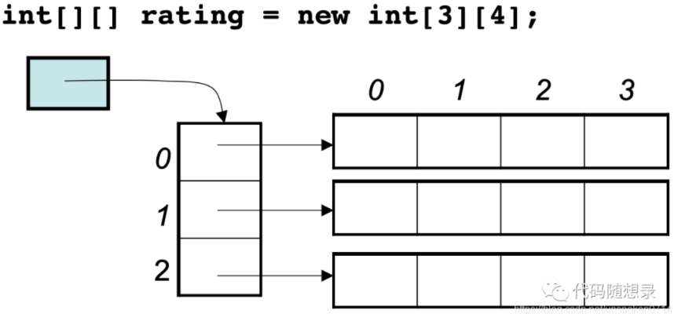

## 时间复杂度

### 常见的时间复杂度
##### O(1)
执行常数次，和输入无关
```js
def O1(num):
	i = num
	j = num*2
	return i+j
```


##### O(N):
```js
def ON(num):
	total = 0
	for i in range(num):
		total+=i
	return total
```
##### O(logN):
```js
def OlogN(num);
	 i = 1
	 while(i < num):
	 	i = i*2
	return i
```
##### O(M+N)
```js
def OMN(num):
	total = 0
	for i in range(num):
		total += 1
	for j in range(num):
		total += j
	return total
```
##### O(NlogN)
```js
def ONlogN(num1, num2):
	total = 0
	j = 0
	for i in range(num1):
		while(j < num2):
			total += i + j
			j = j*2
	return total
```
##### O(N^2)
```js
def ON2(num):
	total = 0
	for i in range(num):
		for j in range(num):
			total += i + j
	return total
```


**O(1) < O(logN) (二分查找) < O(N) < O(NlogN) < O(N^2) < O(2^n) < O(n!)**

### 常见的空间复杂度
算法的存储空间与输入值之间的关系
**O(1) < O(N) < O(N^2)**
常量看其与输入值得关系
递归要考虑递归栈

##### O(1)
```js
def ON(num):
	sum = 0;
	for i in range(num):
		sum = sum+i
	return sum
```

##### 递归
O（1）
```js
def ON(num):
	if(num<=0):
		return 0
	return ON(num-1) + ON(num-2) 
```

# 数据结构

## 数组

- 定义：在**连续的内存空间**中，储存一组**相同类型**的元素
- 数组的访问: 通过索引访问元素。a[0]
- 数组的内存空间是连续的，增删需要移动后面的元素
- 二维数组的内存地址是连续的吗？

二维数组实际是一个线性数组存放着其他数组的首地址



数组的搜索：找到这个元素对应的索引
### 复杂度
- 访问Access:Ｏ（１）
  通过计算可以得到地址位置，从而进行访问
- 搜索search:O(N)
  需要对数组进行遍历
- 插入insert: O(N)
  需要将后面的元素往后移动
  如果内存不够，需要开辟一块新空间，将数组移进去
- 删除delete: O(N)
  需要将后面元素往前移

### 特点
- 适合读
- 不适合频繁做增删操作。
- 场景：读多写少
### 常用操作
- 创建数组
```js
a = [];
```

- 添加元素
```js
// 末尾添加
a.append(1)
a.append(2)
a.append(3)
// [1,2,3]
// insert(x,y)指定位置x添加y
a.insert(2,99)
//# [1,2,99,3]
```

- ### 访问元素
```js
temp = a[2]
// temp = 99
```
```js
- 修改元素
a[2] = 88
```
```js
删除元素
// 删除指定值 O(N)
a.remove(88)
// 1 2 3
// 删除指定索引的元素 O(N)
a.pop(1)
// 1 2
// 删除最后的元素 O(1)
a.pop()
// 1
```
- 遍历元素
```js
for i in a:
	print(i)

for i in range(0,len(a)):
	print("index:",i,"value:",a[i])

for i, val in emumerate(a):
	print("index:",i,"value:",val)
```

- 查找元素
```js
index = a.index(2)
```
- 数组的长度
```js
len(a)
```

- 数组的排序
```js
// 从小到大
a.sort()
// 从大到小
a.sort(reverse =True)
```


# [十大经典排序算法（动图演示）](https://www.cnblogs.com/onepixel/p/7674659.html)

[推荐对于算法可视化的网站](https://clementmihailescu.github.io/Pathfinding-Visualizer/#)

