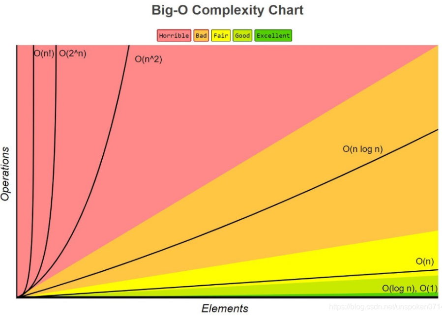
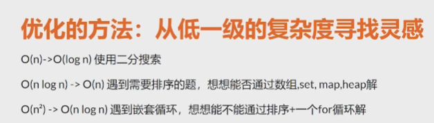
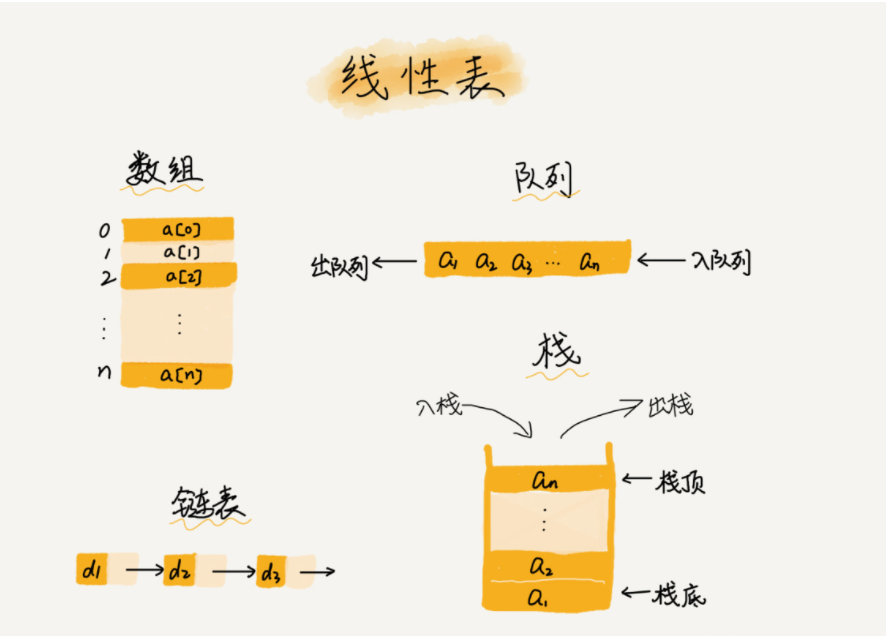
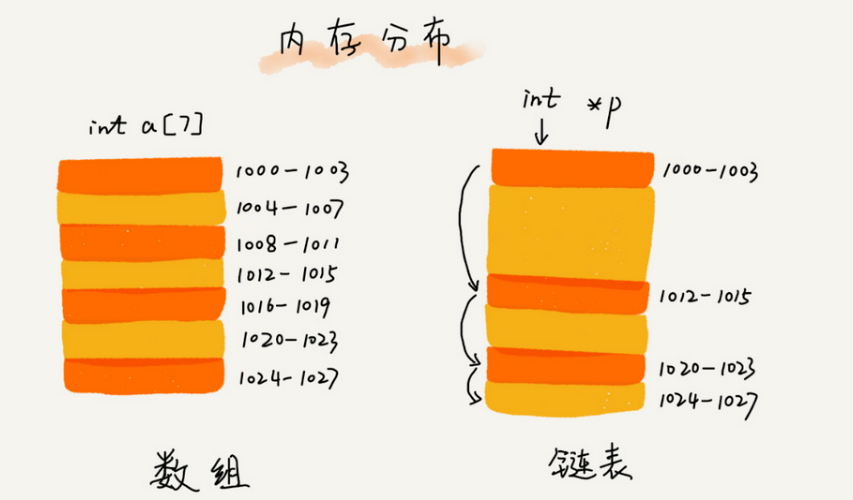
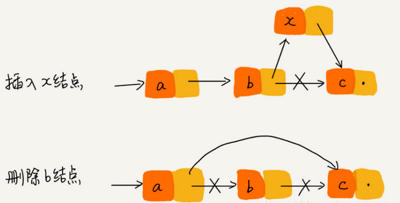
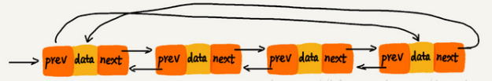
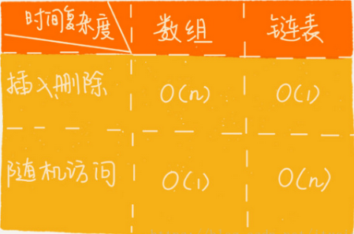
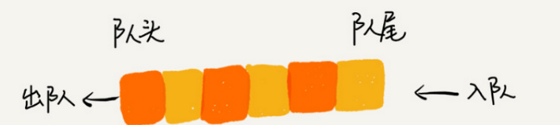
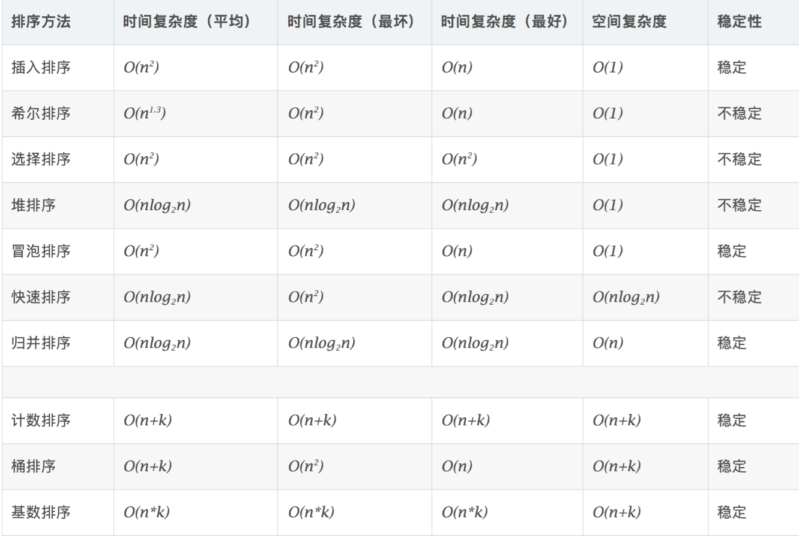
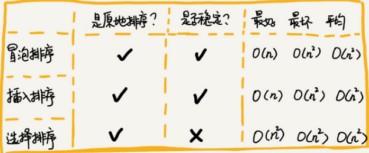

> 做法: 分类总结刷

## 时间复杂度

### 常见的时间复杂度

**时间复杂度**：评估执行程序所需的时间。可以估算出程序对处理器的使用程度

##### O(1)
执行常数次，和输入无关
```python
def O1(num):
	i = num
	j = num*2
	return i+j
```


##### O(N)
```python
def ON(num):
	total = 0
	for i in range(num):
		total+=i
	return total
```
一般来说有for循环基本是O(N) 但是这时候有个特例

```js
let i =0; while(i<n)
```

这里也是O(N)

##### O(logN)

```python
def OlogN(num);
	 i = 1
	 while(i < num):
	 	i = i*2
	return i
```
可以看出上面的代码，随着number每次乘以2后，都会越来越接近n，当number不小于n时就会退出循环。假设循环的次数为X，则由2^x=n得出x=log₂n，因此得出这个算法的时间复杂度为O(logn)。

##### O(M+N)

```python
def OMN(num):
	total = 0
	for i in range(num):
		total += 1
	for j in range(num):
		total += j
	return total
```
##### O(NlogN)
```python
def ONlogN(num1, num2):
	total = 0
	j = 0
	for i in range(num1):
		while(j < num2):
			total += i + j
			j = j*2
	return total
```
只要排序基本都是Nlog(N)

##### O(N^2)

for循环 嵌套 While循环

```python
def ON2(num):
	total = 0
	for i in range(num):
		for j in range(num):
			total += i + j
	return total
```

**这里很多时候以为嵌套的，就都是O(N^2)**内层循环的时间复杂度在讲到线性阶时就已经得知是O(n)，现在经过外层循环n次，那么这段算法的时间复杂度则为O(n²)。

 但是下面这个并不是！！！！ 注意 ： 因为他并不是从0开始的

```js
for(int i=0;i<n;i++){   
      for(int j=i;j<n;i++){
         //复杂度为O(1)的算法
         ... 
      }
  }
```

需要注意的是内循环中int j=i，而不是int j=0。当i=0时，内循环执行了n次；i=1时内循环执行了n-1次，当i=n-1时执行了1次，我们可以推算出总的执行次数为：

n+(n-1)+(n-2)+(n-3)+……+1
=(n+1)+[(n-1)+2]+[(n-2)+3]+[(n-3)+4]+……
=(n+1)+(n+1)+(n+1)+(n+1)+……
=(n+1)n/2
=n(n+1)/2
=n²/2+n/2

根据此前讲过的推导大O阶的规则的第二条：只保留最高阶，因此保留n²/2。根据第三条去掉和这个项的常数，则去掉1/2,最终这段代码的时间复杂度为O(n²)。 

#### 其他常见复杂度

除了常数阶、线性阶、平方阶、对数阶，还有如下时间复杂度：
f(n)=nlogn时，时间复杂度为O(nlogn)，可以称为nlogn阶。
f(n)=n³时，时间复杂度为O(n³)，可以称为立方阶。
f(n)=2ⁿ时，时间复杂度为O(2ⁿ)，可以称为指数阶。
f(n)=n!时，时间复杂度为O(n!)，可以称为阶乘阶。
f(n)=(√n时，时间复杂度为O(√n)，可以称为平方根阶。 




**O(1) < O(logN) (二分查找) < O(N) < O(NlogN) < O(N^2) < O(2^n) < O(n!)**

### 常见的空间复杂度
**空间复杂度**：评估执行程序所需的存储空间。可以估算出程序对计算机内存的使用程度。
**O(1) < O(N) < O(N^2)**

常量看其与输入值得关系
递归要考虑递归栈

##### O(1)
```python
def ON(num):
	sum = 0;
	for i in range(num):
		sum = sum+i
	return sum
```

这里的占据的空间是固定的，没有根据输入值的改变而改变的

##### O(N)

```python
def test(nums):
	array=[]
     for num in nums:
		array.append(num)
     return array
```

一个数占4个字节，所以array的空间与nums成正比；

例如 linked List array hashMap...

> 我们常见的空间复杂度就是O(1)、O(n)、 O(n2), 像O(logn)、O(nlogn) 这样的对数阶复杂度平时都用不到。而且，空间复杂度分析比时间复杂度分析要简单很多。


##### 注意特殊：递归

由于数据会一直被存在stack中

O（N）
```python
def ON(num):
	if(num<=0):
		return 0
	return ON(num-1) + ON(num-2) 
```

### 复杂度分析的4个概念
1. 最坏情况时间复杂度：代码在最坏情况下执行的时间复杂度。
2. 最好情况时间复杂度：代码在最理想情况下执行的时间复杂度。
3. 平均时间复杂度：代码在所有情况下执行的次数的加权平均值。
4. 均摊时间复杂度：在代码执行的所有复杂度情况中绝大部分是低级别的复杂度，个别情况是高级别复杂度且发生具有时序关系时，可以将个别高级别复杂度均摊到低级别复杂度上。基本上均摊结果就等于低级别复杂度。

## 优化方法



# 数据结构

## 1. 数组

线性表:  线性表就是数据排成像一条线一样的结构.每个现行表上的数据最多只有前和后两个方向.常见的线性表结构：数组，链表、队列、栈等。

- 优点：两限制使得具有随机访问的特性缺点：删除，插入数据效率低



数组的搜索：找到这个元素对应的索引
### 复杂度
**低效的插入和删除**
1） 插入：从最好O(1) 最坏O(n) 平均O(n)
2） 插入：数组若无序，插入新的元素时，可以将第K个位置元素移动到数组末尾，把心的元素，插入到第k个位置，此处复杂度为O(1)。
3） 删除：从最好O(1) 最坏O(n) 平均O(n)
4） 多次删除集中在一起，提高删除效率

### 特点
- 适合读
- 不适合频繁做增删操作。
- 场景：读多写少

## 2. 链表

1. 和数组一样，链表也是一种线性表。
2. 从内存结构来看，链表的内存结构是不连续的内存空间，是将一组零散的内存块串联起来，从而进行数据存储的数据结构。
3. 链表中的每一个内存块被称为节点Node。节点除了存储数据外，还需记录链上下一个节点的地址，即后继指针next




### 链表的特点

1. 插入、删除数据效率高O(1)级别（只需更改指针指向即可），随机访问效率低O(n)级别（需要从链头至链尾进行遍历）。

2. 和数组相比，内存空间消耗更大，因为每个存储数据的节点都需要额外的空间存储后继指针

   

### 常见列表

- 单列表(单行)

  1）每个节点只包含一个指针，即后继指针。
  2）单链表有两个特殊的节点，即首节点和尾节点。为什么特殊？用首节点地址表示整条链表，尾节点的后继指针指向空地址null。
  3）性能特点：插入和删除节点的时间复杂度为O（1），查找的时间复杂度为O(n)。

- 循环链表

  1）除了尾节点的后继指针指向首节点的地址外均与单链表一致。
  2）适用于存储有循环特点的数据，比如约瑟夫问题。

- 双向列表

  

    1）节点除了存储数据外，还有两个指针分别指向前一个节点地址（前驱指针prev）和下一个节点地址（后继指针next）。
    2）首节点的前驱指针prev和尾节点的后继指针均指向空地址。
- 双向循环链表

  


## 选择数组还是链表？

1.插入、删除和随机访问的时间复杂度
数组：插入、删除的时间复杂度是O(n)，随机访问的时间复杂度是O(1)。
链表：插入、删除的时间复杂度是O(1)，随机访问的时间复杂端是O(n)。




## 淘汰策略
常见的3种包括先进先出策略FIFO（First In，First Out）、最少使用策略LFU（Least Frenquently Used）、最近最少使用策略LRU（Least Recently Used）。

## 3. 队列 queue

队列是一种受限的线性表数据结构,只支持两个操作:入栈push()和出栈pop0,队列跟非常相似,支持的操作也 ,很有限,最基本的操作也是两个:入队enqueue(),放一个数据到队列尾部;出队dequeue0),从队列头部取一个元素。



### 特点

1. 队列跟栈一样,也是一种抽象的数据结构。

2. 具有**先进先出**的特性,支持在队尾插入元素,在队头删除元素。

## 4. 栈 Stack

- 先进后出
- 基于链表创建的

> 单端队列： 一个口进一个口出

> 双端队列： 两个口都可以进，两个口都可以出

### 复杂度

- 访问: O(N)
- 搜索：O(N)
- 插入: O(1)
- 删除： O(1)

### 基本操作

```js
function Stack(){
    //定义栈中的属性
    this.items = [];
    //栈的操作
    //1.元素入栈
    Stack.prototype.push = function (ele) {
        this.items.push(ele);
    }
    //2.取出栈顶元素（并返回）
    Stack.prototype.pop = function () {
        return this.items.pop();
    }
    //3.查看栈顶元素（返回）
    Stack.prototype.peek = function () {
        return this.items[this.items.length - 1];
    }
    //4.判断栈是否为空
    Stack.prototype.isEmpty = function () {
        return this.items.length == 0;
    }
    //5.获取栈中元素的个数
    Stack.prototype.size = function () {
        return this.items.length;
    }
    //6.toString方法
    Stack.prototype.toString = function () {
        var resultString = '';
        for( var i =0; i < this.items.length ; i++){
            resultString += this.items[i] + ' ';
        }
        return resultString;
    }
} 
```


## 5. [哈希表](https://www.cnblogs.com/AhuntSun-blog/p/12636714.html)

> 哈希表是基于**数组**实现的，数组相对的劣势有：
> - 插入和删除效率低；
> - 基于内容查找效率也不高；

哈希表的优势 :

- 提供快速的**插入-删除-查找**操作
- O(1)的时间级，只需要几个机器指令完成；
- 速度比树还快，编码更容易。

哈希表的劣势：

- 数据是**没有顺序的**，不能用特定顺序的方式遍历元素；
- 哈希表的key**不能重复**。


## 排序

### 前言

（1）几种最经典、最常用的排序方法：冒泡排序、插入排序、选择排序、快速排序、归并排序、计数排序、基数排序、桶排序。

（2）复杂度归类

- 冒泡排序、插入排序、选择排序 O(n^2)
- 快速排序、归并排序 O(nlogn)
- 计数排序、基数排序、桶排序 O(n)

**原地排序算法：特指空间复杂度是O(1)的排序算法。**



### 冒泡排序,插入排序,选择排序



#### 冒泡排序

相当于把最大的一直推到最后


```js
const bubbleSort = (array) => {
    // 不修改原数组
    const originValues = array.slice(); 
    // 迭代次数 数组长度-1
    for (let i = 0; i < originValues.length - 1; i++) {
        // 两两比较，该迭代的最大数，移动到右侧相应位置
        for (let j = 0; j < originValues.length - 1 - i; j++) {
            // 如果前一个数，大于后一个数，交换
            if (originValues[j] > originValues[j + 1]) {
                const tmp = originValues[j];
                originValues[j] = originValues[j + 1];
                originValues[j + 1] = tmp;
            }
        }
    }
    return originValues;
};
```

```js
function optimzedBubbleSort = (arr) => {
  const  n = arr.length;
  let swapped = true;

  // 一共要跑 n 輪
  for (let i = 0; i < n && swapped; i++) {

    // 從第一個元素開始，不斷跑到第 n - 1 - i 個
    // 原本是 n - 1，會再加上 - i 是因為最後 i 個元素已經排好了
    // 所以沒必要跟那些排好的元素比較
    swapped = false;
    for (let j = 0; j < n - 1 - i; j++) {
      if (arr[j] > arr[j + 1]) {
        swapped = true;
        [arr[j], arr[j + 1]] = [arr[j + 1], arr[j]];
      }
    }
  }
  return arr;
}
```

改良之後，如果輸入是已經排好的陣列，就只會跑一次內圈，然後就跳掉了，所以時間複雜度會是`O(n)`

#### 插入排序

第一个基本固定,后面的通过与第一个对比,进行排序


```js
function insertSort(arr) {
  // 缓存数组长度
  const len = arr.length
  // temp 用来保存当前需要插入的元素
  let temp  
  // i用于标识每次被插入的元素的索引
  for(let i = 1;i < len; i++) {
    // j用于帮助 temp 寻找自己应该有的定位
    let j = i
    temp = arr[i]  
    // 判断 j 前面一个元素是否比 temp 大
    while(j > 0 && arr[j-1] > temp) {
      // 如果是，则将 j 前面的一个元素后移一位，为 temp 让出位置
      arr[j] = arr[j-1]   
      j--
    }
    // 循环让位，最后得到的 j 就是 temp 的正确索引
    arr[j] = temp
  }
  return arr
}
var arr = [4, 2, 1, 3];
insertionSort(arr); //[1, 2, 3, 4]
```

#### 选择排序 selectionSort

找到最小排前面


```js
function selectSort(arr)  {
  // 缓存数组长度
  const len = arr.length 
  // 定义 minIndex，缓存当前区间最小值的索引，注意是索引
  let minIndex  
  // i 是当前排序区间的起点
  for(let i = 0; i < len - 1; i++) { 
    // 初始化 minIndex 为当前区间第一个元素
    minIndex = i  
    // i、j分别定义当前区间的上下界，i是左边界，j是右边界
    for(let j = i; j < len; j++) {  
      // 若 j 处的数据项比当前最小值还要小，则更新最小值索引为 j
      if(arr[j] < arr[minIndex]) {  
        minIndex = j
      }
    }
    // 如果 minIndex 对应元素不是目前的头部元素，则交换两者
    if(minIndex !== i) {
      [arr[i], arr[minIndex]] = [arr[minIndex], arr[i]]
    }
  }
  return arr
}
```

### 高级排序 快速排序,归并排序

#### 归并排序 mergeSort

该算法是采用分治法（Divide and Conquer）的一个非常典型的应用


```js
const simpleMergeSort = (arr) => {

  // 合併
  const merge = (leftArray, rightArray) => {
    let result = [];
    let nowIndex = 0, left = 0, right = 0;
    const leftLength = leftArray.length;
    const rightLength = rightArray.length;

    // 如果左右兩邊都沒抓完，就看誰比較小抓誰
    while (left < leftLength && right < rightLength) {
      if (leftArray[left] < rightArray[right]) {
        result[nowIndex++] = leftArray[left++];
      } else {
        result[nowIndex++] = rightArray[right++];
      }
    }

    // 跑到這裡代表左右兩邊其中一邊抓完了
    // 如果是左邊沒抓完，全部抓下來
    while (left < leftLength) {
      result[nowIndex++] = leftArray[left++];
    }

    // 右邊沒抓完，全部抓下來
    while (right < rightLength) {
      result[nowIndex++] = rightArray[right++];
    }

    // 把合併好的陣列直接傳回去
    return result;
  }
  const _mergeSort = (arr) => {
    const length = arr.length;
    if (length <= 1) return arr;

    // 切兩半
    const middle = Math.floor(length / 2);

    // 排左邊
    const leftArray = _mergeSort(arr.slice(0, middle));

    // 排右邊
    const rightArray = _mergeSort(arr.slice(middle, length));

    // 合併後丟回去
    return merge(leftArray, rightArray);
  }
  return _mergeSort(arr);
}
```

#### 快速排序 quickSort

找一個數，並且把這個數調整到：讓左邊的元素比它小，右邊的元素比它大，再對左右兩遍做一樣的事

```js
function quickSort(arr) {
    if(arr.length <= 1) {
        return arr;  //递归出口
    }
    var left = [],
        right = [],
        current = arr.splice(0,1); 
    for(let i = 0; i < arr.length; i++) {
        if(arr[i] < current) {
            left.push(arr[i])  //放在左边
        } else {
            right.push(arr[i]) //放在右边
        }
    }
    return quickSort(left).concat(current,quickSort(right));
} 
```


## [十大经典排序算法（动图演示）](https://visualgo.net/en)

[推荐对于算法可视化的网站](https://clementmihailescu.github.io/Pathfinding-Visualizer/#)

