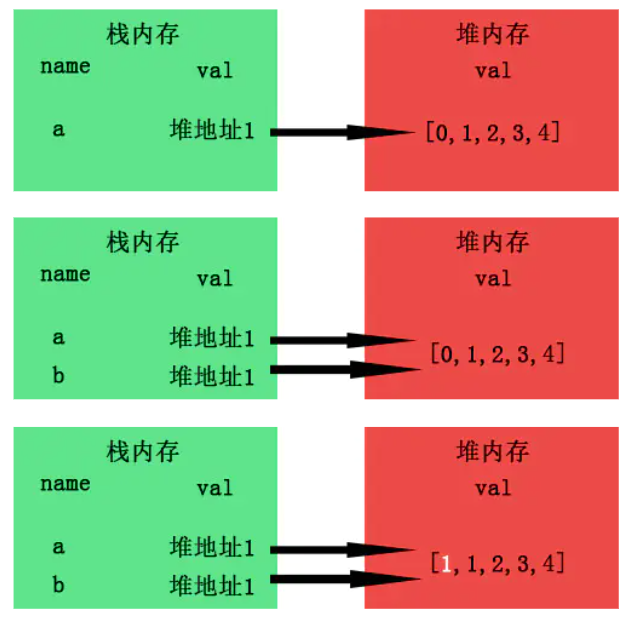
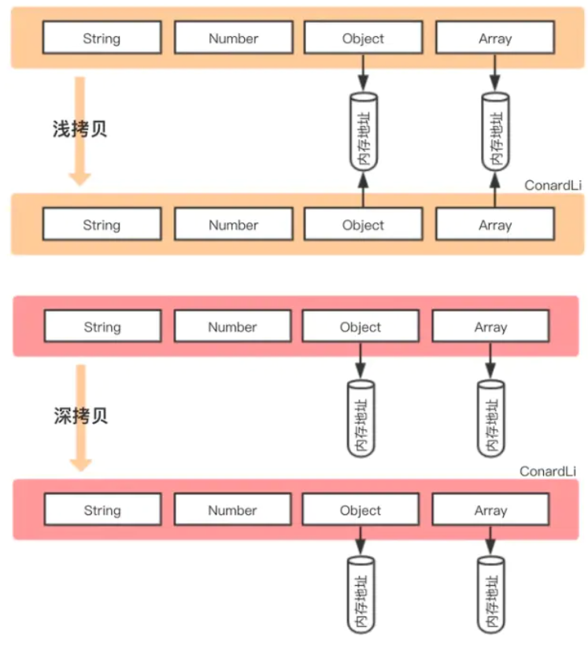

## 前言



##  深拷贝&浅拷贝区别

- **浅拷贝**：仅仅是复制了引用，修改基本数据类型不会影响原有数据的基本数据类型，修改引用数据类型会影响原有的数据类型 **共享内存**
- **深拷贝**：在堆中重新分配内存，不同的地址，相同的值，互不影响 **不共享内存**

借助[ConardLi大佬](https://github.com/ConardLi)以下两张图片，帮我们更好的理解两者的含义：



##  赋值和深/浅拷贝的区别


- 当我们把一个对象赋值给一个新的变量时，**赋的其实是该对象的在栈中的地址，而不是堆中的数据**。也就是两个对象指向的是同一个存储空间，无论哪个对象发生改变，其实都是改变的存储空间的内容，因此，两个对象是联动的。
- 浅拷贝：重新在堆中创建内存，拷贝前后对象的基本数据类型互不影响，但拷贝前后对象的引用类型因共享同一块内存，会相互影响。
- 深拷贝：从堆内存中开辟一个新的区域存放新对象，对对象中的子对象进行递归拷贝,拷贝前后的两个对象互不影响。

## 浅拷贝的实现方式

#### 1.Object.assign()

Object.assign() 方法可以把任意多个的源对象自身的可枚举属性拷贝给目标对象，然后返回目标对象。

```js
let obj1 = { person: {name: "kobe", age: 41},sports:'basketball' };
let obj2 = Object.assign({}, obj1);
obj2.person.name = "wade";
obj2.sports = 'football'
console.log(obj1); // { person: { name: 'wade', age: 41 }, sports: 'basketball' }
```

#### 2.函数库lodash的_.clone方法

该函数库也有提供_.clone用来做 Shallow Copy,后面我们会再介绍利用这个库实现深拷贝。

```
var _ = require('lodash');
var obj1 = {
    a: 1,
    b: { f: { g: 1 } },
    c: [1, 2, 3]
};
var obj2 = _.clone(obj1);
console.log(obj1.b.f === obj2.b.f);// true

```

#### 3.展开运算符...

展开运算符是一个 es6 / es2015特性，它提供了一种非常方便的方式来执行浅拷贝，这与 Object.assign ()的功能相同。

```js
let obj1 = { name: 'Kobe', address:{x:100,y:100}}
let obj2= {... obj1}
obj1.address.x = 200;
obj1.name = 'wade'
console.log('obj2',obj2) // obj2 { name: 'Kobe', address: { x: 200, y: 100 } }

```

#### 4.Array.prototype.concat()

```js
let arr = [1, 3, {
    username: 'kobe'
    }];
let arr2 = arr.concat();    
arr2[2].username = 'wade';
console.log(arr); //[ 1, 3, { username: 'wade' } ]

```

#### 5.Array.prototype.slice()

```js
let arr = [1, 3, {
    username: ' kobe'
    }];
let arr3 = arr.slice();
arr3[2].username = 'wade'
console.log(arr); // [ 1, 3, { username: 'wade' } ]

```

## 深拷贝的实现方式

#### 1.JSON.parse(JSON.stringify())

[原理加深分析](https://gitee.com/cpeng1314/laochenqianduan/blob/master/99-%E7%AC%94%E8%AF%95%E5%92%8C%E9%9D%A2%E8%AF%95%E9%A2%98/02-JavaScript/21-JSON%E7%9A%84stringify%E5%92%8Cparse%E5%AE%9E%E7%8E%B0.md)

```js
let arr = [1, 3, {
    username: ' kobe'
}];
let arr4 = JSON.parse(JSON.stringify(arr));
arr4[2].username = 'duncan'; 
console.log(arr, arr4)

```


这也是利用JSON.stringify将对象转成JSON字符串，再用JSON.parse把字符串解析成对象，一去一来，新的对象产生了，而且对象会开辟新的栈，实现深拷贝。

**这种方法虽然可以实现数组或对象深拷贝,但不能处理函数和正则**，因为这两者基于JSON.stringify和JSON.parse处理后，得到的正则就不再是正则（变为空对象），得到的函数就不再是函数（变为null）了。

比如下面的例子：

```js
let arr = [1, 3, {
    username: ' kobe'
},function(){}];
let arr4 = JSON.parse(JSON.stringify(arr));
arr4[2].username = 'duncan'; 
console.log(arr, arr4)

```


#### 2.函数库lodash的_.cloneDeep方法

该函数库也有提供_.cloneDeep用来做 Deep Copy

```js
var _ = require('lodash');
var obj1 = {
    a: 1,
    b: { f: { g: 1 } },
    c: [1, 2, 3]
};
var obj2 = _.cloneDeep(obj1);
console.log(obj1.b.f === obj2.b.f);// false

```

#### 3.jQuery.extend()方法

jquery 有提供一個`$.extend`可以用来做 Deep Copy

```js
$.extend(deepCopy, target, object1, [objectN])//第一个参数为true,就是深拷贝

var $ = require('jquery');
var obj1 = {
    a: 1,
    b: { f: { g: 1 } },
    c: [1, 2, 3]
};
var obj2 = $.extend(true, {}, obj1);
console.log(obj1.b.f === obj2.b.f); // false

```

#### 4.手写递归方法

递归方法实现深度克隆原理：**遍历对象、数组直到里边都是基本数据类型，然后再去复制，就是深度拷贝**。

有种特殊情况需注意就是对象存在**循环引用**的情况，即对象的属性直接的引用了自身的情况，解决循环引用问题，我们可以额外开辟一个存储空间，来存储当前对象和拷贝对象的对应关系，当需要拷贝当前对象时，先去存储空间中找，有没有拷贝过这个对象，如果有的话直接返回，如果没有的话继续拷贝，这样就巧妙化解的循环引用的问题。关于这块如有疑惑，请仔细阅读`ConardLi大佬`[如何写出一个惊艳面试官的深拷贝?](https://segmentfault.com/a/1190000020255831)这篇文章。

```js
function deepClone(obj, hash = new WeakMap()) {
  if (obj === null) return obj; // 如果是null或者undefined我就不进行拷贝操作
  if (obj instanceof Date) return new Date(obj);
  if (obj instanceof RegExp) return new RegExp(obj);
  // 可能是对象或者普通的值  如果是函数的话是不需要深拷贝
  if (typeof obj !== "object") return obj;
  // 是对象的话就要进行深拷贝
  if (hash.get(obj)) return hash.get(obj);
  let cloneObj = new obj.constructor();
  // 找到的是所属类原型上的constructor,而原型上的 constructor指向的是当前类本身
  hash.set(obj, cloneObj);
  for (let key in obj) {
    if (obj.hasOwnProperty(key)) {
      // 实现一个递归拷贝
      cloneObj[key] = deepClone(obj[key], hash);
    }
  }
  return cloneObj;
}
let obj = { name: 1, address: { x: 100 } };
obj.o = obj; // 对象存在循环引用的情况
let d = deepClone(obj);
obj.address.x = 200;
console.log(d);
```