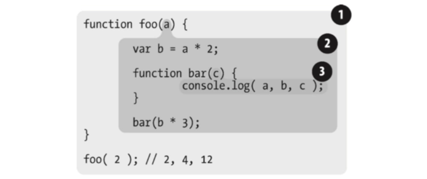
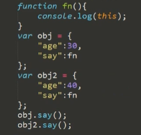

# 基本作用域

Javascript语言的特殊之处，就在于函数内部可以直接读取全局变量。



```js
var n=999;
function f1(){
　　alert(n); 
　　}
f1(); // 999
```


另一方面，在函数外部自然无法读取函数内的局部变量。

```js
　function f1(){
　　　　var n=999;
　　}
　　alert(n); // error
```

这里有一个地方需要注意，函数内部声明变量的时候，一定要使用var命令。如果不用的话，你实际上声明了一个全局变量！

```js
function f1(){
　　　　n=999;
　　}
　　f1();
　　alert(n); // 999
```

# 外部读取局部变量

1. 在函数的内部，再定义一个函数
2. 将内部函数值返回

```js
　function f1(){
　　　　var n=999;
　　　　function f2(){
　　　　　　alert(n); // 999
　　　　}
　　}
```

Javascript语言特有的"链式作用域"结构（chain scope），子对象会一级一级地向上寻找所有父对象的变量。所以，父对象的所有变量，对子对象都是可见的，反之则不成立。

```js
function f1(){
　　　　var n=999;
　　　　function f2(){
　　　　　　alert(n);
　　　　}
　　　　return f2;
　　}
　　var result=f1();
　　result(); // 999
```

# 闭包实际概念

一个函数和对其周围状态（**lexical environment，词法环境**）的引用捆绑在一起（或者说函数被引用包围），这样的组合就是**闭包**（**closure**）。

> 闭包就是能够读取其他函数内部变量的函数。
>
> 由于在Javascript语言中，只有函数内部的子函数才能读取局部变量，因此可以把闭包简单理解成"定义在一个函数内部的函数"。
>
> 所以，在本质上，闭包就是将函数内部和函数外部连接起来的一座桥梁。

闭包可以用在许多地方。它的最大用处有两个，一个是前面提到的可以**读取函数内部的变量**，另一个就是**让这些变量的值始终保持在内存中**。使用闭包十分容易造成浏览器的内存泄露，严重情况下会是浏览器挂死

## 基本例子

```js
function fn(){
    var num=100;
    console.log(num);
    num++
}
fn();//100
fn();//100


function aa(){
    var n =1;//常驻变量 不会被销毁
    return function(){return n++;}
}
var a1=aa(),
var a2=aa();
    console.log(a1());//1 n=2
    console.log(a1());//2 n=3
	console.log(a2());//1 n=2
```

a1、a2中的变量n是独立的，存储在各自的作用域里，互不干涉


## 匿名函数 - IIFE - immediately Invoked Function Expression

匿名函数最大的用途是创建闭包（这是JavaScript语言的特性之一），并且还可以构建命名空间，以减少全局变量的使用

```js
var oEvent = {}; 

(function(){ 
    var addEvent = function(){ /*代码的实现省略了*/ }; 
    function removeEvent(){} 
    oEvent.addEvent = addEvent; 
    oEvent.removeEvent = removeEvent; 
})();
```

在这段代码中函数addEvent和removeEvent都是局部变量，但我们可以通过全局变量oEvent使用它，这就大大减少了全局变量的使用，增强了网页的安全性。

```js
oEvent.addEvent(document.getElementById('box') , 'click' , function(){});
var rainman = (function(x , y){ 
return x + y; 
})(2 , 3); 
/** 
* 也可以写成下面的形式，因为第一个括号只是帮助我们阅读，但是不推荐使用下面这种书写格式。 
* var rainman = function(x , y){ 
* return x + y; 
* }(2 , 3);
**/
```

## 闭包中的匿名函数

下面的情况是很熟悉的

```js
"use strict";
var a=[];
for(var i=0;i<10;i++){
        a[i]=function(){
            return i;
        }
}
console.log(a[0]());
console.log(a[1]());
console.log(a[2]());
```

如果使用闭包能改变吗？

```js
"use strict";
var a=[];
for(var i=0;i<10;i++){
    (function(){
        a[i]=function(){
            return i;
        }
    })()
}
console.log(a[0]());//10
console.log(a[1]());//10
console.log(a[2]());//10
```

实际上闭包是不能的，一定注意先循环后面函数被call时候，函数才被运行，实际解决办法

```js
"use strict";
var a=[];
for(var i=0;i<10;i++){
    console.log(i);
        a[i]=(function(){
            console.log(i);
            return i;
        })();

}

//或者
"use strict";
var a=[];
for(var i=0;i<10;i++){
    (function(){
        var y=i;//只有这样下层return才能知道i是多少
        a[i]=function(){
            return y;
        }
    })()
}
console.log(a[0]());
console.log(a[1]());
console.log(a[2]());

//实际上面的写法 按照匿名函数，最好的写法是：
"use strict";
var a=[];
for(var i=0;i<10;i++){
    (function(y){
        console.log("this is y : "+y);
        a[y]=function(){
            return y;
        }
    })(i)
}
```


## 实际应用中经典例子

```js
/** 
* <body> 
* <ul> 
* <li>one</li> 
* <li>two</li> 
* <li>three</li> 
* <li>one</li> 
* </ul> 
*/
var lists = document.getElementsByTagName('li'); 
for(var i = 0 , len = lists.length ; i < len ; i++){ 
    lists[ i ].onmouseover = function(){ 
    	alert(i); 
    }; 
}
```

当mouseover事件调用监听函数时，首先在匿名函数（ function(){ alert(i); }）内部查找是否定义了 i，结果是没有定义；因此它会向上查找，查找结果是已经定义了，并且i的值是4（循环后的i值）；所以，最终每次弹出的都是4。

解决方法一：

```javascript
var lists = document.getElementsByTagName('li'); 
for(var i = 0 , len = lists.length ; i < len ; i++){     
    (function(index){         
        lists[ index ].onmouseover = function(){             
            alert(index);         
        };     
    })(i); //这是一种自执行函数的格式，前一个括号是匿名函数，解析器执行后返回一个函数对象然后调用后面一个括号(i)，所以后面一个括号就是函数参数}
```

解决办法二：

```js
function eventListener(list, index){ 
    list.onmouseover = function(){ 
    	alert(index); 
    }; 
} 
var lists = document.getElementsByTagName('li'); 
for(var i = 0 , len = lists.length ; i < len ; i++){ 
eventListener(lists[ i ] , i); 
}
```

# 自测

注意构造函数中的this，主要看是哪个obj调用这个function



```js
　　var name = "The Window";
　　var object = {
　　　　name : "My Object",
　　　　getNameFunc : function(){
　　　　　　return function(){
　　　　　　　　return this.name;
　　　　　　};
　　　　}
　　};
　　alert(object.getNameFunc()());
```

```js
　var name = "The Window";
　　var object = {
　　　　name : "My Object",
　　　　getNameFunc : function(){
　　　　　　var that = this;
　　　　　　return function(){
　　　　　　　　return that.name;
　　　　　　};
　　　　}
　　};
　　alert(object.getNameFunc()());
```


Reference：

https://developer.mozilla.org/zh-CN/docs/Web/JavaScript/Closures

http://www.ruanyifeng.com/blog/2009/08/learning_javascript_closures.html