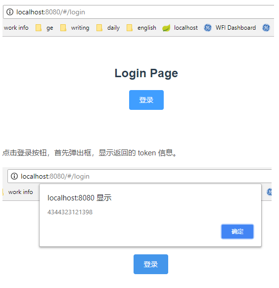

**这里主要是练习中的记录 不全**

**注意  下面的前提是axios Mock都已经设置好了**

## 安装JS_cookie插件

**[JS_cookie](https://www.npmjs.com/package/js-cookie)**

axios.js 中，会用到 Cookie 获取 token，所以需要把相关依赖安装一下。

执行以下命令，安装依赖包。

```sh
yarn add js-cookie
```

```sh
npm i js-cookie
```

## Vue 中引入使用

### 引入插件

在 main.js 中以 vue 插件的形式引入 axios，这样在其他地方就可通过 this.$api 调用相关的接口了。

```js
// main.js
import api from './http/index'
Vue.use(api)
```

### 编写接口

```js
//interface.js
export const login = () => {
    return axios({
        url: '/login',
        method: 'get'
    })
}
```

### 组件中调用接口

在登录界面 Login.vue 中，添加一个登录按钮，点击处理函数通过 axios 调用 login 接口返回数据。

成功返回之后，将 token 放入 Cookie 并跳转到主页。

```vue
<template>
  <div class="page">
    <h2>Login Page</h2>
    <el-button type="primary" @click="login()">登录</el-button>
  </div>
</template>

<script>
  import mock from '@/mock/mock.js';
  import Cookies from "js-cookie";//在组件中引入 
  import router from '@/router'
  export default {
    name: 'Login',
    methods: {
      login() {
        this.$api.login().then(function(res) {
　　　　　　　alert(res.data.token)
            Cookies.set('token', res.data.token) // 放置token到Cookie 
            router.push('/')  // 登录成功，跳转到主页
          }).catch(function(res) {
            alert(res);
          });
          
      }
    }
  }
</script>
```

### mock接口

```js
//mock.js

//前面的link可以不写
Mock.mock('http://localhost:8080/login',{
    data:{
        'token':'123159753456789'
        //其他数据
    }
})
```

## 成功结果



## JS_cookie的基本使用

### 1. 存到Cookie去

```javascript
// Create a cookie, valid across the entire site:
Cookies.set('name', 'value');

// Create a cookie that expires 7 days from now, valid across the entire site:
Cookies.set('name', 'value', { expires: 7 });

// Create an expiring cookie, valid to the path of the current page:
Cookies.set('name', 'value', { expires: 7, path: '' });
```

### 2.在Cookie中取出

```javascript
// Read cookie:
Cookies.get('name'); // => 'value'
Cookies.get('nothing'); // => undefined

// Read all visible cookies:
Cookies.get(); // => { name: 'value' }
```

### 3.删除

```javascript
// Delete cookie:
Cookies.remove('name');

// Delete a cookie valid to the path of the current page:
Cookies.set('name', 'value', { path: '' });
Cookies.remove('name'); // fail!
Cookies.remove('name', { path: '' }); // removed!
```

### 从Cookie中取出的时候，要从字符串转换成json格式

```javascript
const user = {
  name: 'lia',
  age: 18
}
Cookies.set('user', user)
const liaUser = JSON.parse(Cookies.get('user'))
```