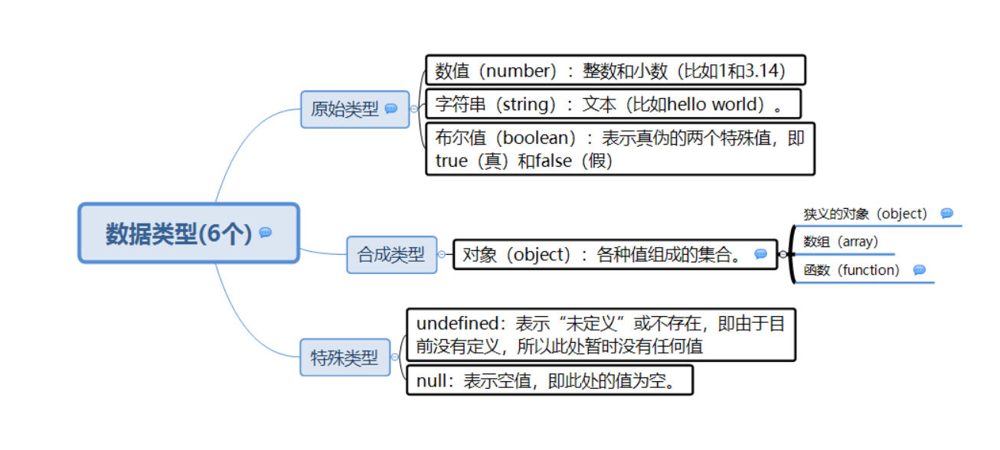
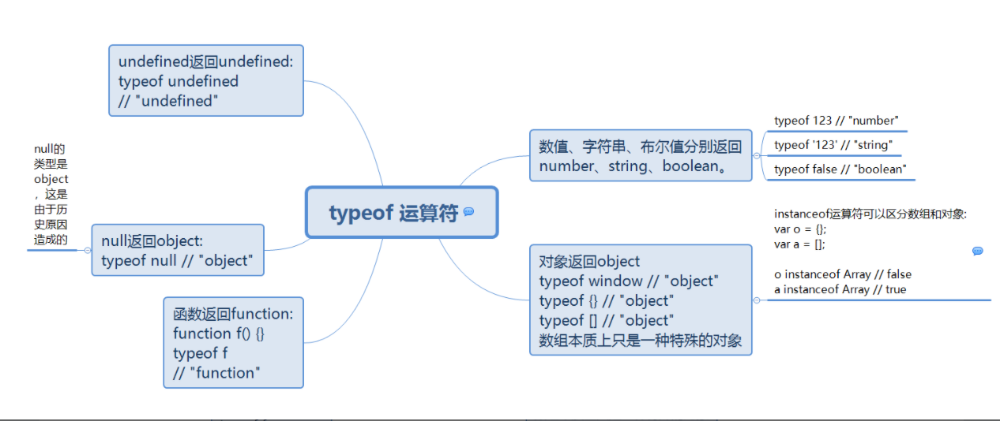

# JavaScript 数据类型

包含值的数据类型：

- 字符串（string）
- 数字（number）
- 布尔（boolean）
- 对象（object）
- 函数（function）

有三种对象类型：

- 对象（Object）
- 日期（Date）
- 数组（Array）

同时有两种不能包含值的数据类型：

- null

- undefined

  




## 原始值( primitive values )

除 Object 以外的所有类型都是不可变的（值本身无法被改变。类似于：字符串（String）、数字(Number)、布尔(Boolean)、对空（Null）、未定义（Undefined）、Symbol。

原始值明显的特征是不可更改，任何方法都无法更改一个原始值

```js
var s= 'hello';
s.toUpperCase();
console.log(s);//'hello'
```

## 复杂值（**引用数据类型**）

复杂值可以由很多不同类型的javascript对象组成。复杂对象其在内存中的大小是未知的，因为复杂对象可以包含任何值，而不是一个特定的已知值。比如：对象(Object)、数组(Array)、函数(Function)。

对象和原始值不同，它们是可变的，它们的值是可修改的

```js
var o = {x:1};
o.x = 2;
o.y = 3;
```

## 储存方式

### 栈存储

　　因为原始值占据空间固定，是简单的数据段，为了便于提升变量查询速度，将其存储在栈(stack)中

### 堆存储

　　由于复杂值的大小会改变，所以不能将其存放在栈中，否则会降低变量查询速度，因此其存储在堆(heap)中，存储在变量处的值是一个指针，指向存储对象的内存处


## 访问方式

### 按值访问

　　原始值是作为不可细化的值进行存储和操作的，引用它们会转移其值

```js
var myString = 'foo';
var myStringCopy = myString;
var myString = null;
console.log(myString,myStringCopy);//null,'foo'
```

### 引用访问

　　复杂值是通过引用进行存储和操作的，而不是实际的值。创建一个包含复杂对象的变量时，其值是内存中的一个引用地址。引用一个复杂对象时，使用它的名称(即变量或对象属性)通过内存中的引用地址获取该对象值

```js
var myObject = {};
var copyOfMyObject = myObject;//没有复制值，而是复制了引用
myObject.foo = 'bar';//操作myObject中的值
//现在如果输出myObject和copyOfMyObject，则都会输出foo属性，因为它们引用的是同一个对象
console.log(myObject,copyOfMyObject);//Object{foo="bar"}
```

### js函数的call by value & call by reference 详细讲解

#### **[js的数值类型：基本类型和引用类型](https://www.w3school.com.cn/js/pro_js_value.asp)**

**js一共有六大数据类型。number string boolean object null underfind**

 基本类型存放在栈区，访问是**按值访问**的，就是说你可以操作保存在变量中的实际的值。

**引用类型指的是对象：js中的array和object**。可以拥有属性和方法，并且我们可以修改其属性和方法。引用对象存放的方式是：在栈中存放变量名（该变量的值是堆中真实数据的指针（对象在堆中的存放地址）），在堆中存放数据（真正的数据）。

对象使用的是**引用赋值**。当我们把一个对象赋值给一个新的变量时，赋的其实是该对象的在堆中的地址，而不是堆中的数据。也就是两个对象指向的是同一个存储空间，无论哪个对象发生改变，其实都是改变的存储空间的内容.


|                    | call by value                                      | call by reference/sharing                                 |
| ------------------ | -------------------------------------------------- | --------------------------------------------------------- |
| 数据               | number string boolean object null underfind        | array  object                                             |
| 存放地址           | 栈                                                 | 栈中地址，堆中数据                                        |
| copy value         | 没有关系 互不影响                                  | 指向同一个存储空间，一个变，都会变( 两者联动)             |
| 函数传值(访问类型) | 不改变原值<br />所有函数的参数都**是按值来传递**的 | 按引用访问 传地址<br />所有函数的参数都**是按值来传递**的 |
| 函数内赋值/复制    | 按值复制                                           | 按值复制（指针，也是值）                                  |
|                    |                                                    |                                                           |

  call by value

```js
function add(num){
    num+=1;
    return num;
}
var n=3;
var m=add(n);
alert(n);//3
alert(m);//4
```

call by reference/sharing：

```js
var obj1 = {  value:'111' };
 
var obj2 = {  value:'222' };
 
function changeStuff(obj){
  obj.value = '333';
  obj = obj2;
  return obj.value;
}
 
var foo = changeStuff(obj1);
 
console.log(foo);// '222' 参数obj指向了新的对象obj2
console.log(obj1.value);//'333'
```

所以

```js
function changeStuff(a, b, c)
{
  a = a * 10;
  b.item = "changed";
  c = {item: "changed"};
}

var num = 10;
var obj1 = {item: "unchanged"};
var obj2 = {item: "unchanged"};

changeStuff(num, obj1, obj2);

console.log(num); //10
console.log(obj1.item);//change
console.log(obj2.item);//unchange
```

> But the item that is passed by value is *itself* a reference. Technically, this is called [call-by-sharing](http://en.wikipedia.org/wiki/Evaluation_strategy#Call_by_sharing).
>
> In practical terms, this means that if you change the parameter itself (as with `num` and `obj2`), that won't affect the item that was fed into the parameter. But if you change the **INTERNALS** of the parameter, that will propagate back up (as with `obj1`).

# 详细数据类型

## undefined

当声明的变量未初始化时，该变量的**默认值是undefined.** (null 的出现意味着是被操作者赋值的，而不是js赋值的)

会出现场景

- 已声明未赋值的变量
- 获取对象不存在的属性
- 无返回值的函数的执行结果
- 函数的参数没有传入
- void(expression)

## null

它表示一个特殊值，常用来描述"空值"

null是空对象指针，而[]是空数组，{}是空对象，三者不相同

> null表示"空值"，undefined表示"未定义"。两者往往可以互换。判断相等运算符==认为两者是相等的


## null 和undefined 区别

|        | null                | undefined                   |
| ------ | ------------------- | --------------------------- |
| 相同点 | if语句中为false     | if语句中为false             |
| 区别   | number（null）= 0   | number(undefined) = NaN     |
|        | 作为argument，error | 作为argument，返回undefined |

## NaN

判断一个值是否是NaN 等号运算符（== 和 ===） 不能被用来判断一个值是否是 NaN。必须使用 **Number.isNaN() 或 isNaN()** 函数.**只有 NaN 能够实现不全等与自己**

```js
 var a = NaN;
a!==a;//true

 var a = 1;
a!==a;//false
```


## Boolean

用Boolean()转型函数，转换成false的值称为假值(falsy value)，这7个值包括undefined、null、+0、-0、NaN、false、""(空字符串)

> 空字符串""转换为false，而空白字符串" "转换为true

## Number

isFinite()来确定一个数值是不是有穷的

isNaN()来判断这个数字是不是NaN、

把非数值转换成数值：Number()、parseInt()和parseFloat()

Number()解析字符串时会识别出字符串的前置空格并去掉

parseInt()专门用于把字符串转换成整数。在转换字符串时，会忽略字符串前面的空格，直到找到第一个非空格字符。如果第一个字符不是数字字符或者负号，parseInt()就会返回NaN。（接受进制）

parseFloat()专门用于字符串转换浮点数。同样地，解析时会忽略字符串前面的空格，直到找到第一个非空格字符，然后一直解析到字符串末尾或一个无效的浮点数字字符为止

> valueOf()方法返回对象的数字字面量
>
> toString()方法将数字转换为字符串
>
> toLocalString()方法将数字转换为本地惯例格式化数字的字符串
>
> toFixed()方法按照指定的小数位返回数值四舍五入后的字符串表示(常用于处理货币值)
>
> toExponential()方法返回数值四舍五入后的指数表示法(e表示法)的字符串表示，参数表示转换后的小数位数

Number.toFixed(n) // 保留n位小数，为0则只保留整数
		Number.round() // 返回最接近的整数（相当于四舍五入）
		Number.floor() // 向小取整

## Math

### 常量

```js
Math.E             自然对数的底数，即常量e的值(约等于2.71828)
Math.LN2           2的自然对数(约等于0.693)
Math.LN10          10的自然对数(约等于2.303)
Math.LOG2E         以2为底e的对数(约等于1.443)
Math.LOG10E        以10为底e的对数(约等于0.434)
Math.PI            派的值(约等于3.14)
Math.SQRT2         2的平方根(约等于1.414)
Math.SQRT1_2       1/2的平方根，即2的平方根的倒数(约等于0.707)
```

### 数学函数

| 方法             | 描述                                                     |
| :--------------- | :------------------------------------------------------- |
| abs(x)           | 返回 x 的绝对值                                          |
| acos(x)          | 返回 x 的反余弦值，以弧度计                              |
| asin(x)          | 返回 x 的反正弦值，以弧度计                              |
| atan(x)          | 以介于 -PI/2 与 PI/2 弧度之间的数值来返回 x 的反正切值。 |
| atan2(y,x)       | 返回从 x 轴到点 (x,y) 的角度                             |
| ceil(x)          | 对 x 进行上舍入                                          |
| cos(x)           | 返回 x 的余弦                                            |
| exp(x)           | 返回 Ex 的值                                             |
| floor(x)         | 对 x 进行下舍入                                          |
| log(x)           | 返回 x 的自然对数（底为e）                               |
| max(x,y,z,...,n) | 返回最高值                                               |
| min(x,y,z,...,n) | 返回最低值                                               |
| pow(x,y)         | 返回 x 的 y 次幂                                         |
| random()         | 返回 0 ~ 1 之间的随机数                                  |
| round(x)         | 把 x 四舍五入为最接近的整数                              |
| sin(x)           | 返回 x（x 以角度计）的正弦                               |
| sqrt(x)          | 返回 x 的平方根                                          |
| tan(x)           | 返回角的正切                                             |


## 运算符

[类型对比table](https://dorey.github.io/JavaScript-Equality-Table/)

| 运算符 | 描述                 | 比较      | 返回  |
| :----- | :------------------- | :-------- | :---- |
| ==     | 等于                 | x == 8    | false |
|        |                      | x == 5    | true  |
|        |                      | x == "5"  | true  |
| ===    | 值相等并且类型相等   | x === 5   | true  |
|        |                      | x === "5" | false |
| !=     | 不相等               | x != 8    | true  |
| !==    | 值不相等或类型不相等 | x !== 5   | false |
|        |                      | x !== "5" | true  |
|        |                      | x !== 8   | true  |
| >      | 大于                 | x > 8     | false |
| <      | 小于                 | x < 8     | true  |
| >=     | 大于或等于           | x >= 8    | false |
| <=     | 小于或等于           | x <= 8    | true  |

> Javascript有两组相等运算符，一组是==和!=，另一组是===和!==。前者只比较值的相等，后者除了值以外，还比较类型是否相同。
>
> 请尽量不要使用前一组，永远只使用===和!==。因为==默认会进行类型转换，规则十分难记。如果你不相信的话，请回答下面五个判断式的值是true还是false：
>
> 　　false == 'false'
>
> 　　false == undefined
>
> 　　false == null
>
> 　　null == undefined
>
> 　　0 == ''
>
> 前三个是false，后两个是true。

## String


| 原始值           | 转换为数字 | 转换为字符串      | 转换为逻辑 |
| :--------------- | :--------- | :---------------- | :--------- |
| false            | 0          | "false"           | false      |
| true             | 1          | "true"            | true       |
| 0                | 0          | "0"               | false      |
| 1                | 1          | "1"               | true       |
| "0"              | 0          | "0"               | **true**   |
| "000"            | 0          | "000"             | **true**   |
| "1"              | 1          | "1"               | true       |
| NaN              | NaN        | "NaN"             | false      |
| Infinity         | Infinity   | "Infinity"        | true       |
| -Infinity        | -Infinity  | "-Infinity"       | true       |
| ""               | **0**      | ""                | **false**  |
| "20"             | 20         | "20"              | true       |
| "twenty"         | NaN        | "twenty"          | true       |
| [ ]              | **0**      | ""                | true       |
| [20]             | **20**     | "20"              | true       |
| [10,20]          | NaN        | "10,20"           | true       |
| ["twenty"]       | NaN        | "twenty"          | true       |
| ["ten","twenty"] | NaN        | "ten,twenty"      | true       |
| function(){}     | NaN        | "function(){}"    | true       |
| { }              | NaN        | "[object Object]" | true       |
| null             | **0**      | "null"            | false      |
| undefined        | NaN        | "undefined"       | false      |


## 确定对象类型

JavaScript 有三种方法，可以确定一个值到底是什么类型。

- `typeof`运算符
- `instanceof`运算符
- `Object.prototype.toString`方法



# JavaScript 对象 实例

[例子总结1](https://www.runoob.com/js/js-ex-objects.html)

# reference:

1. https://segmentfault.com/a/1190000014658470