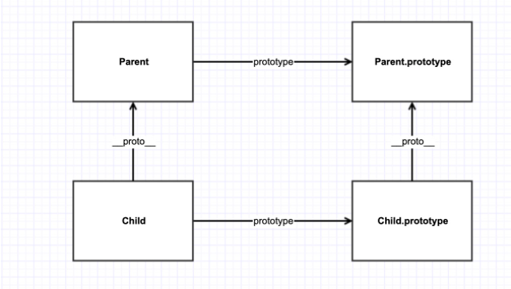

由于基本都有了之前的原型链继承等6种集成方法的了解，所以我们直接就上图 方便下面的理解



## 基本声明

```js
// 匿名类
let Example = class {
    constructor(a) {
        this.a = a;
    }
     sayName(){
        console.log(this.a)
     }
}
// 命名类
let Example = class Example {
    constructor(a) {
        this.a = a;
    }
     sayName(){
        console.log(this.a)
     }
}

class Example {
    constructor(a) {
        this.a = a;
    }
     sayName(){
        console.log(this.a)
     }
}
```

> 类声明和函数声明的区别和特点：
>
> 1. 函数声明可以被提升，类声明不能提升（与 `let` 声明类似）
> 2. 类声明中的代码自动强行运行在 **严格模式** 下
> 3. 只能通过 `new` 关键字来声明类，声明类会调用类的构造函数
> 4. 每个类都有一个 `[[construct]]` 的方法，该方法就是构造函数
> 5. 类的所有方法都定义在类的 `prototype` 属性上
> 6. 类中的方法无需添加 `function` 关键字，只需直接添加到类中
> 7. 方法间不需要添加逗号（`,`），加了会报错
> 8. 类中的所有方法都是 **不可枚举的**（Non-Enumerable），而自定义类型中，可以通过 `Object.definedProperty()` 手工指定不可枚举属性
> 9. 在类的实例上调用方法，实质上就是调用原型上的方法
> 10. 不能在类中修改类名
> 11. `name` 属性总是返回紧跟 `class` 的关键字后的类名
> 12. `this` 的指向默认指向 **类的实例**

## 运行环境的指向

类的方法内部如果含有 `this`，它默认指向 **类的实例**。

但是，如果将类方法内部的方法提取出来单独使用，`this` 会指向该方法 **运行时所在的环境**，因为找不到相对应的方法而导致报错。

因此，需要 **在构造函数中绑定 `this`** ，这样就不会找不到相对应的方法。

```js
class Student {
  constructor() {
    this.sayName = this.sayName.bind(this);
  }
}
```

另一种解决方法是使用 **箭头函数**。

```js
class Car {
  constructor() {
    this.sayName = (name = 'BOT') => {
      this.sayName(`My name is ${name}`);
    };
  }
}
```

还有一种解决方法是使用 `Proxy` ，获取方法的时候，自动绑定 `this`。

## class 属性 

### prototype

```js
//定义方法
Example.prototype={
    //methods
}

//添加方法
Object.assign(Example.prototype,{
    //methods
})
```

### 静态属性

ES6 中规定，Class 内部只有静态方法，没有静态属性。

```js
class Example {
// 新提案
    static a = 2;
}
// 目前可行写法
Example.b = 2;
```

### 公共属性

```js
class Example{}
Example.prototype.a = 2;

```

### 实例属性

```js
class Example {
    a = 2;
    constructor () {
        console.log(this.a);
    }
}
```

### name 属性

返回跟在 class 后的类名(存在时)。

```js
let Example=class Exam {
    constructor(a) {
        this.a = a;
    }
}
console.log(Example.name); // Exam
 
let Example=class {
    constructor(a) {
        this.a = a;
    }
}
console.log(Example.name); // Example
```

## 方法

### constructor

```js
class Example{
    constructor(){
      console.log('我是constructor');
    }
}
new Example(); // 我是constructor
```

### 返回对象

```js
class Test {
    constructor(){
        // 默认返回实例对象 this
    }
}
console.log(new Test() instanceof Test); // true
 
class Example {
    constructor(){
        // 指定返回对象
        return new Test();
    }
}
console.log(new Example() instanceof Example); // false
```

### 静态方法
```js
class Example{    
	static sum(a, b) {        
		console.log(a+b);    
	} 
} 
Example.sum(1, 2); // 3
```
### 原型方法
```js
class Example {    
	sum(a, b) {        
		console.log(a + b);    
		} 
	} 
let exam = new Example(); 
exam.sum(1, 2); // 3
```

### 实例方法
```js
class Example {    
	constructor() {        
		this.sum = (a, b) => {            
			console.log(a + b);        
		}    
	} 
}
```

### 属性表达式

类的属性名，可以采用表达式。

```js
const methodName = 'getArea'

class Square(){
  constructor(length){
    // ...
  }
  [methodName](){
    // ...
  }
}
```

### 生成器方法

如果某个方法之前加上星号（`*`），就表示该方法是一个生成器方法（Generator 函数）。

```js
class Foo {
  constructor(...args) {
    this.args = args;
  }
  *[Symbol.iterator]() {
    for (let arg of this.args) {
      yield arg;
    }
  }
}

for (let x of new Foo('hello', 'world')) {
  console.log(x);
}
// hello
// world
```

## 类的实例化

### new

class 的实例化必须通过 new 关键字。

 ```js
class Example {}
 
let exam1 = Example(); 
// Class constructor Example cannot be invoked without 'new'
 ```

### 实例化对象

共享原型对象

 ```js
class Example {
    constructor(a, b) {
        this.a = a;
        this.b = b;
        console.log('Example');
    }
    sum() {
        return this.a + this.b;
    }
}
let exam1 = new Example(2, 1);
let exam2 = new Example(3, 1);
console.log(exam1._proto_ == exam2._proto_); // true
 
exam1._proto_.sub = function() {
    return this.a - this.b;
}
console.log(exam1.sub()); // 1
console.log(exam2.sub()); // 2
 ```

## decorator（这里的例子照的不好 可以暂时跳过） 

decorator 是一个函数，用来修改类的行为，在代码编译时产生作用。

### 类修饰

#### 一个参数

第一个参数 target，指向类本身。

 ```js
function testable(target) {
    target.isTestable = true;
}
@testable
class Example {}
Example.isTestable; // true
 ```

#### 多个参数——嵌套实现

```js
function testable(isTestable) {
    return function(target) {
        target.isTestable=isTestable;
    }
}
@testable(true)
class Example {}
Example.isTestable; // true
```

#### 实例属性

上面两个例子添加的是静态属性，若要添加实例属性，在类的 prototype 上操作即可。

```js
function testable(isTestable) {
    return function(target) {
        target.isTestable=isTestable;
    }
}
@testable(true)
class Example {}
Example.isTestable; // true
```

### 方法修饰

3个参数：target（类的原型对象）、name（修饰的属性名）、descriptor（该属性的描述对象）。

 ```js
class Example {
    @writable
    sum(a, b) {
        return a + b;
    }
}
function writable(target, name, descriptor) {
    descriptor.writable = false;
    return descriptor; // 必须返回
}
 ```

修饰器执行顺序

由外向内进入，由内向外执行。

```js
class Example {
    @logMethod(1)
    @logMethod(2)
    sum(a, b){
        return a + b;
    }
}
function logMethod(id) {
    console.log('evaluated logMethod'+id);
    return (target, name, desctiptor) => console.log('excuted         logMethod '+id);
}
// evaluated logMethod 1
// evaluated logMethod 2
// excuted logMethod 2
// excuted logMethod 1
```

## 封装与继承

### 访问父类

通过 `Object.getPrototypeOf()` 方法可以用来从子类上获取父类。

```js
Object.getPrototypeOf(Child) === Parent;
```

因此，可以通过此方法判断，一个类是否继承了另一个类。

### getter / setter

getter 与 setter 必须**同级**出现, 不可以单独出现

```js
class Example1{
    constructor(a, b) {
        this.a = a;
        this.b = b;
    }
    get a(){
        console.log('getter');
        return this._a;//注意这里
    }
    set a(a){
        console.log('setter');
        this._a = a;//注意这里 如果用this.a=a 这里会出现自身递归不断被调用 最终导致 RangeError
    }
}
let exam1 = new Example1(1,2); // 只输出 setter , 不会调用 getter 方法
console.log(exam1._a); // 1, 可以直接访问
```

### extends

通过 extends 实现类的继承。

```js
class Child extends Father { ... }
```

### super

子类 constructor 方法中必须有 super ，且必须出现在 this 之前，调用父类构造函数,只能出现在子类的构造函数。

```js
class Father {
    constructor() {}
}
class Child extends Father {
    //constructor() {}
    // or 
     constructor(a) {
    	super();//必须在构造函数 
         this.a = a;
        // super(); 这里不能放在后面~~~~
     }
}

```

虽 `super` 代表了父类 `Parent` 的 **构造函数**，但是返回的是子类 `Child` 的实例，即 `super` 内部的 `this` 指的是 `Child`，因此 `super()` 在这里相当于：

```js
Parent.prototype.constructor.call(this);
```

当 `super` 作为对象时：

- 在子类的普通方法
  - `super` 指向 **父类的原型对象** `Parent.prototype`
  - 通过 `super` 调用父类的方法时，方法内部的 `this` 指向当前的 **子类实例**
- 在子类的静态方法
  - `super` 指向 **父类**，而不是父类的原型对象
  - 通过 `super` 调用父类的方法时，方法内部的 `this` 指向当前 **子类**，而不是子类的实例

```js
class Father {
    test(){
        return 0;
    }
    static test1(){
        return 1;
    }
}
class Child2 extends Father {
    constructor(){
        super();
        // 调用父类普通方法
        console.log(super.test()); // 0
    }
    static test3(){
        // 调用父类静态方法
        return super.test1+2;
    }
}
Child2.test3(); // 3
```

这里更多细节就不写了 因为我觉得基本够了 这里有部分参考资料来源[这里](https://tsejx.github.io/javascript-guidebook/object-oriented-programming/class-definitions/class-extends#%E5%86%85%E7%BD%AE%E5%AF%B9%E8%B1%A1%E7%9A%84%E7%BB%A7%E6%89%BF)。

## Reference

[ECMAScript 6 入门](https://es6.ruanyifeng.com/) 