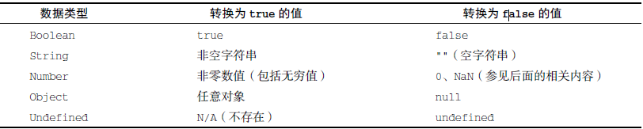
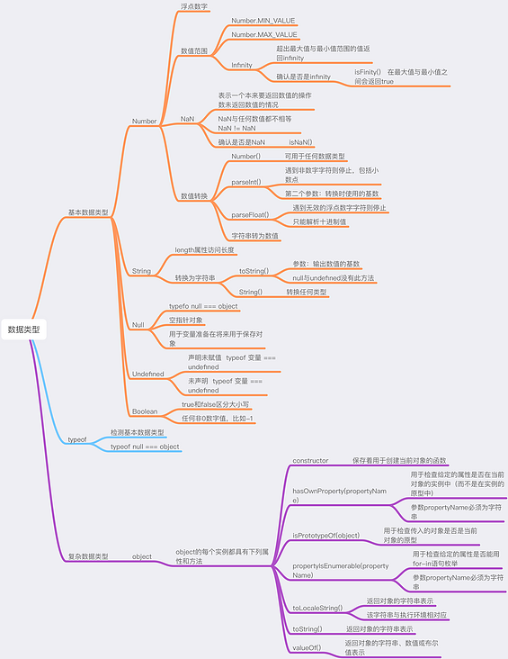
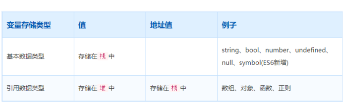
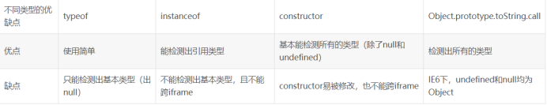

# JS 类型（以下均为书本内容摘选）

ECMAScript 有6 种简单数据类型（也称为原始类型）：Undefined、Null、Boolean、Number、String 和Symbol。还有一种复杂数据类型叫Object（对象）。Object 是一种无序名值对的集合

## 判断数据类型-  typeof 操作符（不是函数）

### "undefined"表示值未定义
1. 目的：明确空对象指针（null）和未初始化变量的区别

2. 无论是声明还是未声明，typeof 返回的都是字符串"undefined",但是本身的值操作会有一个undefined 与 referenceError

3. undefined 可认为false 反为true
```js
let message; // 这个变量被声明了，只是值为undefined
	// age 没有声明
if (message) {
	// 这个块不会执行
}
if (!message) {
	// 这个块会执行
}
if (age) {
	// 这里会报错
}
```

### "null"类型返回 "obj"

1. Null 类型同样只有一个值，即特殊值null。逻辑上讲，null 值表示一个空对象指针，这也是给
   typeof 传一个null 会返回"object"的原因

2. **在定义将来要保存对象值的变量时，建议使用null 来初始化，不要使用其他值**

3. null 为假值/false

```js
   let message = null;
   let age;
   if (message) {
   	// 这个块不会执行
   }
   if (!message) {
   	// 这个块会执行
   }
   if (age) {
   	// 这个块不会执行
   }
   if (!age) {
   	// 这个块会执行
   }
   
```

#### `null` 和 `undefined` 的区别

- `null`：js 的关键字，是一个特殊的对象值，表示`空值`，typeof运算是`object`
- `undefined`：预定义的全局变量，表示`未定义`，用typeof运算是`undefined`

###  "boolean"表示值为布尔值

1. 布尔值字面量true 和false 是区分大小写的，因此True 和False(及其他大小混写形式),是有效的标识符，但不是布尔值。

2. 布尔值 不等于 数值
```js
   false == 0 //true
   false === 0 //false
```
3. true false 转换

   
   
   
   
### "number"表示值为数值；

#### float 
数值中必须包含小数点，而且小数点后面必须至少有一个数字

由于精确度（17位小数）的问题，不要测试某个特定的浮点值。

```js
if (a + b == 0.3) { // 别这么干！
console.log("You got 0.3.");
}
```
#### 值的范围
使用Number.NEGATIVE_INFINITY 和Number.POSITIVE_INFINITY 也可以获取正、负Infinity。没错，这两个属性包含的值分别就是-Infinity 和Infinity。

#### NaN
返回数值的操作失败了（而不是抛出错误）

1. 计算出现NaN
```js
 //0、+0 或-0 相除会返回NaN：
   console.log(0/0); // NaN
   console.log(-0/+0); // NaN
 // 如果分子是非0 值，分母是有符号0 或无符号0，则会返回Infinity 或-Infinity：
   console.log(5/0); // Infinity
   console.log(5/-0); // -Infinity
 // isNaN() 任何不能转换为数值的值都会导致这个函数返回true
    console.log(isNaN(NaN)); // true
    console.log(isNaN(10)); // false，10 是数值
    console.log(isNaN("10")); // false，可以转换为数值10
    console.log(isNaN("blue")); // true，不可以转换为数值
    console.log(isNaN(true)); // false，可以转换为数值1
```
#### 数值转换

>  Number()、parseInt()和parseFloat()
>

Number()函数

- 布尔值，true 转换为1，false 转换为0。
- 数值，直接返回。
- null，返回0。
- undefined，返回NaN。
- 字符串，应用以下规则。
  - 如果字符串包含数值字符，包括数值字符前面带加、减号的情况，则转换为一个十进制数值。因此，Number("1")返回1，Number("123")返回123，Number("011")返回11（忽略前面的零）。
  - 如果字符串包含有效的浮点值格式如"1.1"，则会转换为相应的浮点值（同样，忽略前面的零）。
  - 如果字符串包含有效的十六进制格式如"0xf"，则会转换为与该十六进制值对应的十进制整
    数值。
  - 如果是空字符串（不包含字符），则返回0。
  - 如果字符串包含除上述情况之外的其他字符，则返回NaN。
- 对象，调用valueOf()方法，并按照上述规则转换返回的值。如果转换结果是NaN，则调用toString()方法，再按照转换字符串的规则转换。

parseInt()函数更专注于字符串是否包含数值模式,返回整数

```js
let num1 = parseInt("1234blue"); // 1234
let num2 = parseInt(""); // NaN
let num3 = parseInt("0xA"); // 10，解释为十六进制整数
let num4 = parseInt(22.5); // 22
let num5 = parseInt("70"); // 70，解释为十进制值
let num6 = parseInt("0xf"); // 15，解释为十六进制整数

//判断是否为整数
parseInt(x, 10) === x ? ture: false;
```

parseFloat()

```js
let num1 = parseFloat("1234blue"); // 1234，按整数解析
let num2 = parseFloat("0xA"); // 0
let num3 = parseFloat("22.5"); // 22.5
let num4 = parseFloat("22.34.5"); // 22.34
let num5 = parseFloat("0908.5"); // 908.5
let num6 = parseFloat("3.125e7"); // 31250000
```

### "string"表示值为字符串；

1. 字符串可以使用双引号（"）、单引号（'）或反引号（`）标示

2. 转换为字符串 toString()、null 和undefined 值没有toString()方法,其他都有
   
   > **String 对象自带方法**
   >
   > - 字符操作：charAt，charCodeAt，fromCharCode
   > - 字符串提取：substr，substring ，slice
   > - 位置索引：indexOf ，lastIndexOf
   > - 大小写转换：toLowerCase，toUpperCase
   > - 模式匹配：match，search，replace，split
   > - 其他操作：concat，trim，localeCompare
   
3. toString()通过传入参数，可以得到数值的二进制、八进制、十六进制，或者其他任何有效基
   数的字符串表示，比如：
```js
   let num = 10;
   console.log(num.toString()); // "10"
   console.log(num.toString(2)); // "1010"
   console.log(num.toString(8)); // "12"
   console.log(num.toString(10)); // "10"
   console.log(num.toString(16)); // "a"
```
4. 模板字面量 - HTML 模板 用反引号（`）

5. 字符串插值

```js
   console.log(`Hello, ${ `World` }!`); // Hello, World!
   将表达式转换为字符串时会调用toString()：
   let foo = { toString: () => 'World' };
   console.log(`Hello, ${ foo }!`); // Hello, World!
   在插值表达式中可以调用函数和方法：
   function capitalize(word) {
   return `${ word[0].toUpperCase() }${ word.slice(1) }`;
   }
   console.log(`${ capitalize('hello') }, ${ capitalize('world') }!`); // Hello, World!
   此外，模板也可以插入自己之前的值：
   let value = '';
   function append() {
   value = `${value}abc`
   console.log(value);
   }
   append(); // abc
   append(); // abcabc
   append(); // abcabcabc
```

6. 模板字面量标签函数 tag function - 书例子

7. 原始字符串 - String.raw 标签函数

   

### "symbol"表示值为符号

1. 符号是原始值，且符号实例是唯一、不可变的。符号的用途是确保对象属性使用唯一标识符，不会发生属性冲突的危险。

```js
let genericSymbol = Symbol();
let otherGenericSymbol = Symbol();
let fooSymbol = Symbol('foo');
let otherFooSymbol = Symbol('foo');
console.log(genericSymbol == otherGenericSymbol); // false

let mySymbol = new Symbol(); // TypeError: Symbol is not a constructor!!!
```

2. 全局符号注册表

```js
// 创建全局符号
let s = Symbol.for('foo');
console.log(Symbol.keyFor(s)); // foo
// 创建普通符号
let s2 = Symbol('bar');
console.log(Symbol.keyFor(s2)); // undefined
如果传给Symbol.keyFor()的不是符号，则该方法抛出TypeError：
Symbol.keyFor(123); // TypeError: 123 is not a symbol
```

>    看不下去了。。。。觉得好难理解
>

###  "object"表示值为对象（而不是函数）或null；

obj方法 与属性

```
constructor：用于创建当前对象的函数。在前面的例子中，这个属性的值就是Object()
函数。
hasOwnProperty(propertyName)：用于判断当前对象实例（不是原型）上是否存在给定的属
性。要检查的属性名必须是字符串（如o.hasOwnProperty("name")）或符号。
isPrototypeOf(object)：用于判断当前对象是否为另一个对象的原型。（第8 章将详细介绍
原型。）
propertyIsEnumerable(propertyName)：用于判断给定的属性是否可以使用（本章稍后讨
论的）for-in 语句枚举。与hasOwnProperty()一样，属性名必须是字符串。
toLocaleString()：返回对象的字符串表示，该字符串反映对象所在的本地化执行环境。
toString()：返回对象的字符串表示。
valueOf()：返回对象对应的字符串、数值或布尔值表示。通常与toString()的返回值相同。
```

> **Object 新增 API**
>
> ECMA-262 第 5 版对 Object 对象进行了增强，包括 defineProperty 在内，共定义了 9 个新的 API：
>
> - create(prototype[,descriptors])：用于原型链继承。创建一个对象，并把其 prototype 属性赋值为第一个参数，同时可以设置多个 descriptors 。
> - defineProperty(O,Prop,descriptor) ：用于定义对象属性的特性。
> - defineProperties(O,descriptors) ：用于同时定义多个属性的特性。
> - getOwnPropertyDescriptor(O,property)：获取 defineProperty 方法设置的 property 特性。
> - getOwnPropertyNames：获取所有的属性名，不包括 prototy 中的属性，返回一个数组。
> - keys()：和 getOwnPropertyNames 方法类似，但是获取所有的可枚举的属性，返回一个数组。
> - preventExtensions(O) ：用于锁住对象属性，使其不能够拓展，也就是不能增加新的属性，但是属性的值仍然可以更改，也可以把属性删除。
> - Object.seal(O) ：把对象密封，也就是让对象既不可以拓展也不可以删除属性（把每个属性的 configurable 设为 false），单数属性值仍然可以修改。
> - Object.freeze(O) ：完全冻结对象，在 seal 的基础上，属性值也不可以修改（每个属性的 wirtable 也被设为 false）。

### "function"表示值为函数； typeof 的返回值 但不属于类型



## 拓展 [详解数据类型](https://www.cnblogs.com/onepixel/p/5140944.html)

## 章节重点总结：  js 类型 ，js基本类型，如何判断以及方法比较

### js类数据类型

Undefined  Null Boolean Number String Symbol Object

### js基本类型



### “一切皆对象”怎么理解？ number 也是对象么？字符串也是对象么？

1. 并非JavaScript中的所有内容都是对象，应该说所有内容都可以充当对象。
2. 所有不是原始类型的值都是一个对象。
3. 字符串，布尔值和数字可以表示为基本类型，但作为包装器类型时也可以表示为对象（new string()....）。由于名为autoboxing的JavaScript特性，某些原始类型（字符串，数字，布尔值）似乎表现得有点像对象。

### 判断类型

#### 1.typeof

typeof是检测数据类型的运算符，输出的字符串就是对应的类型。

有以下局限性

1）typeOf(null)输出的是object，但 null 是基本数据类型

2）无法区分对象具体是什么类型，比如typeof([1])和typeof({1})输出的都是object

而对于引用类型返回的基本上都是object, 其实返回object也没有错，因为所有对象的原型链最终都指向了Object,Object是所有对象的`祖宗`。 但当我们需要知道某个对象的具体类型时，typeof 就显得有些力不从心了。 

```js
typeof item === "object"// 注意小写
```


#### 2.instanceOf

```js
//用法
object instanceof constructor
Object.getPrototypeOf(o) === C.prototype （yes or no）
o instanceof C 
```

判断对象和构造函数在原型链上是否有关系，如果有关系，返回真，否则返回假
```js
function Aaa(){ }
var a1 = new Aaa();

//alert( a1 instanceof Aaa);  //true判断a1和Aaa是否在同一个原型链上，是的话返回真，否则返回假

var arr = [];
alert( arr instanceof Aaa);//false if Array true 
```
我们来看一下

```js
var str = 'hello';
alert(str instanceof String);//false!
var bool = true;
alert(bool instanceof Boolean);//false!
var num = 123;
alert(num instanceof Number);//false!
var nul = null;
alert(nul instanceof Object);//false!
var und = undefined;
alert(und instanceof Object);//false!
var oDate = new Date();
alert(oDate instanceof Date);//true
var json = {};
alert(json instanceof Object);//true
var arr = [];
alert(arr instanceof Array);//true
var reg = /a/;
alert(reg instanceof RegExp);//true
var fun = function(){};
alert(fun instanceof Function);//true
var error = new Error();
alert(error instanceof Error);//true
```
从上面的运行结果我们可以看到，基本数据类型是没有检测出他们的类型，但是我们使用下面的方式创建num、str、boolean，是可以检测出类型的：
```js
var num = new Number(123);
var str = new String('abcdef');
var boolean = new Boolean(true); 
```

#### 3.constructor

constructor 在其对应对象的原型下面，是自动生成的。当我们写一个构造函数的时候，程序会自动添加：构造函数名.prototype.constructor = 构造函数名

```js 
function Aaa(){}
//Aaa.prototype.constructor = Aaa;  //每一个函数都会有的，都是自动生成的
//注意返回的是函数 ，所以是函数 == 函数 ！！ 不是""string
```

判断数据类型的方法

```js
var str = 'hello';
alert(str.constructor == String);//true

var bool = true;
alert(bool.constructor == Boolean);//true

var num = 123;
alert(num.constructor ==Number);//true

// var nul = null;
// alert(nul.constructor == Object);//报错

//var und = undefined;
//alert(und.constructor == Object);//报错

var oDate = new Date();
alert(oDate.constructor == Date);//true

var json = {};
alert(json.constructor == Object);//true

var arr = [];
alert(arr.constructor == Array);//true

var reg = /a/;
alert(reg.constructor == RegExp);//true

var fun = function(){};
alert(fun.constructor ==Function);//true

var error = new Error();
alert(error.constructor == Error);//true
```
> 从上面的测试中我们可以看到，**undefined和null是不能够判断出类型的**，并且会报错。因为null和undefined是无效的对象，因此是不会有constructor存在的
>
> 同时我们也需要注意到的是：**函数的 constructor 是不稳定的**，这个主要体现在自定义对象上，当开发者重写 prototype 后，原有的 constructor 引用会丢失，constructor 会默认为 Object
>

```js
function Aaa(){ }
Aaa.prototype.constructor = Aaa;//程序可以自动添加，当我们写个构造函数的时候，程序会自动添加这句代码
Aaa.prototype.constructor === Object // false
function BBB(){}
Aaa.prototype.constructor = BBB;//此时我们就修改了Aaa构造函数的指向问题
//Aaa.prototype =BBB; 相当于
alert(Aa.construtor==Aaa);//false
```
可以看出，constructor并没有正确检测出正确的构造函数

#### [4.Object.prototype.toString.call](https://developer.mozilla.org/zh-CN/docs/Web/JavaScript/Reference/Global_Objects/Object/toString)

toString是Object原型对象上的一个方法，该方法默认返回其调用者的具体类型，更严格的讲，是 toString运行时this指向的对象类型, 返回的类型格式为[object xxx],xxx是具体的数据类型，其中包括String,Number,Boolean,Undefined,Null,Function,Date,Array,RegExp,Error,HTMLDocument,... 基本上所有对象的类型都可以通过这个方法获取到。 

> Object.prototype.toString = function(){
>      在函数里this正常指向的就是调用这个函数的对象， js中call()方法是改变this的指向， a.call(b),  b替换了a
> }
>
> Object.prototype.toString.call([ ]),  [ ]替换了Object.prototype;


```js
var str = 'hello';
console.log(Object.prototype.toString.call(str));//[object String]

var bool = true;
console.log(Object.prototype.toString.call(bool))//[object Boolean]

var num = 123;
console.log(Object.prototype.toString.call(num));//[object Number]

var nul = null;
console.log(Object.prototype.toString.call(nul));//[object Null]

var und = undefined;
console.log(Object.prototype.toString.call(und));//[object Undefined]

var oDate = new Date();
console.log(Object.prototype.toString.call(oDate));//[object Date]

var json = {};
console.log(Object.prototype.toString.call(json));//[object Object]

var arr = [];
console.log(Object.prototype.toString.call(arr));//[object Array]

var reg = /a/;
console.log(Object.prototype.toString.call(reg));//[object RegExp]

var fun = function(){};
console.log(Object.prototype.toString.call(fun));//[object Function]

var error = new Error();
console.log(Object.prototype.toString.call(error));//[object Error]
```
从这个结果也可以看出，不管是什么类型的，Object.prototype.toString.call();都可以判断出其具体的类型。

#### 5. 使用`Object.getPrototypeOf()`方法 对象原型判断

如果修改了构造函数的原型对象，之前创建的对象无法通过这种方式来确定类型

```js
function Person(){ }

var p1 = new Person()
Object.getPrototypeOf(p1) === Person.prototype // true
Object.getPrototypeOf(p1) === Object.prototype // false

Person.prototype = {
    name: 'aaa',
    age: '20'
}
// p1是修改构造函数原型对象之前创建的对象
// p1的__proto__仍然指向原来的原型对象
Object.getPrototypeOf(p1) === Person.prototype // false

// p2是修改构造函数原型对象之后创建的对象
var p2 = new Person()
Object.getPrototypeOf(p2) === Person.prototype // true
```

#### 6.使用`isPrototypeOf()`方法 判断一个对象是否存在于另一个对象的原型链上

```js
如果修改了构造函数的原型对象，之前创建的对象无法通过这种方式来确定类型

function Person(){
}
var p1 = new Person()
Person.prototype.isPrototypeOf(p1) // true
Object.prototype.isPrototypeOf(p1) //true

Person.prototype = {
}
Person.prototype.isPrototypeOf(p1) // false
Object.prototype.isPrototypeOf(p1) //true

var p2 = new Person()
Person.prototype.isPrototypeOf(p2) // true
Object.prototype.isPrototypeOf(p2) //true
```


### 分析一下四种方法各自的优缺点



|                                                              | 优点                                                         | 缺点                                                         |
| ------------------------------------------------------------ | ------------------------------------------------------------ | ------------------------------------------------------------ |
| typeof                                                       | 1. js内置的一个操作符，基本类型可以判断 <br />2. undefined可以判断，function 类型可以判断<br />3.对于引用类型，只能判断为Obj | 1.typeof主要为了区分对象类型和原生类型，所以只能用于判断一个变量是不是对象或者是不是字符串等.<br />2. 但是不能很好的检测obj 是哪一个构造函数的实例<br /> |
| instanceof<br />原型链判断 ：<br />`isPrototypeOf`           | 1. 可以判断引用类型<br />                                    | 1. 基本类型的判断不出来<br />2. 基本类型- new可以判断<br />3.null 与 undefined 不能判断<br />4. 对于原型链上深层的多个原型，判断并不能唯一，对于每一个原型链上的类型都会返回true<br />5. 不能跨iframe |
| constructor                                                  | 1. 全部的类型都可以检测到（除了null undefined）<br />2.引用类型具体的可以检查到 | 1. 能被改动，不可靠<br />2. 不能跨iframe                     |
| Object.prototype.toString.call()<br />原型判断<br />`Object.getPrototypeOf()` - 多数引用不好用 | 可以检测所有的类型-内置对象的class属性                       | 对于对象，只能返回object，并不能获取到自定义构造函数的具体的类型 |

> 如果只是想要判断某一个对象是不是某一个构造函数的实例，使用instanceof
>
> 如果希望区分内置对象和自定义对象，可以使用Object.prototype.toString.call（ 所有内置对象的[[Class]]属性的值是由本规范定义的.所有宿主对象的[[Class]]属性的值可以是除了"Arguments", "Array", "Boolean", "Date", "Error", "Function", "JSON", "Math", "Number", "Object", "RegExp", "String"之外的的任何字符串）
>
> 如果希望判断是不是基础类型的或者对象，或者是函数，可以使用typeof
>
> 如果希望得到自定义对象的具体的类型的字符串，可以使用constructor

从上表中我们看到了，instanceof和constructor不能跨iframe,上面没有细说，所以下面我们直接上例子喽

例：跨页面判断是否是数组
```js
window.onload = function(){ 
var oF = document.createElement('iframe');
document.body.appendChild( oF );
var ifArray = window.frames[0].Array;

var arr = new ifArray();
//alert( arr.constructor == Array );  //false
//alert( arr instanceof Array );  //false
alert( Object.prototype.toString.call(arr) == '[object Array]' );  //true
};
```
从结果中可以看出，constructor和instanceof都没有正确的判断出类型，只有object.prototype.toString.call()；正确判断出了

其实面试官也经常喜欢让说一种最简单的判断是数组的方法，记住喽是object.prototype.toString.call()哦！

### 手写判断函数

```js
function getType(obj){
    let res = Object.prototype.toString.call(obj).split(" ")[1]
	console.log(res.slice(0,res.length-1))
    return res.slice(0,res.length-1)
}
```

## 拓展 stack vs heap

## 拓展 IF运算符 - 判断假值

- 在IF条件运算中undefined、null、NaN、false、0、""、false都是相对等于（`==`）false的，{}和[]是true；
- 其中 "undefined`==`null" 和 "0`==`false"、" ' '`==`false" 的关系运算结果都是true

```js
//判断undefined
let a;
console.log(typeof(a));  //typeof(undefined) 为 undefined

//判断null
//方法一
var exp =null; 
if (!exp && typeof(exp)!="undefined" && exp!=0) //代表逻辑false，非undefined类型，非false、""
{ 
    alert("is null"); 
}　
 
//方法二
if (exp===null) //绝对相等
{ 
    alert("is null 2"); 
} 

//检验空对象或者空数组：	
JSON.stringify(obj) === '{}';
JSON.stringify(obj) === '[]'
```

## 拓展 判断数字 - NaN 

#### 提取string字符串中数字

```js
Number('123abc');// NaN
parseInt('123abc');// 123
parseInt('123abc45');// 123
parseFloat('123.45abc');// 123.45

//简单用一元加操作符
+'12abc';// NaN
+'123';// 123
+'123.78';// 123.78
+'abc';// NaN
```

#### 判断是否为纯数字

```js
'abc'- 3  // NaN
parseInt('abc') // NaN
parseFloat('abc')// NaN
Number('abc')   // NaN
```

#### 判断是否NaN

```js
//不能直接用isNaN()
//isNaN() 是一个全局方法，它的作用是检查一个值是否能被 Number() 成功转换
isNaN(NaN)   // true 不能转换
isNaN('123')  // false 能转换
isNaN('abc')   // true 不能转换
isNaN('123ab')  // true 不能转换
isNaN('123.45abc')// true 不能转换

//要用Number.isNaN()
Number.isNaN('123');// false 本身不是NaN
Number.isNaN('abc');// false 本身不是NaN
Number.isNaN(NaN);// true　本身是NaN
```

> 个人的思维记录再note 软件中

## 拓展 [JavaScript 运算符规则与隐式类型转换详解](https://zhuanlan.zhihu.com/p/29064256)

## 参考

js程序高级设计

https://blog.csdn.net/lhjuejiang/article/details/79623973

https://www.cnblogs.com/onepixel/p/5126046.html