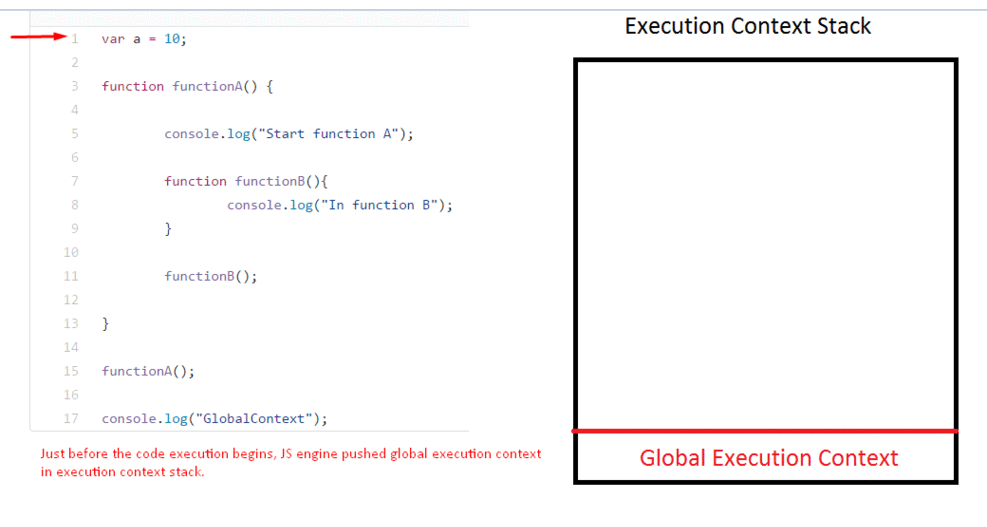
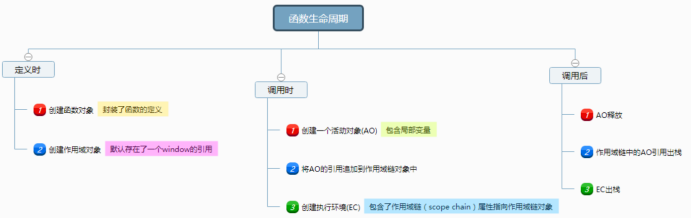
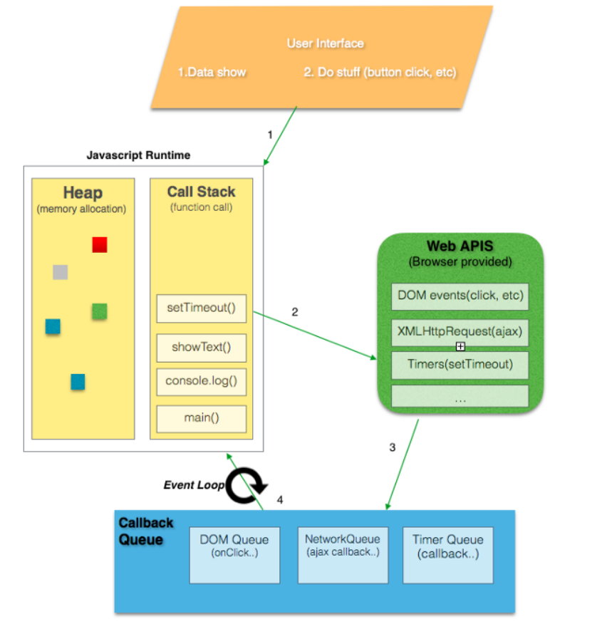
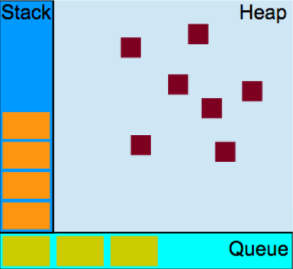

>  这里是阅读完 js高级程序设计中的第10章以及第4章 做出的总结
>
>  基础的笔记  [闭包](https://savancode.github.io/2020/11/26/js-closure/) [this指向](https://savancode.github.io/2020/11/25/js-this-keyword/)

## 重点部分的摘抄

### 1. 作用域，作用域链的理解

> **Scope** : The current context of execution. The context in which [values](https://developer.mozilla.org/en-US/docs/Glossary/Value) and **expressions** are "visible" or can be referenced. If a **[variable](https://developer.mozilla.org/en-US/docs/Glossary/Variable)** or other expression is not "in the current scope," then it is unavailable for use. Scopes can also be layered in a **hierarchy**, so that child scopes have access to parent scopes, but not vice versa.
>
> scope =>  **Global scope** and **Local scope**
>
> Lexical Scope & function Scope
>
> **The scope chain** of a function context is created at function *call* and consists of the *activation object* and the internal *[[Scope]]* property of this function
>
> **作用域对象**：
> 本质就是函数定义所在的函数的局部变量存储对象（AO对象），如果在全局作用域下定义的函数，则为全局作用域对象。
>
> **作用域链**：
> 则是当前函数所有外层的执行上下对象的“局部变量存储对象”列表，也包含当前函数的“局部变量存储对象”（作为第一个元素）。

```js
activeExecutionContext = {
  VO: {...}, // or AO
  this: thisValue,
  Scope: [ // Scope chain
   // list of all variable objects
   // for identifiers lookup
  ] 
};
```

### 2.  this 都有哪些情况

> the value of `this` is determined by how a function is called (runtime binding).
>
> 取决于执行时的上下文

function 类型： 构造函数 普通函数 箭头函数

1. 默认绑定：全局 / 普通函数 - window - strict mode就undefined
2. 隐式绑定：对象内函数
3. 构造函数  跟new有关 
4. 箭头函数 this是继承
5. 显式绑定： call apply bind

> 关于new操作符创建对象时发生的事情：  
>
> 第一步: 创建一个Object对象实例
> 第二步: 将构造函数的执行对象赋给新生成的这个实例 call
> 第三步: 执行构造函数中的代码
> 第四步: 返回新生成的对象实例

### 3. 闭包的理解

> 闭包，即使函数是在当前词法作用域之外执行。

函数返回函数内局部变量的引用，导致函数执行结束后，其执行上下文对象依旧存在引用，无法被释放。外部就可以继续访问

闭包在js编程中随处可见，书中有这样一个结论：

> **在定时器、事件监听器、 Ajax 请求、跨窗口通信、Web Workers 或者任何其他的异步(或者同步)任务中，只要使用了回调函数，实际上就是在使用闭包**!

立即执行函数，普通函数都会形成闭包

箭头函数 不是严谨的闭包

### 4. 改变函数作用域办法

1. call apply bind

call apply 立即执行函数，参数有区别，apply 类数组，call 一个个参数

bind 返回函数，不会立即执行

2. 包装为立即执行函数

```js
   (function foo() {
       var a = 3;
       console.log( a ); // 3
   })();
```

## 知识细节摘抄以及理解

### 执行上下文与作用域

CallStack又是也叫执行上下文栈（Execution Context Stack）- function/global/local



执行函数的过程：

1. 先创建函数执行上下文(Execution Context）EC, 每个分为内存分配（Memory Creation Phase）与执行（Execution）这两个阶段，压入执行栈顶；

   变量对象(Varibale Object) VO / Activation Object / this / arguments

2. 执行函数函数。

   

> 这里我们拓展一下**什么叫做js**
>
> JavaScript is a single-threaded non-blocking asynchronous concurrent language
>
> - a single-threaded: 只有一个`call stack`，即`one thread == one call stack == one thine at a time`
>
> - non-blocking asynchronous: `EventLoop` + `callback queue`
>
>   
>   
> - 
>
> - JavaScript 内存模型的角度，我们可以将内存划分为调用栈（Call Stack）、堆（Heap）以及队列（Queue）
>
> - 每个 JavaScript 运行时都必须包含一个任务队列。当调用栈为空时，运行时会从队列中取出某个消息并且执行其关联的函数（也就是创建栈帧的过程）
>
> [这里的理解来源](https://zhuanlan.zhihu.com/p/29116364?hmsr=toutiao.io&utm_medium=toutiao.io&utm_source=toutiao.io)

#### 作用域增强

try/catch 以及 with 语句

#### 很好的理解变量提升

> 其实这里如果能够很好地理解JS 机制,那么JS 的变量提升就能很好地理解

由于要在函数执行前创建函数执行上下文对象，所以函数内的局部变量都提前声明了。“变量提升”中的“提升”就是指创建执行上下文带来的“提前”行为。

**JavaScript中的函数是一等公民，函数声明的优先级最高，会被提升至当前作用域最顶端，然后才是函数表达式和变量按顺序执行**

**let 有暂时死区，不会被提升**

> 变量三个阶段： 声明（Declaration phase）、初始化（Initialization phase）与赋值（Assignment phase）

[更多详细例子理解](https://www.cnblogs.com/liuhe688/p/5891273.html)

#### 拓展实例 

```js
console.log(b);
b = 1;
```

上面的语句将会报错，提示 ReferenceError: b is not defined，即变量 b 未声明，这是因为 b 不是用 var 命令声明的，JavaScript 引擎不会将其提升，而只是视为对顶层对象的 b 属性的赋值。ES6 引入了块级作用域，块级作用域中使用 let 声明的变量同样会被提升，只不过不允许在实际声明语句前使用：

```js
> let x = x;
ReferenceError: x is not defined
> let x = 1;
SyntaxError: Identifier 'x' has already been declared
```

### 垃圾回收机制

标记清理，引用计数

> 任何变量（不管包含的是原始值还是引用值）都存在于某个执行上下文中（也称为作用域）。这个上下文（作用域）决定了变量的生命周期，以及它们可以访问代码的哪些部分
>
> 代码执行流每进入一个新的上下文，会创建作用域链，用于搜索变量与函数

闭包 - 用完就销毁

### 函数声明 与 函数表达式

函数的定义通过函数声明或者函数表达式，function构造函数，创建具名或者匿名函数以及立即执行函数

函数声明	- 函数声明提升

```js
console.log(sum(10, 10));
function sum(num1, num2) {
	return num1 + num2;
}
```

函数表达式

```js
console.log(sum(10, 10));
var sum = function(num1, num2) {// 不可以用let
	return num1 + num2;
};
```

### 函数内部与递归

#### 内部

arguments 、this 、caller(严格模式不可用，找回上层函数)、 new.target

检测函数是否使用new 关键字调用的new.target 属性

```js
function King() {
	if (!new.target) {
		throw 'King must be instantiated using "new"'
	}
	console.log('King instantiated using "new"');
}
new King(); // King instantiated using "new"
King(); // Error: King must be instantiated using "new"
```

#### 递归

```js
function factorial(num) {
    if (num <= 1) {
    	return 1;
    } else {
    	return num * arguments.callee(num - 1);
        //return num * factorial(num - 1);
    }
}
```

### 函数尾部用优化

理解就是 最好用函数返回后不需要执行额外的逻辑，以及引用其他的值 或者 进行其他的转型运算

详细的[JS引擎工作原理](https://www.cnblogs.com/onepixel/p/5090799.html)

### 绑定this失效

this在箭头函数中被绑定，4种绑定中的无论哪种都无法改变其绑定

```js
var a = 0;
function foo(){
    var test = () => {
        console.log(this.a);
    }
    return test;
};
var obj1 = {
    a : 1,
    foo:foo
}
var obj2 = {
    a : 2,
    foo:foo    
}
obj1.foo()();//1
var bar = foo.call(obj1);
//由于上一条语句已经把this绑定到obj1上，且无法修改。所以本条语句call(obj2)无效，返回的值是obj1.a的值1
bar.call(obj2);//1
```

## 重点理解的题

### 1. 混合知识点的题

```js
function Foo() {
    getName = function () { alert (1); };
    return this;
}
Foo.getName = function () { alert (2);};
Foo.prototype.getName = function () { alert (3);};
var getName = function () { alert (4);};
function getName() { alert (5);}

//答案：
Foo.getName();//2  
getName();//4   因为变量提升与函数表达式，4会覆盖5

------------------------------------
    区别在于 var getName 是函数表达式，而 function getName 是函数声明
    函数表达式最大的问题，在于js会将此代码拆分为两行代码分别执行
    console.log(x);//输出：f (){}
    var x=1;
    x = function (){}
	console.log(x)//输出：f (){}
------------------------------------
  console.log(x);//输出：function x(){}
    var x=1;
     function x(){}
	console.log(x)//输出：1
------------------------------------
Foo().getName();//1  1覆盖4，返回this，指向的是window ===window.getName
getName();//1   window.getName
new Foo.getName();//2   ne(Foo.getName)();
                        //将getName函数作为了构造函数来执行
new Foo().getName();//3 点（.）的优先级高于new操作  (new Foo()).getName()
                    //返回this，指向new，实例的getName 是protitype  
new new Foo().getName();//3  new ((new Foo()).getName)();
```

### 2. let const var 声明区别

- **var和let/const的区别**

  1. 块级作用域
  
  2. 不存在变量提升
  
  3. 暂时性死区
  
  4. 不可重复声明
  
  5. let、const声明的全局变量不会挂在顶层对象下面
  
     ```js
     var a = 1;
     // 如果在 Node环境，可以写成 global.a
     // 或者采用通用方法，写成 this.a 
     window.a // 1
     let b = 1;
     window.b // undefined
     ```
  
- **const命令两个注意点:**

  1. const 声明之后必须马上赋值，否则会报错
  2. const 简单类型一旦声明就不能再更改，复杂类型(数组、对象等)指针指向的地址不能更改，内部数据可以更改。 

> ES5只有全局作用域和函数作用域，没有块级作用域。
> 这带来很多不合理的场景:
>
> 1. 内层变量可能覆盖外层变量
> 2. 用来计数的循环变量泄露为全局变量
>
> **在块级作用域声明函数，最好使用匿名函数的形式**。
>
> **暂时性死区和不能变量提升的意义在于:**
> 为了减少运行时错误，防止在变量声明前就使用这个变量，从而导致意料之外的行为。
> 不允许重复声明变量

```js
var f = true;
if (f === true) {
  var a = 10;
}

function fn() {
  var b = 20;
  c = 30;
}

fn();
console.log(a);
console.log(b);
console.log(c);

// 10 报错 30
//这是个我犯了很久的错误，很长一段时间我都以为{...}内的新声明的变量是局部变量，后来我才发现function内的新声明的变量才是局部变量，而没有用var声明的变量在哪里都是全局变量。再次提醒切记只有function(){}内新声明的才能是局部变量，while{...}、if{...}、for(..) 之内的都是全局变量（除非本身包含在function内）。
```


### 3. 代码理解

```js
for (var i = 0; i < 3; i++) {
  setTimeout(() => console.log(i), 1);
}
```

这里的点是 块级作用域+全局作用域 & eventLoop（异步 - settimeout 函数）

### 4. 函数没有返回值时，返回什么？

```js
function Person(firstName, lastName) {
  this.firstName = firstName;
  this.lastName = lastName;
}

const lydia = new Person("Lydia", "Hallie");
const sarah = Person("Sarah", "Smith");

console.log(lydia);
console.log(sarah);

A: Person {firstName: "Lydia", lastName: "Hallie"} and undefined
B: Person {firstName: "Lydia", lastName: "Hallie"} and Person {firstName: "Sarah", lastName: "Smith"}
C: Person {firstName: "Lydia", lastName: "Hallie"} and {}
D:Person {firstName: "Lydia", lastName: "Hallie"} and ReferenceError
```

函数没有return的时候 return的就是undefined

**这里一定注意 const不可能没有值！！！**

### this在箭头函数中的指向问题

[推荐阅读1](https://github.com/anirudh-modi/JS-essentials/blob/master/ES2015/Functions/Arrow%20functions.md#how-this-is-different-for-arrow-functions)

> ```js
> function foo() {
>  setTimeout(()=>{
>          console.log(this.a);        // func
>      },100);
> }
> foo.a = 'func';
> var a = 'global';
> foo.call(foo);
> ```
>
>
> You must be wondering how did the above code worked, and we didn't even hard binded `this` for the arrow function to `this` of `foo` function!!!! 👺
>
> Well *this* is because the arrow functions do not have their own `this`, so how come it printed `func` 😱, *this* is because of the fact that, for arrow functions `this` is used using lexical scope lookup, which means that, when a reference to `this` is made within any arrow function, the engine, will start looking up the scope of arrow function to find a `this` binding, default being the `global scope` `this`, so, when the above code is executed, during the callback, the engine, will first look for `this` within the scope of arrow function, which it fails to find, then it traverses up the scope of the arrow function, which is the scope of the function `foo`, and since it finds a `this` in the scope of the `foo`, that same `this` is used as future reference within the arrow function, and since `this` of `foo` is hard binded to itself, we get the value of `this.a` as `func`.
>
> 文章解释很全，总的说，跟红宝书讲的一样，**箭头函数本身没有this，ES6新增的箭头函数在被调用时不会绑定`this`，所以它需要去 箭头函数没有this绑定，往外层词法环境寻找**。这里往外层 也就是书中说的继承

加深理解的例子（这里的例子[来源网络](https://www.jianshu.com/p/fed4c7ae2c33)，单个人理解与原作者的理解有出入 ）

```js
console.log('全局环境的this', this)
    
    function test (){
        console.log('方法中的 this', this)

        function child(){
            console.log('方法中的方法的 this', this)
        }
        child()
    }
    test()

    var obj =  {
        name: "object",
        doSth: function() {
            var oName = "obj function name"
            console.log('对象中的 this', this)
        },
        childObj: {
            name: "childObj",
            doSth: function() {
                var arrow = () => {
                    console.log("对象中箭头函数的this", this)
                }
                arrow()
                console.log('对象的对象中的 this', this)
            }
        },
        doBibao: function() {
            var count = 500
            console.log('闭包构造方法的 this', this)
            return function() {
                console.log('闭包返回结果的 this', this)
            }
        }
    }
    obj.doSth()
    obj.childObj.doSth()
    var mbb = obj.doBibao()
    mbb()

    setTimeout(obj.doSth, 1800)
    setTimeout(obj.doSth.bind(obj), 2000)

    var fun = function() {
        console.log('匿名函数中的 this', this)
    }
    fun()

    class Vue {
        constructor(options){
            this.name = "vue"
            this.type = "object"
            this.options = options
            console.log('构造函数的 this', this)

            options.log()
        }
    }

    var vm = new Vue({
        log: function () {
            console.log('构造函数找那个传递方法的 this', this)
        }
    })

    function bibao (){
        var count = 101
        console.log('闭包外的 this', this)
        return function() {
            count++
            console.log('闭包中的 this', this)
            return count;
        }
    }
    var bi = bibao()
    console.log(bi())

    var mArrow = () => {
        console.log('箭头函数中的 this', this)
    }
    mArrow()
    console.log('以下内容为异步执行')

    setTimeout(() => {
        console.log('延时箭头函数中的 this', this)
    }, 1000)
```

这里是又遇到一个挺好的文章推荐

### this 测试题

```js
var length = 10;
function fn() {
 console.log(this.length);
}

var obj = {
 length: 5,
 method: function(fn) {
   fn();
   arguments[0]();
 }
};

obj.method(fn, 1);
//window
//arguments
//obj
```

### 变量提升

```js
function fn(a) {
  console.log(a); 
  var a = 2;
  function a() {}
  console.log(a); 
}

fn(100);

//function a() {}
//2
//函数与var都能提升,函数先.
```

