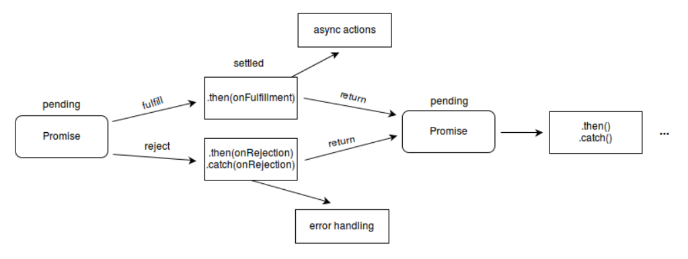
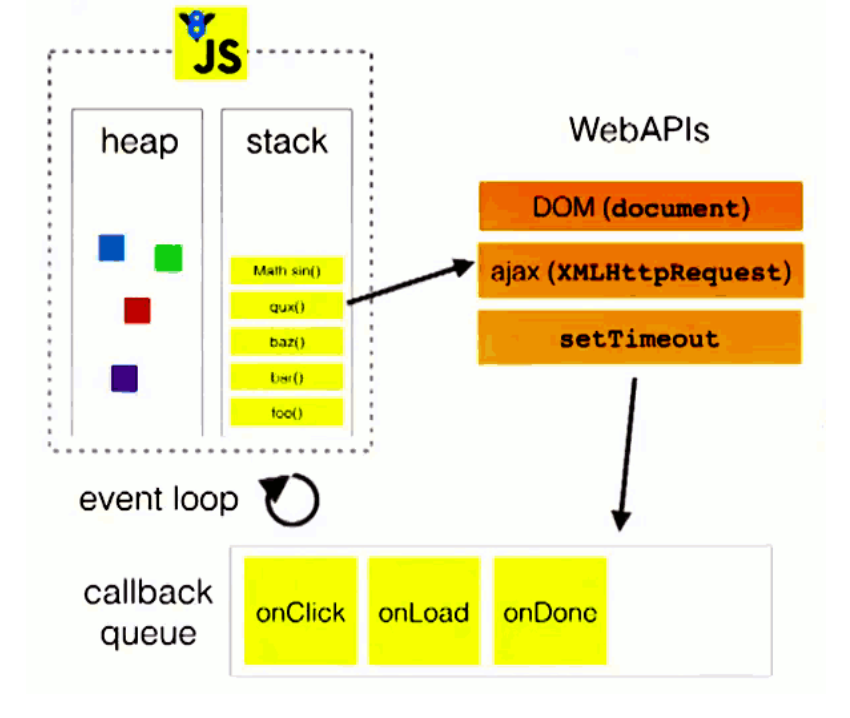
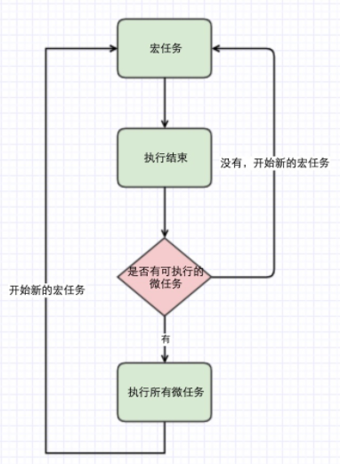
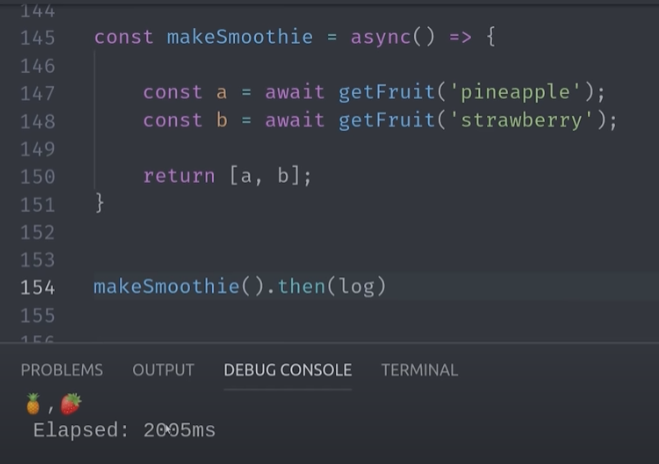
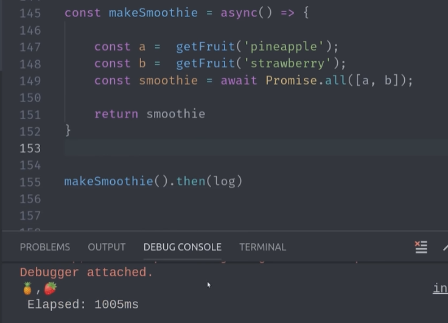

> 这里是阅读完 你不知道的JS 中卷 中的异步 做出的总结
>
> （其实之前的总结 也是有结合“你不知道的JS” 只是会把主要的书名字放在标题）
>
> 之前写的关于异步的笔记
>
> [eventLoop](https://savancode.github.io/2021/03/23/Eventloop/)  [js异步基础笔记](https://savancode.github.io/2020/12/10/js-promise/) js promise详细笔记

## 重点部分摘抄

### 1. 都有哪些异步

callback promise generator generator+promise async await

### 2. 事件循环的理解

**首先推荐一个[Event Loop可视化执行](http://latentflip.com/loupe)的网站。**

[JavaScript事件循环机制解析](https://www.jianshu.com/p/23fad3814398)

### 3. Promise 的原理



```js
var promise = new Promise(function(resolve, reject) {
  if (/* 异步操作成功 */){
    resolve(value);
  } else {
    reject(error);
  }
});
//then 直接跟这两个参数哦
promise.then(function(value) {
  // 如果调用了resolve方法，执行此函数
}, function(value) {
  // 如果调用了reject方法，执行此函数
});
```

果我们的后续任务是异步任务的话，必须return 一个 新的 promise 对象。
如果后续任务是同步任务，只需 return 一个结果即可

### 4. Generator 怎么用

处理异步,外部传参,处理错误,

### 5. Async 的用法和原理 (额外)

底层原理：用 Promise 控制 generator 函数的迭代器调用。

async/await 解决了 callback hell 问题，是一个语法糖，promise，then，catch 是链式调用，但也是基于回调函数。

> 它们和 Promise 的关系如下：
> - 执行 async 函数，返回的是 Promise 对象；
> - await 相当于 Promise 的 then；
> - try...catch 可以捕获异常，代替了 Promise 的 catch

### 6.错误处理中的链式流

错误方式一共有：return new Error () / throw new Error ()/ return Promise.reject(new Error())

> 这里一定注意不要误解！！！！
>
> - pending 状态，不会触发 then 和 catch
> - resolved 状态，会触发后续的 then 回调函数
> - rejected 状态，会触发后续的 catch 回调函数
> - then 正常返回 resolved，里面有报错则返回 rejected
> - catch 正常返回 resolved，里面报错则返回 rejected

```js
.then(() => {
    return new Error('error!!!')
  })
  .then((res) => {
    console.log('then: ', res)
  })
  .catch((err) => {
    console.log('catch: ', err)
  })
//then:  Error: error!!!

Promise.resolve()
  .then(() => {
    return Promise.reject(new Error('error!!!')) //这里还是resolved
  })
  .then((res) => {
    console.log('then: ', res)
  })
  .catch((err) => {
    console.log('catch: ', err)
  })

//catch:  Error: error!!!

Promise.resolve()
  .then(() => {
    throw new Error('error!!!')

  })
  .then((res) => {
    console.log('then: ', res)
  })
  .catch((err) => {
    console.log('catch: ', err)
  })
//catch:  Error: error!!!
```

[关于 generator hunk 这部分真的不是很能弄明白，请看这个](https://zhuanlan.zhihu.com/p/23845404)

## 重点概念的概括

> 这里主要是当别人问你概念的时候，可以简单回答

###  事件循环

线程提供一种机制来处理程序中多个块的执行，并且执行每个块时调用JS引擎，这种机制就是事件循环机制

一旦有事件需要运行，事件循环就会运行，直到队列清空。事件循环的每一轮称为一个tick。用户交互、Ajax 和定时器会向事件队列中加入事件。

### 进程和线程的概念以及关系

- **进程（Process）**：进程是系统资源分配和调度的单元。一个运行着的程序就对应了一个进程。一个进程包括了运行中的程序和程序所使用到的内存和系统资源。
- **线程（Thread）**：线程是进程下的执行者，一个进程至少开启一个线程（主线程），也可以开启多个线程。

### 并行和并发的概念

- **并发（Concurrency）**：我分别有任务 A 和任务 B，在一段时间内通过任务间的切换完成了这两个任务，这种情况就可以称之为并发
- **并行（Parallelism）**：指程序的设计结构，在同一时间内多件事情能被交替地处理。重点是，在某个时间内只有一件事情在执行。比如单核 CPU 能实现多任务运行的过程就是并发。

### 阻塞和非阻塞的概念

- **阻塞（Blocking）**：阻塞是指调用在等待的过程中线程被挂起（CPU 资源被分配到其他地方去）
- **非阻塞（Non-blocking）**：非阻塞是指等待的过程 CPU 资源还在该线程中，线程还能做其他的事情

### 单线程和多线程的区别

- **单线程**：从头执行到尾，逐行执行，如果其中一行代码报错，那么剩下代码将不再执行。同时容易代码阻塞。
- **多线程**：代码运行的环境不同，各线程独立，互不影响，避免阻塞。

### 同步与异步的概念

- **同步（Synchronous）**：程序发出调用的时候，一直等待直到返回结果，没有结果之前不会返回。
- **异步（Asynchronous）**：程序发出调用之后，无法立即得到结果，需要额外的操作才能得到预期的结果是为异步。

### 回调函数

回调函数包裹或者说封装了程序的延续（continuation），回调函数是JavaScript 异步的基本单元

### promise

Promise 是一种封装和组合未来值的易于复用的机制。解决了只用回调的代码的控制反转问题

> 所谓Promise，简单说是一个容器，里面保存着某个未来才会结束的事件的结果。从语法上说，Promise 是一个对象，从它可以获取异步操作的消息。Promise 提供统一的 API，各种异步操作都可以用同样的方法进行处理，让开发者不用再关注于时序和底层的结果。Promise的状态具有不受外界影响和不可逆两个特点。

### generator

> `iterator` 也是一种对象，它有`next` 方法，该方法返回一个包含 `value` 和 `done` 两个属性的对象 。前者是迭代的值，后者是表明迭代是否完成的标志 -- 布尔值. 最后的最后,没有值直接undefined

`generator` 就是一个返回值为 `iterator` 的函数, *` 标明这是个 `generators`， `yield` 用来在调用 `next`时返回 `value


## 知识细节摘抄和理解

### 整体知识结构图


[图片来源](https://www.cnblogs.com/wenruo/p/9379179.html)

[**每个部分的指示图 推荐看 国内掘金也有搬运的**](https://codertw.com/%E7%A8%8B%E5%BC%8F%E8%AA%9E%E8%A8%80/731509/#outline__10)

### 异步

#### 事件循环理解

先看图~



> 文字版本:
>
> 所有同步任务及异步任务按照 [编译原理](https://tsejx.github.io/javascript-guidebook/core-modules/executable-code-and-execution-contexts/compilation/compilation#编译原理) 在主线程上执行，形成一个 [执行上下文栈](https://tsejx.github.io/javascript-guidebook/core-modules/executable-code-and-execution-contexts/execution/execution-context-stack)（Execution Context Stack）
>
> 同步任务执行完成并返回结果后退出执行上下文栈；异步任务执行一部分后，退出主线程的执行上下文栈，推进至运行环境的专用线程中继续执行
>
> 当运行环境的专用线程中的异步任务准备就绪后，将被推至任务队列（Task Queue）中等待执行
>
> 主线程的执行上下文栈中的所有任务执行完毕后，JavaScript 解释器就会通过事件循环机制检查任务队列中是否存在等待执行的事件。如果存在，则队首的异步任务将结束等待状态，进入执行上下文执行
>
> JavaScript 主线程运行期间将不断重复上面第四步

#### 异步任务分两种

MacroTask：

- `setTimeout`
- `setInterval`
- `MessageChannel`
- I/0（文件，网络）相关API
- DOM事件监听：浏览器环境
- `setImmediate`：Node环境，IE好像也支持（见caniuse数据）

Microtasks:

- `requestAnimationFrame`：浏览器环境
- `MutationObserver`：浏览器环境
- `Promise.prototype.then`, `Promise.prototype.catch`, `Promise.prototype.finally`
- `process.nextTick`：Node环境
- `queueMicrotask`

运行机制理解 如下



综合整体理解 [图来源](https://www.jianshu.com/p/23fad3814398)


> 执行宏任务，然后执行该宏任务产生的微任务，若微任务在执行过程中产生了新的微任务，则继续执行微任务，微任务执行完毕后，再回到宏任务中进行下一轮循环。

### 回调

#### 回调5大信任问题

- 调用回调过早（在追踪之前）；
- 调用回调过晚（或没有调用）；
- 调用回调的次数太少或太多（就像你遇到过的问题！）；
- 没有把所需的环境/ 参数成功传给你的回调函数；
- 吞掉可能出现的错误或异常；
- ……

### Promise

#### 链式流程控制可行的Promise 固有特性

- 调用Promise 的then(..) 会自动创建一个新的Promise 从调用返回。
- 在完成或拒绝处理函数内部，如果返回一个值或抛出一个异常，新返回的（可链接的）Promise 就相应地决议。
- 如果完成或拒绝处理函数返回一个Promise，它将会被展开，这样一来，不管它的决议值是什么，都会成为当前then(..) 返回的链接Promise 的决议值。

#### Promise的局限性

- 顺序错误处理
一个promise链只是连接到一起的成员，并不是一个整体；即会有外部方法能够观察可能发生的错误。
- 单一值
promise只能有一个完成值或者一个拒绝理由
- 单决议
promise只能决议一次
- 惯性
在一个充满回调函数的代码块中，现存的代码不识别promise，那么还是保存原来的样子要好
- 无法取消的promise
一旦创建一个promise并注册完成或拒绝处理函数，这时如果某种情况发生导致这个任务得不到处理，实际上是没有办法从外部停止这个进程的

对于单一决议容易考的点

```js
const promise = new Promise((resolve, reject) => {
  resolve('success1')
  reject('error')
  resolve('success2')
})

promise
  .then((res) => {
    console.log('then: ', res)
  })
  .catch((err) => {
    console.log('catch: ', err)
  })
```

#### [promise的具体函数API](https://es6.ruanyifeng.com/#docs/promise)

#### Promise.all()和Promise.race()的区别

all会将传入的数组中的所有promise全部决议以后，将决议值以数组的形式传入到观察回调中，任何一个promise决议为拒绝，那么就会调用拒绝回调。

race会将传入的数组中的所有promise中第一个决议的决议值传递给观察回调，即使决议结果是拒绝。

#### 如果向Promise.all()和Promise.race()传递空数组，运行结果会有什么不同？

all会立即决议，决议结果是fullfilled，值是undefined

race会永远都不决议，程序卡死……

#### 如果向Promise.all()和Promise.race()中随便一个reject，其他都是，运行结果会有什么不同？

all会立即决议，决议结果是rejected,（这里不考虑catch）

race输出是最快的 ，但是有错误 ，所以还是会有引发错误（这里就算有catch 中途会断，最后打印的还是最早的成功的结果）

```js
let p1 = new Promise((resolve, reject) => {
  setTimeout(() => {
    resolve('success')
  },100)
})

let p2 = new Promise((resolve, reject) => {
  setTimeout(() => {
    reject('failed')
  }, 500)
})

Promise.race([p1, p2]).then((result) => {
  console.log(result)
}).catch((error) => {
  console.log(error)
})
```


#### 补充：面试考点

#### promise 并发

#### promise 串行

#### 值穿透

```js
Promise.resolve(1)
  .then(2)
  .then(Promise.resolve(3))
  .then(console.log)
```

运行结果：

```
1
```

解释：`.then` 或者 `.catch` 的参数期望是函数，传入非函数则会发生值穿透。

### generator

#### 为什么会有generator

Generator 函数可以暂停执行和恢复执行，这是它能封装异步任务的根本原因。除此之外，它还有两个特性，使它可以作为异步编程的完整解决方案：函数体内外的数据交换和错误处理机制。

#### 理解generator 以及 yield(同时理解return与yield的区别)

```js
function *foo(x) {
  let y = 2 * (yield (x + 1))
  let z = yield (y / 3)
  return (x + y + z)
}
let it = foo(5)
console.log(it.next())   // => {value: 6, done: false}
console.log(it.next(12)) // => {value: 8, done: false}
console.log(it.next(13)) // => {value: 42, done: true}
```

- 首先 `Generator` 函数调用和普通函数不同，它会返回一个迭代器
- 当执行第一次 `next` 时，传参会被忽略，并且函数暂停在 `yield (x + 1)` 处，所以返回 `5 + 1 = 6`
- 当执行第二次 `next` 时，传入的参数等于上一个 `yield` 的返回值，如果你不传参，`yield` 永远返回 `undefined`。此时 `let y = 2 * 12`，所以第二个 `yield` 等于 `2 * 12 / 3 = 8`
- 当执行第三次 `next` 时，传入的参数会传递给 `z`，所以 `z = 13, x = 5, y = 24`，相加等于 `42`

#### generator 和异步控制

利用 `Generator` 函数的暂停执行的效果，可以把异步操作写在 `yield` 语句里面，等到调用 `next` 方法时再往后执行。这实际上等同于不需要写回调函数了，因为异步操作的后续操作可以放在 `yield` 语句下面，反正要等到调用 `next` 方法时再执行。所以，`Generator` 函数 的一个重要实际意义就是**用来处理异步操作，改写回调函数**。

#### Symbol.iterator

```js
let collection = {
  items: [],
  *[Symbol.iterator]() {
    for (let item of this.items) {
      yield item;
    }
  }
};
//注意和for of 对比
```

#### generator 运行理解

- 第一步，协程`A`开始执行。
- 第二步，协程`A`执行到一半，进入暂停，执行权转移到协程`B`。
- 第三步，（一段时间后）协程`B`交还执行权。
- 第四步，协程`A`恢复执行。

实际例子

```js
function getDataAsync (url) {
    return new Promise((resolve, reject) => {
        setTimeout(() => {
            var res = {
                url: url,
                data: Math.random()
            }
            resolve(res)
        }, 1000)
    })
}
//使用 Generator 函数可以这样写
function * getData () {
    var res1 = yield getDataAsync('/page/1?param=123')
    console.log(res1)
    var res2 = yield getDataAsync(`/page/2?param=${res1.data}`)
    console.log(res2)
    var res3 = yield getDataAsync(`/page/2?param=${res2.data}`)
    console.log(res3))
}
//然后我们这样逐步执行
var g = getData()
g.next().value.then(res1 => {
    g.next(res1).value.then(res2 => {
        g.next(res2).value.then(() => {
            g.next()
        })
    })
})
```

### async关键字

#### async & promise

```js
function f() {
  return Promise.resolve('TEST');
}

// asyncF相当于f！
async function asyncF() {
  return 'TEST';
}
```

类似地

```js
function f() {
  return Promise.reject('Error');
}

// asyncF相当于f！
async function asyncF() {
  throw 'Error';
}
```

#### await 表达式的运算结果

await 表达式的运算结果取决于它等的是什么

- 如果它等到的不是一个 Promise 对象，那 await 表达式的运算结果就是它等到的东西。
- 如果它等到的是一个 Promise 对象，await 就忙起来了，它会阻塞后面的代码，等着 Promise 对象 resolve，然后得到 resolve 的值，作为 await 表达式的运算结果。

```js
async function test() {
  return "1"
}
console.log(test()) // -> Promise {<resolved>: "1"}
```
```javascript
function testAsy(x){
   return new Promise(resolve=>{setTimeout(() => {
       resolve(x);
     }, 3000)
    }
   )
}
async function testAwt(){    
  let result =  await testAsy('hello world');
  console.log(result);    // 3秒钟之后出现hello world
  console.log('cuger')   // 3秒钟之后出现cug
}
testAwt();
console.log('cug')  //立即输出cug
```

这就是 await 必须用在 async 函数中的原因。async 函数调用不会造成阻塞，它内部所有的阻塞都被封装在一个 Promise 对象中异步执行。await暂停当前async的执行，所以’cug”最先输出，hello world’和‘cuger’是3秒钟后同时出现的。

#### 使用 async/await 重写 promise 代码

```js
fetch('coffee.jpg')
.then(response => response.blob())
.then(myBlob => {
  let objectURL = URL.createObjectURL(myBlob);
  let image = document.createElement('img');
  image.src = objectURL;
  document.body.appendChild(image);
})
.catch(e => {
  console.log('There has been a problem with your fetch operation: ' + e.message);
});
```

```js
async function myFetch() {
  let response = await fetch('coffee.jpg');
  let myBlob = await response.blob();

  let objectURL = URL.createObjectURL(myBlob);
  let image = document.createElement('img');
  image.src = objectURL;
  document.body.appendChild(image);
}

myFetch()
.catch(e => {
  console.log('There has been a problem with your fetch operation: ' + e.message);
});
```

#### async/await对比Promise的优势

- 代码读起来更加同步，Promise虽然摆脱了回调地狱，但是then的链式调⽤也会带来额外的阅读负担

- Promise传递中间值⾮常麻烦，⽽async/await⼏乎是同步的写法，⾮常优雅

- 错误处理友好，async/await可以⽤成熟的try/catch，Promise的错误捕获⾮常冗余

- 调试友好，Promise的调试很差，由于没有代码块，你不能在⼀个返回表达式的箭头函数中设置断点，如果你在⼀个.then代码块中使⽤调试器的步进(step-over)功能，调试器并不会进⼊后续的.then代码块，因为调试器只能跟踪同步代码的每⼀步。

### 但是对于提速 实际上，async结合promise会很好



  

### 重点自测

[如果看不懂 题目做错 看这个图解是eventloop的](https://zhuanlan.zhihu.com/p/131337054)

```js
console.log('1');

setTimeout(function() {
    console.log('2');
    process.nextTick(function() {
        console.log('3');
    })
    new Promise(function(resolve) {
        console.log('4');
        resolve();
    }).then(function() {
        console.log('5')
    })
})
process.nextTick(function() {
    console.log('6');
})
new Promise(function(resolve) {
    console.log('7');
    resolve();
}).then(function() {
    console.log('8')
})

setTimeout(function() {
    console.log('9');
    process.nextTick(function() {
        console.log('10');
    })
    new Promise(function(resolve) {
        console.log('11');
        resolve();
    }).then(function() {
        console.log('12')
    })
})
```

**（1）第一轮事件循环流程分析如下：**

- 整体script作为第一个宏任务进入主线程，遇到`console.log`，输出1。
- 遇到`setTimeout`，其回调函数被分发到宏任务Event Queue中。暂且记为`setTimeout1`。
- 遇到`process.nextTick()`，其回调函数被分发到微任务Event Queue中。记为`process1`。
- 遇到`Promise`，`new Promise`直接执行，输出7。`then`被分发到微任务Event Queue中。记为`then1`。
- 又遇到了`setTimeout`，其回调函数被分发到宏任务Event Queue中，记为`setTimeout2`。

| 宏任务Event Queue | 微任务Event Queue |
| :---------------: | :---------------: |
|    setTimeout1    |     process1      |
|    setTimeout2    |       then1       |

上表是第一轮事件循环宏任务结束时各Event Queue的情况，此时已经输出了1和7。发现了`process1`和`then1`两个微任务：

- 执行`process1`，输出6。
- 执行`then1`，输出8。

好了，第一轮事件循环正式结束，这一轮的结果是输出1，7，6，8。

**（2）第二轮时间循环从`setTimeout1`宏任务开始：**

- 首先输出2。接下来遇到了`process.nextTick()`，同样将其分发到微任务Event Queue中，记为`process2`。
- `new Promise`立即执行输出4，`then`也分发到微任务Event Queue中，记为`then2`。

| 宏任务Event Queue | 微任务Event Queue |
| :---------------: | :---------------: |
|    setTimeout2    |     process2      |
|                   |       then2       |

第二轮事件循环宏任务结束，发现有`process2`和`then2`两个微任务可以执行：

- 输出3。
- 输出5。

第二轮事件循环结束，第二轮输出2，4，3，5。

**（3）第三轮事件循环开始，此时只剩setTimeout2了，执行。**

- 直接输出9。
- 将`process.nextTick()`分发到微任务Event Queue中。记为`process3`。
- 直接执行`new Promise`，输出11。
- 将`then`分发到微任务Event Queue中，记为`then3`。

| 宏任务Event Queue | 微任务Event Queue |
| :---------------: | :---------------: |
|                   |     process3      |
|                   |       then3       |

第三轮事件循环宏任务执行结束，执行两个微任务`process3`和`then3`：

- 输出10。
- 输出12。

第三轮事件循环结束，第三轮输出9，11，10，12。

整段代码，共进行了三次事件循环，完整的输出为1，7，6，8，2，4，3，5，9，11，10，12。

```js
var a = 0
var b = async () => {
  a = a + await 10
  console.log('2', a) // -> ？
}
b()
a++
console.log('1', a) // -> ？
复制代码
```

这道题目大部分读者肯定会想到 `await` 左边是异步代码，因此会先把同步代码执行完，此时 `a` 已经变成 1，所以答案应该是 11。

其实 `a` 为 0 是因为加法运算法，先算左边再算右边，所以会把 0 固定下来。如果我们把题目改成 `await 10 + a` 的话，答案就是 11 了。 

### 重点自测2

```js
async function async1() {
  console.log("async1 start");
  await async2();
  console.log("async1 end");
  setTimeout(() => {
    console.log('timer1')
  }, 0)
}
async function async2() {
  setTimeout(() => {
    console.log('timer2')
  }, 0)
  console.log("async2");
}
async1();
setTimeout(() => {
  console.log('timer3')
}, 0)
console.log("start")
```

### [针对面试题目写的集合](https://savancode.github.io/2021/04/21/js-promise2/)

### 拓展关于Vue nexttick

**`Vue` 中每产生一个状态更新任务，它就会被塞进一个叫 `callbacks` 的数组（此处是任务队列的实现形式）中。这个任务队列在被丢进 `micro` 或 `macro` 队列之前，会先去检查当前是否有异步更新任务正在执行（即检查 `pending` 锁）。如果确认 `pending` 锁是开着的（`false`），就把它设置为锁上（true），然后对当前 `callbacks` 数组的任务进行派发（丢进 `micro` 或 macro 队列）和执行。设置 `pending` 锁的意义在于保证状态更新任务的有序进行，避免发生混乱。**

## 参考

你不知道的js

[JS guidebook](https://tsejx.github.io/javascript-guidebook/core-modules/executable-code-and-execution-contexts/concurrency-model/timers-mechanism)

[The Async Await Episode I Promised](https://www.youtube.com/watch?v=vn3tm0quoqE)

## 推荐阅读

[JavaScript事件循环机制解析](https://www.jianshu.com/p/23fad3814398)