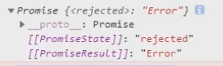
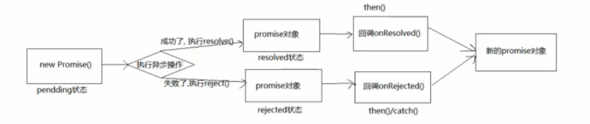
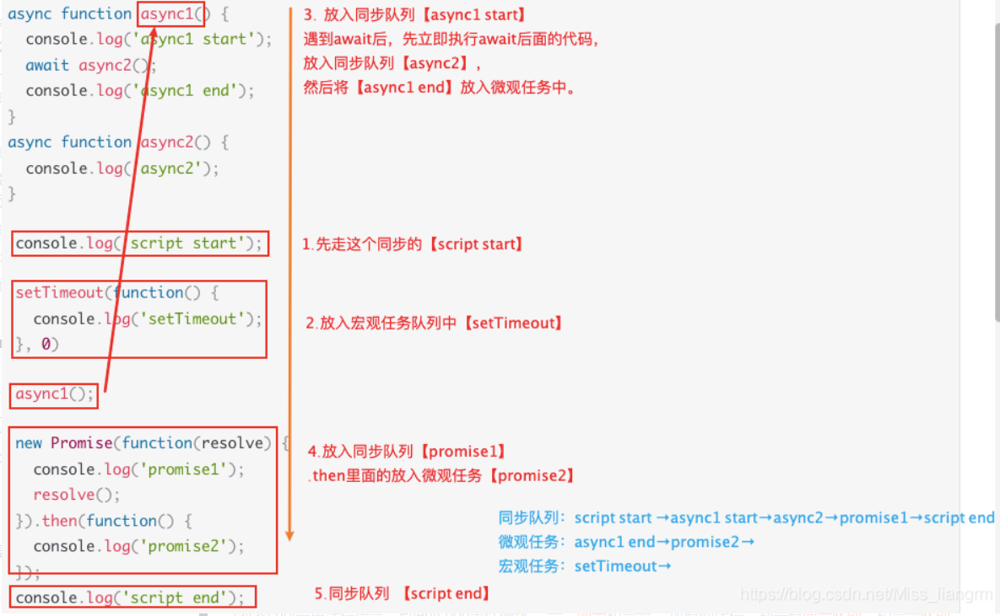

title: JS 回调函数 & Promise & async
top: false
cover: false
toc: true
mathjax: true
date: 2020-12-10 19:53:09
password:
summary:
tags: JS
categories:


# js处理error

## 错误的类型

- Error错误：所有错误的父类型

- ReferenceError: 引用的变量不存在

- TypeError:数据类型不正确的错误

- RangeError:数据值不在其所允许的范围内

- SyntaxError:语法错误

  ```js
  //1.ReferenceError: 引用的变量不存在
  console.log(a);//Uncaught ReferenceError: a is not defined
  
  //2.TypeError:数据类型不正确的错误
  let b = null
  console.log(b.xxx);//Uncaught TypeError: Cannot read property 'xxx' of null
  
  //3.RangeError:数据值不在其所允许的范围内
  function fn () {
     fn()
  }
  fn() //Uncaught RangeError: Maximum call stack size exceeded
  
  //4.SyntaxError:语法错误
  const c = '''' //Uncaught SyntaxError: Unexpected string
  ```

  

## 错误处理

- 捕获错误：try … catch …
- 抛出错误：throw error

```js
try{
  let b
  console.log(b.xxx);
}catch(error){
  console.log(error.message);
  console.log(error.stack);
}
console.log('出错之后');
//2.throw error
function some () {
  if (Date.now()%2 === 0){
    console.log('当前时间为奇数，可以执行任务');
  } else {
    throw new Error('当前时间为偶数,无法执行')
  }
}
//捕获异常
try {
  some()
} catch (error) {
  alert(error.message)
}
```

## 错误对象

- message属性：错误相关信息
- stack属性:函数调用栈记录信息


# 回调函数

### 回调函数基本定义

1. 自己定义
2. 不会亲自调用，但是自己执行
3. setTimeout（）中传递回调函数

###  回调函数类型

- 同步回调

  - 理解：立即执行，完全执行完了才结束，不会放入回调队列中

    例子：数组遍历相关的回调函数/ promise的excutor函数

- 异步回调

  - 理解: 不会立即执行，会放入回调队列中将来执行

    例子：定时器回调 / ajax回调 / promise的成功|失败回调

```js
//1.同步回调函数
const arr = [1, 2, 3, 4, 5]
arr.forEach(item => { //遍历回调，同步回调函数
     console.log(item);
  })
console.log('foreach()之后');
// 2.异步回调函数
/**
* js中两种定时器，setTimeout和setInterval的区别
*     setTimeout只在指定时间后执行一次
*     setInterval以指定时间为周期循环执行
*/
setTimeout(() => { //异步回调函数，会放入队列中将来执行
   console.log('timeout callback()');
}, 0)
console.log('setTimeout()之后执行');
```


# JS Promise

## Promise基本理解

- **抽象表达**：promise是js中进行异步编程的新的解决方案。（旧的是纯粹的回调函数）

- **具体表达**：从语法上来看，promise是一个构造函数。

  ​				  从功能上来说，promise对象用来封装一个异步操作，并可以获取其结果。

## 异步操作的三个阶段

**第一阶段**

回调函数作为参数传入，异步结果作为回调函数的参数传入，回调函数在异步操作后调用，以完成对异步结果的获取和处理。

因为基本的异步操作的执行，是无法直接得到执行结果的。

```js
//基本的同步函数
function sum(n,m){
	return n+m;
}
const result=sum(10,30)//40

//基本的异步函数 - 出现的问题就是异步函数api没有办法获得返回的值
function getMsg(){
    setTimeout(function(){
        return {msg:'Hello Node.js'}},2000);
}
const msg = getMsg();//undefined 
```

为了拿到结果，人们将函数作为参数来定义异步操作的函数：

```js
function getData(callback){
	//比如这里异步操作
    //...
    //异步操作结束，比如结果是123
    let result=123
    callback(result);//对异步操作的结果处理放在回调函数中了
}
getData(function(n){
    console.log("callback函数被调用");
    console.log(n);//123
});
```

若是出现多层回调函数嵌套的情况，就会产生回调地狱。为了解决回调地狱的问题，人们引入了promise。

**第二阶段 promise**

回调地狱的产生，原因还是回调函数对结果的处理和异步操作终究还是在一起，并没有把分离。而引入promise的最大作用，就是把异步操作的过程和结果做到了分离，可以用promise.then()来获取和处理异步操作的结果。

```js
const p = new Promise((resolve,reject)=>{
	if true resolve()
	else reject()
});
p.then(value=>{},reject=>{});
//对于已经封装好的函数 下面例子
function f1(para){}
f1(para).then(value=>{},reject=>{});
```

**第三阶段 异步函数**

promise还是有些繁琐，于是es7又推出了async和await，将同步操作以同步的方式书写出来。

## promise的状态改变

Promise对象只有三种状态 （PromiseState）

- 异步操作“未完成”（pending）
- 异步操作“已完成”（resolved，又称fulfilled）
- 异步操作“失败”（rejected）


这三种的状态的变化途径只有两种且不可逆，且一个promise只能改变以此一次状态。

- 异步操作从“未完成”到“已完成”（pending -  resolved）
- 异步操作从“未完成”到“失败”。( pending - rejected)

因此，Promise对象的最终结果只有两种。**要么成功，要么失败。于是只会有一种数据产生，成功的结果数据称value,失败的结果数据称reason** （PromiseResult）

- 异步操作**成功**，Promise对象传回一个值，状态变为 resolved。

- 异步操作**失败**，Promise对象抛出一个错误，状态变为 rejected。

- 异步操作，函数返回promise （不管里面是成功失败），外面的状态是pending，proto的属性会保留结果状态

  

```js
var p1 = new Promise(function(resolve,reject){
	resolve(1);//成功
});
var p2 = new Promise(function(resolve,reject){
setTimeout(function(){
  	resolve(2);  //成功
}, 500);      
});
var p3 = new Promise(function(resolve,reject){
setTimeout(function(){
  	reject(3);  //失败
}, 500);      
});

console.log(p1);
console.log(p2);
console.log(p3);
setTimeout(function(){
	console.log(p2);
}, 1000);
setTimeout(function(){
	console.log(p3);
}, 1000);

p1.then(function(value){
	console.log(value);
});
p2.then(function(value){
	console.log(value);
});
p3.catch(function(err){
	console.log(err);
});
```

```js
/*
Promise {[[PromiseStatus]]: "resolved", [[PromiseValue]]: 1}
Promise {[[PromiseStatus]]: "pending", [[PromiseValue]]: undefined}
Promise {[[PromiseStatus]]: "pending", [[PromiseValue]]: undefined}
1
2
3
Promise {[[PromiseStatus]]: "resolved", [[PromiseValue]]: 2}
Promise {[[PromiseStatus]]: "rejected", [[PromiseValue]]: 3}
*/
```

  Promise的内部实现是一个状态机。Promise有三种状态：pending，resolved，rejected。当Promise刚创建完成时，处于pending状态；当Promise中的函数参数执行了resolve后，Promise由pending状态变成resolved状态；如果在Promise的函数参数中执行的不是resolve方法，而是reject方法，那么Promise会由pending状态变成rejected状态。

p2、p3刚创建完成时，控制台输出的这两台Promise都处于pending状态，但为什么p1是resolved状态呢？ 这是因为p1 的函数参数中执行的是一段同步代码，Promise刚创建完成，resolve方法就已经被调用了，因而紧跟着的输出显示p1是resolved状态。我们通过两个`setTimeout`函数，延迟1s后再次输出p2、p3的状态，此时p2、p3已经执行完成，状态分别变成resolved和rejected。

## promise 基本流程



## promise 基本使用

```js
// 1.创建一个新的promise对象
const p = new Promise((resolve , reject) => { //执行器函数, 是一个同步回调
  console.log('执行 excutor')
  // 2.执行异步任务
  setTimeout(() => {
    const time = Date.now() //如果当前时间为偶数代表成功，否则失败
      // 3.1 如果成功了，调用resolve(value)
    if(time % 2 === 0){
      resolve('成功的数据，time =' + time)
    }else{
      //3.2 如果失败了，调用reject(reason)
      reject('失败的数据,time=' + time)
    }
  },1000)
})

p.then(
  value => {//接受得到成功的value数据  onResolved
    console.log('成功的回调',value);
  },
  reason => {//接受得到失败的reason数据 onRejected
    console.log('失败的回调',reason);
  }
)

consle.log('new promise()执行之后')

//注意 这里的 then 是在当前脚本的所有同步任务执行完才会执行的
/*执行 excutor
new promise()执行之后
undefined
成功的回调 成功的数据，time =1607609563332*/
```

## 为什么要使用promise

### 1，指定回调函数的方式更加灵活

```js
//成功的回调函数
function successCallback(result){
	//对result的一系列操作，例如下面这行打印结果
	console.log(result)
}

//失败的回调函数
function failureCallback(error){
	//对error的一系列操作
	console.log(error)
}

//定义异步操作的函数
function createAudioFileAsync(audioSettings,successFun,errorFun){
	//针对audioSettings中的一些参数，进行异步操作
	//……一系列的异步操作代码，得成功的话，得到result,失败的话得到error
	if(成功){
		// 执行成功的操作,并将结果传入作为参数
		successFun(result)
	}else(失败){
		// 执行失败后的操作,并将结果传入作为参数
		errorFun(error)
	}
}
//1.使用纯粹的回调函数
//使用并进行异步操作，直接指定回调函数，作为异步操作函数的实参传入，使得异步操作的结果也在这个异步操作的函数中处理
createAudioFileAsync(audioSettings,successCallback,failureCallback)
// 2. 使用promise
//直接开始异步操作，只是没有在第一时间完成
const promise = createAudioFileAsync(audioSettings)
//在后面指定的回调函数，异步操作和异步操作的结果做到了分离。
promise.then(successCallback,failureCallback)
```

### 2，支持链式调用，可以解决回调地狱问题

**什么是回调地狱？回调函数嵌套调用，外部回调函数异步执行的结果是嵌套的回调函数执行的条件。**
回调地狱的缺点？不便于阅读、不便于异步处理
解决方案？promise链式调用
终极解决方案？async/await

```javascript
// 1. 回调地狱
doSomething(function(result){
	doSomethingElse(result, function(newResult){
		doThirdThing(newResult, function(finalResult){
			console.log('Got the final result:' + finalResult)
		}, failureCallback)
	}, failureCallback)
}, failureCallback)

// 2. 使用promise的链式调用解决回调地狱
doSomething().then(function(result){
	return doSomethingElse(result)
})
.then(function(newResult) {
	return doThirdThing(newResult)
})
.then(function(finalResult){
	console.log('Got the final result:'+finalResult)
})
.catch(failureCallback)

// 3. async/await：回调地狱的终极解决方案
async function request() {
	try {
		const result=await doSomething()
		const newResult=await doSomethingElse(result)
		const finalResult=await soThirdThing(newResult)
		console.log('Got the final result'+finalResult)
	} catch(error) {
		failureCallback(error)
	}
}
```

# promise的API使用

## 1、Promise构造函数：Promise(excutor){}

- excutor函数：同步执行 (resolve, reject)=>{}
- resolve函数：内部定义成功时我们调用的函数 value=>{}
- reject函数：内部定义失败时我们调用的函数 reason=>{}
  说明：excutor会在Promise内部立即同步回调，异步操作在执行器中执行

## 2、Promise.prototype.then方法：(onResolved, onRejected)=>{}

- onResolved函数：成功的回调函数 (value)=>{}

- onRejected函数：失败的回调函数 (reason)=>{}
  说明：指定用于得到成功value的成功回调和用于得到失败reason的失败回调，返回一个新的promise对象
```js
//规范写法
const p = new Promise((resolve , reject) => { 
    if(result==true){//成功
      resolve(result);//将result传下去
    }else{//失败
      reject(result);
    }
})
//then中完善成功与失败分别的函数内容
p.then(
  (value) => {//接受得到成功的value数据  onResolved
    console.log('成功的回调',value);}//此处value就是删改传下来的
   ,
  (reason) => {//接受得到失败的reason数据 onRejected
    console.log('失败的回调',reason);
  }
)

//简单写法
var p = new Promise(function(resolve, reject){
	console.log("create a promise");
	resolve("success");
});

console.log("after new Promise");

p.then(function(value){
	console.log(value);
});
/*
"create a promise"
"after new Promise"
"success"*/
```

  

## 3、Promise.prototype.catch方法：(onRejected)=>{}

- onRejected函数：失败的回调函数 (reason)=>{}

  说明：then()的语法糖，相当于：then(undefined, onRejected)

```javascript
let p = new Promise((resolve, reject)=>{
	//一系列异步操作，得到结果result，成功则调用resolve，失败则调用reject
	resolve(result)
	// reject(result)
})

	p.then(  //对成功的结果的处理，参数是一个函数，此函数的参数value就是result，
	value=>{
		console.log('onResolved()', value)
	}
)
    p.catch(   //对失败的结果的处理，参数是一个函数，此函数的参数reason就是result
	reason=>{
		console.log('onRejected()', reason)
	}
)
```

## 4、Promise.resolve方法：(value)=>{}

- value: 成功的数据或promise对象
  说明：返回一个成功/失败的promise对象

> 如果传入的参数是非promise对象，则返回结果为成功的promise对象
> 	   如果传入参数为promise对象，则参数的结果决定了resolve的结果就是对应的promise对象 PromiseResult

## 5、Promise.reject方法：(reason)=>{}

- reason：失败的原因
  说明：返回一个失败的promise对象

```javascript
// 产生一个成功值为1的promise对象
const p1=new Promise((resolve, reject)=>{
	resolve(1)
})
// 产生一个成功值为2的promise对象
const p2=Promise.resolve(2) 
const p3=Promise.reject(3)

p1.then(value=>{console.log(value)}) //1
p2.then(value=>{console.log(value)}) //2
p3.catch(reason=>{console.log(reason)}) //3
```

## 6、Promise.all方法：(promises)=>{}

- promises：包含n个promise的数组
  说明：返回一个新的promise，只有所有的promise都成功才成功，只要有一个失败了就直接失败

```javascript

let Promise1 = new Promise(function(resolve, reject){ resolve(v1); reject(r1); })
let Promise2 = new Promise(function(resolve, reject){ resolve(v2); reject(r2); })
let Promise3 = new Promise(function(resolve, reject){ resolve(v3); reject(r3); })
 
let p = Promise.all([Promise1, Promise2, Promise3])
p.then(([v1, v2, v3]) => {
  // 三个都成功则成功, 参数为三个Promise成功值构成的数组
}, (r2) => {
  // 只要有失败，则失败， 假设Promise2失败
})
```

## 7、Promise.race方法：(promises)=>{}

- promises: 包含n个promise数组
  说明：返回一个新的promise，**第一个完成的promise的结果状态就是最终的结果状态**

```javascript

let Promise1 = new Promise(function(resolve, reject){ resolve(v1); reject(r1); })
let Promise2 = new Promise(function(resolve, reject){ resolve(v2); reject(r2); })
let Promise3 = new Promise(function(resolve, reject){ resolve(v3); reject(r3); })
 
let result = Promise.race([Promise1, Promise2, Promise3])
// 假设Promise1, Promise2 resolve，Promise3 resolve，且Promise2 resolve最快
console.log(result);//显示的是promise 2 的resolve

let p = Promise.all([Promise1, Promise2, Promise3])
 // 假设Promise1, Promise2 resolve，Promise3 reject，且Promise2 resolve最快
p.then((v2) => {
 // v2 比 v1 快， 但因为Promise3 reject了，并不会执行此处回调
}, (r3) => {
  // 返回第一个reject的reason
})
```

## 8、对于已经是回调函数，可以直接用util.promisify()转换

```js
const util = require(‘util’);
const fs = require(‘fs’);

const stat = util.promisify(fs.stat);
stat(‘.’)
.then((stats) => {
// Do something with `stats`
})
.catch((error) => {
// Handle the error.
});
```


# promise的关键问题

## 如何改变promise 的状态

- resolve：如果当前是pendding就会变为resolved
- reject：如果当前是pendding就会变为rejected
- 抛出异常：如果当前是pendding就会变为rejected

```javascript
const p= new Promise((resolve,reject)=>{
	//resolve(1)  promise变为resolved成功状态 pending => fulfilled/resolved
	//reject(2)   promise变为rejected失败状态 pending => rejected
	//throw new Error('出错了')  抛出异常，promise变为rejected失败异常，reason为抛出的异常
	throw 3  //抛出异常，promise变为rejected失败状态，reason为抛出的3
})
p.then(
	value=>{}
	reason =>{console.log(reason)}
)
p.then(
	value=>{}
	reason =>{console.log('第二次'+reason)}
)
//两次都可以执行，对异步操作的结果做不同的处理
```

## 改变promise状态和指定回调函数谁先谁后？

1. 都有可能，正常情况下是先指定回调再改变状态，但也可以先改变状态再指定回调
2. 如何先改变状态再指定回调？
   - 在执行器中直接调用resolve()/reject()
   - 延长更长时间才调用then()
3. 什么时候才能得到数据？
   - 如果先指定的回调，那当状态发送改变时，回调函数就会调用，得到数据
   - 如果先改变状态，那当指定回调时，回调函数就会调用，得到数据

```javascript
// 常规上先指定回调，会改变状态
new Promise((resolve , reject) => {
  setTimeout(() => {
    resolve(1) // 后改变的状态(同时指定数据),异步执行回调函数
  },1000)
}).then( //先指定回调函数，保存当前指定的回调函数
  value => {},
  reason => {
    console.log('reason' , reason);
  }
)

new Promise((resolve , reject) => {
  resolve(1) // 先改变的状态(同时指定数据)
}).then( //后指定回调函数，异步执行回调函数
  value => {},
  reason => {
    console.log('reason' , reason);
  }
)
```

## promise.then()返回的新的promise的结果状态由什么决定？

1. 简单表达式：有then()指定的回调函数执行的结果决定
2. 详细表达：
   - 如果抛出异常，新promise变为rejected，reason为抛出异常
   - 如果返回的是非promise任意值，新promise变为resolved,value为返回值
   - 如果返回的是另一个新的promise，此promise的结果就会成为新promise的结果

```javascript
new Promise((resolve , reject) => {
  resolve(1)
}).then(
  value => {
    console.log('value',value);//1
    //return value
    //return Promise.resolve(3)
    //return Promise.reject(4)
    // throw 5
  },
  reason => {
    console.log('reason',reason);
  }
).then(
  value => {
    console.log('value1',value);//undefined
  },
  reason => {
    console.log('reason1',reason);
  }
)
```

## promise如何串联多个操作任务？

1. promise的then返回一个新的promise，看一看成then的链式调用
2. 使用then的链式调用串联多个同步异步任务

```javascript
//下面的例子是怎么实现的呢?
new Promise((resolve , reject) => {
  setTimeout(() => {
    console.log('执行异步任务1');
    resolve(1)
  },1000)
}).then(
  value => {
    console.log('任务1的结果',value);
    console.log('执行同步任务2');
    return 2
  }
).then(
  value => {
    console.log('同步任务2的结果',value);
    return new Promise((resolve , reject) => {
      //执行异步任务3
      setTimeout(() => {
        console.log('执行异步任务3');
        resolve(3)
      },1000)
    })
  }
).then(
  value => {
    console.log('异步任务3的结果');
  }
)

//串联任务的实现
let p = new Promise((resolve, reject) => {
    setTimeout(() => {
        resolve('OK');
    }, 1000);
});

p.then(value => {
    return new Promise((resolve, reject) => {
        resolve("success");
    });
}).then(value => {
    console.log(value);//这里打印是什么？
}).then(value => {
    console.log(value);//这里打印应该是什么？
})
//这里一定记得 then的实现取决于前面返回的是什么！！
```

## promise异常穿透

1. 当使用promise的then链式调用时，可以在最后指定失败的回调
2. 前面任何操作出现异常，都会传到最后失败的回调中处理

```javascript
new Promise((resolve , reject) => {
  //resolve(1)
  reject(1)
}).then(
  value => {
    console.log('onResolve()1',value);
    return 2
  },
  //异常穿透，相当于在每个then中 throw reason 或者 Promise.reject(reason)
  // reason => {
  //   throw reason
  // }
  // reason => {
  //   Promise.reject(reason)
  // }
).then(
  value => {
    console.log('onResolve()2',value);
    return 3
  }
).then(
  value => {
    console.log('onResolve()3',value);
  }
).catch(
  reason => {
    console.log('onRejected()1',reason);
  }
)
```

## 中断promise链

1. 当使用promise的链式调用时，在中间中断，不再调用后面的回调函数
2. 办法：在回调函数中返回一个pendding状态的promise对象（对后面的then函数而言，由于一直是pending状态的，then是不能执行的），通过return false也没有用！！

```javascript
new Promise((resolve , reject) => {
  reject(1)
}).then(
  value => {
    console.log('onResolve()1',value);
    return 2
  }
).then(
  value => {
    console.log('onResolve()3',value);
  }
).catch(
  reason => {
    console.log('onRejected()1',reason);
    return new Promise(() => {})//返回一个pending的promise,中断promise链
  }
).then(
  value => {
    console.log('onResolve()4',value);
  },
  reason => {
    console.log('onRejected()2',reason);
  }
)
```


## 如果 Promise 状态已经变成resolved，再抛出错误是无效的

```js
const promise = new Promise(function(resolve, reject) {
  resolve('ok');
  throw new Error('test');
});
promise
  .then(function(value) { console.log(value) })
  .catch(function(error) { console.log(error) });
// ok
```

Promise 在resolve语句后面，再抛出错误，不会被捕获，等于没有抛出。因为 Promise 的状态一旦改变，就永久保持该状态，不会再变了。

# Promise拓展练习

1. https://juejin.cn/post/6844903509934997511
2. https://juejin.cn/post/6844903488695042062#heading-0
3. https://juejin.cn/post/6844903625769091079

# async和awiat

1. async 函数
   - 函数的返回值为promise对象
   
   - promise对象的结果由async函数执行的返回值决定
   
     
   
   ```js
   //注意输出的result
   async function main(){
               //1. 如果返回值是一个非Promise类型的数据
               // return 521;
               //2. 如果返回的是一个Promise对象
               // return new Promise((resolve, reject) => {// 这里返回promise的状态是什么呢？
               //     // resolve('OK');
               //     reject('Error');
               // });
               //3. 抛出异常
               throw "Oh NO";
           }
   
           let result = main();
           console.log(result);
   ```
   
   
   
2. await表达式
   - await右侧的表达式一般为promise对象，但也可以是其他值

   - 如果表达式是promise对象，await返回的都是promise的成功值

   - 如果表达式是其他值，直接将此值作为await返回值

     

   ```js
    async function main(){
               let p = new Promise((resolve, reject) => {
                   // resolve('OK');
                   reject('Error');
               })
               //1. 右侧为promise的情况
               // let res = await p;
               //2. 右侧为其他类型的数据
               // let res2 = await 20;
               //3. 如果promise是失败的状态
               // let res3 = await p //这样是不行的 再reject的时候
               try{
                   let res3 = await p;
               }catch(e){
                   console.log(e);
               }
           }
   
           main();
   ```

   

3. 注意
   - await必须写在async函数中，但async函数中可以没有await
   - 如果await的promise失败了，就会抛出异常，需要通过try … catch来捕获处理

```js
// 使用async await 替代 Promise
const asyncFunction = async (params) => {
    try {
        const data1 = await get$(params);
        const data2 = await get$(data1);
        const data3 = await get$(data2);
        console.log(data3);
    } catch (error) {
        conosle.log(error);
    }
}

//例子
/**
 * resource  1.html  2.html 3.html 读取文件内容
 */

const fs = require('fs');
const util = require('util');
const mineReadFile = util.promisify(fs.readFile);//将函数变成promise

//回调函数的方式
// fs.readFile('./resource/1.html', (err, data1) => {
//     if(err) throw err;
//     fs.readFile('./resource/2.html', (err, data2) => {
//         if(err) throw err;
//         fs.readFile('./resource/3.html', (err, data3) => {
//             if(err) throw err;
//             console.log(data1 + data2 + data3);
//         });
//     });
// });

//async 与 await
async function main(){
    try{
        //读取第一个文件的内容
        let data1 = await mineReadFile('./resource/1.html');
        let data1error = await mineReadFile('./resource/1x.html');
        let data2 = await mineReadFile('./resource/2.html');
        let data3 = await mineReadFile('./resource/3.html');
        console.log(data1 + data2 + data3 + data1error);
    }catch(e){
        console.log(e.code);
    }
}

main();
```


# JS异步之宏队列与微队列

[详细的解释](https://www.cnblogs.com/sunmarvell/p/9564815.html)


- **宏列队** **macrotask**：用来保存待执行的宏任务（回调），比如：定时器回调、DOM 事件回调、ajax 回调、script(整体代码)、setTimeout、setInterval、setImmediate、I/O、UI交互事件、postMessage、MessageChannel

  **优先级**：主代码块 > setImmediate > MessageChannel > setTimeout / setInterval

- **微列队** **microtask**：用来保存待执行的微任务（回调），比如：Promise回调：Promise.then、Mutation回调：MutationObserver、process.nextTick(Node环境)

  **优先级**：process.nextTick > Promise > MutationObserver

## 例子

```js
//输出下面的出现顺序 
setTimeout(() => {
            console.log(4);
        }, 0);
 
        new Promise(resolve=>{
            console.log(1);
            for(let i =0;i<10000;i++){
                i == 9999 && resolve();
            }
            console.log(2)
        }).then(()=>{
            console.log(5)
        })
 
        console.log(3)
```


```js
　　setTimeout(() => { //立即放入宏队列
      console.log('timeout callback1（）')
      Promise.resolve(3).then(
        value => { //立即放入微队列
          console.log('Promise onResolved3()', value)
        }
      )
    }, 0)

    setTimeout(() => { //立即放入宏队列
      console.log('timeout callback2（）')
    }, 0)

    Promise.resolve(1).then(
      value => { //立即放入微队列
        console.log('Promise onResolved1()', value)
        setTimeout(() => {
          console.log('timeout callback3（）', value)
        }, 0)
      }
    )

    Promise.resolve(2).then(
      value => { //立即放入微队列
        console.log('Promise onResolved2()', value)
      }
    )

    // Promise onResolved1() 1
    // Promise onResolved2() 2
    // timeout callback1（）
    // Promise onResolved3() 3
    // timeout callback2（）
    // timeout callback3（） 1
```


```js
// 先来看下下面这段代码
async function async1() {
  console.log('async1 start');
  await async2();
  console.log('async1 end');
}
async function async2() {
  console.log('async2');
}
 
console.log('script start');
 
setTimeout(function() {
  console.log('setTimeout');
}, 0)
 
async1();
 
new Promise(function(resolve) {
  console.log('promise1');
  resolve();
}).then(function() {
  console.log('promise2');
});
console.log('script end');
 
 
/*执行结果
script start
async1 start
async2
promise1
script end
async1 end
promise2
setTimeout
*/
```

从上往下看，先走同步队列，再走异步队列（包含微观任务队列和宏观任务队列）。

同步队列：script start → async1 start → async2 → promise1 → script end

异步队列：包括微观任务和宏观任务。

微观任务：async1 end → promise2

宏观任务: setTimeout →




# reference

1. https://www.bilibili.com/video/BV1GA411x7z1?p=2
2. https://blog.csdn.net/Miss_liangrm/article/details/103182530?utm_medium=distribute.pc_relevant.none-task-blog-BlogCommendFromMachineLearnPai2-1.control&depth_1-utm_source=distribute.pc_relevant.none-task-blog-BlogCommendFromMachineLearnPai2-1.control
3. https://www.cnblogs.com/sunmarvell/p/9564815.html