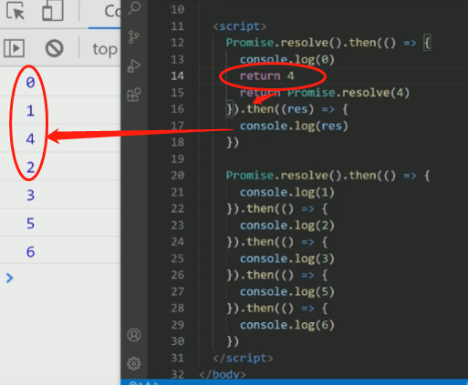
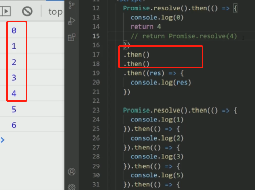

## Promise 异步请求串行&并行执行实现

给定一个数组urls，里面保存着一组请求的url。通过调用一个getResponse(url)方法 发送异步请求。该方法返回值为一个promise。 

```js
var urls = ['url1','url2','url3','url4'];
const getResponse = (url)=>{
	return new Promise((resolve,reject)=>{
		console.log('参数为：',url)
		setTimeout(()=>{
			console.log('异步请求后结果为','afeter'+url);
			resolve("success")
		},1000)
	})
}
```

实现两个方法，分别实现这些并行和串行的请求。

### 并行

```js
//模拟实现promise.all
const parallel = function (promises) {
    return new Promise((resolve, reject) => {
        if (!Array.isArray(promises)) {
            return reject(new Error('传入的参数必须得是数组格式'))
        }
        let res = []
        let count;
        promises.forEach((promise, index) => {
        	// 这里其实需要判断一下, 当前遍历的promise是否是Promise类型, 但是, 这里没有判断, 想想是因为什么原因. 
            //依照 promises 规范，一旦一个 promise 被创建，它就被执行了
            Promise.resolve(promise).then(
                data => {
                    // 注意点1: index用来保证按序存储
                    res[index]  = data
                    count++
                    // 注意点2: count用来保证获取到了想要的所有数据
                if(count === promises.length) {
                    resolve(res)}
            }, err => reject(err)
            )
        })
    })
}
```

### 串行

执行过程大致是下面的样子：

```text
Task A | ------>|
Task B |         ------>|
Task C |                 ------>|
Task D |                         ------>|
```

#### 写法一 for loop +await

```js
async function execute(tasks) {
  let result = [];
  for (const task of tasks) {
    try {
      result.push(await task());
    } catch (err) {
      result.push(null);
    }
  }

  return result;
}
```

#### 写法二 reduce

```js
array.reduce(function(total, currentValue, currentIndex, arr), initialValue)
```

```js
function runPromiseByQueue(myPromises) {
  myPromises.reduce(
    (previousPromise, nextPromise) => previousPromise.then(() => nextPromise()),Promise.resolve()
  );
}
```

#### 写法三 递归 +promise

```js
function runPromisesSerially([curTask, ...restTasks]) {
  const p = Promise.resolve()
  if (!curTask) return p
  return p.then(curTask).then(() => runPromisesSerially(restTasks))
}
```

#### 写法四 `Generator`

Generator本身只是一个状态机，需要通过调用`promise.then()`来改变它的状态，实现`promises`的串行执行。

```js
function runPromisesSerially(tasks) {
  function *gen() {
    for (const task of tasks) {
      yield task()
    }
  }
  const g = gen()
  function next(val) {
    const result = g.next(val)
    if (result.done) return result.value
    result.value.then(val => next(val))
  }
  next()
}
```

#### `for await of`

需要自己实现可异步迭代的对象供`for await of`调用。

```js
async function runPromisesSerially([...tasks]) {
  const asyncIterable = {
    [Symbol.asyncIterator]() {
      return {
        i: 0,
        next() {
          const task = tasks[this.i++]
          return task
            ? task().then(value => ({ done: false, value }))
            : Promise.resolve({ done: true })
        }
      }
    }
  }

  for await (val of asyncIterable) {
    // do something
  }
}
```

#### `for await of` + `Async Generator`

本质上是异步生成器函数（）执行会自动生成异步迭代器，然后异步迭代器可配合`for await of`实现串行运行`promises`。

```js
async function runPromisesSerially(tasks) {
  async function* asyncGenerator() {
    let i = 0
    while (i < tasks.length) {
      const val = await tasks[i]()
      i++
      yield val
    }
  }

  for await (val of asyncGenerator()) {
    // do something
  }
}
```

## 增加理解的异步进化练习

```js
//红绿黄每隔一秒亮一次；如何让三个灯不断交替重复亮灯？
function red(){
  console.log('red- ', new Date());
}
function green(){
  console.log('green- ', new Date());
}
function yellow(){
  console.log('yellow- ', new Date());
}
```

```js
//promise
function tic(callback) {
return new Promise((resolve, reject) => {
  setTimeout(() => {
    callback()
    resolve()
  }, 500)
})
}

function run(){
//tic(red).then(()=>{tic(green)}).then(()=>tic(yellow)).then(()=>{run()})
}

run()

//generator
function* light(){
yield tic(red)
yield tic(green)
yield tic(yellow)
}
function generator(iterator,gen){
//var result= iterator.next();
//这种判断可以 但是没必要的哦    
//if(result.done){//true
//    generator(iterator,gen)
//}else{//false
//    
//	}
    iterator.next()
    generator(iterator)
}

generator(light(),light)

//async await
 ( async function play(){
    while(true){
        await tic(red)
        await tic(green)
        await tic(yellow)
    }
  })()
```

## [promise 错误抓取](https://zh.javascript.info/promise-error-handling)

简单总结就是

如果是 return new Error() 这个会被then抓取

如果是 throw error 或者是 reject 就一定会通过catch

[Promise面试题](https://juejin.cn/post/6844903591518404622#heading-9)

[Promise组合面试题](https://www.cnblogs.com/everlose/p/12950564.html)

[Promise面试题](https://my.oschina.net/u/3991187/blog/4779209)

## 重点理解promise的源码

> 先说 这个题,如果不看源码 真的是一头雾水, 因为这个涉及到了源码里面then的实现问题. 所以如果你并没有打算看源码,可以虎烈这个题 ,这个考题有点偏

我们先看这个题

```js
Promise.resolve().then(()=>{console.log(1)}).then(()=>{console.log(2)}).then(()=>{console.log(3)})
Promise.resolve().then(()=>{console.log('a')}).then(()=>{console.log('b')}).then(()=>{console.log('c')})
```

这里的答案是什么呢?

```js
1 a 2 b 3 c
```

这里一定要注意顺序,当1在执行,a才进去,... 这里的循环要弄清楚哈

然后这个没问题,那我们就看下面这个难题

[题目来源字节面试题](https://juejin.cn/post/6937076967283884040#heading-17)

```js
Promise.resolve().then(() => {
    console.log(0);
    return Promise.resolve(4);
}).then((res) => {
    console.log(res)
})

Promise.resolve().then(() => {
    console.log(1);
}).then(() => {
    console.log(2);
}).then(() => {
    console.log(3);
}).then(() => {
    console.log(5);
}).then(() =>{
    console.log(6);
})
```

这个题曾让我怀疑自己 (→_→)

好的 这个答案是 1 2 3 4 5 6 

对的 你没看错 那么我们来看看哈  then部分的具体源码 看这个

具体讲源码 写在这个文章

```js

/* 
用来指定成功/失败回调函数的方法
    1). 如果当前promise是resolved, 异步执行成功的回调函数onResolved
    2). 如果当前promise是rejected, 异步执行成功的回调函数onRejected
    3). 如果当前promise是pending, 保存回调函数
返回一个新的promise对象
    它的结果状态由onResolved或者onRejected执行的结果决定
    2.1). 抛出error ==> 变为rejected, 结果值为error
    2.2). 返回值不是promise   ==> 变为resolved, 结果值为返回值
    2.3). 返回值是promise    ===> 由这个promise的决定新的promise的结果(成功/失败)
*/
Promise.prototype.then = function (onResolved, onRejected) {
  const self = this

  onResolved = typeof onResolved === 'function' ? onResolved : value => value // 将value向下传递
  onRejected = typeof onRejected === 'function' ? onRejected : reason => {
    throw reason
  } // 将reason向下传递

  return new Promise((resolve, reject) => { // 什么时候改变它的状态
    /* 
    1. 调用指定的回调函数
    2. 根据回调执行结果来更新返回promise的状态
    */
    function handle(callback) {
      try {
        const result = callback(self.data)
        if (!(result instanceof Promise)) { //  2.2). 返回值不是promise   ==> 变为resolved, 结果值为返回值
          resolve(result)
        } else { // 2.3). 返回值是promise  ===> 由这个promise的决定新的promise的结果(成功/失败)
          result.then(
            value => resolve(value),
            reason => reject(reason)
          )
          // result.then(resolve, reject)
        }
      } catch (error) { // 2.1). 抛出error ==> 变为rejected, 结果值为error
        reject(error)
      }
    }

    if (self.status === RESOLVED) {
      setTimeout(() => {
        handle(onResolved)
      })
    } else if (self.status === REJECTED) {
      setTimeout(() => {
        handle(onRejected)
      })
    } else { // PENDING
      self.callbacks.push({
        onResolved(value) {
          handle(onResolved)
        },
        onRejected(reason) {
          handle(onRejected)
        }
      })
    }   
  })
}
```

这里的重点是要理解到 这里有两次的判断的 

也就是对于Promise.resolve(4) 这里会走两个循环

不理解没关系 我们先这样看~~~ 如果我们直接return 4 是我们想要的结果



所以这样的运行结果,也就是告诉我们这里多了两个微任务,那么我们试一下?



哎 找到了 这里就是多了两个then的微任务,为啥呢?

这里就可以看看源码的2.3部分 

```js
// 2.3). 返回值是promise  ===> 由这个promise的决定新的promise的结果(成功/失败)
  result.then(
    value => resolve(value),
    reason => reject(reason)
  )
```

所以他会一直看你是不是promise,是的会给你增加微任务,为什么呢? 为的就是拿到你的最内层的值~~

比如这里就是,我拿到了promise.resolve(4) 好的,我创建一个then(), 这时候我就拿到了一个4, 然后我还要判断这个4是不是一个promise,这时候我再次创建一个promise, 然后哎 他已经不是了 欧克 ~~~ 我就不用再判断了

所以这里是两层哦~~~

> 对于现在很多面试会说面试官会要直接手撕promise. 但是实际上,都只是要了解整个大概~ 就是它的运行原理和基本的框架,你是要心中有数的. 所以想进大厂对于底层原理还是要保证理解上要足够好,光光挂题和肯定不够的哦~~~

## 手写promise API

#### promise.all 

就是前面并行

#### promise.race

```js
/* 
返回一个promise, 由第一个完成promise决定
*/
Promise.race = function (promises) {
  return new Promise((resolve, reject) => {
    // 遍历所有promise, 取其对应的结果
    promises.forEach(p => {
      // 返回的promise由第一个完成p来决定其结果
      p.then(resolve, reject)
    })
  })
}
```

## promise - 下面代码的执行结果是

```javascript
const promise1 = new Promise((resolve, reject) => {
  console.log('promise1')
  resolve('resolve1')
})
const promise2 = promise1.then(res => {
  console.log(res)
})
console.log('1', promise1);
console.log('2', promise2);
```

输出结果如下：

```javascript
'promise1'
'1' Promise{<resolved>: 'resolve1'}
'2' Promise{<pending>}
'resolve1'
```

需要注意的是，直接打印promise1，会打印出它的状态值和参数。

这里说一下这道题的具体思路：

- script是一个宏任务，按照顺序执行这些代码
- 首先进入Promise，执行该构造函数中的代码，打印`promise1`
- 碰到`resolve`函数, 将`promise1`的状态改变为`resolved`, 并将结果保存下来
- 碰到`promise1.then`这个微任务，将它放入微任务队列
- `promise2`是一个新的状态为`pending`的`Promise`
- 执行同步代码1， 同时打印出`promise1`的状态是`resolved`
- 执行同步代码2，同时打印出`promise2`的状态是`pending`
- 宏任务执行完毕，查找微任务队列，发现`promise1.then`这个微任务且状态为`resolved`，执行它。

这样，就执行完了所有的的代码。

## promise 执行

```js
const promise = new Promise((resolve, reject) => {
  console.log(1);
  setTimeout(() => {
    console.log("timerStart");
    resolve("success");
    console.log("timerEnd");
  }, 0);
  console.log(2);
});
promise.then((res) => {
  console.log(res);
});
console.log(4);
//1
//2
//4
//timerStart
//timerEnd
//success
```


## promise 执行

```js
Promise.resolve().then(() => {
  console.log('promise1');
  const timer2 = setTimeout(() => {
    console.log('timer2')
  }, 0)
});
const timer1 = setTimeout(() => {
  console.log('timer1')
  Promise.resolve().then(() => {
    console.log('promise2')
  })
}, 0)
console.log('start');
//'start'
//'promise1'
//'timer1'
//'promise2'
//'timer2'
```

- 首先，`Promise.resolve().then`是一个微任务，加入微任务队列
- 执行timer1，它是一个宏任务，加入宏任务队列
- 继续执行下面的同步代码，打印出start
- 这样第一轮的宏任务就执行完了，开始执行微任务，打印出`promise1`
- 遇到timer2，它是一个宏任务，将其加入宏任务队列
- 这样第一轮的微任务就执行完了，开始执行第二轮宏任务，指执行定时器timer1,打印timer1
- 遇到Promise，它是一个微任务，加入微任务队列
- 开始执行微任务队列中的任务，打印promise2
- 最后执行宏任务timer2定时器，打印出timer2

## promise执行结果

```js
Promise.resolve(1)
  .then(2)
  .then(Promise.resolve(3))
  .then(console.log)
```

执行结果为：

```javascript
1
Promise {<fulfilled>: undefined}
```

Promise.resolve方法的参数如果是一个原始值，或者是一个不具有then方法的对象，则Promise.resolve方法返回一个新的Promise对象，状态为resolved，Promise.resolve方法的参数，会同时传给回调函数。

then方法接受的参数是函数，而如果传递的并非是一个函数，它实际上会将其解释为then(null)，这就会导致前一个Promise的结果会传递下面。

**`.then` 或`.catch` 的参数期望是函数，传入非函数则会发生值透传**

## promise执行结果

```javascript
const promise1 = new Promise((resolve, reject) => {
  setTimeout(() => {
    resolve('success')
  }, 1000)
})
const promise2 = promise1.then(() => {
  throw new Error('error!!!')
})
console.log('promise1', promise1)
console.log('promise2', promise2)
setTimeout(() => {
  console.log('promise1', promise1)
  console.log('promise2', promise2)
}, 2000) 
```

输出的结果如下：

```javascript
promise1 Promise {<pending>}
promise2 Promise {<pending>}

Uncaught (in promise) Error: error!!!
promise1 Promise {<fulfilled>: "success"}
promise2 Promise {<rejected>: Error: error!!}
```

## promise的执行结果

```javascript
Promise.resolve().then(() => {
  return new Error('error!!!')
}).then(res => {
  console.log("then: ", res)
}).catch(err => {
  console.log("catch: ", err)
})
```

返回任意一个非 promise 的值都会被包裹成 promise 对象，因此这里的`return new Error('error!!!')`也被包裹成了`return Promise.resolve(new Error('error!!!'))`。

因此它被then捕获而不是catch，输出结果为：

```javascript
"then: " "Error: error!!!"
```

换个新题

```js
Promise.resolve()
  .then(function success (res) {
    throw new Error('error!!!')
  }, function fail1 (err) {
    console.log('fail1', err)
  }).catch(function fail2 (err) {
    console.log('fail2', err)
  })
```


## promise的执行结果

```javascript
Promise.reject('err!!!')
  .then((res) => {
    console.log('success', res)
  }, (err) => {
    console.log('error', err)
  }).catch(err => {
    console.log('catch', err)
  })
复制代码
```

`.then`函数中的两个参数：

- 第一个参数是用来处理Promise成功的函数
- 第二个则是处理失败的函数

也就是说`Promise.resolve('1')`的值会进入成功的函数，`Promise.reject('2')`的值会进入失败的函数。

在这道题中，错误直接被`then`的第二个参数捕获了，所以就不会被`catch`捕获了，输出结果为：`'error' 'error!!!'`

## promise

```javascript
function runAsync(x) {
  const p = new Promise(r =>
    setTimeout(() => r(x, console.log(x)), 1000)
  );
  return p;
}
function runReject(x) {
  const p = new Promise((res, rej) =>
    setTimeout(() => rej(`Error: ${x}`, console.log(x)), 1000 * x)
  );
  return p;
}
Promise.race([runReject(0), runAsync(1), runAsync(2), runAsync(3)])
  .then(res => console.log("result: ", res))
  .catch(err => console.log(err));

Promise.all([runReject(0), runAsync(1), runAsync(2), runAsync(3)])
  .then(res => console.log("result: ", res))
  .catch(err => console.log(err));
```

**`all`和`race`传入的数组中如果有会抛出异常的异步任务，那么只有最先抛出的错误会被捕获，并且是被then的第二个参数或者后面的catch捕获；但并不会影响数组中其它的异步任务的执行。**

## async下面代码的执行结果

```javascript
async function async1 () {
  console.log('async1 start');
  await new Promise(resolve => {
    console.log('promise1')
  })
  console.log('async1 success');
  return 'async1 end'
}
console.log('srcipt start')
async1().then(res => console.log(res))
console.log('srcipt end')
//script start
//async1 start
//promise1
//script end
```

这里需要注意的是在`async1`中`await`后面的Promise是没有返回值的，也就是它的状态始终是`pending`状态，所以在`await`之后的内容是不会执行的，也包括`async1`后面的 `.then`。

## async下面代码的执行结果

```js
async function async1 () {
  console.log('async1 start');
  await new Promise(resolve => {
    console.log('promise1')
    resolve('promise1 resolve')
  }).then(res => console.log(res))
  console.log('async1 success');
  return 'async1 end'
}
console.log('srcipt start')
async1().then(res => console.log(res))
console.log('srcipt end')
```


## async下面代码的执行结果

```js
async function async1() {
  console.log("async1 start");
  await async2();
  console.log("async1 end");
}

async function async2() {
  console.log("async2");
}

console.log("script start");

setTimeout(function() {
  console.log("setTimeout");
}, 0);

async1();

new Promise(function(resolve) {
  console.log("promise1");
  resolve();
}).then(function() {
  console.log("promise2");
});
console.log('script end')
```

## async下面代码的执行结果

```js
async function async1() {
  console.log("async1 start");
  await async2();
  console.log("async1 end");
}

async function async2() {
  console.log("async2");
}

console.log("script start");

setTimeout(function() {
  console.log("setTimeout");
}, 0);

async1();

new Promise(function(resolve) {
  console.log("promise1");
  resolve();
}).then(function() {
  console.log("promise2");
});
console.log('script end')
```

## 综合promise

```js
const first = () => (new Promise((resolve, reject) => {
    console.log(3);
    let p = new Promise((resolve, reject) => {
        console.log(7);
        setTimeout(() => {
            console.log(5);
            resolve(6);
            console.log(p)
        }, 0)
        resolve(1);
    });
    resolve(2);
    p.then((arg) => {
        console.log(arg);
    });
}));
first().then((arg) => {
    console.log(arg);
});
console.log(4);
```