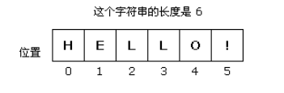

## 引号

字符串String是由双引号(")或单引号(')声明的

## 反引号 `` - 多行字符串 & 嵌入变量

```js
// 普通字符串
console.log(`In JavaScript '\n' is a line-feed.`);

// 多行字符串 - 空格、缩进和换行都会被保留在输出中。
console.log(`In JavaScript this is
not legal.`);


// 字符串中嵌入变量 - 模板字符串中嵌入变量，要将变量名写在${}之中
var name = "Bob", time = "today";
console.log(`Hello ${name}, how are you ${time}?`);   // Hello Bob, how are you today?
var x = 1, y = 2;

console.log(`${x} + ${y} = ${x + y}`);
// "1 + 2 = 3"

function func() {
    return 'Hello';
}

`${func()} World`;
// "Hello World"
```


## 反斜线- 特殊符号

```js
'Wouldn\'t you prefer this book?'    //"Wouldn't you prefer this book?"
'Did she say \'Hello\'?'             //"Did she say 'Hello'?"
"Did she say \"Hello\"?"             //"Did she say "Hello"?"
"Prev \\ Next" 						// "Prev \ Next"
'\a' 								// "a"
```

## 转义字符

```js
\0 空字节
\n 换行
\t 制表
\b 空格
\r 回车
\f 进纸
\\ 斜杠
\' 单引号
\" 双引号
\xnn 以十六进制nn表示一个字符(n为0-f)，如\x41表示'A'
\unnnn 以十六进制nnnn表示一个Unicode字符(n为0-f)，如\u03a3表示希腊字符ε
```

快速转为string 用+

```js
var lang = "java";
lang = lang + "script"; //'javascript'
```

## string数字转数字

```js
a='3';
console.log(a*1);
console.log(a>>>0);//转换为10进制 2就是换成2进制
```


## string内容操作函数 toString()、toLocaleString()、valueOf() 

```js
console.log("test".valueOf());//"test"
console.log("test".toString());//"test"
console.log("test".toLocaleString());//"test"
```

由于alert()要接收字符串参数，它会在后台调用toString()方法，会得到与toString()方法相同的结果

```js
alert([1,2,3]);//'1,2,3'
```

## chartAt()、中括号[]、charCodeAt()和fromCharCode()

chartAt()

```js
var str = "hello";
console.log(str.charAt(1));//e
console.log(str.charAt(-1));//''
console.log(str.charAt());//h 
console.log(str.charAt(NaN));//h
//argument会被转为数字
var str = "hello";
console.log(str.charAt(true));//'e'
console.log(str.charAt(false));//'h'
console.log(str.charAt('abc'));//'h'
console.log(str.charAt({}));//'h'
console.log(str.charAt([2]));//'l'
```

其他方式的取char

```js
var str = "hello";
console.log(str.charAt(1));//'e'
console.log(str.substring(1,2));//'e'
console.log(str.slice(1,2));//'e'
console.log(str.substr(1,1));//'e'
```

中括号[]

```js
var str = "hello";
console.log(str[0]);//h
console.log(str[[1]]);//e
console.log(str[false]);//undefined
console.log(str[-1]);//undefined
console.log(str[NaN]);//undefined
console.log(str[]);//报错
```

charCodeAt() 返回的是指定位置的字符16位Unicode编码

```js
var str = "hello";
console.log(str.charCodeAt());//104
console.log(str.charCodeAt(0));//104
console.log(str.charCodeAt(1));//101
```

fromCharCode()接收一个或多个字符编码，然后把它们转换成一个字符串

```js
console.log(String.fromCharCode(104,101,108,108,111));//'hello'
console.log(String.fromCharCode(0x6211,0x662f,0x5c0f,0x706b,0x67f4));//'我是小火柴'
```

## 字符串拼接   concat()和加号+ 

```js
var stringValue = 'hello ';
var result = stringValue.concat('world','!');
console.log(result);//'hello world!'
(true).concat('false');//报错，第一个参数必须字符串
var o = {valueOf:function(){return '1';}};
o + 2;//'12'
var o = {valueOf:function(){return 1;}};
o + 2;//3

```

> [注意]由于数组也存在concat()方法，参数会按照首先出现的参数是数组还是字符串来决定如何转换
>
> '1,2,3,'.concat([4,5]);	//	'1,2,3,4,5'
> 		[1,2,3].concat(',4,5');	//	[1, 2, 3, ",4,5"]

##  string变array - split()

```js
stringObject.split(separator,howmany)
//字符串或正则表达式，从该参数指定的地方分割 stringObject。
//howmany (可选)该参数可指定返回的数组的最大长度。如果设置了该参数，返回的子串不会多于这个参数指定的数组。如果没有设置该参数，整个字符串都会被分割，不考虑它的长度。
```

```js
str.split(/\W/);//去掉所有的非字母
str.split(" ")；//按照空格
```


## 创建子字符串 slice()、substr()（弃用）和substring()

slice() 返回这个字符串中从start位置的字符到(但不包含)end位置的字符的一个子字符串；如果end为undefined或不存在，则返回从start位置到字符串结尾的所有字符。 **start 和 end 不能调换**

　　**如果start是负数**，则start = max(length + start,0)

　　**如果end是负数**，则end = max(length + end,0)

```js
var stringValue = 'hello world';
console.log(stringValue.slice());//'hello world'
console.log(stringValue.slice(0, 2));//'he'
console.log(stringValue.slice(0, -2));//'hello wor'
console.log(stringValue.slice(2));//'llo world'
console.log(stringValue.slice(-2));//'ld'
console.log(stringValue.slice(2,undefined));//'llo world'
console.log(stringValue.slice(2,-5));//'llo '
console.log(stringValue.slice(2,-20));//''
console.log(stringValue.slice(20));//''
console.log(stringValue.slice(-2,2));//''
```

特殊argument

```js
var stringValue = 'hello world';
console.log(stringValue.slice(NaN));//'hello world'
console.log(stringValue.slice(0,NaN));//''
console.log(stringValue.slice(true,[3]));//'el'
console.log(stringValue.slice(null,undefined));//'hello world'
console.log(stringValue.slice({}));//'hello world'
console.log(stringValue.slice('2',[5]));//'llo'
```

substring(start,end) 返回这个字符串中从start位置的字符到(但不包含)end位置的字符的一个子字符串；如果end为undefined或不存在，则返回从start位置到字符串结尾的所有字符

**如果任一参数是NaN或负数**，则被0取代

**如果任一参数大于字符串长度**，则被字符串长度取代

**如果start 大于 end**，则交换它们的值 

```js
var stringValue = 'hello world';
console.log(stringValue.substring());//'hello world'
console.log(stringValue.substring(2));//'llo world'
console.log(stringValue.substring(2,undefined));//'llo world'
console.log(stringValue.substring(20));//''
console.log(stringValue.substring(-2,2));//'he'
console.log(stringValue.substring(NaN,2));//'he'
console.log(stringValue.substring(-2,20));//'hello world'
```

特殊的值

```js
var stringValue = 'hello world';
console.log(stringValue.substring(true,[3]));//'el'
console.log(stringValue.substring(null,undefined));//'hello world'
console.log(stringValue.substring({}));//'hello world'
console.log(stringValue.substring('2',[5]));//'llo'
```

## 大小写转换 toLowerCase()、toLocaleLowerCase()(针对地区)、toUpperCase()、toLocaleUpperCase()(针对地区)

## 查找子串位置  indexOf()和lastIndexOf()

indexOf(searchString,start) 返回searchString首次出现的位置，如果没有找到则返回-1

```js
var string = 'hello world world';
console.log(string.indexOf('ld'));//9
console.log(string.indexOf('ld',undefined));//9
console.log(string.indexOf('ld',NaN));//9
console.log(string.indexOf('ld',-1));//9
console.log(string.indexOf('ld',10));//15
```

与indexOf()不同，lastIndexOf()从右向左查找

lastIndexOf(searchString,start) 返回searchString第一次出现的位置，如果没有找到则返回-1。 searchString表示要搜索的子字符串；start表示该搜索的开始位置，若忽略该参数或该参数为undefined、NaN时，start = length - 1；若start为负数，start = 0。

```js
var string = 'hello world world';
console.log(string.lastIndexOf('ld'));//15
console.log(string.lastIndexOf('ld',undefined));//15
console.log(string.lastIndexOf('ld',NaN));//15
console.log(string.lastIndexOf('ld',-1));//-1
console.log(string.lastIndexOf('h',-1));//0
console.log(string.lastIndexOf('w',undefined));//12 
console.log(string.lastIndexOf('ld',10));//9
console.log(string.lastIndexOf('ld',[10]));//9 
```

**lastIndexOf()方法常用于获取URL地址中的扩展名** 

## 正则匹配

### [**正则基本介绍以及工具**](https://www.runoob.com/regexp/regexp-syntax.html)

工具 ： https://regex101.com/

**常用元字符**

| 代码 | 说明                       |
| ---- | -------------------------- |
| .    | 匹配除换行符以外的任意字符 |
| \w   | 匹配字母或数字或下划线     |
| \s   | 匹配任意的空白符           |
| \d   | 匹配数字                   |
| \b   | 匹配单词的开始或结束       |
| ^    | 匹配字符串的开始           |
| $    | 匹配字符串的结束           |

**常用限定符**

| 代码/语法 | 说明             |
| --------- | ---------------- |
| *         | 重复零次或更多次 |
| +         | 重复一次或更多次 |
| ?         | 重复零次或一次   |
| {n}       | 重复n次          |
| {n,}      | 重复n次或更多次  |
| {n,m}     | 重复n到m次       |

**常用反义词**

| 代码/语法 | 说明                                       |
| --------- | ------------------------------------------ |
| \W        | 匹配任意不是字母，数字，下划线，汉字的字符 |
| \S        | 匹配任意不是空白符的字符                   |
| \D        | 匹配任意非数字的字符                       |
| \B        | 匹配不是单词开头或结束的位置               |
| [^x]      | 匹配除了x以外的任意字符                    |
| [^aeiou]  | 匹配除了aeiou这几个字母以外的任意字符      |

### 基本方法

#### match()

　　若匹配失败，则match()方法返回null

```js
'x'.match(/y/);//null
var string = 'cat,bat,sat,fat';
var matches = string.match('at');
console.log(matches,matches.index,matches.input);//['at'] 1 'cat,bat,sat,fat'
//正则
var str1 = 'j1h342jg24g234j 3g24j1';
array = str1.match(/\d+/g);
console.log(array);//["1", "342", "24", "234", "3", "24", "1"]
```

#### search()

接受一个正则或字符串的参数，返回匹配的内容在字符串中首次出现的位置，类似于不能设置起始位置的indexOf，找不到返回-1 (全局标志g影响)

```js
var string = 'cat,bat,sat,fat';
var pattern = /.at/;
var pos = string.search(pattern);
console.log(pos);//0

var string = 'cat,bat,sat,fat';
var pattern = /.at/g;
var pos = string.search(pattern);
console.log(pos);//0

var string = 'cat,bat,sat,fat';
var pattern = 'at';
var pos = string.search(pattern);
console.log(pos);//1
```

#### replace()

用于替换一个或多个子字符串。它接收两个参数：第一个是正则表达式或字符串，表示待查找的内容；第二个是字符串或函数，表示替换内容。返回替换后的字符串 (全局标志g影响)

```js
var string = 'cat,bat,sat,fat';
var result = string.replace('at','ond'); // var result = string.replace(/at/,'ond');
console.log(result);//'cond,bat,sat,fat'

var string = 'cat,bat,sat,fat';
var result = string.replace(/at/g,'ond');
console.log(result);//'cond,bond,sond,fond'
```

#### split()

基于指定的分隔符将一个字符串分割成多个字符串，并将结果放在一个数组中，分隔符可以是字符串，也可以是一个RegExp

```js
var colorText = 'red,blue,green,yellow';
console.log(colorText.split(''));//["r", "e", "d", ",", "b", "l", "u", "e", ",", "g", "r", "e", "e", "n", ",", "y", "e", "l", "l", "o", "w"]
console.log(colorText.split(','));//["red", "blue", "green", "yellow"]
console.log(colorText.split(',',2));//["red", "blue"]
console.log(colorText.split(',',6));//["red", "blue", "green", "yellow"]
console.log(colorText.split('-'));//["red,blue,green,yellow"]
console.log(colorText.split(/\,/));//["red", "blue", "green", "yellow"]
console.log(colorText.split(/e/));//["r", "d,blu", ",gr", "", "n,y", "llow"]
console.log(colorText.split(/[^\,]+/));//将除去逗号以外的字符串变为分隔符["", ",", ",", ",", ""],IE8-会识别为[",",",",","]
```

## 去除首尾空格

trim()返回的是字符串的副本，所以原始字符串中的前置及后缀空格会保持不变，包括制表符(\t)、换行符(\n)和回车符(\r)

```js
var string = '    hello world   ';
console.log(string.trim());//'hello world'
'\r\nabc \t'.trim() // 'abc'
```

## 字符串比较

localeCompare()方法用于比较两个字符串

-  如果字符串在字母表中应该排在字符串参数之前，则返回一个负数(大多数情况下为-1)
-  如果字符串等于字符串参数，则返回0
-  如果字符串在字母表中应该排在字符串参数之后，则返回一个正数(大多数情况下为1)

## 结合array - join（）

如果不给join()方法传入任何值，则使用逗号作为分隔符

```js
var a = [1,2,3];
console.log(a.join());//'1,2,3'
console.log(a.join(' '));//'1 2 3'
console.log(a.join(''));//'123'

var b = new Array(10);
b.join('-');//'---------'，9个连字符组成的字符串
```

```js
var colors = [1,undefined,2,null,3];
console.log(colors.join());//'1,,2,,3'
console.log(Array.prototype.join.call('hello', '-'));// "h-e-l-l-o"
var obj = { 0: 'a', 1: 'b', length: 2 };
console.log(Array.prototype.join.call(obj, '-'));// 'a-b'
```

> 若对象没有length属性，就不是类数组，也就不能调用数组的方法

## 栈&LIFO - Last-In-First-Out

### push() 

接收任意数量的参数， 添加到数组末尾，并 修改后数组的长度。所以，该数组会改变原数组

```js
var a = [];
console.log(a,a.push(1));//[1] 1
console.log(a,a.push('a'));//[1,'a'] 2
console.log(a,a.push(true, {}));//[1,'a',true,{}] 4
console.log(a,a.push([5,6]));//[1,'a',true,{},[5,6]] 5
```

　　如果需要合并两个数组，可以使用apply方法

```js
var a = [1, 2, 3];
var b = [4, 5, 6];
console.log(a,Array.prototype.push.apply(a, b));//[1,2,3,4,5,6] 6
```

push()方法也可以向对象中添加元素，添加后的对象变成类数组对象，即新加入元素的键对应数组的索引，并且对象有一个length属性

push()方法也可以向对象中添加元素，添加后的对象变成类数组对象，即新加入元素的键对应数组的索引，并且对象有一个length属性

```js
var obj = {a: 1};
console.log(obj,[].push.call(obj, 2));// {a:1, 0:2, length: 1}
console.log(obj,[].push.call(obj, [3]));// {a:1, 0:2, 1:[3], length: 2}
```

### pop()

　　pop()方法从数组末尾移除最后一项，减少数组的length值，然后返回移除的项。所以，该数组会改变原数组

```js
var a = ['a', 'b', 'c'];
console.log(a,a.pop()); // ['a', 'b'] 'c'
```

　 

### shift()

　　shift()方法移除数组中的第一个项并返回该项，同时数组的长度减1。所以，该数组会改变原数组

```js
var a = ['a', 'b', 'c'];
console.log(a,a.shift());//['b', 'c'] 'a'
```

### unshift()

　　unshift()方法在数组前端添加任意个项并返回新数组长度。所以，该数组会改变原数组

```js
var a = ['a', 'b', 'c'];
console.log(a,a.unshift('x')); //['x', 'a', 'b', 'c'] 4
```

　　当使用多个参数调用unshift()时，参数是一次性插入的而非一次一个地插入。这意味着最终的数组中插入的元素的顺序和它们在参数列表中的顺序一致

```js
var a = ['a', 'b', 'c'];
console.log(a,a.unshift('x','y','z')); //['x','y','z','a', 'b', 'c'] 6
```


# 操作方程

## js判断一个字符串是否包含在另一个字符串

```js
'Blue Whale'.includes('blue'); // returns false
'Blue Whale'.includes('Blue'); // returns true
```

## js 替换指定位置的字符串

```js
//str:原始字符串，index,开始位置,changeStr，改变后的字
changeStr(str,index,changeStr){
	 return str.substr(0, index) + changeStr+ str.substr(index + changeStr.length);
	 }
```

js去掉所有的空格（连续空格）提内容

```js
array.trim().split(/\s+/)
```

## js正则去掉不是字母

```js
str = str.toLowerCase().replace(/[\W_]/g, "");
```

## js 正则将大小写之间分开

```js
str.replace(/([a-z])([A-Z])/g, "$1 $2");
//TheAndyGriffith_Show
//The Andy Griffith_Show

//is followed by an uppercase letter [(?=[A-Z])]
//whitespace character [\s]
str.split(/\s|_|(?=[A-Z])/)
```

## 应用正则

### 去掉非数字

```js
var s ="价格4500元";

var num= s.replace(/[^0-9]/ig,"");

alert(num);//4500

var s ="价格4500元，等级：2";

var num = s.replace(/[^0-9]/ig,"");

alert(num);//45002
```


### 替换指定符号

```js
function convertHTML(str) {
  // Use Object Lookup to declare as many HTML entities as needed.
  const htmlEntities = {
    "&": "&amp;",
    "<": "&lt;",
    ">": "&gt;",
    '"': "&quot;",
    "'": "&apos;"
  };
  // Using a regex, replace characters with it's corresponding html entity
  return str.replace(/([&<>\"'])/g, match => htmlEntities[match]);
}
```

## Binary to string 变化

```js
function binaryAgent(str) {
   return str.split(/\s/).map(function (val){
    return String.fromCharCode(parseInt(val, 2));
  }).join("");
}

binaryAgent("01000001 01110010 01100101 01101110 00100111 01110100 00100000 01100010 01101111 01101110 01100110 01101001 01110010 01100101 01110011 00100000 01100110 01110101 01101110 00100001 00111111");
```

## 字符串中的数字

```js
parseInt(str); // 会提取字符串中的整数部分，遇到非整数会立即停止提取；适合去掉css中的单位
parseFloat(str) // 同上，可以提取小数
```

## js保留两位小数方法总结

```js
//num:要操作的数字     size：要保留的位数
parseFloat(num).toFixed(size);
```

