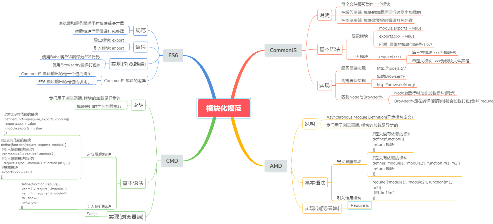
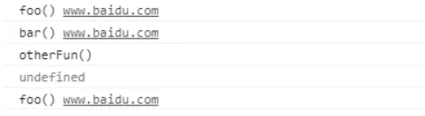
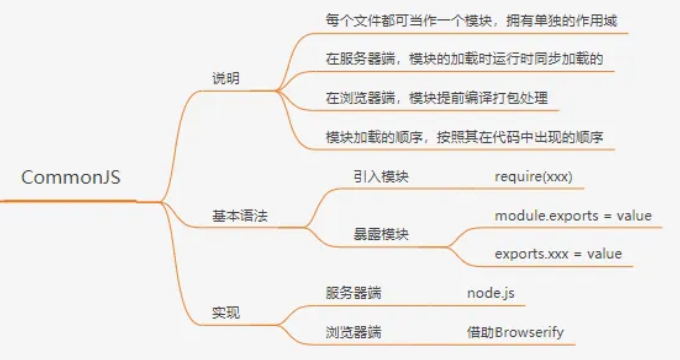
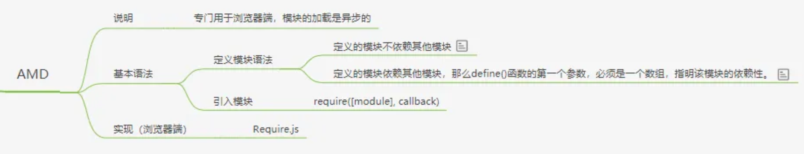
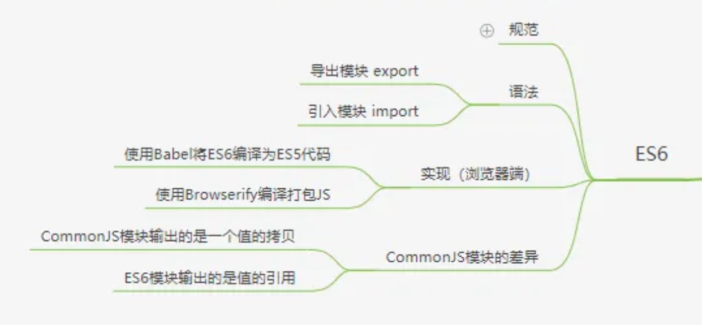
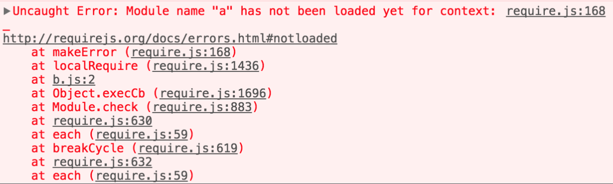

整体的理解

- 服务器端
  	CommonJS  同步加载 NodeJS

- 浏览器(客户端)
  	异步加载
  	AMD(异步模块定义) -> require.js
  	CMD(通用模块定义) -> seajs

- 服务器端+客户端
  	UMD

原生模块定义(ES6) -> Babel(ES5)

## 考点

- 每种模块化的特点
- 模块化的api 以及本质原理
- 循环引用的解决办法
- 重点掌握的commonJS AMD ES6

## 模块化的基本了解

- 将一个复杂的程序依据一定的规则(规范)封装成几个块(文件), 并进行组合在一起
- 块的内部数据与实现是私有的, 只是向外部暴露一些接口(方法)与外部其它模块通信

简单的说就是当你越写越多文件，或者说越来越团队化工作会出现的互相引用变量的问题

## 一般写法-全局function

```js
　function m1(){
　　　　//...
　　}

　　function m2(){
　　　　//...
　　}
```

> 缺点："污染"了全局变量，无法保证不与其他模块发生变量名冲突，而且模块成员之间看不出直接关系。

## 对象封装写法

```js
var module1 = new Object({
	_count : 0,
    flag:false,
	m1 : function (){
 		 //...
	},
	m2 : function (){
 	 //...
	}
});
//引用变量
if(module1.flag){
   //...
}
```

> 缺点：写法会暴露所有模块成员，内部状态可以被外部改写（对象私有属性会被改）

## 立即执行函数写法-Immediately-Invoked Function Expression，IIFE（不算做严谨闭包）

达到不暴露私有成员的目的, 这样保证了数据是私有的, 外部只能通过暴露的方法操作 

是为了形成块级作用域，不污染全局。常用的写法有：

- (function(形参){函数体})(实参)
- (function(形参){函数体}(实参))
- !function(形参){函数体}(实参)

```js
var i = function(){ return 10; }();
true && function(){ /* code */ }();
0, function(){ /* code */ }();
```

甚至像下面这样写，也是可以的。

```js
!function () { /* code */ }();
~function () { /* code */ }();
-function () { /* code */ }();
+function () { /* code */ }();
```

### IIFE模式：匿名函数自调用(闭包)

```html
// index.html文件
<script type="text/javascript" src="module.js"></script>
<script type="text/javascript">
    myModule.foo()
    myModule.bar()
    console.log(myModule.data) //undefined 不能访问模块内部数据
    myModule.data = 'xxxx' //不是修改的模块内部的data
    myModule.foo() //没有改变
</script>
```
```js
// module.js文件
(function(window) {
  let data = 'www.baidu.com'
  //操作数据的函数
  function foo() {
    //用于暴露有函数
    console.log(`foo() ${data}`)
  }
  function bar() {
    //用于暴露有函数
    console.log(`bar() ${data}`)
    otherFun() //内部调用
  }
  function otherFun() {
    //内部私有的函数
    console.log('otherFun()')
  }
  //暴露行为
  window.myModule = { foo, bar } //ES6写法
})(window)
```




> 优点: 模块外部没有办法修改module的变量函数
>
> 缺点：功能相对较弱，封装过程增加了工作量、仍会导致命名空间污染可能、闭包是有成本的。
>
> 问题: 如果当前这个模块依赖另一个模块怎么办?

### IIFE模式增强 : 引入依赖 - 现代模块实现的基石

```js
// module.js文件
(function(window, $) {
  let data = 'www.baidu.com'
  //操作数据的函数
  function foo() {
    //用于暴露有函数
    console.log(`foo() ${data}`)
    $('body').css('background', 'red')
  }
  function bar() {
    //用于暴露有函数
    console.log(`bar() ${data}`)
    otherFun() //内部调用
  }
  function otherFun() {
    //内部私有的函数
    console.log('otherFun()')
  }
  //暴露行为
  window.myModule = { foo, bar }
})(window, jQuery)
```
```html
<!--  index.html文件 引入的js必须有一定顺序 -->
  <script type="text/javascript" src="jquery-1.10.1.js"></script>
  <script type="text/javascript" src="module.js"></script>
  <script type="text/javascript">
    myModule.foo()
  </script>
```

上例子通过jquery方法将页面的背景颜色改成红色，所以必须先引入jQuery库，就把这个库当作参数传入。

> 这样做除了保证模块的独立性，还使得模块之间的依赖关系变得明显.
>
> **优点：**
>
> 相比于使用一个js文件，这种多个js文件实现最简单的模块化的思想是进步的。　
>
> **缺点：**
>
> 污染全局作用域。 因为每一个模块都是暴露在全局的，简单的使用，会导致全局变量命名冲突，当然，我们也可以使用命名空间的方式来解决。
>
> 对于大型项目，各种js很多，开发人员必须手动解决模块和代码库的依赖关系，后期维护成本较高。
>
> 依赖关系不明显，不利于维护。 比如main.js需要使用jquery，但是，从上面的文件中，我们是看不出来的，如果jquery忘记了，那么就会报错。

### 放大模式

### 宽放大模式（Loose augmentation）

与"放大模式"相比，＂宽放大模式＂就是"立即执行函数"的参数可以是空对象。

##  模块化的好处

- 避免命名冲突(减少命名空间污染)
- 更好的分离, 按需加载
- 更高复用性
- 高可维护性

## 引入多个`<script>`后出现出现问题

因为现在也免得导入都是通过多个script请求

- 请求过多

首先我们要依赖多个模块，那样就会发送多个请求，导致请求过多

- 依赖模糊

我们不知道他们的具体依赖关系是什么，也就是说很容易因为不了解他们之间的依赖关系导致加载先后顺序出错。

- 难以维护

## 最流行的commonjs, AMD, CMD , ES6 规范

这里下面每一个都有实际的代码练习 [github连接](https://github.com/SavanCode/blog-code)

###  1. CommonJS的模块化 

##### CommonJS exports 本质是什么?   面试题

是exports的对象~ 所以 module.exports =function(){} 或者 ={} 会被直接覆盖~~~~

#### **描述过程** 面试题

通过require第一次加载该脚本，就会执行整个脚本，然后在内存生成一个对象。以后需要用到这个模块的时候，就会到`exports`属性上面取值。即使再次执行`require`命令，也不会再次执行该模块，而是到缓存之中取值。



#### 特点

> 1. 主要用于服务器端，不适合前端；
> 2. 在服务器端,模块的加载是运行时同步加载的；
> 3. 在浏览器端，无法直接运行在浏览器端上，需要通过工具转换成标准的 ES5 ；
> 4. 所有代码都运行在模块作用域，不会污染全局作用域。(一个文件一个模块)
> 5. 模块可以多次加载，但是只会在第一次加载时运行一次，然后运行结果就被缓存了，以后再加载，就直接读取缓存结果。要想让模块再次运行，必须清除缓存。
>
> 6. 模块加载的顺序，按照其在代码中出现的顺序

服务器端模块化的规范,Node.js 采用了这个规范

CommonJS规范规定，每个模块内部，module变量代表当前模块。这个变量是一个对象，它的exports属性（即module.exports）是对外的接口。**加载某个模块，其实是加载该模块的module.exports属性**

#### CommonJS 有三个 API 定义模块

1. require 导入
2. exports 导出
3. module 模块本身

- 暴露模块：`module.exports = value`或`exports.xxx = value`
- 引入模块：`require(xxx)`,如果是第三方模块，xxx为模块名；如果是自定义模块，xxx为模块文件路径

#### 引入整个模块

```js
// example.js
var x = 5;
var addX = function (value) {
  return value + x;
};
exports.x = x;//module.exports.x=x;
exports.addX = addX;
module.exports.add=(m,n)=>console.log(m+n);
```

```js
var example = require('./example.js'); 
console.log(example.x); // 5
console.log(example.addX(1)); // 6
example.add(1,5); // 6
```

#### 引入变量

```js
// lib.js
var counter = 3;
function incCounter() {
  counter++;
}
module.exports = {
  counter: counter,
  incCounter: incCounter,
};
```

```js
// main.js
var counter = require('./lib').counter;
var incCounter = require('./lib').incCounter;

console.log(counter);  // 3
incCounter();
console.log(counter); // 3
```

CommonJS 加载模块是同步的，所以只有加载完成才能执行后面的操作。像Node.js主要用于服务器的编程，加载的模块文件一般都已经存在本地硬盘，所以加载起来比较快，不用考虑异步加载的方式，所以CommonJS规范比较适用。但如果是浏览器环境，要从服务器加载模块，这是就必须采用异步模式。所以就有了 AMD CMD 解决方案。

#### 小总结

> Browserify工具可以把nodejs的模块编译成浏览器可用的模块
>
> **优点：**
>
> CommonJS规范在服务器端率先完成了JavaScript的模块化，解决了依赖、全局变量污染的问题，这也是js运行在服务器端的必要条件。
>
> **缺点：**
>
> CommonJS 是同步加载模块的，在服务器端，文件都是保存在硬盘上，所以同步加载没有问题，
>
>  但是对于浏览器端，需要将文件从服务器端请求过来，那么同步加载就不适用了，所以，CommonJS是不太适用于浏览器端。

### 2. AMD(Asynchromous Module Definition) 异步模块定义

#### 描述流程 面试题

> 找了很多 都是描述得非常模糊。 下面的描述主要来源是一些我个人比较赞同的回答 
>
> [来源1](https://stackoverflow.com/questions/12117935/how-do-amd-loaders-work-under-the-hood)   [来源2](https://github.com/requirejs/requirejs/wiki/Differences-between-the-simplified-CommonJS-wrapper-and-standard-AMD-define#standard)

由于js是单线程，所以实际上异步指的是对于其执行顺序上的控制优化。

##### **So how does it work?**

1. RequireJS reads the dependency array. 读取依赖
2. Then it checks if each module was already registered for the current context: 检查是否在缓存

   1. If module was registered uses it;
   2. Otherwise:
      - resolve the ID into a URI by checking the [paths.config](http://requirejs.org/docs/api.html#config) and current module path;
      - loads script;
      - If AMD module, repeat steps till all the dependencies are loaded.
3. After all the dependencies are ready it calls the definition function passing the dependencies as arguments, it will then register the module as the value returned by the definition function. 全部的依赖执行完之后，将定义模块的结果返回作为缓存结果

##### **Does it mean that AMD loads a,b,c asynchronously then checks to see if those files are loaded (doesn't care about the order) then execute the callback?**

 Correct. AMD-define() allows you to load all scripts in any order you wish (i.e. ultimately you let the browser roll the dice and load them in any order it sees fit at any time it sees fit).

Then any time a define() is called, the AMD-loader will check if the current list of dependencies for this define has already been satisfied. If it is, it will call the current callback immediately, and after that, it will check if any of the previously registered define-callbacks can be called too (because all of their dependencies have been satisfied). If the dependencies for this callback have not all been satisfied yet, the callback is added to the queue to be resolved later.

This eventually results in all callbacks being called in the correct dependency order, regardless of the order in which the scripts have been loaded/executed in the first place.

> `RequireJS` 基本思想为，通过一个函数来将所有所需的或者所依赖的模块装载进来，然后返回一个新的函数（模块）。后续所有的关于新模块的业务代码都在这个函数内部操作。



#### why RequireJS 

AMD 是 RequireJS 在推广过程中对模块定义的规范化产出

> requireJS主要解决两个问题：
>
> 1 多个js文件可能有依赖关系，被依赖的文件需要早于依赖它的文件加载到浏览器。
>
> 2 js加载的时候浏览器会停止页面渲染，加载文件愈多，页面失去响应的时间愈长。

AMD异步加载模块。它的模块支持对象 函数 构造器 字符串 JSON等各种类型的模块。

#### 特点

> - 专门用于浏览器端；
> - **模块的加载是异步的**， 模块的加载不影响它后面语句的运行。所有依赖这个模块的语句，都定义在一个回调函数中，等到加载完成之后，这个回调函数才会运行；
> - 依赖前置。

#### AMD定义两个API 依赖声明

```js
define(id?: String, dependencies?: String[], factory: Function|Object);
//定义一个名为 myModule 的模块，它依赖 jQuery 模块：
define('myModule', ['jquery'], function($) {
    $('body').text('hello world');// $ 是 jquery 模块的输出
});
// 使用
```

`id` 是模块的名字，它是可选的参数。

`dependencies` 指定了所要依赖的模块列表，它是一个数组，也是可选的参数，每个依赖的模块的输出将作为参数一次传入 `factory` 中。如果没有指定 `dependencies`，那么它的默认值是 `["require", "exports", "module"]`。

```js
define(function(require, exports, module) {})
```

`factory` 是最后一个参数，它包裹了模块的具体实现，它是一个函数或者对象。如果是函数，那么它的返回值就是模块的输出接口或值。

1. **在 dependencies 声明依赖**

```js
//定义没有依赖的模块
define(function(){
   return //模块
})
//定义有依赖的模块
define(['module1', 'module2'], function(m1, m2){
   return //模块
})
```

2. **在 factory 中 require 依赖**

   这种情况下 factory 的参数默认为 require, exports, modules 。但是真正用到的只有 require，所以其他的可以不用写啦。

```js
//这里是使用时候 github练习例子中是main.js文件中
(function(){
    requirejs.config({
      baseUrl: 'js/', //基本路径 出发点在根目录下
      paths: {
        //映射: 模块标识名: 路径
        module1: './modules/module1', //此处不能写成alerter.js,会报错
        //module2....
      }
    })
    require(['module1', 'module2'], function(m1, m2){
    	//使用m1/m2
    })
})()
```

下面是例子

```js
//定义alter模块
define(function () {
    var alertName = function (str) {
        alert("I am " + str);
    }
    var alertAge = function (num) {
        alert("I am " + num + " years old");
    }
    return {
        alertName: alertName,
        alertAge: alertAge
    };
});
```

```js
//引入模块
require(['alert'], function (alert) {
    alert.alertName('zhangsan');
    alert.alertAge(21);
});
```

#### 小总结

> **优点：**
>
> - 可以在不转码情况下直接在浏览器运行
> - 可以异步加载模块。可以并行加载多个模块。
> - 可以运行在浏览器或者Node.js
>
> **缺点：**
>
> - JS 运行环境没有原生支持 AMD，需要先导入实现了 AMD 的库后才能正常使用。
> - 开发成本高，代码的阅读和书写比较困难，模块定义方式的语义不顺畅

### 3. CMD （Common Module Definition）通用模块定义(简单看看)

CMD规范专门用于浏览器端，模块的加载是异步的，模块使用时才会加载执行。CMD规范整合了CommonJS和AMD规范的特点。在 Sea.js 中，所有 JavaScript 模块都遵循 CMD模块定义规范。

#### 用法

- 通过 `exports` 暴露接口。这意味着不需要命名空间了，更不需要全局变量。这是一种彻底的命名冲突解决方案。
- 通过 `require` 引入依赖。这可以让依赖内置，开发者只需关心当前模块的依赖，其他事情 `Sea.js` 都会自动处理好。对模块开发者来说，这是一种很好的 关注度分离，能让程序员更多地享受编码的乐趣。
- 通过 `define` 定义模块，更多详情参考[SeasJS | 极客学院](https://link..im/?target=http%3A%2F%2Fwiki.jikexueyuan.com%2Fproject%2Fhello-seajs%2Fusage-guide.html)。

### 4. [ES6模块化 - 最香的 - import export](https://developer.mozilla.org/zh-CN/docs/Web/JavaScript/Reference/Statements/export) 



> 1. 在node中使用的是exports，不要混淆了
> 2. 这里一定注意一个地方**有效的路径符号**. 完整的非相对路径。这样在将其传给new URL(moduleSpecifier)的时候才不会报错。
> **以 / 开头。**
> **以 ./ 开头。**
> **以 ../ 开头。**
> 3. 在文件中的任何位置引入 import 模块都会被提前到文件顶部
> 4. 同一模块只会加载一次
> 5. 加载之后执行
> 6. this是undefined,var变量不会声明到windows

#### 基本定义例子

**ES6 在语言标准的层面上，实现了模块功能，而且实现得相当简单，完全可以取代 CommonJS 和 AMD 规范，成为浏览器和服务器通用的模块解决方案**

export命令用于规定模块的对外接口，import命令用于输入其他模块提供的功能。

```js
/** 定义模块 math.js **/
var basicNum = 0;
var add = function (a, b) {
    return a + b;
};
export { basicNum, add };
```
```js
/** 引用模块 **/
import { basicNum, add } from './math';
function test(ele) {
    ele.textContent = add(99 + basicNum);
} 
```

#### 花式自定义export import

如上例所示，使用import命令的时候，用户需要知道所要加载的变量名或函数名，否则无法加载。为了给用户提供方便，让他们不用阅读文档就能加载模块，就要用到export default命令，为模块指定默认输出。

```js
// export-default.js
export default function () {
  console.log('foo');
}

//例子：
export let myVariable = Math.sqrt(2);
export { name1, name2, …, nameN };
export { variable1 as name1, variable2 as name2, …, nameN };
export let name1, name2, …, nameN; // also var
export let name1 = …, name2 = …, …, nameN; // also var, const
 
export default   function (…) { … } // also class, function*
export default function name1(…) { … } // also class, function*
export { name1 as default, … };
 
export * from …;
export { name1, name2, …, nameN } from …;
export { import1 as name1, import2 as name2, …, nameN } from …;
```
```js
// import-default.js
import customName from './export-default';
customName(); // 'foo'


//导入整个模块的内容，这将myModule插入当前作用域
import * as myModule from '/modules/my-module.js';
//重命名接口
import {reallyReallyLongModuleExportName as shortName} from '/modules/my-module.js';
//运行模块中的全局代码, 执行js,但实际上不导入任何值
import '/modules/my-module.js'; 

//例子：
import defaultMember from "module-name";
import * as name from "module-name";
import { member } from "module-name";
import { member as alias } from "module-name";
import { member1 , member2 } from "module-name";
import { member1 , member2 as alias2 , [...] } from "module-name";
import defaultMember, { member [ , [...] ] } from "module-name";
import defaultMember, * as name from "module-name";
import "module-name";
```

#### [动态import](https://developer.mozilla.org/zh-CN/docs/Web/JavaScript/Reference/Statements/import#%E5%8A%A8%E6%80%81import)

关键字import可以像调用函数一样来动态的导入模块。以这种方式调用，将返回一个 `promise`。

```js
import('/modules/my-module.js')
  .then((module) => {
    // Do something with the module.
  });
```

这种使用方式也支持 `await` 关键字。

```js
let module = await import('/modules/my-module.js');
```

#### 引入type module

```html
<script type="module" src="...."></script>
//会立即下载 但是延迟到文档解析完成之后执行 按照上到下的顺序
```

#### 细节

##### 模块中默认为严格模式，this指向undefined

##### 静态化编译 ： import 优先执行 export变量提升

##### ES 的 推荐 export 和 不建议 export default

ES 模块化导出有 export 和 export default 两种。这里我们建议减少使用 export default 导出，原因是一方面 export default 导出整体对象结果，不利于 tree shaking 进行分析；另一方面，export default 导出的结果可以随意命名变量，不利于团队统一管理。

Nicholas C. Zakas 有一篇文章： [Why I've stopped exporting defaults from my JavaScript modules](https://link.juejin.im/?target=https%3A%2F%2Fhumanwhocodes.com%2Fblog%2F2019%2F01%2Fstop- using-default-exports-javascript-module%2F) ，表达了类似的观点。

### ES6 模块与 CommonJS 模块的对比

- CommonJS 模块输出的是一个值的拷贝，ES6 模块输出的是值的引用

> 这里um。。。我没有找到很好的例子，基本大佬们解释的判断是从webpack中看怎么打包使用的。 从而推断的

- CommonJS 模块是运行时加载，ES6 模块是编译时输出接口
- CommonJS 的this是当前模块，ES6 Module 的this 是undefined
- CommonJS 的动态语法可以写在判断里面，ES6 Module静态语法只能写在顶层
- CommonJS 单个导出，ES6 Module可以花样导出

### CommonJS

1. 对于基本数据类型，属于复制。即会被模块缓存。同时，在另一个模块可以对该模块输出的变量重新赋值。
2. 对于复杂数据类型，属于浅拷贝。由于两个模块引用的对象指向同一个内存空间，因此对该模块的值做修改时会影响另一个模块。
3. 当使用require命令加载某个模块时，就会运行整个模块的代码。
4. **当使用require命令加载同一个模块时，不会再执行该模块，而是取到缓存之中的值。**也就是说，CommonJS模块无论加载多少次，都只会在第一次加载时运行一次，以后再加载，就返回第一次运行的结果，除非手动清除系统缓存。
5. **循环加载时，属于加载时执行**。即脚本代码在require的时候，就会全部执行。一旦出现某个模块被"循环加载"，就只输出已经执行的部分，还未执行的部分不会输出。

### ES6模块

> 设计思想是尽量 **静态化** ，这样能保证在编译时就确定模块之间的依赖关系，每个模块的输入和输出变量也都是确定的

1. ES6模块中的值属于【动态只读引用】。
2. 对于只读来说，即不允许修改引入变量的值，import的变量是只读的，不论是基本数据类型还是复杂数据类型。当模块遇到import命令时，就会生成一个只读引用。等到脚本真正执行时，再根据这个只读引用，到被加载的那个模块里面去取值。
3. 对于动态来说，原始值发生变化，import加载的值也会发生变化。不论是基本数据类型还是复杂数据类型。
4. 循环加载时，ES6模块是动态引用。只要两个模块之间存在某个引用，代码就能够执行。

## 总结

- CommonJS规范主要用于服务端编程，加载模块是同步的，这并不适合在浏览器环境，因为同步意味着阻塞加载，浏览器资源是异步加载的，因此有了AMD CMD解决方案。
- AMD规范在浏览器环境中异步加载模块，而且可以并行加载多个模块。不过，AMD规范开发成本高，代码的阅读和书写比较困难，模块定义方式的语义不顺畅。
- CMD规范与AMD规范很相似，都用于浏览器编程，依赖就近，延迟执行，可以很容易在Node.js中运行。不过，依赖SPM 打包，模块的加载逻辑偏重
- **ES6 在语言标准的层面上，实现了模块功能，而且实现得相当简单，完全可以取代 CommonJS 和 AMD 规范，成为浏览器和服务器通用的模块解决方案**。

## 重点易错点

###  ES6 模块和 CommonJS 模块的不同点

#### 模块中的值变化(Commonjs vs ES6)

```js
// a.js
var b = require('./b');
console.log(b.foo);
setTimeout(() => {
  console.log(b.foo);
  console.log(require('./b').foo);
}, 1000);

// b.js
let foo = 1;
setTimeout(() => {
  foo = 2;
}, 500);
module.exports = {
  foo: foo,
};
// 执行：node a.js
// 执行结果：
// 1
// 1
// 1
```

```js
// a.js
var b = require('./b');
console.log(b.foo);
setTimeout(() => {  
  console.log(b.foo());
  console.log(require('./b').foo());
}, 1000);

// b.js
let foo = 1;
setTimeout(() => {
  foo = 2;
}, 500);
module.exports = {
  foo: () => {
    return foo;
  },
};
// 执行：node a.js
// 执行结果：
// 1
// 2
// 2
```

或者 更新数据的时候每次都要去更新 module.exports 上的值

```js
// a.js
var b = require('./b');
console.log(b.foo);
setTimeout(() => {
  console.log(b.foo);
  console.log(require('./b').foo);
}, 1000);

// b.js
module.exports.foo = 1;   // 同 exports.foo = 1 
setTimeout(() => {
  module.exports.foo = 2;
}, 500);

// 执行：node a.js
// 执行结果：
// 1
// 2
// 2
```

所以对于CommonJS 

- CommonJS 模块输出的是值的拷贝(原始值的拷贝)，也就是说，一旦输出一个值，模块内部的变化就影响不到这个值。
- CommonJS 模块重复引入的模块并不会重复执行，再次获取模块直接获得暴露的 module.exports 对象
- 如果你要处处获取到模块内的最新值的话，也可以你每次更新数据的时候每次都要去更新 module.exports 上的值; 如果你暴露的 module.exports 的属性是个对象，那就不存在这个问题了

但是对于ES6 不再是生成输出对象的拷贝，而是动态关联模块中的值.所以不会有这个问题

#### 编译区别

- 对于es6，export 命令会有变量声明提前的效果。import 优先执行:

- CommonJS 和 AMD 模块，无法保证前置即确定这些内容，只能在运行时确定。(因为可以动态载入)

```js
// a.js
console.log('a.js')
import { foo } from './b';

// b.js
export let foo = 1;
console.log('b.js 先执行');

//执行a.js
// 执行结果:
// b.js 先执行
// a.js
```

```js
// a.js
import { foo } from './b';
console.log('a.js');
export const bar = 1;
export const bar2 = () => {
  console.log('bar2');
}
export function bar3() {
  console.log('bar3');
}

// b.js
export let foo = 1;
import * as a from './a';
console.log(a);

// 执行结果:
// { bar: undefined, bar2: undefined, bar3: [Function: bar3] }
// a.js
```

###  ES6 模块和 CommonJS 模块的相同点

#### 1. 模块不会重复执行

##### CommonJS 模块循环依赖

```js
//这里是commonjs
// a.js
console.log('a starting');
exports.done = false;
const b = require('./b');
console.log('in a, b.done =', b.done);
exports.done = true;
console.log('a done');

// b.js
console.log('b starting');
exports.done = false;
const a = require('./a');
console.log('in b, a.done =', a.done);
exports.done = true;
console.log('b done');

// node a.js
// 执行结果：
// a starting
// b starting
// in b, a.done = false
// b done
// in a, b.done = true
// a done
```

结合之前讲的特性很好理解，当你从 b 中想引入 a 模块的时候，因为 node 之前已经加载过 a 模块了，所以它不会再去重复执行 a 模块，而是直接去生成当前 a 模块吐出的 module.exports 对象，因为 a 模块引入 b 模块先于给 done 重新赋值，所以当前 a 模块中输出的 module.exports 中 done 的值仍为 false。而当 a 模块中输出 b 模块的 done 值的时候 b 模块已经执行完毕，所以 b 模块中的 done 值为 true。

解决办法 推荐写法

```js
// a.js
exports.done = true;
let b = require('./b');
console.log(b.done)

// b.js
exports.done = true;
let a = require('./a');
console.log(a.done)
```

##### AMD 循环依赖

###### 简单清晰例子1

```js
// a.js
define(function(require){
	var b = require("b")
	return {
		sayHi: "hi",
		doSomething: function(){}
	}
})
// b.js
define(function(require){
	var a = require("a")
	a.sayHi();
})
```



循环引用也是有解。上述的代码只需简单调整下，就能正常运行。

```js
define(function(require){
	return {
		j: function(){
			require("a").sayHi()
		}
	}
})
```
再说明原理的时候，首先要弄清楚两个概念，**装载时依赖** 和 **运行时依赖**

- **装载时依赖**- 模块在初始化过程就需要用到的依赖模块，我们认为这种依赖是装载时依赖
- **运行时依赖**- 模块在初始化过程不需要用到，但是在后续的运行过程中需要用到的依赖模块，我们认为这种依赖是运行时依赖
  对于这个环，只要双方都是运行时依赖，这个环就是活的，就能跑下去。如果有一边是装载时依赖，并且在另一个模块还没加载完成就开始调用它的方法，显然是会出错的。
  上述例子中的模块 b，最开始 a 相对于 b 来说是装载时依赖，这时 a 还没加载完全，所以报错了。然后把 a 调整为运行时依赖，就可以运行了。

###### 稍微复杂例子 待测试

```html
<!-- index.html  -->
<html>
  <body>
    <script data-main="./app.js" src="./require.js"></script>
  </body>
</html>
```

```js
// app.js
define(['./a', './b'], function(a, b) {
  console.log('app starting');
  console.log('in app', a, b);
});
```

```js
// a.js
define(['./b', 'exports'], function(b, exports) {
  console.log('a starting');
  exports.done = false;
  console.log('in a, b.done =', b.done);
  console.log('a done');
  exports.done = true;
});
```

```js
// b.js
define(['./a', 'exports'], function(a, exports) {
  console.log('b starting');
  exports.done = false;
  console.log('in b, a.done =', a.done);
  console.log('b done');
  exports.done = true;
});
```

启动 http-server：

```sh
# npm install -g http-server
$ http-server
```

打开 chrome，查看 console 控制台输出：

```console
b starting
b.js:4 in b, a.done = undefined
b.js:5 b done
a.js:2 a starting
a.js:4 in a, b.done = true
a.js:5 a done
app.js:2 app starting
app.js:3 in app {done: true} {done: true}
```

首先打印的是 `b` 模块中的 `console.log('b starting')`，而不是 `app` 模块中的 `console.log('app starting')`，可以看出 **`Requirejs` 是遵循 `依赖前置` 原则**：demo 中 `a` 模块依赖 `b` 模块，在 `a` 模块回调执行前，会先确保 `b` 模块执行完毕，所以 `b` 模块中 `a.done = undefined`。需要注意的是，如果不使用 `exports` 包来导出模块返回值而选择直接 `return` 的话，`b` 模块中访问 `a` 模块导出值将会报 `undefined` 异常，相当于说 `exports` 包为模块的导出预置了一个空对象（详见 [RequireJS API](https://links.jianshu.com/go?to=http%3A%2F%2Fwww.requirejs.cn%2Fdocs%2Fapi.html%23circular)）。

##### ES6 模块循环依赖

跟 CommonJS 模块一样，ES6 不会再去执行重复加载的模块，又由于 ES6 动态输出绑定的特性，能保证 ES6 在任何时候都能获取其它模块当前的最新值。

```js
// a.js
console.log('a starting')
import {foo} from './b';
console.log('in b, foo:', foo);
export const bar = 2;
console.log('a done');

// b.js
console.log('b starting');
import {bar} from './a';
export const foo = 'foo';
console.log('in a, bar:', bar);
setTimeout(() => {
  console.log('in a, setTimeout bar:', bar);
})
console.log('b done');

// babel-node a.js
// 执行结果：
// b starting
// in a, bar: undefined
// b done
// a starting
// in b, foo: foo
// a done
// in a, setTimeout bar: 2
```

#### 2. 动态 import()


我们先来看下它的用法：

- 动态的 import() 提供一个基于 Promise 的 API
- 动态的import() 可以在脚本的任何地方使用
- import() 接受字符串文字，你可以根据你的需要构造说明符

举个简单的使用例子：

```js
// a.js
const str = './b';
const flag = true;
if(flag) {
  import('./b').then(({foo}) => {
    console.log(foo);
  })
}
import(str).then(({foo}) => {
  console.log(foo);
})

// b.js
export const foo = 'foo';

// babel-node a.js
// 执行结果
// foo
// foo
```

当然，如果在浏览器端的 import() 的用途就会变得更广泛，比如 按需异步加载模块，那么就和 require.ensure 功能类似了。

因为是基于 Promise 的，所以如果你想要同时加载多个模块的话，可以是 Promise.all 进行并行异步加载。

```js
Promise.all([
  import('./a.js'),
  import('./b.js'),
  import('./c.js'),
]).then(([a, {default: b}, {c}]) => {
    console.log('a.js is loaded dynamically');
    console.log('b.js is loaded dynamically');
    console.log('c.js is loaded dynamically');
});
```

还有 Promise.race 方法，它检查哪个 Promise 被首先 resolved 或 reject。我们可以使用import()来检查哪个CDN速度更快：

```js
const CDNs = [
  {
    name: 'jQuery.com',
    url: 'https://code.jquery.com/jquery-3.1.1.min.js'
  },
  {
    name: 'googleapis.com',
    url: 'https://ajax.googleapis.com/ajax/libs/jquery/3.1.1/jquery.min.js'
  }
];

console.log(`------`);
console.log(`jQuery is: ${window.jQuery}`);

Promise.race([
  import(CDNs[0].url).then(()=>console.log(CDNs[0].name, 'loaded')),
  import(CDNs[1].url).then(()=>console.log(CDNs[1].name, 'loaded'))
]).then(()=> {
  console.log(`jQuery version: ${window.jQuery.fn.jquery}`);
});
```

当然，如果你觉得这样写还不够优雅，也可以结合 async/await 语法糖来使用。

```js
async function main() {
  const myModule = await import('./myModule.js');
  const {export1, export2} = await import('./myModule.js');
  const [module1, module2, module3] =
    await Promise.all([
      import('./module1.js'),
      import('./module2.js'),
      import('./module3.js'),
    ]);
}
```

动态 import() 为我们提供了以异步方式使用 ES 模块的额外功能。 根据我们的需求动态或有条件地加载它们，这使我们能够更快，更好地创建更多优势应用程序。

## 循环加载处理以及解决办法 circular dependency 面试题

##### CommonJS

CommonJS模块的重要特性是加载时执行，即脚本代码在`require`的时候，就会全部执行。

**CommonJS解决循环加载的策略：一旦某个模块被循环加载，就只输出已经执行的部分，没有执行的部分不输出**

> In order to prevent an infinite loop, an unfinished copy of the a.js exports object is returned to the b.js module. - 官方原文
>
> **JS引擎不需要关心是否存在循环依赖，只需要在代码运行的时候，从内存空间中读取该导出值。**

##### RequireJS

[来源](https://requirejs.org/docs/api.html#circular) [来源2](https://stackoverflow.com/questions/17146224/how-to-solve-circular-dependency-in-require-js)

The `exports` technique solves the problem where circularly-dependent modules will return `undefined`. 

The `require` technique solves the problem of having a dependency loop at define-time.

`RequireJS`在解决循环依赖时，**假设模块都没有执行过（没有缓存记录）的前提下，总会有其中一个模块读取依赖值是 `空对象` 或者 `undefined`**。

##### ES6模块

ES6模块是动态引用，不存在缓存值的问题，而且模块里面的变量，绑定其所在的模块

**ES6根本不会关心是否发生了"循环加载"，只是生成一个指向被加载模块的引用，需要开发者自己保证，真正取值的时候能够取到值**

## 红宝石书本细节

### module vs no module

## 推荐阅读

[使用 AMD、CommonJS 及 ES Harmony 编写模块化的 JavaScript](https://justineo.github.io/singles/writing-modular-js/)

## Reference

[前端模块化详解(完整版)](https://juejin.cn/post/6844903744518389768#heading-7)

[彻底搞清楚javascript中的require、import和export](https://www.cnblogs.com/libin-1/p/7127481.html)

[import export 官方解释](https://developer.mozilla.org/zh-CN/docs/Web/JavaScript/Reference/Statements/import)

尚硅谷模块化讲解

[JS模块化加载之CommonJS、AMD、CMD、ES6](https://zhuanlan.zhihu.com/p/41231046)

[CommonJS模块与es6模块的区别](http://www.cnblogs.com/unclekeith/p/7679503.html)

