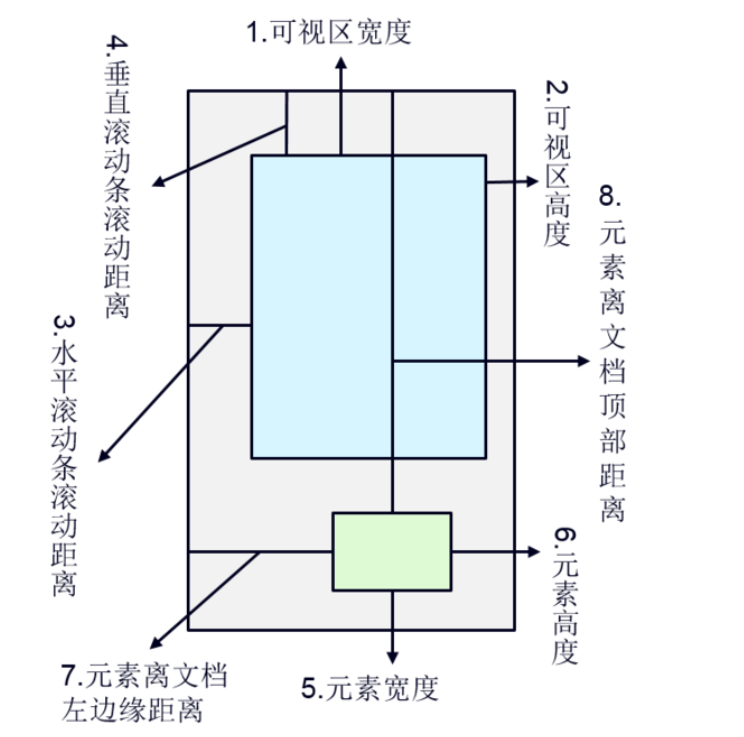
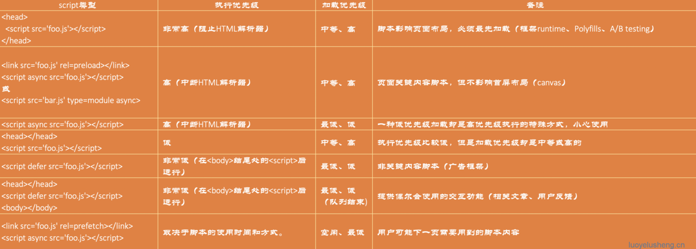

# 懒加载/延迟加载

# 图片懒加载

## 原理

懒加载也就是延迟加载。 

**懒加载的原理就是先在页面中把所有的图片统一使用一张占位图进行占位，把正真的路径存在元素的“data-url”（这个名字起个自己认识好记的就行）属性里，要用的时候就取出来，再设置为图片的真实src**

## 实现方式

- 第一种是纯粹的延迟加载，使用setTimeOut或setInterval进行加载延迟.
- 第二种是条件加载，符合某些条件，或触发了某些事件才开始异步下载。
- 第三种是可视区加载，即仅加载用户可以看到的区域，这个主要由监控滚动条来实现，一般会在距用户看到某图片前一定距离遍开始加载，这样能保证用户拉下时正好能看到图片。
- [用 Intersection Observer API](https://developer.mozilla.org/zh-CN/docs/Web/API/Intersection_Observer_API)

### 注意点



```js
页可见区域宽： document.body.clientWidth;
网页可见区域高： document.body.clientHeight;
网页可见区域宽： document.body.offsetWidth (包括边线的宽);
网页可见区域高： document.body.offsetHeight (包括边线的宽);
网页正文全文宽： document.body.scrollWidth;
网页正文全文高： document.body.scrollHeight;
网页被卷去的高： document.body.scrollTop;
网页被卷去的左： document.body.scrollLeft;
网页正文部分上： window.screenTop;
网页正文部分左： window.screenLeft;
屏幕分辨率的高： window.screen.height;
屏幕分辨率的宽： window.screen.width;
屏幕可用工作区高度： window.screen.availHeight;
```

## 可视区域

1. 拿到所有的图片 dome 。
2. 遍历每个图片判断当前图片是否到了可视区范围内。
3. 如果到了就设置图片的 src 属性。
4. 绑定 window 的 `scroll` 事件，对其进行事件监听。
5. 但是这样存在较大的性能问题，因为 `scroll` 事件会在很短的时间内触发很多次，严重影响页面性能，为了提高网页性能，我们需要一个节流函数来控制函数的多次触发，在一段时间内（如 200ms）只执行一次回调。

```js
// 
function isVisible(el) {
  const position = el.getBoundingClientRect()
  const windowHeight = document.documentElement.clientHeight
  // 顶部边缘可见
  const topVisible = position.top > 0 && position.top < windowHeight;
  // 底部边缘可见
  const bottomVisible = position.bottom < windowHeight && position.bottom > 0;
  return topVisible || bottomVisible;
}

function imageLazyLoad() {
  const images = document.querySelectorAll('img')
  for (let img of images) {
    const realSrc = img.dataset.src
    if (!realSrc) continue
    if (isVisible(img)) {
      img.src = realSrc
      img.dataset.src = ''
    }
  }
}

// 测试
window.addEventListener('load', imageLazyLoad)
window.addEventListener('scroll', imageLazyLoad)
// or
window.addEventListener('scroll', throttle(imageLazyLoad, 1000))
```


## intersectionObserver Api

```js
var io = new IntersectionObserver(callback, option)

// 开始观察
io.observe(document.getElementById('example'))

// 停止观察
io.unobserve(element)

// 关闭观察器
io.disconnect()
```

##  Vue.directive 编写图片懒加载指令

可参考https://segmentfault.com/a/1190000038413073


# 预加载

## 实现原理

让img 标签先显示其他的图片，当其指向的真实图片缓存完成后，再显示为实际的图片。

## 实现预加载的方法有哪些？

实现图片预加载方法有很多，可以用CSS(background)、JS(Image)、HTML，常用的是使用new Image()，设置其src属性实现图片预加载，然后使用image对象的onload事件把预加载完成的图片赋值给要显示该图片的标签。

# 区别

两种技术的本质：两者的行为是相反的，一个是提前加载，一个是迟缓甚至不加载。懒加载对服务器前端有一定的缓解压力作用，预加载则会增加服务器前端压力。

# 按需加载

1. 怎么保证相同的文件只加载一次？
2. 怎么判断文件加载完成？
3. 文件加载完成后，怎么通知所有引入文件的地方

[原理文章](https://juejin.cn/post/6850418111599165448)

## 对于webpack

> 在 webpack 的构建环境中，要按需加载代码模块很简单，遵循 ES 标准的动态加载语法 `dynamic-import` 来编写代码即可，`webpack` 会自动处理使用该语法编写的模块

```javascript
// import 作为一个方法使用，传入模块名即可，返回一个 promise 来获取模块暴露的对象
// 注释 webpackChunkName: "lodash" 可以用于指定 chunk 的名称，在输出文件时有用
import(/* webpackChunkName: "lodash" */ 'lodash').then((_) => { 
  console.log(_.lash([1, 2, 3])) // 打印 3
})...
```

- 注意一下，如果你使用了 `Babel` 的话，还需要 `Syntax Dynamic Import` 这个 `Babel` 插件来处理 `import()` 这种语法。
- 由于动态加载代码模块的语法依赖于 `promise`，对于低版本的浏览器，需要添加 `promise` 的 `polyfill` 后才能使用。
- 如上的代码，webpack 构建时会自动把 `lodash` 模块分离出来，并且在代码内部实现动态加载 `lodash` 的功能。动态加载代码时依赖于网络，其模块内容会异步返回，所以 import 方法是返回一个 `promise` 来获取动态加载的模块内容。
- `import` 后面的注释 `webpackChunkName: "lodash"` 用于告知 `webpack`所要动态加载模块的名称。我们在 webpack 配置中添加一个 `output.chunkFilename` 的配置...

```javascript
output: {
  path: path.resolve(__dirname, 'dist'),
  filename: '[name].[hash:8].js',
  chunkFilename: '[name].[hash:8].js' // 指定分离出来的代码文件的名称
},...
```

> 这样就可以把分离出来的文件名称用 lodash 标识了，如下图：


> 如果没有添加注释 `webpackChunkName: "lodash" 以及 output.chunkFilename` 配置，那么分离出来的文件名称会以简单数字的方式标识，不便于识别

### 以上完整示例代码

```javascript
const path = require('path')
const webpack = require('webpack')
const HtmlWebpackPlugin = require('html-webpack-plugin')
const ExtractTextPlugin = require('extract-text-webpack-plugin')

module.exports = {
  entry: './src/index.js',

  output: {
    path: path.resolve(__dirname, 'dist'),
    filename: '[name].js',
  },

  module: {
    rules: [
      {
        test: /\.jsx?/,
        include: [
          path.resolve(__dirname, 'src'),
        ],
        use: 'babel-loader',
      },
      {
        test: /\.less$/,
        use: ExtractTextPlugin.extract({
          fallback: 'style-loader',
          use: [
            'css-loader',
            'postcss-loader',
            'less-loader',
          ],
        }),
      },
      {
        test: /\.(png|jpg|gif)$/,
        use: [
          {
            loader: 'url-loader',
            options: {
              limit: 8192
            },
          },
          {
            loader: 'image-webpack-loader',
            options: {
              mozjpeg: { // 压缩 jpeg 的配置
                progressive: true,
                quality: 65
              },
              optipng: { // 使用 imagemin-optipng 压缩 png，enable: false 为关闭
                enabled: false,
              },
              pngquant: { // 使用 imagemin-pngquant 压缩 png
                quality: '65-90',
                speed: 4
              },
              gifsicle: { // 压缩 gif 的配置
                interlaced: false,
              },
              webp: { // 开启 webp，会把 jpg 和 png 图片压缩为 webp 格式
                quality: 75
              },
            },
          },
        ],
      },
    ],
  },

  optimization: {
    splitChunks: {
      cacheGroups: {
        vendor: {
          chunks: "initial",
          test: path.resolve(__dirname, "node_modules"), // 路径在 node_modules 目录下的都作为公共部分
          name: "vendor", // 使用 vendor 入口作为公共部分
          enforce: true,
        },
      },
    },
  },

  plugins: [
    new HtmlWebpackPlugin({
      filename: 'index.html', // 配置输出文件名和路径
      template: 'src/index.html', // 配置文件模板
      minify: { // 压缩 HTML 的配置
        minifyCSS: true, // 压缩 HTML 中出现的 CSS 代码
        minifyJS: true, // 压缩 HTML 中出现的 JS 代码
        removeComments: true,
      },
    }),
    new ExtractTextPlugin('[name].css'),
    new webpack.NamedModulesPlugin(),
    new webpack.HotModuleReplacementPlugin(),
  ],

  devServer: {
    hot: true
  }
}
```

# 异步加载

## 初印象

### defer async

> [资料来源](https://segmentfault.com/a/1190000018738129)


- async 会在加载完JS后立即执行，最迟也会在**load事件**前执行完。
- defer会在HTML解析完成后执行，最迟也会在**DOMContentLoaded事件**前执行完。

> 这里拓展一下 [页面生命周期](https://zh.javascript.info/onload-ondomcontentloaded)
>
> - `DOMContentLoaded` 事件 —— DOM 已经就绪，因此处理程序可以查找 DOM 节点，并初始化接口。
> - `load` 事件 —— 外部资源已加载完成，样式已被应用，图片大小也已知了。
> - `beforeunload` 事件 —— 用户正在离开：我们可以检查用户是否保存了更改，并询问他是否真的要离开。
> - `unload` 事件 —— 用户几乎已经离开了，但是我们仍然可以启动一些操作，例如发送统计数据。

从上面我们可以看出，如果你的脚本依赖于DOM构建完成是否完成，则可以使用defer；如果无需DOM的构建，那就可以放心的使用async了。

> 我上面为啥写初印象？ 对的 因为我之前也以为只有这些。。。

## 再次整理

### 1.常见异步加载（Script DOM Element）

```js
(function() {
     var s = document.createElement('script');
     s.type = 'text/javascript';
     s.async = true;
     s.src = 'http://yourdomain.com/script.js';
     var x = document.getElementsByTagName('script')[0];
     x.parentNode.insertBefore(s, x);
 })();
```


异步加载又叫非阻塞，浏览器在下载执行 js 同时，还会继续进行后续页面的处理。

这种方法是在页面中<script>标签内，用 js 创建一个 script 元素并插入到 document 中。这样就做到了非阻塞的下载 js 代码。

此方法被称为 Script DOM Element 法，不要求 js 同源。

将js代码包裹在匿名函数中并立即执行的方式是为了保护变量名泄露到外部可见，这是很常见的方式，尤其是在 js 库中被普遍使用。

> **这种加载方式在加载执行完之前会阻止 onload 事件的触发**，而现在很多页面的代码都在 onload 时还要执行额外的渲染工作等，所以还是会阻塞部分页面的初始化处理

### 2.onload 时的异步加载

```js
(function() {
     function async_load(){
         var s = document.createElement('script');
         s.type = 'text/javascript';
         s.async = true;
         s.src = 'http://yourdomain.com/script.js';
         var x = document.getElementsByTagName('script')[0];
         x.parentNode.insertBefore(s, x);
     }
     if (window.attachEvent)
         window.attachEvent('onload', async_load);
     else
         window.addEventListener('load', async_load, false);
 })();
 
```

这和前面的方式差不多，但关键是它不是立即开始异步加载 js ，而是在 onload 时才开始异步加载。这样就解决了阻塞 onload 事件触发的问题。

###  3.通过 ajax 去获取 js 代码，然后通过 eval 执行

```js
window.onload = function(){
    //1.创建XMLHttpRequest对象并考虑兼容性
    var xhr;
    if(window.XMLHttpRequest){
        //通用浏览器
        xhr = new XMLHttpRequest();
    }
    else{
        //IE5/6
        xhr = new ActiveXObject('Miscrosoft.XMLHttp')
    }
    
    //2.设置请求方式
    let url = '';
    xhr.open('get', url, true);//异步请求
    
    //3.发送请求
    xhr.send();
    
    //4.回调函数
    xhr.onreadyStateChange = function(){
        if(xhr.readyState == 4 && xhr.status == 200){
            let script = xhr.responseText;
            eval(script);   //异步加载script
        }
    }
}
 
```

### 4. 创建并插入 iframe，让它异步执行 js

```js
var iframe = document.createElement('iframe'); 
 document.body.appendChild(iframe); 
 var doc = iframe.contentWindow.document; 
 doc.open().write('<body onload="insertJS()">'); 
 doc.close();
```

## 总结



## Reference

[Javascript 异步加载详解](https://www.cnblogs.com/tiwlin/archive/2011/12/26/2302554.html)