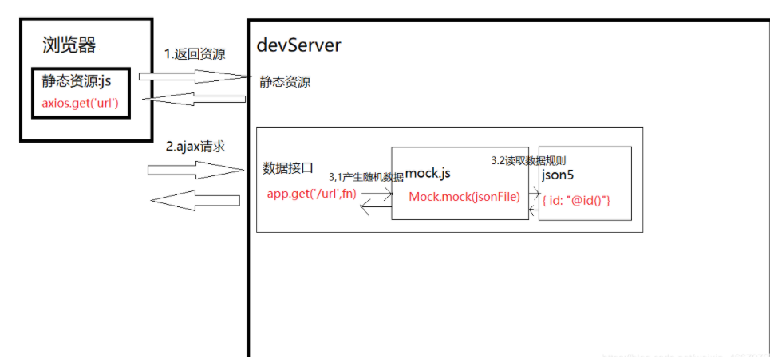
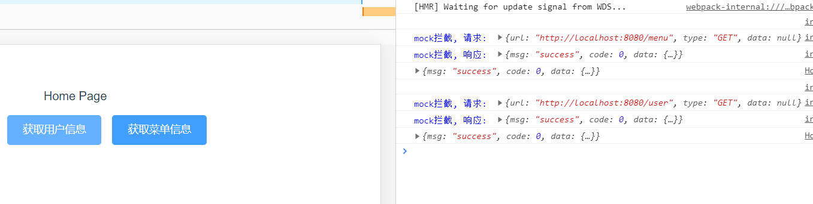

## 了解mockjs

实际开发中，前后端分离，前端需要后端的接口去完成页面的渲染，但是并不能等到后端成员写完接口再开始进行测试。大部分情况下，前后端需要同时进行开发。因此便需要**mockjs生成随机数据 & 拦截 Ajax 请求**来进行后端接口模拟。

(后面的例子会使用到Axios,axios 是一个基于 Promise 用于浏览器和 nodejs 的 HTTP 客户端，我们后续需要用来发送 http 请求)



[使用文档](https://github.com/nuysoft/Mock/wiki/Getting-Started)


官网地址：http:*//mockjs.com/*

github 地址：https:*//github.com/nuysoft/Mock*

## Vue的引入Mockjs - demo1

**完整代码 git: mockjsDemo1**

```sh
npm install mockjs
yarn add mockjs
//下面的例子要用axios
yarn add axios
```

- 在src路径下创建mock.js文件

- 在main.js引入mock.js文件

```js
  require('./mock')
//或者
import './mock'// 这里不用写 ./mock.js
```

- 在mock.js文件中写

```js
  //引入mockjs
  const Mock = require('mockjs')
  // 获取 mock.Random 对象
  const Random = Mock.Random;
  //使用mockjs模拟数据
  Mock.mock('/api/data', (req, res) => {//当post或get请求到/api/data路由时Mock会拦截请求并返回上面的数据
      let list = [];
      for(let i = 0; i < 30; i++) {
          let listObject = {
              title: Random.csentence(5, 10),//随机生成一段中文文本。
              company: Random.csentence(5, 10),
              attention_degree: Random.integer(100, 9999),//返回一个随机的整数。
              photo: Random.image('114x83', '#00405d', '#FFF', 'Mock.js')
          }
          list.push(listObject);
      }
      return {
          data: list
      }
  })
```
  - 在Vue中设置

```js
      mounted:function() {
            axios.get('/api/data').then(res => {//get()中的参数要与mock.js文件中的Mock.mock()配置的路由保持一致
              this.data = res.data.data;
              console.log(res.data);//在console中看到数据
              this.tableData=res.data.data
            }).catch(res => {
              alert('wrong');
            })
          },  
```

上面的运行成功了~ 那么就可以开心的用mockjs了 ~~下面的只是更换所需的功能

## [Mock函数的解释](https://github.com/nuysoft/Mock/wiki/Mock.mock())

Mock.mock(rurl? rtype? template|function(options))   生成模拟数据

- rurl - 可选
    表示需要拦截的 URL，可以是 '字符串' 或 '正则'。例如：
``` js
 'www.xxx.com/list.json'
  /\/www\.xxx\.com\/list\.json/
```
- rtype - 可选
    表示需要拦截的 Ajax 请求方法。例如： GET、POST、PUT、DELETE 等
- template - 可选
    表示数据模板，可以是 '对象' 或 '字符串'。例如：{ 'data|1-10': [{}] }	 或  '@EMAIL'

- function(options) - 可选
    表示用于生成响应数据的函数。
    options 指向本次请求的 Ajax 选项集，包含： url type body  3 个属性

## mockjs 数据生成语法

稍微看看吧， 不想看可以直接按照例子走就完事儿

### mock.js 的语法规范包含 2 部分
  1.数据模板定义规则(Data Template Definition, DTD)
  2.数据占位符定义规则(Data Placeholder Definition, DPD)

### DTD 规范
每个属性由 3 部分组成：属性名、生成规则、属性值。

**'name|rule': value**

- name - 属性名
- rule - 生成规则
- value - 属性值

#### 注意点

1.属性名和生成规则，之间有一个 '|'
2.生成规则是 '可选的'
3.生成规则有 '7' 种格式：
- 1>min-max
- 2>count
- 3>min-max.dmin-dmax
- 4>min-max.dcount
- 5>count.dmin-dmax
- 6>count.dcount
- 7>+step

4.生成规则的含义，依赖 '属性值类型' 来确定(意思是：生成规则，根据属性值 '类型' 的不同，会生成不同的模拟数据) 
5.属性值中可以含有 '@占位符'
6.属性值，指定了最终值的 '初始值' 和 '类型'

### DPD 规范
占位符，只是在 '属性值' 中占个位置，并不会出现在生成的属性值中。

- @占位符
- @占位符(参数[, 参数])

#### 注意点

- 1.用 '@' 来标识其后的字符串为 '占位符'
- 2.占位符引用的是 'Mock.Random' 中的方法
- 3.通过 Mock.Random.extend() 来 '自定义' 占位符
- 4.'占位符' 也 '可以引用'  '数据模板' 的属性
- 5.'占位符' 会 '优先' 引用 '数据模板' 的属性
- 6.'占位符' 支持 '相对路径' 和 '绝对路径'


## 数据模板生成模板 - demo2

http://mockjs.com/examples.html


## mockJs 的模拟get请求

```js
//vue
<button @click="getGoodsList">获取商品列表</button>
 methods: {
    async getGoodsList() {
      const { data: res } = await this.$http.get('/api/goodslist')
      console.log(res)
    }
 }
//mockjs
Mock.mock('/api/goodslist', 'get', {
  status: 200,
  message: '获取商品列表成功！',
  'data|5-10': [
    {
      id: '@increment(1)', // 自增的Id值
      // 'id|+1': 0, // 这也是在模拟一个自增长的 Id 值
      name: '@cword(2, 8)', // 随机生成中文字符串
      price: '@natural(2, 10)', // 自然数
      count: '@natural(100, 999)',
      img: '@dataImage(78x78)' // 指定宽高图片
    }
  ]
})
```

## mockJs 的模拟post请求

```js
//vue
<button @click="addGoods">添加商品</button>
  methods: { 
    async addGoods() {
      const { data: res } = await this.$http.post('/api/addgoods', {
        name: '菠萝',
        price: 8,
        count: 550,
        img: ''
      }) 
      console.log(res)
    }
  }
//mockjs
Mock.mock('/api/addgoods', 'post', function(option) {
  // 这里的 option 是请求相关的参数
  console.log(option)

  //一般的默认的return
  // return{
  //   status:200,
  //   message:'商品添加成功'
  // }

  //这里如果你要使用mock返回信息的话 就需要这样
  return Mock.mock({
    status: 200,
    message: '@cword(2,5)'
  })
})
```

## 删加增减的功能练习

**注意这里的设置会有不同这里的完整代码 github_demo2**

上面的都属于基本的简单实用 ~~**下面咋们看看封装版本**

## 封装mock模板!! - admin-ui

(下面的例子 基本完成了mock的基本设置 axios的基本设置 然后还有做axios封装)

### 目的

为了统一可以统一管理和集中控制数据模拟接口，我们对 mock 模块进行了封装，可以方便的定制模拟接口的统一开关和个体开关

### 文件结构

```
|- mock 
 |--modules
   |--- index.js：模拟接口模块聚合文件
   |--- login.js：登录相关的接口模拟
   |--- user.js：用户相关的接口模拟
   |--- menu.js：菜单相关的接口模拟
```

**代码内容都是admin-ui里面的!!!!**

#### 封装之前

```js
//简单的搭建沟通
import Mock from 'mockjs'

//前面的link可以不写
Mock.mock('http://localhost:8080/login',{
    data:{
        'token':'123159753456789'
        //其他数据
    }
})

Mock.mock('http://localhost:8080/user',{
    'name':'@name',//随机生成名字
    'email':'@email',//随机生成
    'age|1-10':5
})

Mock.mock('http://localhost:8080/menu',{
    'id':'@increment',//随机生成名字
    'name':'@menu',//随机生成
    'order|10-20':12
}) 
```

#### 封装开始!!index.js

```js
import Mock from 'mockjs'
import * as login from './modules/login'
import * as user from './modules/user'
import * as menu from './modules/menu'

// 1. 开启/关闭[业务模块]拦截, 通过调用fnCreate方法[isOpen参数]设置.
// 2. 开启/关闭[业务模块中某个请求]拦截, 通过函数返回对象中的[isOpen属性]设置.
fnCreate(login, true)//现在就暂时只有三个部分
fnCreate(user, true)
fnCreate(menu, true)

/**
 * 创建mock模拟数据
 * @param {*} mod 模块
 * @param {*} isOpen 是否开启?
 */
function fnCreate (mod, isOpen = true) {
  if (isOpen) {
    for (var key in mod) {
      ((res) => {
        if (res.isOpen !== false) {
          Mock.mock(new RegExp(res.url), res.type, (opts) => {
            opts['data'] = opts.body ? JSON.parse(opts.body) : null
            delete opts.body
            console.log('\n')
            console.log('%cmock拦截, 请求: ', 'color:blue', opts)
            console.log('%cmock拦截, 响应: ', 'color:blue', res.data)
            return res.data
          })
        }
      })(mod[key]() || {})
    }
  }
}
```

#### login.js

关于练习里面的login练习，我参照了 [这位仙子](https://blog.csdn.net/hellojoy/article/details/105426536) 以及 [这位仙子的文章](https://www.cnblogs.com/Grewer/p/8440726.html) （其实差不多的''_"）

```js
// 登录接口
export function login () {
  return {
    // isOpen: false,
    url: 'http://localhost:8080/login',
    type: 'get',
    data: {
      'msg': 'success',
      'code': 0,
      'data': {
        'token': '4344323121398'
        // 其他数据
      }
    }
  }
}
```

#### user.js

```js
// 获取用户信息
export function getUser () {
  return {
    // isOpen: false,
    url: 'http://localhost:8080/user',
    type: 'get',
    data: {
      'msg': 'success',
      'code': 0,
      'data': {
        'id': '@increment', 
        'name': '@name', // 随机生成姓名
        'email': '@email', // 随机生成姓名
        'age|10-20': 12
        // 其他数据
      }
    }
  }
}
```

#### menu.js

```js
// 获取菜单信息
export function getMenu () {
  return {
    // isOpen: false,
    url: 'http://localhost:8080/menu',
    type: 'get',
    data: {
      'msg': 'success',
      'code': 0,
      'data': {
        'id': '@increment', 
        'name': 'menu', // 随机生成姓名
        'order|10-20': 12
        // 其他数据
      }
    }
  }
}
```

#### 修改引入

##### 组件内

````js
//之前是
import mock from '@/mock/mock.js';
//改为
import mock from '@/mock/index.js';
````

这部封装成功的效果



## 踩坑

在vue中使用axios做网络请求的时候，会遇到this不指向vue，而为undefined。

解决 this的指向问题，要么箭头函数，要么直接let that=this

```js
//mockjsDemo2
updateItem(id){
        var that = this;
        this.$http.post('/updateItem',{
          params: {
            updateId:id
          }
        }).then(function(res){
          console.log("更新数据",res);
          that.list = res.data.data;
        }).catch((err) => {
          console.log(err)
        })
      } 
```


## Reference

 [在vue-cli项目下简单使用mockjs模拟数据](https://segmentfault.com/a/1190000016730919) (demo1)

[掌握MockJS](https://www.bilibili.com/video/BV1Tt411T7Cw?p=1) (demo2)

[Vue + Element UI 实现权限管理系统](https://blog.csdn.net/xifengxiaoma/article/details/92839222?spm=1001.2014.3001.5501) (admin-ui)