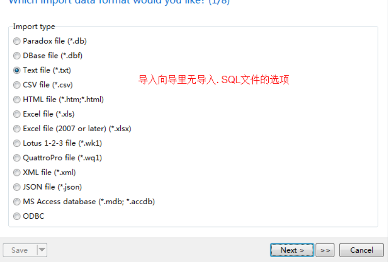
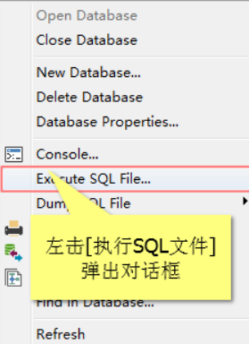

## 软件安装地址

Navicat安装- - 建议自己找绿色版本

[PhpStudy 安装地址](https://www.xp.cn/download.html)

[安装教程 看前部分就好哦](https://www.bilibili.com/video/BV13a4y1E7D7?from=search&seid=6648204584622936331)

## Navicat 导入sql脚本文件

右键点击表,然后选择运行文件

选择导入就可以了~~

## 坑

1. PHPStudy环境安装显示Runtime Error

WIN10联想的电脑，系统自带了联想杀毒Plus的其是自动实时扫描的。
解决办法：打开Plus，关闭实时扫描，安装即可。