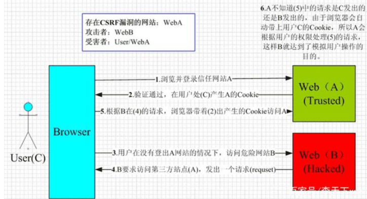

## CSRF以及XSS攻击

### 什么是CSRF

> 资料来源： [美团分享](https://tech.meituan.com/2018/10/11/fe-security-csrf.html)

CSRF（Cross-site request forgery）跨站请求伪造：攻击者诱导受害者进入第三方网站，在第三方网站中，向被攻击网站发送跨站请求。利用受害者在被攻击网站已经获取的注册凭证，绕过后台的用户验证，达到冒充用户对被攻击的网站执行某项操作的目的。

一个典型的CSRF攻击有着如下的流程：



- 受害者登录a.com，并保留了登录凭证（Cookie）。
- 攻击者引诱受害者访问了b.com。
- b.com 向 a.com 发送了一个请求：a.com/act=xx。浏览器会默认携带a.com的Cookie。
- a.com接收到请求后，对请求进行验证，并确认是受害者的凭证，误以为是受害者自己发送的请求。
- a.com以受害者的名义执行了act=xx。
- 攻击完成，攻击者在受害者不知情的情况下，冒充受害者，让a.com执行了自己定义的操作

> ### 浏览器的 Cookie 策略
>
> Cookie 是服务器发送到用户浏览器并保存在本地的一小块数据，它会在浏览器下次向同一服务器再发起请求时被携带并发送到服务器上。Cookie 主要用于以下三个方面：
>
> - 会话状态管理（如用户登录状态、购物车、游戏分数或其它需要记录的信息）
> - 个性化设置（如用户自定义设置、主题等）
> - 个性化设置（如用户自定义设置、主题等）
>
> 而浏览器所持有的 Cookie 分为两种：
>
> - Session Cookie(会话期 Cookie)：会话期 Cookie 是最简单的Cookie，它不需要指定过期时间（Expires）或者有效期（Max-Age），它仅在会话期内有效，浏览器关闭之后它会被自动删除。
> - Permanent Cookie(持久性 Cookie)：与会话期 Cookie 不同的是，持久性 Cookie 可以指定一个特定的过期时间（Expires）或有效期（Max-Age）。
>
> ```js
> res.setHeader('Set-Cookie', ['mycookie=222', 'test=3333; expires=Sat, 21 Jul 2018 00:00:00 GMT;']);
> // 这里就有两个cookie
> ```

#### CSRF的特点

- 攻击一般**发起在第三方网站**，而不是被攻击的网站。被攻击的网站无法防止攻击发生。
- 攻击利用受害者在被攻击网站的登录凭证，冒充受害者提交操作；而不是直接窃取数据。
- 整个过程攻击者并**不能获取到受害者的登录凭证，仅仅是“冒用”**。
- 跨站请求可以用各种方式：图片URL、超链接、CORS、Form提交等等。部分请求方式可以直接嵌入在第三方论坛、文章中，难以进行追踪。

CSRF通常是跨域的，因为外域通常更容易被攻击者掌控。但是如果本域下有容易被利用的功能，比如可以发图和链接的论坛和评论区，攻击可以直接在本域下进行，而且这种攻击更加危险。

#### 防御CSRF

- **阻止不明外域的访问**

  - #### Referer Check： 同源检测

  - Samesite Cookie

- 提交时要求附加本域才能获取的信息

  - CSRF Token

    #### 添加 token 验证

    > CSRF 攻击之所以能够成功，是因为攻击者可以完全伪造用户的请求，该请求中所有的用户验证信息都是存在于 Cookie 中，因此攻击者可以在不知道这些验证信息的情况下直接利用用户自己的 Cookie 来通过安全验证。要抵御 CSRF，关键在于在请求中放入攻击者所不能伪造的信息，并且该信息不存在于 Cookie 之中。可以在 HTTP 请求中以参数的形式加入一个随机产生的 token，并在服务器端建立一个拦截器来验证这个 token，如果请求中没有 token 或者 token 内容不正确，则认为可能是 CSRF 攻击而拒绝该请求。

  - **双重Cookie验证**

  - 验证码

- 设置白名单，不被第三方网站请求

### 什么是 XSS

> 资料来源： [美团分享](https://tech.meituan.com/2018/09/27/fe-security.html)

Cross-Site Scripting（跨站脚本攻击）简称 XSS，是一种代码注入攻击。攻击者通过在目标网站上注入恶意脚本，使之在用户的浏览器上运行。利用这些恶意脚本，攻击者可获取用户的敏感信息如 Cookie、SessionID 等，进而危害数据安全。

为了和 CSS 区分，这里把攻击的第一个字母改成了 X，于是叫做 XSS。

XSS 的本质是：恶意代码未经过滤，与网站正常的代码混在一起；浏览器无法分辨哪些脚本是可信的，导致恶意脚本被执行。

XSS攻击可以分为3类：反射型（非持久型）、存储型（持久型）、基于DOM。

#### 反射型

反射型 XSS 只是简单地把用户输入的数据 “反射” 给浏览器，这种攻击方式往往需要攻击者诱使用户点击一个恶意链接，或者提交一个表单，或者进入一个恶意网站时，注入脚本进入被攻击者的网站

恶意链接的地址指向了 `localhost:8001/?q=111&p=222`

当用户点击恶意链接时，页面跳转到攻击者预先准备的页面，会发现在攻击者的页面执行了 js 脚本

这样就产生了反射型 XSS 攻击。攻击者可以注入任意的恶意脚本进行攻击，可能注入恶作剧脚本，或者注入能获取用户隐私数据(如cookie)的脚本，这取决于攻击者的目的。

#### 存储型

存储型 XSS 会把用户输入的数据 "存储" 在服务器端，当浏览器请求数据时，脚本从服务器上传回并执行。这种 XSS 攻击具有很强的稳定性。

比较常见的一个场景是攻击者在社区或论坛上写下一篇包含恶意 JavaScript 代码的文章或评论，文章或评论发表后，所有访问该文章或评论的用户，都会在他们的浏览器中执行这段恶意的 JavaScript 代码。

#### 基于DOM

基于 DOM 的 XSS 攻击是指通过恶意脚本修改页面的 DOM 结构，是纯粹发生在客户端的攻击。

DOM 型 XSS 的攻击步骤：

1. 攻击者构造出特殊的 URL，其中包含恶意代码。
2. 用户打开带有恶意代码的 URL。
3. 用户浏览器接收到响应后解析执行，前端 JavaScript 取出 URL 中的恶意代码并执行。
4. 恶意代码窃取用户数据并发送到攻击者的网站，或者冒充用户的行为，调用目标网站接口执行攻击者指定的操作。

#### XSS 攻击有两大要素

1. 攻击者提交恶意代码。
2. 浏览器执行恶意代码

#### 防御XSS

- **输入过滤& 转义**(防止HTML中有注入; js执行时候有恶意代码)

```js
  // vuejs 中的 decodingMap
  // 在 vuejs 中，如果输入带 script 标签的内容，会直接过滤掉
  const decodingMap = {
    '&lt;': '<',
    '&gt;': '>',
    '&quot;': '"',
    '&amp;': '&',
    '&#10;': '\n'
  }
```

- 设置白名单

  只允许部分的标签可以通过提交。

- 验证码：防止脚本冒充用户提交危险操作。

## 拓展阅读

[HTTPS的加密原理](https://zhuanlan.zhihu.com/p/43789231)