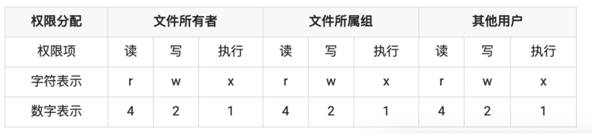

> 这里主要参考的是nodejs的主要内容参考，后面再补充阅读深入浅出Nodejs

### [Path](https://nodejs.org/dist./v0.10.44/docs/api/path.html)

#### node 中的路径分类

node 中的路径大致分 5 类，`dirname`,`filename`,`process.cwd()`,`./`,`../`,其中`dirname`,`filename`,`process.cwd()`绝对路径

- __dirname: 总是返回被执行的 js 所在文件夹的绝对路径__
- filename: 总是返回被执行的 js 的绝对路径
- process.cwd(): 总是返回运行 node 命令时所在的文件夹的绝对路径
- `./`： 不使用 require 时候，`./`与`process.cwd()`一样，使用`require`时候，与`__dirname`一样

只有在 require() 时才使用相对路径(./, ../) 的写法，其他地方一律使用绝对路径，如下：

```javascript
// 当前目录下
path.dirname(__filename) + '/path.js'
// 相邻目录下
path.resolve(__dirname, '../regx/regx.js')
```

#### API

##### path.normalize(p) 

规范化一个字符串路径，照顾`'..'`和`'.'`部分。

当找到多个斜线时，它们会被一个斜线替换；当路径包含尾部斜杠时，它会被保留。在 Windows 上使用反斜杠。

##### path.resolve([from ...], to)
解析to为绝对路径。

If tois not already absolutefrom参数按从右到左的顺序添加，直到找到绝对路径。如果使用所有from路径后仍然没有找到绝对路径，则也使用当前工作目录。生成的路径被规范化，除非路径被解析到根目录，否则会删除尾部斜杠。非字符串from参数将被忽略。

另一种方式是将其视为cdshell 中的一系列命令。

##### path.dirname(p)
返回路径的目录名称。类似于 Unixdirname命令。

**举例说明**

```javascript
const path = require('path')
console.log(path.resolve('/foo/bar', '/bar/faa', '..', 'a/../c'))
```

```javascript
;/bar/c
```

作用 相当于cd

##### path.join

> path.join([...paths])

1. 传入的参数是字符串的路径片段，可以是一个，也可以是多个
2. 返回的是一个拼接好的路径，

##### path.parse

他返回的是一个对象，那么我们来把这么几个名词熟悉一下：

1. root：代表根目录
2. dir：代表文件所在的文件夹
3. base：代表整一个文件
4. name：代表文件名
5. ext: 代表文件的后缀名

##### path.basename

basename 接收两个参数，第一个是`path`，第二个是`ext`(可选参数)，当输入第二个参数的时候，打印结果不出现后缀名

##### path.extname

返回的是后缀名，但是最后两种情况（文件夹）返回'',大家注意一下。

##### path.relative

path.relative(from, to)

描述：从 from 路径，到 to 路径的相对路径。

边界：

- 如果 from、to 指向同个路径，那么，返回空字符串。
- 如果 from、to 中任一者为空，那么，返回当前工作路径

### fs模块

Node.js 中的 fs 模块是文件操作的封装，它提供了文件读取、写入、更名、删除、遍历目录、链接等 POSIX 文件系统操作。与其它模块不同的是，fs 模块中所有的操作都提供了异步和同步的两个版本,具有 sync 后缀的方法为同步方法，不具有 sync 后缀的方法为异步方法 

#### 基本文件操作知识

#### 权限位 mode

因为 fs 模块需要对文件进行操作，会涉及到操作权限的问题，所以需要先清楚文件权限是什么，都有哪些权限。

文件权限表：



在上面表格中，我们可以看出系统中针对三种类型进行权限分配，即文件所有者（自己）、文件所属组（家人）和其他用户（陌生人），文件操作权限又分为三种，读、写和执行，数字表示为八进制数，具备权限的八进制数分别为 `4`、`2`、`1`，不具备权限为 0。

为了更容易理解，我们可以随便在一个目录中打开 `Git`，使用 `Linux` 命令 `ls -al` 来查目录中文件和文件夹的权限位

```text
drwxr-xr-x 1 koala 197121 0 Jun 28 14:41 core
-rw-r--r-- 1 koala 197121 293 Jun 23 17:44 index.md
```

在上面的目录信息当中，很容易看出用户名、创建时间和文件名等信息，但最重要的是开头第一项（十位的字符）。

第一位代表是文件还是文件夹，`d` 开头代表文件夹，`-` 开头的代表文件，而后面九位就代表当前用户、用户所属组和其他用户的权限位，按每三位划分，分别代表读（r）、写（w）和执行（x），`-` 代表没有当前位对应的权限。

> 权限参数 mode 主要针对 Linux 和 Unix 操作系统，Window 的权限默认是可读、可写、不可执行，所以权限位数字表示为 0o666，转换十进制表示为 438。


#### 标识位 flag

Node.js 中，标识位代表着对文件的操作方式，如可读、可写、即可读又可写等等，在下面用一张表来表示文件操作的标识位和其对应的含义。

| 符号 | 含义                                                     |
| ---- | -------------------------------------------------------- |
| r    | 读取文件，如果文件不存在则抛出异常。                     |
| r+   | 读取并写入文件，如果文件不存在则抛出异常。               |
| rs   | 读取并写入文件，指示操作系统绕开本地文件系统缓存。       |
| w    | 写入文件，文件不存在会被创建，存在则清空后写入。         |
| wx   | 写入文件，排它方式打开。                                 |
| w+   | 读取并写入文件，文件不存在则创建文件，存在则清空后写入。 |
| wx+  | 和 w+ 类似，排他方式打开。                               |
| a    | 追加写入，文件不存在则创建文件。                         |
| ax   | 与 a 类似，排他方式打开。                                |
| a+   | 读取并追加写入，不存在则创建。                           |
| ax+  | 与 a+ 类似，排他方式打开。                               |

上面表格就是这些标识位的具体字符和含义，但是 flag 是不经常使用的，不容易被记住，所以在下面总结了一个加速记忆的方法。

- r：读取
- w：写入
- s：同步
- +：增加相反操作
- x：排他方式

> r+ 和 w+ 的区别，当文件不存在时，r+ 不会创建文件，而会抛出异常，但 w+ 会创建文件；如果文件存在，r+ 不会自动清空文件，但 w+ 会自动把已有文件的内容清空。

## fs 文件操作

### 完整性读写文件操作

#### 文件读取-fs.readFile

```
fs.readFile(filename,[encoding],[callback(error,data)]
```

文件读取函数

1. 它接收第一个必选参数 filename，表示读取的文件名。
2. 第二个参数 encoding 是可选的，表示文件字符编码。
3. 第三个参数`callback`是回调函数，用于接收文件的内容。 说明：如果不指定 encoding ，则`callback`就是第二个参数。 回调函数提供两个参数 err 和 data ， err 表示有没有错误发生，data 是文件内容。 如果指定 encoding ， data 是一个解析后的字符串，否则将会以 Buffer 形式表示的二进制数据。

demo:

```javascript
const fs = require('fs')
const path = require('path')
const filePath = path.join(__dirname, 'koalaFile.txt')
const filePath1 = path.join(__dirname, 'koalaFile1.txt')
// -- 异步读取文件
fs.readFile(filePath, 'utf8', function(err, data) {
  console.log(data) // coding
})

// -- 同步读取文件
const fileResult = fs.readFileSync(filePath, 'utf8')
console.log(fileResult) 
```

#### 文件写入 fs.writeFile

```javascript
fs.writeFile(filename, data, [options], callback)
```

文件写入操作

1. 第一个必选参数 filename ，表示读取的文件名
2. 第二个参数要写的数据
3. 第三个参数 option 是一个对象，如下

```javascript
encoding {String | null} default='utf-8'
mode {Number} default=438(aka 0666 in Octal)
flag {String} default='w'

```

这个时候第一章节讲的计算机知识就用到了，flag 值，默认为 w,会清空文件，然后再写。flag 值，r 代表读取文件，w 代表写文件，a 代表追加。

demo：

```javascript
// 写入文件内容（如果文件不存在会创建一个文件）
// 写入时会先清空文件
fs.writeFile(filePath, '写入成功：coding', function(err) {
  if (err) {
    throw err
  }
  // 写入成功后读取测试
  var data = fs.readFileSync(filePath, 'utf-8')
  console.log('new data -->' + data)
})

// 通过文件写入并且利用flag也可以实现文件追加
fs.writeFile(filePath, 'coding追加的数据', { 'flag': 'a' }, function(
  err
) {
  if (err) {
    throw err
  }
  console.log('success')
  var data = fs.readFileSync(filePath, 'utf-8')
  // 写入成功后读取测试
  console.log('追加后的数据 -->' + data)
})
```

#### 文件追加-appendFile

```javascript
fs.appendFile(filename, data, [options], callback)
```

1. 第一个必选参数 filename ，表示读取的文件名
2. 第二个参数 data，data 可以是任意字符串或者缓存
3. 第三个参数 option 是一个对象，与 write 的区别就是[options]的 flag 默认值是”a”，所以它以追加方式写入数据.

说明：该方法以异步的方式将 data 插入到文件里，如果文件不存在会自动创建

demo：

```js
// -- 异步另一种文件追加操作(非覆盖方式)
// 写入文件内容（如果文件不存在会创建一个文件）
fs.appendFile(filePath, '新数据coding456', function(err) {
  if (err) {
    throw err
  }
  // 写入成功后读取测试
  var data = fs.readFileSync(filePath, 'utf-8')
  console.log(data)
})
// -- 同步另一种文件追加操作(非覆盖方式)

fs.appendFileSync(filePath, '同步追加一条新数据coding789')
```

#### 拷贝文件-copyFile

```javascript
fs.copyFile(filenameA, filenameB，callback)
```

1. 第一个参数原始文件名
2. 第二个参数要拷贝到的文件名 demo：

```javascript
// 将filePath文件内容拷贝到filePath1文件内容
fs.copyFileSync(filePath, filePath1);
let data = fs.readFileSync(filePath1, 'utf8');

console.log(data); // coding
    
```

#### 删除文件-unlink

```javascript
fs.unlink(filename, callback) 
```

1. 第一个参数文件路径大家应该都知道了，后面我就不重复了
2. 第二个回调函数 callback

demo:

```javascript
// -- 异步文件删除
fs.unlink(filePath, function(err) {
  if (err) return
})
// -- 同步删除文件
fs.unlinkSync(filePath, function(err) {
  if (err) return
})
```

### 指定位置读写文件操作(高级文件操作)

接下来的高级文件操作会与上面有些不同，流程稍微复杂一些，要先用`fs.open`来打开文件，然后才可以用`fs.read`去读，或者用`fs.write`去写文件，最后，你需要用`fs.close`去关掉文件。

> 特殊说明：read 方法与 readFile 不同，一般针对于文件太大，无法一次性读取全部内容到缓存中或文件大小未知的情况，都是多次读取到 Buffer 中。 想了解 Buffer 可以看 NodeJS —— Buffer 解读。（注意这里换成我的文章）

#### 文件打开-fs.open

```javascript
fs.open(path, flags, [mode], callback)
```

第一个参数:文件路径 第二个参数:与开篇说的标识符 flag 相同 第三个参数:[mode] 是文件的权限（可选参数，默认值是 0666） 第四个参数:callback 回调函数

demo:

```javascript
fs.open(filePath, 'r', '0666', function(err, fd) {
  console.log('哈哈哈', fd) //返回的第二个参数为一个整数，表示打开文件返回的文件描述符，window中又称文件句柄
})
```

demo 说明：返回的第二个参数为一个整数，表示打开文件返回的文件描述符，window 中又称文件句柄，在开篇也有对`文件描述符`说明。

#### 文件读取-fs.read

```javascript
fs.read(fd, buffer, offset, length, position, callback)
```

六个参数

1. fd：文件描述符，需要先使用 open 打开，使用`fs.open`打开成功后返回的文件描述符；
2. buffer：一个 Buffer 对象，`v8`引擎分配的一段内存，要将内容读取到的 Buffer；
3. offset：整数，向 Buffer 缓存区写入的初始位置，以字节为单位；
4. length：整数，读取文件的长度；
5. position：整数，读取文件初始位置；文件大小以字节为单位
6. callback：回调函数，有三个参数 err（错误），bytesRead（实际读取的字节数），buffer（被写入的缓存区对象），读取执行完成后执行。

demo：

```javascript
const fs = require('fs')
let buf = Buffer.alloc(6) // 创建6字节长度的buf缓存对象

// 打开文件
fs.open('6.txt', 'r', (err, fd) => {
  // 读取文件
  fs.read(fd, buf, 0, 3, 0, (err, bytesRead, buffer) => {
    console.log(bytesRead)
    console.log(buffer)

    // 继续读取
    fs.read(fd, buf, 3, 3, 3, (err, bytesRead, buffer) => {
      console.log(bytesRead)
      console.log(buffer)
      console.log(buffer.toString())
    })
  })
})

// 3
// <Buffer e4 bd a0 00 00 00>

// 3
// <Buffer e4 bd a0 e5 a5 bd>
// 你好
```

####  文件写入-fs.write

```javascript
fs.write(fd, buffer, offset, length, position, callback)
```

六个参数

1. fd：文件描述符，使用`fs.open` 打开成功后返回的；
2. buffer：一个 Buffer 对象，`v8` 引擎分配的一段内存，存储将要写入文件数据的 Buffer；
3. offset：整数，从 Buffer 缓存区读取数据的初始位置，以字节为单位；
4. length：整数，读取 Buffer 数据的字节数；
5. position：整数，写入文件初始位置；
6. callback：写入操作执行完成后回调函数，有三个参数 err（错误），bytesWritten（实际写入的字节数），buffer（被读取的缓存区对象），写入完成后执行。

#### 文件关闭-fs.close

```javascript
fs.close(fd, callback)
```

1. 第一个参数：fd 文件`open`时传递的`文件描述符`
2. 第二个参数 callback 回调函数,回调函数有一个参数 err（错误），关闭文件后执行。

demo:

```javascript
// 注意文件描述符fd
fs.open(filePath, 'r', (err, fd) => {
  fs.close(fd, (err) => {
    console.log('关闭成功') // 关闭成功
  })
})
```

##  fs目录(文件夹)操作

1、fs.mkdir 创建目录

```javascript
fs.mkdir(path, [options], callback)
```

1. 第一个参数：path 目录路径
2. 第二个参数[options]，`recursive <boolean>` 默认值: false。 `mode <integer>` Windows 上不支持。默认值: 0o777。 可选的 options 参数可以是指定模式（权限和粘滞位）的整数，也可以是具有 mode 属性和 recursive 属性（指示是否应创建父文件夹）的对象。
3. 第三个参数回调函数,回调函数有一个参数 err（错误），关闭文件后执行。

demo:

```javascript
fs.mkdir('./mkdir', function(err) {
  if (err) return
  console.log('创建目录成功')
})
```

注意： 在 Windows 上，在根目录上使用 fs.mkdir() （即使使用递归参数）也会导致错误：

```javascript
fs.mkdir('/', { recursive: true }, (err) => {
  // => [Error: EPERM: operation not permitted, mkdir 'C:\']
})
```

2、fs.rmdir 删除目录

```javascript
fs.rmdir(path, callback)
```

1. 第一个参数：path 目录路径
2. 第三个参数回调函数,回调函数有一个参数 err（错误），关闭文件后执行。 demo:

```javascript
const fs = require('fs')
fs.rmdir('./mkdir', function(err) {
  if (err) return
  console.log('删除目录成功')
})
```

> 注意：在文件（而不是目录）上使用 fs.rmdir() 会导致在 Windows 上出现 ENOENT 错误、在 POSIX 上出现 ENOTDIR 错误。

3、fs.readdir 读取目录

```js
fs.readdir(path, [options], callback)
```

1. 第一个参数：path 目录路径
2. 第二个参数[options]可选的 options 参数可以是指定编码的字符串，也可以是具有 encoding 属性的对象，该属性指定用于传给回调的文件名的字符编码。 如果 encoding 设置为 'buffer'，则返回的文件名是 Buffer 对象。 如果 options.withFileTypes 设置为 true，则 files 数组将包含 fs.Dirent 对象。
3. 第三个参数回调函数,回调函数有两个参数，第一个 err（错误），第二个返回 的 data 为一个数组，包含该文件夹的所有文件，是目录中的文件名的数组（不包括 `'.'` 和 `'..'`）

## url模块

在头部输入以下代码: `const url = require("url");`

### url模块提供的方法

url模块目前提供三个方法url.parse(),url.format(),url.resolve();

##### url.parse(urlStr,[boolean],[boolean])

接口作用:解析一个url地址,返回一个url对象

参数:第一个参数 url地址字符串,第二个参数 为布尔值,默认false,当值为true,返回的url对象中query属性返回的是一个对象,第三个参数 为布尔值,默认false,如果设为 true,则//之后至下一个/之前的字符串会解析作为host.例如,//foo/bar会解析为{host:'foo',pathname:'/bar'} 而不是 {pathname:'//foo/bar'}.

示例代码:

```js
let parseUrl = "https://www.google.com?q=node.js";
let urlObj = url.parse(parseUrl,true);
console.log(urlObj);
```

返回:

```js
PS E:\项目\nodejs> node url.js
Url {
  protocol: 'https:',
  slashes: true,
  auth: null,
  host: 'www.google.com',
  port: null,
  hostname: 'www.google.com',
  hash: null,
  search: '?q=node.js',
  query: [Object: null prototype] { q: 'node.js' },
  pathname: '/',
  path: '/?q=node.js',
  href: 'https://www.google.com/?q=node.js' }
```

##### url.format(urlObj)

接口作用:接受一个url对象,返回一个url字符串

参数:第一个参数 是一个url对象,具体参数见代码

示例代码:

```js
let urlObj = {
    protocol: 'https:',
    slashes: true,
    auth: null,
    host: 'www.google.com',
    port: null,
    hostname: 'www.google.com',
    hash: null,
    search: '?q=node.js',
    query: '?q=node.js',
    pathname: '/',
    path: '/?q=node.js',
};
let objFormatUrl = url.format(urlObj);
console.log(objFormatUrl);

```

返回:

```js
PS E:\项目\nodejs> node url.js
https://www.google.com/?q=node.js
```

##### url.resolve(from,to)

接口作用:拼接字符串网址

参数:第一个参数 拼接时相对的基本URL,第二个参数 要拼接的另一个url.

示例代码:

```js
let urlAddress = url.resolve("https://www.google.com","image");
console.log(urlAddress);
```

返回:

```js
PS E:\项目\nodejs> node url.js
https://www.google.com/image
```

### node - HTTP

我们需要搭建一个 `http` 的服务器，用于处理用户发送的 `http` 请求，在 node 中有 `http` 核心模块可以在很简单的几句话就帮我们启动一个服务器。

```js
// 导入http模块:
var http = require('http');
// 创建http server，并传入回调函数:
var server = http.createServer(function (request, response) {
    // 回调函数接收request和response对象,
    console.log('有客户端请求了.....');
    // 将HTTP响应200写入response, 同时设置Content-Type: text/html:
    response.writeHead(200, {'Content-Type': 'text/html'});
    // 将HTTP响应的HTML内容写入response:
    response.write('<h1>hello World!</h1>');
    response.end();
});
// 让服务器监听8888端口:
server.listen(8888);
console.log('Server is running at http://127.0.0.1:8888/');
```

就这几行代码，我们就搭建了一个简单服务器，当HTTP

#### 创建与监听

首先我们来看创建`http server`的代码：

- `var server = http.createServer([requestListener])` :创建并返回一个HTTP服务器对象
  - `requestListener` : 监听到客户端连接的回调函数
    在这里可以看到我们的回调函数是可选的，我们还可以使用事件监听器来进行，监听到客户端连接之后的操作,如：

`server.on('request', function(req, res) {// do ....})`
我们要在用户访问时做一些什么，都会在这里。

再看监听端口的代码，在这里我们只是简单的写了一下监听的端口，它的可选项都没有去设置

- `server.listen(port, [hostname], [backlog], [callback])` :监听客户端连接请求,只有当调用了 `listen` 方法以后,服务器才开始工作
  - `port` : 监听的端口
  - `hostname` : 主机名(IP/域名),可选
  - `backlog` : 连接等待队列的最大长度,可选
  - `callback` : 调用listen方法并成功开启监听以后,会触发一个 listening事件,callback将作为该事件的执行函数,可选

看完了创建与监听的方法，我们再看看看，我们在监听到客户端连接的回调函数 `server.on('request', function(req, res) {// do ....})` 中看到有两个参数 request 和 response ，
在这两个参数中，我们可以去获得用户的当前请求一些信息,比如头信息,数据等待，还可以向该次请求的客户端输出返回响应，下面我们一起看看它里面的内容

#### request 对象

参数`request`对象是 `http.IncomingMessage` 的一个实例,通过它 ，我们可以获取到这次请求的一些信息,比如头信息,数据，`url`参数等等
这里简单的列一下最常见的:

- `httpVersion`: 使用的http协议的版本
- `headers `: 请求头信息中的数据
- `url `: 请求的地址
- `method `: 请求方式

#### response 对象

参数 `response`对象是 `http.ServerResponse`(这是一个由HTTP服务器内部创建的对象) 的一个实例，通过它 我们可以向该次请求的客户端输出返回响应。

- `response.writeHead(statusCode, [reasonPhrase], [headers])`：向请求回复响应头，这个方法只能在当前请求中使用一次，并且必须在`response.end()`之前调用。
  - `statusCode`： 一个三位数的HTTP状态码, 例如 404
  - `reasonPhrase`：自行设置http响应状态码对应的原因短语
  - `headers`：响应头的内容
- `write(chunk, [encoding])` : 发送一个数据块到响应正文中 ,如果这个方法被调用但是 `response.writeHead()` 没有被调用，
  它将切换到默认header模式并更新默认的headers。chunk可以是字符串或者缓存。如果chunk 是一个字符串，
  第二个参数表明如何将这个字符串编码为一个比特流。默认的 encoding是'utf8'。
- `end([data], [encoding])`: 当所有的正文和头信息发送完成以后,调用该方法告诉服务器数据已经全部发送完成了。
  **这个方法在每次完成信息发送以后必须调用,并且是最后调用**,如果指定了参数 data , 就相当于先调用` response.write(data, encoding) `之后再调用 `response.end()`
- `setHeader(name, value) `: 为默认或者已存在的头设置一条单独的头信息：如果这个头已经存在于 将被送出的头中，将会覆盖原来的内容。如果我想设置更多的头， 就使用一个相同名字的字符串数组
  如：`response.setHeader("Set-Cookie", ["type=ninja", "language=javascript"]);`

看了那么多api，是时候实践一把了，我们再来对原来的代码进行一点改造～

```js
// 导入http模块,url 模块
var http = require('http');
var url = require('url')
// 创建http server
var server = http.createServer();
server.on('request', function (req, res) {
    // 将HTTP响应200写入response, 同时设置Content-Type: text/html:
    res.writeHead(200, {
        'Content-Type': 'text/html'
    });
    var urlObj = url.parse(req.url);
    //根据用户访问的url不同展示不同的页面
    switch (urlObj.pathname){
        // 这是首页
        case '/':
            res.write('<h1>这是里首页</h1>');
            break;
        case '/user':
            res.write('<h1>这里是个人中心</h1>');
            break;
        default :
            res.write('<h1>你要找的页面不见了～</h1>');
            break;
    }
    // 将HTTP响应的HTML内容写入response:
    res.end();
});
server.listen(8888);
console.log('Server is running at http://127.0.0.1:8888/');
```

启动一下该js文件，并且通过不同的url不同的后缀,如 `/` 和 `/user` 去访问这个地址，看看浏览器的输出，应该已经变了。

这就是通过简单的的url处理，来实现的路由机制拉～

### 拓展：url 处理响应不同 html

当然这里我们再继续深入一下！结合 node 的文件系统（fs模块），使不同的url，直接读取不同的 html 文件,示例：

准备工作: 在当前文件目录下建立`html`文件夹, 并且新增文件 `index.html`与 `user.html`，内容自行发挥

```js
var http = require('http');
var url = require('url');
var fs = require('fs');

var server = http.createServer();
// 读取我们当前文件所在的目录下的 html 文件夹
var HtmlDir = __dirname + '/html/';
server.on('request', function(req, res) {
    var urlObj = url.parse(req.url);
    switch (urlObj.pathname) {
        case '/':
            //首页
            sendData(HtmlDir + 'index.html', req, res);
            break;
        case '/user':
            //用户首页
            sendData(HtmlDir + 'user.html', req, res);
            break;
        default:
            //处理其他情况
            sendData(HtmlDir + 'err.html', req, res);
            break;
    }
});

/**
 * 读取html文件，响应数据，发送给浏览器
 * @param {String} file 文件路径
 * @param {Object} req request
 * @param {Object} res response 对象
 */
function sendData(file, req, res) {
    fs.readFile(file, function(err, data) {
        if (err) {
            res.writeHead(404, {
                'content-type': 'text/html;charset=utf-8'
            });
            res.end('<h1>你要找的页面不见了～</h1>');
        } else {
            res.writeHead(200, {
                'content-type': 'text/html;charset=utf-8'
            });
            res.end(data);
        }

    });
}
server.listen(8888);
console.log('Server is running at http://127.0.0.1:8888/');
```

运行文件，切换url，程序会将不同的页面返回。大家自己去试试吧！

## 面试题

### Node.js 与 JavaScript 有什么不同?


### 什么时候用 Node.js？

Node.js 是异步的、事件驱动的、非阻塞的和单线程的，使得它成为开发下面应用程序的完美候选：

- 实时应用程序，如聊天和提供实时更新的应用程序
- 将视频或其他多媒体内容流式传输给大量观众的流式应用程序
- 其他 I/O 密集型应用程序，如协作平台
- 遵循微服务架构的网络后端

## readFile 和 createReadStream 函数有什么区别？

- readFile 函数异步读取文件的全部内容，并存储在内存中，然后再传递给用户。

- createReadStream 使用一个可读的流，逐块读取文件，而不是全部存储在内存中。

- 与 readFile 相比，createReadStream 使用更少的内存和更快的速度来优化文件读取操作。如果文件相当大，用户不必等待很长时间直到读取整个内容，因为读取时会先向用户发送小块内容。

```js
const fs = require("fs");
fs.readFile("test.txt", (err, content) => {  
	console.log(content);
});
```