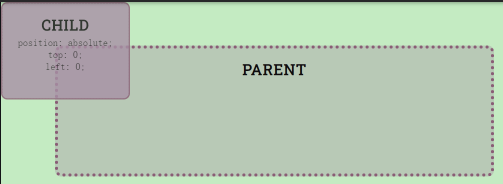
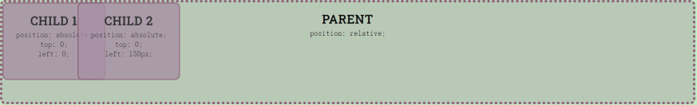
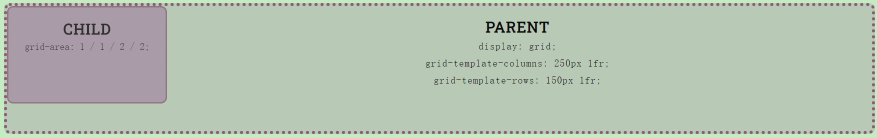
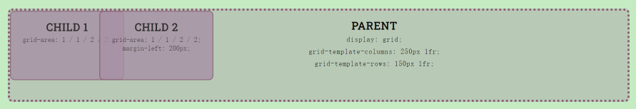

## 1. Position Property

```css
.child { 
  position: absolute;
  top: 0;
  left: 0;
}
```



```css
.child { 
  position: absolute;
  top: 0; 
}

.child-1 {
  left: 0;
}

.child-2 {
  left: 150px;
}

.parent {
  position: relative;
}
```





## 2. Using CSS Grid

```css
.parent {
  display: grid;
  grid-template-columns: 250px 1fr;
  grid-template-rows: 150px 1fr;
}

.child {
  grid-area: 1 / 1 / 2 / 2;
}
```





```css
.parent {
  display: grid;
  grid-template-columns: 250px 1fr;
  grid-template-rows: 150px 1fr;
}

.child {
  grid-area: 1 / 1 / 2 / 2;
}
 
.child-2 {
  margin-left: 200px;
}
```

