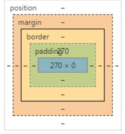

padding / margin : 上，右，下，左

```css
padding: 100% 0 0;
margin: 25px 50px 75px;//上 左右 下
```



## padding 的百分比值

- 和 margin 属性不同， padding 属性是不支持负值的；
- padding 支持百分比值，**padding 百分比值无论是left/right 方向还是top/bottom方向均是相对于宽度计算的！**

## margin 的百分比值

- margin 的百分比值无论是水平方向还是垂直方向都是相对于父元素宽度计算

  

## 灵活调整位置

**移动端变化，灵活调整视图**

- 使用视区宽度单位`vw` ( Relative to 1% of the width of the viewport* ) ，如下：

```css
.banner {
    height: 15.15vw;
    background-size: cover;
}
```

如果对兼容性要求不是很高，使用`vw`也是一个不错的做法，至少理解起来要更轻松一点。

- 但是，如果我们的图片不是通栏，而是需要离左右各`1rem`的距离，此时，我们的CSS代码就要啰嗦点了，想要保持完美比例，就使用借助CSS3 `calc()`计算：

```
.banner {
    height: calc(0.1515 * (100vw - 2rem));
    background-size: cover;
}
```

-  使用百分比`padding`，如下：

```css
.banner {
    padding: 15.15% 0 0;
    background-size: cover;
}
```

此时无论图片的外部元素怎么变动，比例都是恒定不变的。


## 百分比padding与宽度自适应图片布局

但是有时候我们的图片是不方便作为背景图呈现的，而是内联的``，百分比`padding`也是可以轻松应对的，求套路是比较固定的，图片元素外面需要一个固定比例的容器元素，例如下面的HTML结构：

```css
<div class="banner">
  
</div>
```

`.banner`元素同样负责控制比例，然后图片填充`.banner`元素即可，CSS代码如下：

```css
.banner {
    padding: 15.15% 0 0;
    position: relative;
}
.banner > img {
    position: absolute;
    width: 100%; height: 100%;
    left: 0; top: 0;
}
```

例子1：https://www.zhangxinxu.com/study/201708/percent-padding-auto-layout.html

例子2：https://segmentfault.com/a/1190000004231995


## margin 合并（只有垂直，没有水平）

1. 水平边距永远不会重合。
2. 在规范文档中，2个或以上的块级盒模型相邻的垂直margin会重叠。最终的margin值计算方法如下：
   a、全部都为正值，取最大者；
   b、不全是正值，则都取绝对值，然后用正值减去最大值；
   c、没有正值，则都取绝对值，然后用0减去最大值。

**防止外边距重叠解决方案：**
虽然外边距的重叠有其一定的意义，但有时候我们在设计上却不想让元素之间产生重叠，那么可以有如下几个建议可供参考：

1. 外层元素padding代替
2. 内层元素透明边框 border:1px solid transparent;
3. 内层元素绝对定位 postion:absolute:
4. 外层元素 overflow:hidden;
5. 内层元素 加float:left;或display:inline-block;
6. 内层元素padding:1px;

reference：

1. https://www.zhangxinxu.com/wordpress/2017/08/css-percent-padding-image-layout/
2. https://segmentfault.com/a/1190000004231995