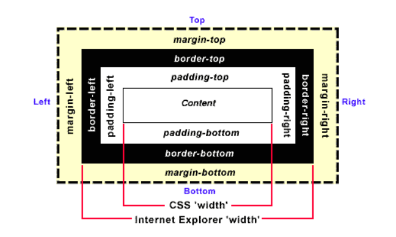
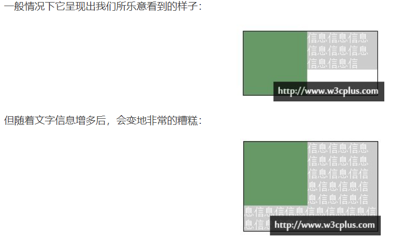
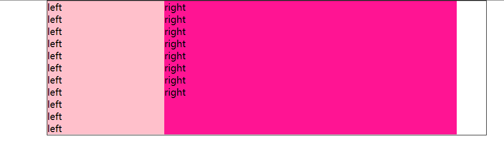
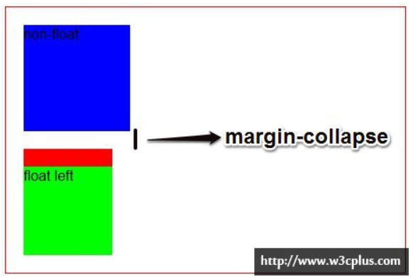
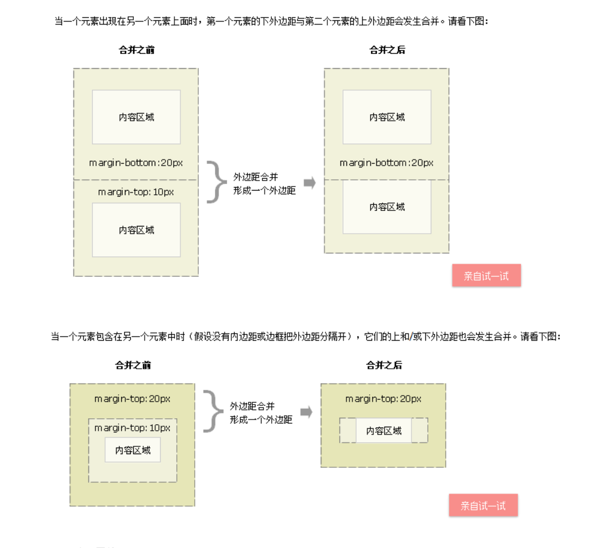
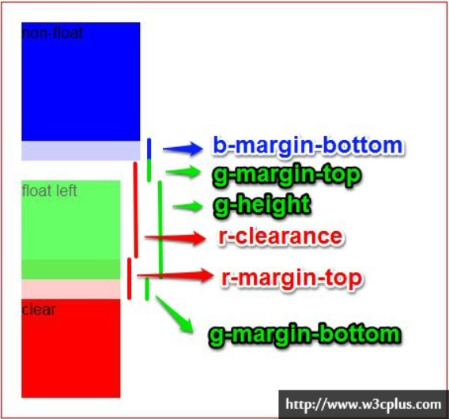

Padding-bottom & Margin-bottom 可以控制伪等高


**不要对float元素指定margin和padding属性(能够在float元素内部嵌套一个div来设置margin和padding)。**

padding / margin : 上，右，下，左

```css
padding: 100% 0 0;
margin: 25px 50px 75px;//上 左右 下
```



## padding 的百分比值

- 和 margin 属性不同， padding 属性是不支持负值的；
- padding 支持百分比值，**padding 百分比值无论是left/right 方向还是top/bottom方向均是相对于==宽度==计算的！**

## margin 的百分比值

- margin 的百分比值无论是水平方向还是垂直方向都是相对于父元素==**宽度**==计算

  

## 灵活调整位置

**移动端变化，灵活调整视图**

- 使用视区宽度单位`vw` ( Relative to 1% of the width of the viewport* ) ，如下：

```css
.banner {
    height: 15.15vw;
    background-size: cover;
}
```

如果对兼容性要求不是很高，使用`vw`也是一个不错的做法，至少理解起来要更轻松一点。

- 但是，如果我们的图片不是通栏，而是需要离左右各`1rem`的距离，此时，我们的CSS代码就要啰嗦点了，想要保持完美比例，就使用借助CSS3 `calc()`计算：

```
.banner {
    height: calc(0.1515 * (100vw - 2rem));
    background-size: cover;
}
```

-  使用百分比`padding`，如下：

```css
.banner {
    padding: 15.15% 0 0;
    background-size: cover;
}
```

此时无论图片的外部元素怎么变动，比例都是恒定不变的。


## 百分比padding与宽度自适应图片布局

但是有时候我们的图片是不方便作为背景图呈现的，而是内联的``，百分比`padding`也是可以轻松应对的，求套路是比较固定的，图片元素外面需要一个固定比例的容器元素，例如下面的HTML结构：

```css
<div class="banner">
  
</div>
```

`.banner`元素同样负责控制比例，然后图片填充`.banner`元素即可，CSS代码如下：

```css
.banner {
    padding: 15.15% 0 0;
    position: relative;
}
.banner > img {
    position: absolute;
    width: 100%; height: 100%;
    left: 0; top: 0;
}
```

例子1：https://www.zhangxinxu.com/study/201708/percent-padding-auto-layout.html

例子2：https://segmentfault.com/a/1190000004231995


## 网页布局的margin 合并与BFC

基本使用场景：：


```html
.box {width:210px;border: 1px solid #000;float: left;}
.img {width: 100px;height: 100px;background: #696;float: left;}
<div class="box">
    <div class="img">image</div>
    <p class="info">信息信息信息信息信息信息信息信息信息信息信息信</p>
</div>
```



做伪等高布局

```html
<style type="text/css">
            *{
                margin: 0;
                padding: 0;
            }
            #wrap{
                width: 750px;
                border: 1px solid;
                margin: 0 auto;
                overflow: hidden;//超出border的padding直接隐藏
            }
            #wrap .left{
                float: left;
                width: 200px;
                background: pink;
                padding-bottom: 1000px;//撑大内部
                margin-bottom: -1000px;//调整boeder
            }
            #wrap .right{
                float: left;
                width: 500px;
                background: deeppink;
                padding-bottom: 1000px;
                margin-bottom: -1000px;
            }
             
            //下面的是为了调整块状浮动             
            .clearfix{
                *zoom: 1;
            }
            .clearfix:after{
                content: "";
                display: block;
                clear: both;
            }
   
        </style>
    </head>
    <body>
        <div id="wrap" class="clearfix">
            <div class="left">
                left <br />
                left <br />
                left <br />
                left <br />
                left <br />
                 left <br />
                left <br />
                left <br />
                left <br />
                left <br />
                left <br />
            </div>
            <div class="right">
                right<br />
                right<br />
                right<br />
                right<br />
                right<br />
                right<br />
                right<br />
                right<br />
            </div>
        </div>
```



**此时我们可以为P元素的内容建立一个BFC，让其内容消除对外界浮动元素的影响。根据上文所知，只要给info元素添加`overflow:hidden;`即可为其内容建立新的BFC。**





 

1. 只有垂直,水平边距永远不会重合。
2. 在规范文档中，2个或以上的块级盒模型相邻的垂直margin会重叠。最终的margin值计算方法如下：
   a、全部都为正值，取最大者；
   b、不全是正值，则都取绝对值，然后用正值减去最大值；
   c、没有正值，则都取绝对值，然后用0减去最大值。

**防止外边距重叠解决方案：**

1. 外层元素padding代替
2. 内层元素透明边框 border:1px solid transparent;
3. 内层元素绝对定位 postion:absolute:
4. 外层元素 overflow:hidden;
5. 内层元素 加float:left;或display:inline-block;
6. 内层元素padding:1px;

**具体讲解：**




上面的图中我们可以看到，我们为红色块盒设置的40px的margin-top（这里我们通过相同高度的阴影来将其可视化）好像并没有对紫色块盒起作用，而且无论我们怎么修改这个margin-top值都不会影响红色块盒的位置，而只由绿色块盒的margin-bottom所决定。

也就是说，**浮动的元素的border-top会紧贴着相应的浮动元素的margin-bottom**。

通过w3c的官方规范可知，闭合浮动的块盒在margin-top上所产生的间距（clearance）的值与该块盒的margin-top之和应该足够让该块盒垂直的跨越浮动元素的margin-bottom，使闭合浮动的块盒的border-top恰好与浮动元素的块盒的margin-bottom相邻接。

**用上图例子中的相关值可以得出这样一个式子：r-margin-top + r-clearance = g-margin-top + g-height + g-margin-bottom**

PS！闭合浮动并不能使浮动元素回到原来的BFC当中！

reference：

1. https://www.zhangxinxu.com/wordpress/2017/08/css-percent-padding-image-layout/
2. https://segmentfault.com/a/1190000004231995