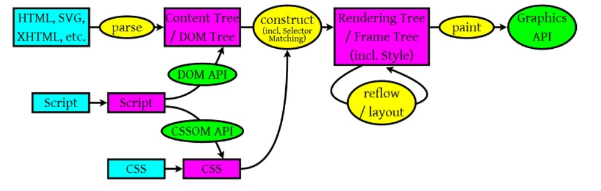
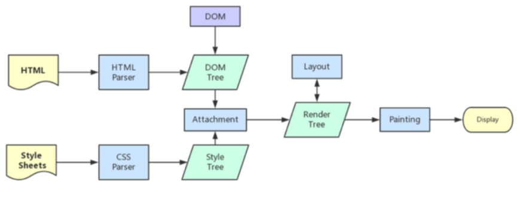
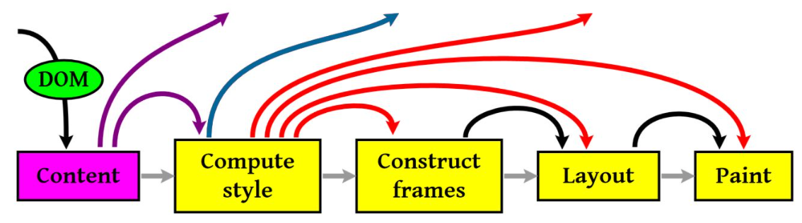

## 浏览器渲染页面的过程

从耗时的角度，浏览器请求、加载、渲染一个页面，时间花在下面五件事情上：

1. DNS 查询
2. TCP 连接
3. HTTP 请求即响应
4. 服务器响应
5. 客户端渲染

## 客户端渲染- 图很重要

- `HTML`,`SVG`,`XHTML`，解析生成`DOM`树。 （ **解码（encoding）**+ **预解析（pre-parsing）**+ **符号化（Tokenization）**+ **构建树（tree construction）**）
- `CSS`解析生成`CSS`规则树。
- `JavaScript`用来操作`DOM API`和`CSSOM API`，生成`DOM Tree`和`CSSOM API`。

解析完成后，浏览器会通过已经解析好的`DOM Tree` 和 `CSS`规则树来构造 `Rendering` `Tree`。

- `Rendering Tree` 渲染树并不等同于`DOM`树，因为一些像`Header`或`display:none`的东西就没必要放在渲染树中了。
- `CSS` 的 `Rule Tree`主要是为了完成匹配并把`CSS Rule`附加上`Rendering`。
- `Tree`上的每个`Element`。也就是`DOM`结点，即`Frame`。然后，计算每个`Frame`（也就是每个`Element`）的位置，这又叫`layout`和`reflow`过程。
- 最后通过调用操作系统`Native GUI`的`API`绘制。





**两个图结合着看！！！！**

[细节的描述 如何构建tree](https://imweb.io/topic/56841c864c44bcc56092e3fa)

## **渲染阻塞**

当遇到一个`script`标签时，DOM 构建会被暂停，直至脚本完成执行，然后继续构建 DOM 树。

但如果 JS 依赖 CSS 样式，而它还没有被下载和构建时，浏览器就会延迟脚本执行，直至 CSS Rules 被构建。

所有我们知道：

- CSS 会阻塞 JS 执行
- JS 会阻塞后面的 DOM 解析

为了避免这种情况，应该以下原则：

- CSS 资源排在 JavaScript 资源前面
- JS 放在 HTML 最底部，也就是 `</body>`前

另外，如果要改变阻塞模式，可以使用 defer 与 async，详见：[这篇文章](https://github.com/xiaoyu2er/blog/issues/8)

## 渲染

渲染的流程基本上如下（黄色的四个步骤）：

> - 计算CSS样式
> - 构建Render Tree
> - Layout – 定位坐标和大小，是否换行，各种position, overflow, z-index属性 ……
> - 正式开画



上图流程中有很多连接线，这表示了Javascript动态修改了DOM属性或是CSS属会导致重新Layout，有些改变不会，就是那些指到天上的箭头，比如，修改后的CSS rule没有被匹配到，等。

###  **回流(reflow)**， **重绘(repaint)**

- **Repaint** ——屏幕的一部分要重画，比如某个CSS的背景色变了。但是元素的几何尺寸没有变。
- **Reflow** ——意味着元件的几何尺寸变了，我们需要重新验证并计算Render Tree。是Render Tree的一部分或全部发生了变化。这就是Reflow，或是Layout。（HTML使用的是flow based layout，也就是流式布局，所以，如果某元件的几何尺寸发生了变化，需要重新布局，也就叫reflow）reflow 会从<html>这个root frame开始递归往下，依次计算所有的结点几何尺寸和位置，在reflow过程中，可能会增加一些frame，比如一个文本字符串必需被包装起来。

- **`display:none` 会触发回流，而 `visibility:hidden` 只会触发重绘。**

**Reflow的成本比Repaint的成本高得多的多。**reflow例子

- 当你增加、删除、修改DOM结点时，会导致Reflow或Repaint
- 当你移动DOM的位置，或是搞个动画的时候。
- 当你修改CSS样式的时候。
- 当你Resize窗口的时候（移动端没有这个问题），或是滚动的时候。
- 当你修改网页的默认字体时。
- 注：display:none会触发reflow，而visibility:hidden只会触发repaint，因为没有发现位置变化。

```css
var bstyle = document.body.style; // cache

bstyle.padding = "20px"; // reflow, repaint
bstyle.border = "10px solid red"; //  再一次的 reflow 和 repaint

bstyle.color = "blue"; // repaint
bstyle.backgroundColor = "#fad"; // repaint

bstyle.fontSize = "2em"; // reflow, repaint

// new DOM element - reflow, repaint
document.body.appendChild(document.createTextNode('dude!'));
```

reflow有如下的几个原因：

> - Initial。网页初始化的时候。
> - Incremental。一些Javascript在操作DOM Tree时。
> - Resize。其些元件的尺寸变了。
> - StyleChange。如果CSS的属性发生变化了。
> - Dirty。几个Incremental的reflow发生在同一个frame的子树上。

### [减少reflow / repaint](https://segmentfault.com/a/1190000016990089)

下面是一些Best Practices：

1）不要一条一条地修改DOM的样式。与其这样，还不如预先定义好css的class，然后修改DOM的className（批量处理 或者用css text） 主语DOM的节点位置，太接近root 成本高

2）批量修改多个DOM

隐藏元素，进行修改后，然后再显示该元素

使用文档片段创建一个子树，然后再拷贝到文档中

将原始元素拷贝到一个独立的节点中，操作这个节点，然后覆盖原始元素

> 使用documentFragment 对象在内存里操作DOM 先把DOM给display:none(有一次reflow)，然后你想怎么改就怎么改。比如修改100次，然后再把他显示出来。 clone一个DOM结点到内存里，然后想怎么改就怎么改，改完后，和在线的那个的交换一下。（**隐藏元素，进行修改后，然后再显示该元素**）
>


3）为动画的HTML元件使用fixed或absoult的position，那么修改他们的CSS是不会reflow的。

4）千万不要使用table布局。因为可能很小的一个小改动会造成整个table的重新布局。

5）transform替代top 用visibility 替代display：none

## Reference

[浏览器的工作原理](https://developer.mozilla.org/zh-CN/docs/Web/Performance/How_browsers_work#%E6%B8%B2%E6%9F%93)

[浏览器渲染原理](https://imweb.io/topic/56841c864c44bcc56092e3fa)

https://segmentfault.com/a/1190000016990089

[深入解析你不知道的 EventLoop 和浏览器渲染、帧动画、空闲回调（动图演示）](https://juejin.cn/post/6844904165462769678#heading-2)

## 推荐阅读

[「前端性能」避免回流和重绘的必要性](https://juejin.cn/post/6953029989306466317)