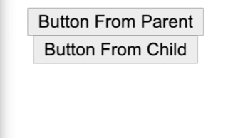

##  官网： https://reactjs.org/docs/hooks-intro.html

## useState

```jsx
import React, { useState } from "react";

const StateTutorial = () => {
  const [inputValue, setInputValue] = useState("Pedro");

  let onChange = (event) => {
    const newValue = event.target.value;
    setInputValue(newValue);
  };

  return (
    <div>
      <input placeholder="enter something..." onChange={onChange} />
      {inputValue}
    </div>
  );
};

export default StateTutorial;
```

## Reducer

多个state 。这里 其实还有一种就是useState 里面用object

```jsx
import React, { useReducer } from "react";

const reducer = (state, action) => {
  switch (action.type) {
    case "INCREMENT":
      return { count: state.count + 1, showText: state.showText };
    case "toggleShowText":
      return { count: state.count, showText: !state.showText };
    default:
      return state;
  }
};

const ReducerTutorial = () => {
  const [state, dispatch] = useReducer(reducer, { count: 0, showText: true });

  return (
    <div>
      <h1>{state.count}</h1>
      <button
        onClick={() => {
          dispatch({ type: "INCREMENT" });
          dispatch({ type: "toggleShowText" });
        }}
      >
        Click Here
      </button>

      {state.showText && <p>This is a text</p>}
    </div>
  );
};

export default ReducerTutorial;
```

## useEffect

```jsx
import React, { useEffect, useState } from "react";
import axios from "axios";

function EffectTutorial() {
  const [data, setData] = useState("");
  const [count, setCount] = useState(0);

  useEffect(() => {
    axios
      .get("https://jsonplaceholder.typicode.com/comments")
      .then((response) => {
        setData(response.data[0].email);
        console.log("API WAS CALLED");
      });
  }, [count]);

  return (
    <div>
      Hello World
      <h1>{data}</h1>
      <h1>{count}</h1>
      <button
        onClick={() => {
          setCount(count + 1);
        }}
      >
        Click
      </button>
    </div>
  );
}

export default EffectTutorial;
```

## UseRef

直接操作DOM， 类似document.getElementById()

```jsx
import React, { useRef } from "react";

function RefTutorial() {
  const inputRef = useRef(null);

  const onClick = () => {
    inputRef.current.value = "";
    inputRef.current.focus()//这里有很多可用方程
  };
  return (
    <div>
      <h1>Pedro</h1>
      <input type="text" placeholder="Ex..." ref={inputRef} />
      <button onClick={onClick}>Change Name</button>
    </div>
  );
}

export default RefTutorial;
```

## useLayoutEffect(少)

与 `useEffect` 相同，但它会在所有的 DOM 变更之后同步调用 effect。可以使用它来读取 DOM 布局并同步触发重渲染。在浏览器执行绘制之前，`useLayoutEffect` 内部的更新计划将被同步刷新。

```jsx
import { useLayoutEffect, useEffect, useRef } from "react";

function LayoutEffectTutorial() {
  const inputRef = useRef(null);

  useLayoutEffect(() => {
    console.log(inputRef.current.value);
  }, []);

  useEffect(() => {
    inputRef.current.value = "HELLO";
  }, []);

  return (
    <div className="App">
      <input ref={inputRef} value="PEDRO" style={{ width: 400, height: 60 }} />
    </div>
  );
}

export default LayoutEffectTutorial;
```

## UseImperativeHandle

`useImperativeHandle` 可以让你在使用 `ref` 时自定义暴露给父组件的实例值。在大多数情况下，应当避免使用 ref 这样的命令式代码。`useImperativeHandle` 应当与 [`forwardRef`](https://zh-hans.reactjs.org/docs/react-api.html#reactforwardref) 一起使用


这种就是父组件会 触及子组件的方程。
```jsx
import { useLayoutEffect, useEffect, useRef } from "react";

function LayoutEffectTutorial() {
  const inputRef = useRef(null);

  useLayoutEffect(() => {
    console.log(inputRef.current.value);
  }, []);

  useEffect(() => {
    inputRef.current.value = "HELLO";
  }, []);

  return (
    <div className="App">
      <input ref={inputRef} value="PEDRO" style={{ width: 400, height: 60 }} />
    </div>
  );
}

export default LayoutEffectTutorial;
```

```jsx
//child button
import React, { forwardRef, useImperativeHandle, useState } from "react";

const Button = forwardRef((props, ref) => {
  const [toggle, setToggle] = useState(false);

  useImperativeHandle(ref, () => ({
    alterToggle() {
      setToggle(!toggle);
    },
  }));
  return (
    <>
      <button>Button From Child</button>
      {toggle && <span>Toggle</span>}
    </>
  );
});

export default Button;
```

## useContext

解决一些组合型共有state状态

```jsx
import React, { useState, createContext } from "react";
import Login from "./Login";
import User from "./User";

export const AppContext = createContext(null);

function ContextTutorial() {
  const [username, setUsername] = useState("");

  return (
    <AppContext.Provider value={{ username, setUsername }}>
      <Login /> <User />
    </AppContext.Provider>
  );
}

export default ContextTutorial;
```

```jsx
import React, { useContext } from "react";
import { AppContext } from "./ContextTutorial";

function Login() {
  const { setUsername } = useContext(AppContext);

  return (
    <div>
      <input
        onChange={(event) => {
          setUsername(event.target.value);
        }}
      />
    </div>
  );
}

export default Login;
```

```jsx
import React, { useContext } from "react";
import { AppContext } from "./ContextTutorial";

function User() {
  const { username } = useContext(AppContext);

  return (
    <div>
      <h1>User: {username}</h1>
    </div>
  );
}

export default User;
```

## Memo  - 关联value

通过**记忆组件渲染结果的方式来提高组件的性能表现。**这意味着在这种情况下，React 将跳过渲染组件的操作并直接复用最近一次渲染的结果。- 避免重复渲染

下面的例子中 点击摁纽不会重新计算。 这里findLongestName只会计算一次

```jsx
import axios from "axios";
import { useEffect, useState, useMemo } from "react";

export default function MemoTutorial() {
  const [data, setData] = useState(null);
  const [toggle, setToggle] = useState(false);

  useEffect(() => {
    axios
      .get("https://jsonplaceholder.typicode.com/comments")
      .then((response) => {
        setData(response.data);
      });
  }, []);

  const findLongestName = (comments) => {
    if (!comments) return null;

    let longestName = "";
    for (let i = 0; i < comments.length; i++) {
      let currentName = comments[i].name;
      if (currentName.length > longestName.length) {
        longestName = currentName;
      }
    }
    console.log("THIS WAS COMPUTED");

    return longestName;
  };

  const getLongestName = useMemo(() => findLongestName(data), [data]);// 这里值会只根据data变化的时候变化
  const getLongestName = useMemo(() => findLongestName(data), [toggle]);// 这里值会只根据toggle变化的时候变化

  return (
    <div className="App">
      <div> {getLongestName} </div>
      <button
        onClick={() => {
          setToggle(!toggle);
        }}
      >
        Toggle
      </button>
      {toggle && <h1> toggle </h1>}
    </div>
  );
}
```

## UseCallback - 关联function

**useCallback(fn, deps) 相当于 useMemo(() => fn, deps)**

把内联回调函数及依赖项数组作为参数传入 `useCallback`，它将返回该回调函数的 memoized 版本，该回调函数仅在某个依赖项改变时才会更新

```jsx
import axios from "axios";
import { useCallback, useState } from "react";
import Child from "./Child";

export default function CallBackTutorial() {
  const [toggle, setToggle] = useState(false);
  const [data, setData] = useState("Yo, pls sub to the channel!");

    //下面如果是普通方程，那么就会一直function rerender，因为他不是一直value
  const returnComment = useCallback(
    (name) => {
      return data + name;
    },
    [data]
  );

  return (
    <div className="App">
      <Child returnComment={returnComment} />

      <button
        onClick={() => {
          setToggle(!toggle);
        }}
      > 
        Toggle
      </button>
      {toggle && <h1> toggle </h1>}
    </div>
  );
}
```

```jsx
import React, { useEffect } from "react";

function Child({ returnComment }) {
  useEffect(() => {
    console.log("FUNCTION WAS CALLED");
  }, [returnComment]);

  return <div>{returnComment("Pedro")}</div>;
}

export default Child;
```

