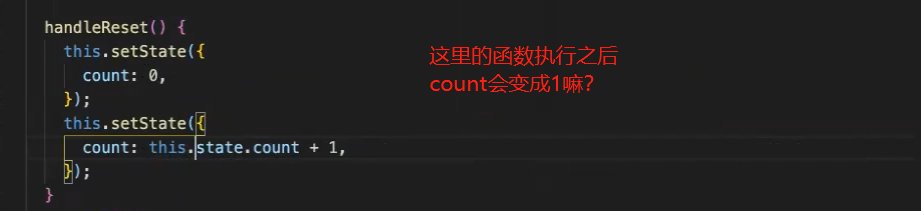
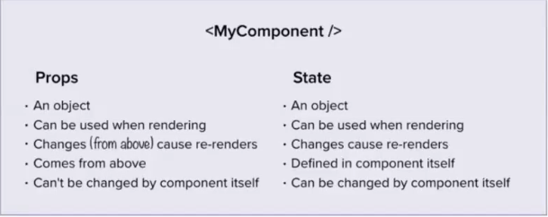

## React 开始

通过react的脚手架，创建项目进行开发，部署。（推荐）

全局安装create-react-app

```sh
$ npm install -g create-react-app
```

创建一个项目

```sh
$ create-react-app your-app 注意命名方式
```

## React 事件与方法

通过前面的练习，我们将用class写

```jsx
import React from 'react'
import ReactDOM from 'react-dom'
 
class IndecisionApp extends React.Component{
  render(){
    const title ='Indecision';
    const subtitle = 'Put your life in the hand of Computer';
    const options = ["option 1","option 2","option 3"]
    return (
      <div>
         <Header title={title} subtitle={subtitle}/>
        <Actions />
        <Options optionArray={options}/>
        <AddOption />
      </div>
    )
  }
}


class Header extends React.Component{
  render(){
    return (
      <div>
        <h1>{this.props.title}</h1>
        <h2>{this.props.subtitle}</h2>
      </div>
    )
  }
}

class Actions extends React.Component{
  handlePick(){
    alert("pick!!!");
  }
  render(){
    return (
      <div>
        {/* <p>This is Action</p> */}
        <button onClick={this.handlePick} >What should I do</button>
      </div>
    )
  }
}


class Options extends React.Component{
  removeAll(){
    alert("remove all ");
  }
  render(){
    return (
      <div>
        Here are option Components from optionArray
        {
         (this.props.optionArray).map((option) => {
            return <Option key={option} optionText={option}/>
          })
        } 
       <button onClick={this.removeAll}> Remove All</button>
      </div>
    )
  }
}


class Option extends React.Component{
  render(){
    return (
      <div>
        {/* <p>This is Option Components</p> */}
        <p>{this.props.optionText}</p>
      </div>
    )
  }
}


//AddOption
class AddOption extends React.Component{
  addOptionFunc(e){
    e.preventDefault();  //防止刷新
    const option = e.target.elements.option.value;//获得输入值
    if(option){
      console.log(option);
      e.target.elements.option.value="";//清空输入值的显示
    }
  } 
  render(){
    return (
      <div>
        <p>This is AddOption Components</p>
        <form onSubmit={this.addOptionFunc}>
            {/* name 用来取值*/}
          <input type="text" name="option"/>
          <button>+1</button>
        </form>
      </div>
    )
  }
}


/* 
const title ='Indecision';
const subtitle = 'Put your life in the hand of Computer';
const options = ["option 1","option 2"]

 const jxs = (
   <div> 
     <Header title={title} subtitle={subtitle}/>
     <Actions />
     <Options optionArray={options}/>
     <AddOption />
   </div>
 )
*/

//注意此处 const 与class 渲染的不同方式
//ReactDOM.render(jxs, document.getElementById('root'));

ReactDOM.render(<IndecisionApp />, document.getElementById('root'));
```

## 事件绑定

### 原理解释

**React事件绑定时需要注意this指向**

react事件绑定时。this并不会指向当前DOM元素。往往使用bind来改变this指向。有参数就得使用bind

```jsx
<button onClick={this.function.bind(this)}>Click Me</button>
```

> 参考这篇文章：[Choosing the Best Approach for React Event Handlers](https://www.bignerdranch.com/blog/choosing-the-best-approach-for-react-event-handlers/)
>
> 1、function.bind()方式
>
> 2、inline arrow function方式
>
> 3、Class Property Arrow Functions - constructor
>
> 第一种方式比较常见，但因为每次父组件render时，会重新生成一个函数，相当于子组件的props发生了改变。子组件的PureComponent会失效。
>
> 第二种是一种性能好，书写简单，功能强大的方式。
>
> 第三种因为是类的属性，可能涉及到继承、方法调用问题，性能有影响。

接下来要加上动态事件，这时候跟前面的区别在于这里由于用的是class，属性之间没有办法很好的共享

#### function.bind()方式

```jsx
const obj={
    name="tom";
    getName(){
        return this,name;
    }
}
//这里利用bind绑定对于后面的obj
const getName=obj,getName.bind({name:"joe"});
console.log(getName());
```

#### inline arrow function方式

1. 为事件提供的处理函数，必须是如下格式

```
onClick= { function } 
```

2. 用的最多的事件绑定形式为：

```jsx
<button onClick={ () => this.show('传参') }>按钮</button>

// 事件的处理函数，需要定义为 一个箭头函数，然后赋值给 函数名称
show = (arg1) => {
   console.log('show方法' + arg1)
}
```

### 回归例子

#### 方式一 -  bind

实际上我们尝试用处理removeAll, 先拿到所有的props，两种办法

```jsx
//方法1：加上removeAll动态的事件，拿到如数的数据，方式一：绑定bind（）
class Options extends React.Component{
  removeAll(){
    console.log(this.props.optionArray);
  }
  render(){
    return (
      <div>
        Here are option Components from optionArray
        {
         (this.props.optionArray).map((option) => {
            return <Option key={option} optionText={option}/>
          })
        } 
        {/* 绑定“参数对象”，所以这里绑定的实际上是传进来的props，所以函数操作对应就是参数对象 */}
       <button onClick={this.removeAll.bind(this)}> Remove All</button>
      </div>
    )
  }
}

```

缺点：

1. 数量多时极其浪费内存
2. 如果是子组件的props，则会导致子组件重新渲染

#### 方式二 ：通过constructor绑定

```jsx
//方式二 通过constructor绑定
class Options extends React.Component{
  constructor(props){//构造函数继承
    super(props);
    this.removeAll = this.removeAll.bind(this);
  }
  removeAll(){
    console.log(this.props.optionArray);
  }
  render(){
    return (
      <div>
        Here are option Components from optionArray
        {
         (this.props.optionArray).map((option) => {
            return <Option key={option} optionText={option}/>
          })
        } 
        {/* 绑定“参数的this” */}
       <button onClick={this.removeAll}> Remove All</button>
      </div>
    )
  }
}
```

#### 方式三 箭头函数

## State

组件自身的state，**注意！！注意！！ 这是对象**

## setState函数 
做一个计数器中利用state进行改变数量

```jsx
//利用算数函数 确保立即执行 保障同步性；因为setState本身是异步函数
incrementCount(){
   this.setState((prevState, props) => ({
      count: prevState.count + 1 //count 是state中属性
    }));
   this.setState((prevState, props) => ({
      count: prevState.count + 1
    }));
  }
```



实际上不会，由于是异步，所以第一个设为0并没有完成，但是可能先+1；

### 实际例子

改变class内state变量

```jsx
import React from 'react'
import ReactDOM from 'react-dom'

class Counter extends React.Component{
  constructor(props){
    super(props);
    this.addone=this.addone.bind(this);
    this.minuseone=this.minuseone.bind(this);
    this.reset=this.reset.bind(this);
    this.state={ count:100 }
  }

  addone(){
    this.setState((prevState)=>{
       return {
         count: prevState.count+1}
    });
  }
  minuseone(){
    this.setState((prevState)=>{
      return {
        count: prevState.count-1}
   });
  }
  reset(){
    this.setState((prevState)=>{
      return {
        count: 0}
   });
  }

  render() {
    return (
    <div>
    <h1>Count: {this.state.count} </h1>
    <button onClick={this.addone }> +1</button>
    <button onClick={this.minuseone}> -1</button>
    <button onClick={this.reset}> reset</button>
    </div>
    )
  }
}

ReactDOM.render( <Counter />, document.getElementById('root'));
```

### setState 的三种写法

**(1)对象**

```js
this.setState({key : value})
//或者
const new="newValue";
this.setState({new})
```

**(2)函数，一般是用于在setState之前做一些操作**

```js
this.setState(state=>{
    return {key : value}
}) 
//或者
this.setState(
  () => {
    // TODO
    console.log('')
    return {
      a:300
    }
  }
) 
```

**(3)第二个参数，一般是用于在setState之后做一些操作**

```js
this.setState({
  a:300
}, () => {
  // TODO
  console.log('state值修改成功，现在的name值为' + this.state.name)
})
```

### 存在props值的修改state的值 

因为更新的 props 和状态是异步的。这里，我们根据这些 props 更新状态。

```jsx
// 错误方式
this.setState({
  total: this.state.total + this.props.count,
})
// 正确方式
this.setState((state, props) => {
 	return {total: state.total + props.count}
})
```

## Props

### 默认props & 基本props

```jsx
//默认input设置
const ShoppingCart = (props) => {
  return (
    <div>
      <h1>Shopping Cart Component</h1>
    </div>
  )
}; 
ShoppingCart.defaultProps={items : 0}

//输入变量
const Items = (props) => {
  return <h1>Current Quantity of Items in Cart: {props.quantity}</h1>
}
Items.defaultProps = {  quantity: 0 }

class ShoppingCart extends React.Component {
  constructor(props) { super(props); }
  render() { 
    return <Items quantity={ 10 }/> 
  }
};
//数组
<ChildComponent colors={["green", "blue", "red"]} />

```

### props 输入限制

```jsx
componentName.propTypes = {
  inputName: PropTypes.string.isRequired//string 
};
componentName.propTypes = {
  inputName: PropTypes.number.isRequired//number
};

```


## Props children

this.props.children。它表示组件所有的子节点。
this.props.children 的值有三种可能：
 - 如果当前组件没有子节点，它就是 undefined；
 - 如果有一个子节点，数据类型是 object；
 - 如果有多个子节点，数据类型就是 array

### 基本语法

一个 span 标签在 Parent 中作为Child的子节点传入，可在 Child 中通过 this.props.children 取到：
```jsx
class Parent extends React.Component {
  render() {
    return (
      <Child>
        <div>slot1</div>
        <div>slot2</div>
        <div>slot3</div>
      </Child>
    )
  }
}
 
class Child extends React.Component {
 render() {
   return (
    <div>
      <div>{this.props.children[2]}</div>
      <div>{this.props.children[1]}</div>
      <div>{this.props.children[0]}</div>
    </div>
  )
 }
}
```

### React.Children 方法

React 提供了工具方法 React.Children 来处理 this.props.children。

1. React.Children.map

```html
object React.Children.map(object children, function fn)
```

遍历 props.children ，在每一个子节点上调用 fn 函数。

2. React.Children.forEach

```html
React.Children.forEach(object children, function fn)
```

类似于 React.Children.map()，但是不返回对象。

3. React.Children.count

```html
number React.Children.count(object children)
```

返回 children 当中的组件总数。

4. React.Children.only

```html
object React.Children.only(object children)
```

返回 children 中仅有的子节点。如果在 props.children 传入多个子节点，将会抛出异常。

### 实例

```jsx
<!DOCTYPE html>
<html lang="en">
<head>
    <meta charset="UTF-8">
    <meta name="viewport" content="width=device-width, initial-scale=1.0">
    <meta http-equiv="X-UA-Compatible" content="ie=edge">
    <title>Document</title>
</head>
<body>
    <div id="app"></div>
    <script src="common/react.js"></script>
    <script src="common/react-dom.js"></script>
    <script src="https://cdn.bootcss.com/babel-core/5.8.38/browser.js"></script>
    <script type="text/babel">
       class App extends React.Component {
           render() {
               return <div>
                    {/*props.children获取下面4个子节点:3个元素节点和1个文字节点*/}
                    {this.props.children.map((item,index)=> <p key={index}>{item}</p>)}
               </div>
           }
       }
       ReactDOM.render(
           <App>
                {/*加一些子元素*/}
                <span>rick</span>
                <span>zhangamie</span>
                <span>react</span>
                2132132
           </App>,
           document.getElementById('app')
       )
    </script>
</body>
</html>
```
## Props vs State



props是单向联动的

## 函数组件-函数名称以大写字母开头

### 无状态组件

**无状态组件不支持this！！**

```jsx
/* 基本语法
const User=()=>{
    return <div></div>
}*/
//这里不需要用this.props
const User=(props)=>{
    return (<div>
        <p>Name: {props.name}</p>
        <p>Age: {props.age}</p>
        </div>)
}
ReactDOM.render( <User name="tom" age={28}/>, document.getElementById('root')); 
```

#### class组件 const组件对比

```jsx
//注意区别 仔细看对比
class Header extends React.Component{
  render(){
    return (
      <div>
        <h1>{this.props.title}</h1>
        <h2>{this.props.subtitle}</h2>
      </div>
    )
  }
}

const Header=(props)=>{
  return(
    <div>
    <h1>{props.title}</h1>
    <h2>{props.subtitle}</h2>
  </div>
  );
}
```

#### 默认input

```jsx
const Header=(props)=>{
  return(
    <div>
    <h1>{props.title}</h1>
    <h2>{props.subtitle}</h2>
  </div>
  );
}
//此处为默认input
//className.defaultProps={ 属性：''}
Header.defaultProps={
  title:'Default Title'
}

class IndecisionApp extends React.Component{
      constructor(props){
      super(props);
      this.state={
        options : props.options
      }
      this.handlePick=this.handlePick.bind(this);
      this.removeAll=this.removeAll.bind(this);
  }

  render(){
    const title ='Indecision App';
    const subtitle = 'Put your life in the hand of Computer';
    return (
      <div>
         {/* 此时title就是默认的title
         <Header title={title} subtitle={subtitle}/>
         */}
         <Header subtitle={subtitle}/>
      </div>
    )
  }
}
IndecisionApp.defaultProps={ option:[]}

//有无输入区别
ReactDOM.render(<IndecisionApp />, document.getElementById('root'));
//ReactDOM.render(<IndecisionApp options={["option 1","option 2"]} />, document.getElementById('root'));
```


#### input双向绑定

```jsx
class ControlledInput extends React.Component {
  constructor(props) {
    super(props);
    this.state = {
      input: ''
    };
this.handleChange=this.handleChange.bind(this);
  }
handleChange(event){   
  this.setState( {
      input: event.target.value,
    });
}

  render() {
    return (
      <div>
        { /* 这里注意： 不仅input输入变状态 状态的改变也会改变输入*/}
          <input type="text" value = {this.state.input} onChange={this.handleChange}  /> 
        <h4>Controlled Input : </h4>
        <p>{this.state.input}</p>
      </div>
    );
  }
};
```


#### onclick函数

```jsx
const Option = (props)=>{
  return(
    <div> 
      <p>{props.optionText}</p>
      <button onClick={()=>{props.deleteFunc(props.inputText)}}>remove this</button>
      <button onClick={this.handleClick}>Click Me</button>{/*handleClick是函数*/}
    </div>
  )
}
```


### 状态组件

```jsx
class StatefulComponent extends React.Component {
  constructor(props) {
    super(props);
      this.state = {
        name: ""
      }
  }
  render() {
      //或者可以这里有个const 拿到上面的state中的值，下面再次调取
    return (
      <div>
        <h1>{this.state.name}</h1>
      </div>
    );
  }
};
```


## 父子组件之间的传递以及实例

### 单纯的input传输（子组件input给父）

```jsx
class MyApp extends React.Component {
  constructor(props) {
    super(props);
    this.state = {
      inputValue: ''
    }
    this.handleChange = this.handleChange.bind(this);
  }
  handleChange(event) {
    this.setState({
      inputValue: event.target.value
    });
  }
  render() {
    return (
       <div>
          <GetInput input={this.state.inputValue}  handleChange={this.handleChange}/>
          <RenderInput input={this.state.inputValue}/>
       </div>
    );
  }
};

class GetInput extends React.Component {
  constructor(props) {
    super(props);
  }
  render() {
    return (
      <div>
        <h3>Get Input:</h3>
        <input
          value={this.props.input}
          onChange={this.props.handleChange}/>
      </div>
    );
  }
};

class RenderInput extends React.Component {
  constructor(props) {
    super(props);
  }
  render() {
    return (
      <div>
        <h3>Input Render:</h3>
        <p>{this.props.input}</p>
      </div>
    );
  }
};
```

### 子组件事件 影响父组件state

父组件 - IndecisionApp

```jsx
class IndecisionApp extends React.Component{
    constructor(props){
        super(props);
        this.state={
            options : ["option 1","option 2","option 3"],//options : [ ]
            pickedOption:null,
        }
    }
    
    handleRemove=(optionValue)=>{ 
        console.log("remove this ",optionValue);
        this.setState(()=>({
            options: this.state.options.filter(function (elem, index, arr) {
                return  elem !== optionValue
              })
        }))
    }
    render(){
        const subtitle = 'Put your life in the hands of a computer'
        return(
            <div>
                <Header subtitle={subtitle}/>
                {/* What should i do  render pick- 弹窗+产生随机数 */}
                <Action active={this.state.options.length} hanldPickOption={this.hanldPickOption} />
                {/* show all options+ remove all + remove one */}
                <Options options={this.state.options} removeAll={this.handleRemoveAll} remove={this.handleRemove}/>
                {/* add one option */}
                <AddOption addOption={this.handleAddOption}/>
                {/* 弹框 */}
                <OptionModal pickedOption={this.state.pickedOption} clearPickedOption={this.clearPickedOption} />  
            </div>
        )
    }
 }
```

子组件 - Options

```jsx
const Options = (props)=>{
    return (
        <div>
        {props.options.length === 0 && <p>Add an option to started!</p>}
        <ul>
        {/* {props.options.map((i) => <li key={i}>{i} <button onClick={props.remove}> remove </button></li>)}  */}
        {props.options.map((e,i) => <Option key={e} optionText={e} remove={props.remove}/>)}
        </ul>
        <button onClick={props.removeAll}>Remove all</button>
    </div>
    )
}
export default Options
```

### 子组件向父组件通信

子组件通过 回调函数 向父组件传递数据。父组件将自己的某个方法传递给子组件，子组件通过this.props接收到父组件的方法后进行调用。

如果子组件内需要修改父组件传递过来的数据，需要通过调用父组件的方法，在父组件中对数据进行修改。

```jsx
import React, { Component ,createRef} from 'react'
import ReactDOM from 'react-dom';

//子组件
class Child extends Component{
   state={
     name:"admin",
     age:18
  }
  childClickHandle=()=>{
    this.props.showInfo({address:"beijing"})
  }
  render(){
    return (
	    <div>
             {/*方式一：直接调用父组件的方法*/}
		    <button onClick={this.props.showInfo.bind(this,this.state)}>按钮</button>
		    {/*方式二：先调用自身的方法，再调用父组件的方法*/}
		    <button onClick={this.childClickHandle}>按钮</button>
	    </div>
	)
  }
}

//父组件
class Parent extends Component{
  clickHandle(data){
    //data为子组件中传递过来的数据
    //{address: "beijing"}
    //{name: "admin", age: 18, sex: "woman"}
	console.log(data);
  }

  render(){
    return <Child showInfo={this.clickHandle.bind(this)}></Child>
  }
}

ReactDOM.render(
  <Parent/>,
  document.getElementById('root')
);
```


# reference:

- https://blog.csdn.net/u012372720/article/details/94000150
- CodeCamp 练习题
- [React 组件通信的五种方式_props_ref_Context_Redux](https://blog.csdn.net/Charissa2017/article/details/105746685)

# 拓展读物

[五分钟，简单聊一聊React Component的发展历程](https://doc.xuwenliang.com/docs/react/3503)