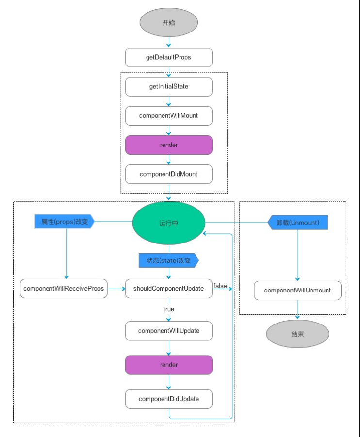
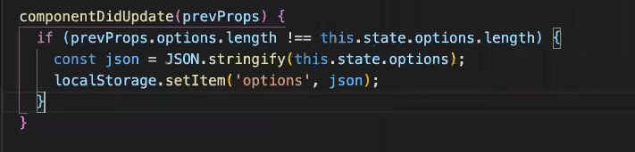
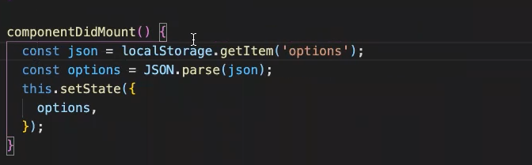
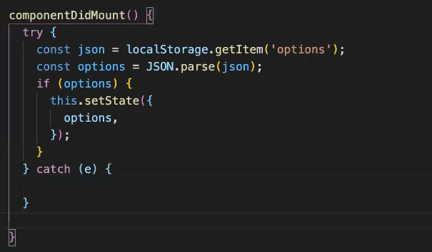

# React的生命周期

## 挂载卸载过程基本函数

- constructor()
- componentWillMount()
- componentDidMount()
- componentWillUnmount ()

## 更新过程基本函数

- componentWillReceiveProps (nextProps) 
- shouldComponentUpdate(nextProps,nextState) 
- componentWillUpdate (nextProps,nextState) 
- componentDidUpdate(prevProps,prevState) 
- render() 

## React新增的生命周期基本函数 

- getDerivedStateFromProps(nextProps, prevState)
- getSnapshotBeforeUpdate(prevProps, prevState)

React的生命周期从广义上分为三个阶段：挂载、渲染、卸载



# 挂载卸载过程

## 1.constructor()

constructor()中完成了React数据的初始化，它接受两个参数：props和context，当想在函数内部使用这两个参数时，需使用super()传入这两个参数。
 注意：只要使用了constructor()就必须写super(),否则会导致this指向错误。

## 2.componentWillMount()

componentWillMount()一般用的比较少，它更多的是在服务端渲染时使用。它代表的过程是组件已经经历了constructor()初始化数据后，但是还未渲染DOM时。

```jsx
class MyComponent extends React.Component {
  constructor(props) {
    super(props);
  }
  componentWillMount() { 
  console.log(0); 
  }
  render() {
    return <div />
  }
};
//结果：执行多次哦
//0
//0
//0
```


## 3.componentDidMount()

组件第一次渲染完成，此时dom节点已经生成，可以在这里调用ajax请求，返回数据setState后组件会重新渲染

```jsx
class MyComponent extends React.Component {
  constructor(props) {
    super(props);
    this.state = {
      activeUsers: null
    };
  }
  componentDidMount() {
    setTimeout(() => {
      this.setState({
        activeUsers: 1273
      });
    }, 2500);
  }
  render() {
    return (
      <div> 
        <h1>Active Users:{this.state.activeUsers} </h1> 
      </div>
    );
  }
}
```


## 4.componentWillUnmount ()

在此处完成组件的卸载和数据的销毁。

1. clear你在组建中所有的setTimeout,setInterval
2. 移除所有组建中的监听 removeEventListener
3. 有时候我们会碰到这个warning:

```csharp
Can only update a mounted or mounting component. This usually means you called setState() on an unmounted component. This is a   no-op. Please check the code for the undefined component.
```

原因：因为你在组件中的ajax请求（异步函数）返回setState,而你组件销毁的时候，请求还未完成，因此会报warning
 解决方法：

```kotlin
componentDidMount() {
    this.isMount === true
    axios.post().then((res) => {
    this.isMount && this.setState({   // 增加条件ismount为true时
      aaa:res
    })
})
}
componentWillUnmount() {
    this.isMount === false
}
```

其他的：https://www.jianshu.com/p/b331d0e4b398 

# 实际应用

## 5、componentDidUpdate(prevProps,prevState) 

数据发生变化之后才会被保存



## 6、componentDidMount()

渲染的时候，读取数据储存，刷新页面也还是根据localStorage



但是这里其实加多判断看有没有option这个数据，另外要注意页面error（JSON.parse()这个很容易有error，导致页面崩塌）




# 练习

偶数点击，显示count

```jsx
class OnlyEvens extends React.Component {
  constructor(props) {
    super(props);
  }
  shouldComponentUpdate(nextProps, nextState) {
    console.log('Should I update?'); 
    //只有当摁了两次才会发生改变
    if(nextProps.value %2 == 0){
    return true;} 
  }
  componentDidUpdate() {
    console.log('Component re-rendered.');
  }
  render() {
    return <h1>{this.props.value}</h1>;
  }
}

class Controller extends React.Component {
  constructor(props) {
    super(props);
    this.state = {
      value: 0
    };
    this.addValue = this.addValue.bind(this);
  }
  addValue() {
    this.setState(state => ({
      value: state.value + 1
    }));
  }
  render() {
    return (
      <div>
        <button onClick={this.addValue}>Add</button>
        <OnlyEvens value={this.state.value} />
      </div>
    );
  }
}
```

暂存option （indecision app）

```jsx
componentDidUpdate(prevProps,prevState){
    if(prevState.options.length !== this.state.options.length){
            console.log("options changed")
            const json =JSON.stringify(this.state.options);
            localStorage.setItem('option',json);
    }
}
componentDidMount(){
    try{
        const json=localStorage.getItem('option');
        const options=JSON.parse(json);
        this.setState({
            options,
        })
    }catch(error){
        }
}
```


## 对于localstorage

基本用法

| **名称**               | **作用**                                                  |
| ---------------------- | --------------------------------------------------------- |
| setItem(“key”,“value”) | 存储数据，如果key存在，就更新value                        |
| getItem(“key”)         | 读取数据，获取名称为key的值，如果key不存在则返回null      |
| clear                  | 清空localStorage上存储的数据                              |
| removeItem(“key”)      | 删除名称为“key”的信息，这个key所对应的value也会全部被删除 |
| key                    | 读取第i个数据的名字或称为键值(从0开始计数)                |
| length                 | 获取localStorage存储变量的个数                            |

关于字符串和对象
- 1.localStorage中只能存字符串，如果直接把对象放到localStorage中，则直接保存object object这个字符串
- 2.如果调用localStorage的getItem("carts")方法得到的信息也是字符串
- 3.js和字符串的转换
js对象---->字符串:var str=JSON.stringfy(js对象)
字符串----->js对象：var obj=JSON.parse(字符串);

例如字符串和对象

```jsx
class Person extends Object{
String name;
}
Person p=new Person();
//这是一个对象,转为字符串,用tostring方法
```

**从本地获取数据得到的是字符串，要先从字符串转为js对象(数组),同理，最后用完了数据要转成字符串再存入本地**

### 1、存

```json
localStorage.setItem("phone", "123")

//对象
let obj = {"name":"xiaoming","age":"16"}
localStorage.setItem("phone",JSON.stringify(obj));
```

### 2、取

```json
localStorage.getItem("phone")

//对象
let user = JSON.parse(localStorage.getItem("phone"))
```

### 3、删

```json
//指定删
localStorage.removeItem('phone');

//全删
localStorage.clear(); 
```

### 4、设置localStorageSet 过期时间

```json
//设置缓存
const localStorageSet = (name, data) => {
    const obj = {
        data,
        expire: new Date().getTime() + 1000 * 60 * 30
    };
    localStorage.setItem(name, JSON.stringify(obj));
};
```

### 5、读取缓存，且比较时间戳是否过期

```json
//读取缓存
const localStorageGet = name => {
    const storage = localStorage.getItem(name);
    const time = new Date().getTime();
    let result = null;
    if (storage) {
        const obj = JSON.parse(storage);
        if (time < obj.expire) {
            result = obj.data;
        } else {
            localStorage.removeItem(name);
        }
    }
    return result;
};
```

### 6、使用

```json
//存
localStorageSet('weather', data)

//取（返回null则过期）
localStorageGet('weather')
```

# 一个完整的例子

```jsx
import React,{Component} from 'react';
import {render} from 'react-dom';
import './index.css';

class CommentInput extends Component{
    constructor(){
        super();
        this.state={
            username:'',
            content:''
        }
    }

    handleUsernameChange=(event)=>{
        this.setState({
            username:event.target.value
        })
    };

    handleContentChange=(event)=>{
        this.setState({
            content:event.target.value
        })
    };

    handleSubmit=()=>{
        if(this.props.submit){
            this.props.submit({
                username:this.state.username,
                content:this.state.content,
                createTime:+new Date()
            })
        }
        this.setState({
            content:''
        })
    };

    handleUsernameHold=(event)=>{
        localStorage.setItem('username',event.target.value)
    };

    componentWillMount(){
        const username=localStorage.getItem('username');
        if(username){
            this.setState({username})
        }
    }

    componentDidMount(){
        this.input.focus();
    };

    render(){
        return(
            <div className='comment-input'>
                <div className='comment-field'>
                    <span className='comment-field-name'>用户名：</span>
                    <div className='comment-field-input'>
                        <input
                            ref={(input)=>this.input=input}
                            value={this.state.username}
                            onBlur={this.handleUsernameHold}
                            onChange={this.handleUsernameChange}
                        />
                    </div>
                </div>
                <div className='comment-field'>
                    <span className='comment-field-name'>评论内容：</span>
                    <div className='comment-field-input'>
                        <textarea
                            value={this.state.content}
                            onChange={this.handleContentChange}
                        />
                    </div>
                </div>
                <div className='comment-field-button'>
                    <button onClick={this.handleSubmit}>
                        发布
                    </button>
                </div>
            </div>
        )
    }
}

class CommentList extends Component{

    constructor(){
        super();
        this.state={
            items:[]
        }
    }

    render(){
        return(
            <div>
                {this.props.items.map((item,index)=><Comment deleteItem={this.props.deleteItem} item={item} index={index} key={index}/>)}
            </div>
        )
    }
}

class Comment extends Component{
    constructor(){
        super();
        this.state={
            timeString:''
        }
    }

    handleTimeString=()=>{
        const item=this.props.item;
        const duration=(+Date.now()-item.createTime)/1000;
        return duration>60?`${Math.round(duration/60)}分钟前`:`${Math.round(Math.max(duration,1))}秒前`;
    };

    handleDelete=()=>{
        if(this.props.deleteItem){
            this.props.deleteItem(this.props.index)
        }
    };

    render(){
        return(
            <div className='comment'>
                <div className='comment-user'>
                    <span className='comment-username'>{this.props.item.username} </span>：
                </div>
                <p>{this.props.item.content}</p>
                <span className="comment-delete" onClick={this.handleDelete}>删除</span>
                <span className="comment-createdtime">
                    {this.handleTimeString()}
                </span>
            </div>
        )
    }
}

class CommentApp extends Component{
    constructor(){
        super();
        this.state={
            items:[]
        }
    }

    handleSubmit=(item)=>{
        this.state.items.push(item);
        this.setState({
            items:this.state.items
        });
        localStorage.setItem('items',JSON.stringify(this.state.items))
    };

    handleDelete=(index)=>{
        console.log(index);
        this.state.items.splice(index,1);
        this.setState({
            items:this.state.items
        });
        localStorage.setItem('items',JSON.stringify(this.state.items))
    };

    componentWillMount(){
        let items=localStorage.getItem('items');
        if(items){
            items=JSON.parse(items);
            this.setState({items})
        }
    };

    render(){
        return(
            <div className="wrapper">
                <CommentInput submit={this.handleSubmit} />
                <CommentList deleteItem={this.handleDelete} items={this.state.items}/>
            </div>
        )
    }
}

class Index extends Component{
    render(){
        return(
            <div>
                <CommentApp/>
            </div>
        )
    }
}

render(<Index/>,document.getElementById('root'));
```

# reference:

- CodeCamp 练习题

- https://zhuanlan.zhihu.com/p/151286410

- https://www.cnblogs.com/Scar007/p/8081212.html

  