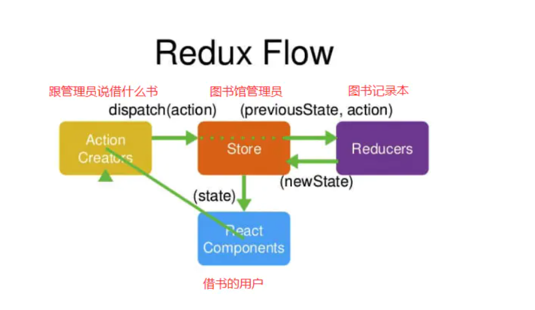
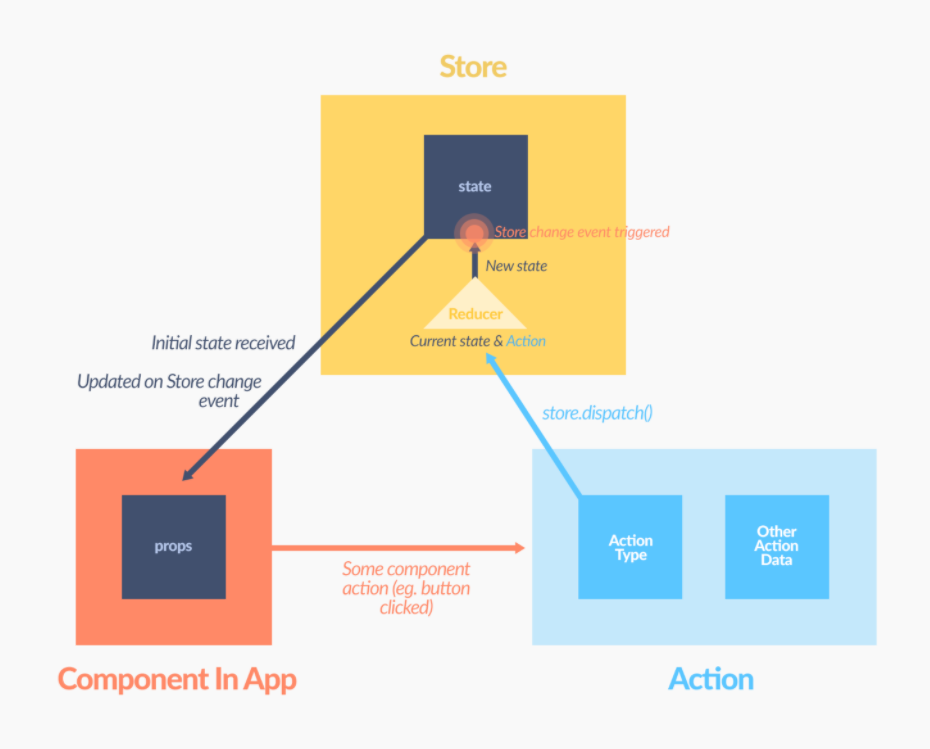
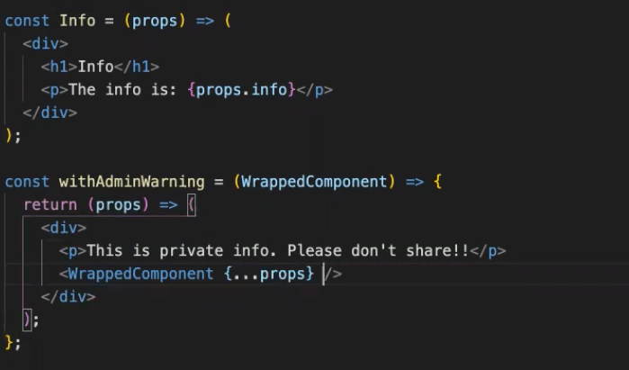
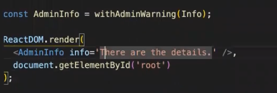
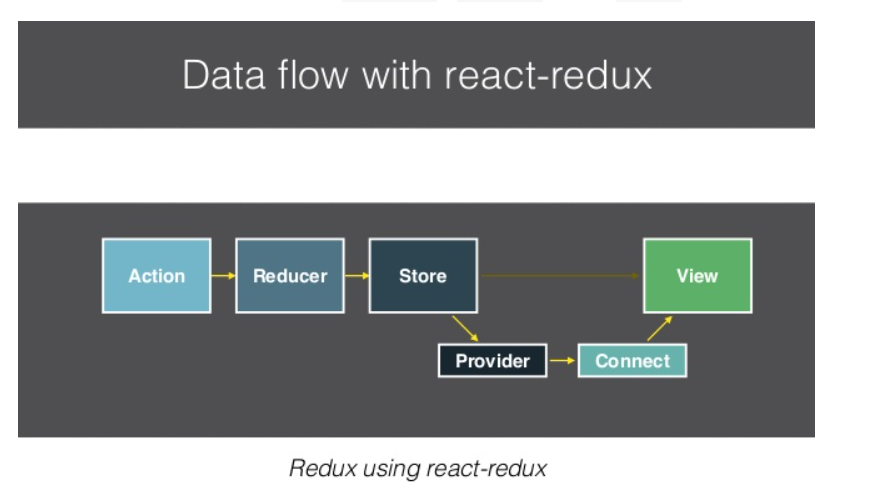
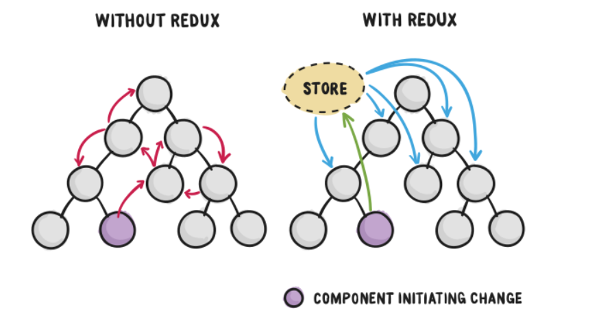
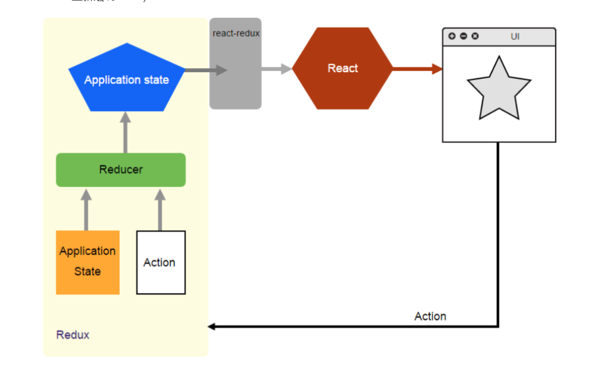

# Redux 必要条件

The Redux core library is available as a package on NPM for use with a module bundler or in a Node application:

```
# NPM
npm install redux

# Yarn
yarn add redux
```

# redux理解

什么: redux是专门做状态管理的独立第3方库, 不是react插件
作用: 对应用中状态进行集中式的管理(写/读)
开发: 与react-redux, redux-thunk等插件配合使用

**类比图书馆借书流程：**

- 首先，我们要借一本书，
- 借书的人（React Components），他说‘我要借一本书’（actionCreaters）
- 这句话被图书馆管理员（store）听见后，管理员去找这本书，但是他自己记不住
- 于是管理员去查阅图书记录本（reducers），记录本会显示这本书放在哪（一来一回）
- 管理员（store）知道这本书放在哪，找到这本书，把这本书给借书的人（React Components）
- 

**store、components、actionCreaters、reducers的关系即为：**

- 首先有一个组件，组件要去获取store中的一些数据

- actionCreaters通过dispatch(action)方法  让store知道 组件要获取数据

- store在reducer查组件需要什么数据，reducer返回组件应该拿到的数据

- store获得数据后把数据 返给 组件 

  

  

# Redux核心概念(3个)


## action
默认是对象(同步action), {type: 'xxx', data: value}, 需要通过对应的actionCreator产生, 
它的值也可以是函数(异步action), 需要引入redux-thunk才可以

## reducer
根据老的state和指定的action, 返回一个新的state
不能修改老的state

## store
redux最核心的管理对象
内部管理着: state和reducer
提供方法: getState(), dispatch(action), subscribe(listener)

- `createStore` 创建store
- `store.dispatch` 派发action，action传递给store
- `store.getState()` 获取store里面所有的数据内容
- `store.subscribe()` 订阅store的改变，只要store发生改变，`store.subscribe()`中的回调函数就会执行

#  单个redux例子

## 基础 reducer store action

```jsx
import { createStore } from 'redux' 
/**
 这是 reducer - a function describing "what happened"
 - reducer =  a current state value + an action object  
 - returns a new state value.
 - 格式： (state, action) => newState
 *
 * The Redux state ： plain JS objects, arrays, and primitives.
 * The root state value is usually an object.   
 */
function counterReducer(state = { value: 0 }, action) {
  switch (action.type) {
    case 'INCREMENT':
      return { value: state.value + 1 }
    case 'DECREMENT':
      return { value: state.value - 1 }
    case 'RESET':
      return { value: 0}
    default:
      return state
  }
}

const store =createStore(counterReducer)
//查状态 0
console.log(store.getState());

//执行
store.dispatch({ type: "INCREMENT" })
store.dispatch({ type: "INCREMENT" })
store.dispatch({ type: "INCREMENT" })
//3
console.log(store.getState());
store.dispatch({ type: "DECREMENT" })
//2
console.log(store.getState());s

store.dispatch({ type: "RESET" })
//0
console.log(store.getState()); 
```

## subscribe以及设置特殊值

```jsx
 //仓库放所有action 以及state
const initState = {
  count :0 ,
  list:['任务一',"任务二"]
};
 //仓库放所有action 以及state
const store = createStore((state=initState,action)=>{
  switch(action.type){
  case "INCREMENT":
    const incrementBy = typeof action.incrementBy ==='number'? action.incrementBy :1;
    return { count:state.count+incrementBy }
  
  case "DECREMENT": 
  const decrementBy = typeof action.decrementBy ==='number'? action.decrementBy :1;
    return { count:state.count-decrementBy }
  
  case "RESET": return { count:0 }

  case "SET": return { count:action.count }
  
  default: return state
  }
}) 
//实时监控
const unsub=store.subscribe(()=>{ console.log(store.getState()); })

//执行
store.dispatch({ type: "INCREMENT", incrementBy:5})
store.dispatch({ type: "INCREMENT" }) 
store.dispatch({ type: "DECREMENT", decrementBy:3 }) 
store.dispatch({ type: "SET", count : 100 }) 

//直接取消掉subscribe
unsub();
//后面执行但是不会跟踪
store.dispatch({ type: "DECREMENT", decrementBy:3}) 
console.log(store.getState())
```

利用解构 以及整理Action

```jsx
 const initState = {
  count :0 ,
  list:['任务一',"任务二"]
};
 //仓库放所有action选择 以及state 以及返回新的对象
const store = createStore((state=initState,action)=>{
  switch(action.type){
  case "INCREMENT":  return { count:state.count+action.incrementBy };
  
  case "DECREMENT":  return { count:state.count-action.decrementBy };
  
  case "RESET": return { count:0 };

  case "SET": return { count:action.count };
  
  default: return state
  }
}) 
//实时监控
const unsub=store.subscribe(()=>{ console.log(store.getState()); })

//返回操作函数（对象包装函数）
const increment =(payload={})=>{
  return {
  type: "INCREMENT",
  incrementBy:typeof payload.incrementBy ==='number'? payload.incrementBy :1}
}
//这里利用解构 简化写法
const decrement =({decrementBy=1}={})=>{
 return{ type: "DECREMENT", decrementBy}}
//执行
store.dispatch(increment({incrementBy:6}))
store.dispatch(increment({ type: "INCREMENT" }))
store.dispatch(decrement({decrementBy:5})) 
store.dispatch({ type: "SET", count : 100}) 
//直接取消掉subscribe
unsub();

//后面执行但是不会跟踪
store.dispatch({ type: "DECREMENT", decrementBy:3}) 
console.log(store.getState())
```

## 最终完整单个redux例子

最终得到基础的单个redux， 这里注意的重点是，我们用reducer 是为了通过得到一个state以及action 从而返回新的state，并没有改变原本的state，只是给了新的state

```jsx
const initState = {
  count :0 ,
  list:['任务一',"任务二"]
};

const countReducer=(state=initState,action)=>{
  switch(action.type){
  case "INCREMENT":  return { count:state.count+action.incrementBy };
  
  case "DECREMENT":  return { count:state.count-action.decrementBy };
  
  case "RESET": return { count:0 };

  case "SET": return { count:action.setCount };
  
  default: return state
  }
}


 //仓库放所有action选择 以及state 以及返回新的对象
const store = createStore(countReducer) 
//实时监控
const unsub=store.subscribe(()=>{ console.log(store.getState()); })

//返回操作函数（对象包装函数） action generator
const increment =(payload={})=>{
  return {
  type: "INCREMENT",
  incrementBy:typeof payload.incrementBy ==='number'? payload.incrementBy :1}
}

//这里利用解构 简化写法
const decrement =({decrementBy=1}={})=>{
 return{ type: "DECREMENT", decrementBy} 
}

const reset =()=>{
  return { type: "RESET" }
}

const set =({setCount}={})=>{
  return { type: "SET", setCount}
}

//执行
store.dispatch(increment({incrementBy:6}))
store.dispatch(increment({type: "INCREMENT"}))
store.dispatch(decrement({decrementBy:5})) 
store.dispatch(reset())
store.dispatch(decrement({decrementBy:5})) 
store.dispatch(set({setCount:-99})) 
//直接取消掉subscribe
unsub();

//后面执行但是不会跟踪
store.dispatch({ type: "DECREMENT", decrementBy:3 }) 
console.log(store.getState())
```

# 多个reducer例子

那么接下来看看多个reducer的时候 处理数据怎么做

```js
//两个数据例子
const demoState={
  expenses:[{
    id:'poijasdfhwer',
    description:'January Rent',
    note:'This was the final payment',
    amount:54500,
    createdAt:0
  }],
  filters:{
    text:'rent',
    sortBy:'amount',//date or amount
    startDate:undefined,
    endDate:undefined,
  }
}

//default state & reducer
const expensesReducerDefaultState=[];
const expensesReducer=(state=expensesReducerDefaultState,action)=> {
  switch(action.type){
    case "ADD_EXPENSE": 
    //return  state.concat(action.expense);//此处不影响原先数组 只是返回新数组 
    return [...state,action.expense];
    case "REMOVE_EXPENSE": 
    return state.filter(function (elem) {
      return (elem.id !== action.id);
    });
    case "EDIT_EXPENSE": 
    //return  state.concat(action.expense);//此处不影响原先数组 只是返回新数组 
    return state.map((expense)=>{
      if(expense.id===action.id){
        return {
          ...expense,
          ...action.updates,
        }
      }else{
        return expense
      }
    });
    default: return state
  }
}


//返回操作函数（对象包装函数） action generator
const addExpense=({
  description="",
  note="",
  amount=0,
  createdAt=0
}={})=>({
    type:"ADD_EXPENSE",
    expense:{
    id:uuidv4(),
    description,
    note,
    amount,
    createdAt}
  })

const removeExpense=({id}={})=>({ type:"REMOVE_EXPENSE", id })

const editExpense=(id,updates)=>({
    type:"EDIT_EXPENSE",
    id,
    updates
})

//default state & reducer
const filtersReducerDefaultState={
    text:'',
    sortBy:'amount',//date or amount
    startDate:undefined,
    endDate:undefined,
};
const filtersReducer=(state=filtersReducerDefaultState,action)=> {
  switch(action.type){
    case "SET_TEXT_FILTER": 
    return {
      ...state,
      text:action.name
    }
    default: return state
  }
}

//action
const setTextFilter = (name)=>({
  type:"SET_TEXT_FILTER",
  name
})


//仓库放所有action选择 以及state 以及返回新的对象
const store = createStore(combineReducers({expenses:expensesReducer,filters:filtersReducer})) 
//实时监控
const unsub=store.subscribe(()=>{ console.log(store.getState()); })

const expenseOne = store.dispatch(addExpense({description:"Rent",amount:1000})) 
const expenseTwo = store.dispatch(addExpense({description:"Coffee",amount:666}))  

store.dispatch(removeExpense({id:expenseOne.expense.id}))  
store.dispatch(editExpense(expenseTwo.expense.id,{description:"RentNew",amount:19999}))  
store.dispatch(setTextFilter("Rent")); 
```

这里注意 对于箭头函数中，返回时对象，可以直接使用 ( )=>( {对象})

继续补充例子中的function

```js

//default state & reducer
const expensesReducerDefaultState=[];
const expensesReducer=(state=expensesReducerDefaultState,action)=> {
  switch(action.type){
    case "ADD_EXPENSE": 
    //return  state.concat(action.expense);//此处不影响原先数组 只是返回新数组 
    return [...state,action.expense];
    case "REMOVE_EXPENSE": 
    return state.filter(function (elem) {
      return (elem.id !== action.id);
    });
    case "EDIT_EXPENSE": 
    //return  state.concat(action.expense);//此处不影响原先数组 只是返回新数组 
    return state.map((expense)=>{
      if(expense.id===action.id){
        return {
          ...expense,
          ...action.updates,
        }
      }else{
        return expense
      }
    });
    default: return state
  }
}

//action
const addExpense=({
  description="",
  note="",
  amount=0,
  createdAt=0
}={})=>({
    type:"ADD_EXPENSE",
    expense:{
    id:uuidv4(),
    description,
    note,
    amount,
    createdAt}
  })

const removeExpense=({id}={})=>({ type:"REMOVE_EXPENSE", id })

const editExpense=(id,updates)=>({
    type:"EDIT_EXPENSE",
    id,
    updates
})


const filtersReducerDefaultState={
    text:'',
    sortBy:'amount',//date or amount
    startDate:undefined,
    endDate:undefined,
};
const filtersReducer=(state=filtersReducerDefaultState,action)=> {
  switch(action.type){
  case "SET_TEXT_FILTER": 
    return {
      ...state,
      text:action.name
    }
  case "SORT_BY_DATE": 
    return {
      ...state,
      sortBy:'date'
    }
  case "SORT_BY_AMOUNT": 
    return {
      ...state,
      sortBy:'amount'
    }
  case "SET_START_DATE": 
    return {
      ...state,
      startDate:action.startDate
    }
  case "SET_END_DATE": 
    return {
      ...state,
      endDate:action.endDate
    }
    default: return state
  }
}

const setTextFilter = (name)=>({
  type:"SET_TEXT_FILTER",
  name
})

const sortByDate = ()=>({
  type:"SORT_BY_DATE"
})

const sortByAmount = ()=>({
  type:"SORT_BY_AMOUNT"
})

const setStartDate=(startDate)=>({
  type:"SET_START_DATE",
  startDate
})

const setEndDate=(endDate)=>({
  type:"SET_END_DATE",
  endDate
})

 //仓库放所有action选择 以及state 以及返回新的对象
const store = createStore(combineReducers({expenses:expensesReducer,filters:filtersReducer})) 

const getVisibleExpenses=(expenses,{text,sortBy,startDate,endDate})=>{
  return expenses.filter((element)=>{
    //if not set the startdate and createdAt is ok
    const startDateMatch = typeof startDate !== 'number' || element.createdAt >= startDate;
    const endDateMatch =  typeof endDate !== 'number' || element.createdAt <= endDate;
    const textMatch = element.description.toLowerCase().includes(text.toLowerCase());
    return startDateMatch && endDateMatch && textMatch;
  }).sort((a,b)=>{
    if(sortBy === "date"){
      return a.createdAt > b.createdAt ? 1 : -1;
    }else if(sortBy === "amount"){
      return a.amount > b.amount ? 1 : -1;
    }
  })
}

//实时监控
const unsub=store.subscribe(()=>{ 
  const state=store.getState();
  const visibleExpenses =getVisibleExpenses(state.expenses,state.filters);
  console.log(visibleExpenses);
  console.log(store.getState()); 
})

//返回操作函数（对象包装函数） action generator
 const expenseOne = store.dispatch(addExpense({description:"cRent",amount:215610,createdAt:1000})) 
 const expenseTwo = store.dispatch(addExpense({description:"Coffee1",amount:1,createdAt:-1000})) 
 store.dispatch(addExpense({description:"Coffee2",amount:2,createdAt:2000})) 
 store.dispatch(addExpense({description:"Coffee3",amount:3,createdAt:3000}))  

 //store.dispatch(removeExpense({id:expenseOne.expense.id}))  
 store.dispatch(editExpense(expenseTwo.expense.id,{description:"c",amount:9}))  
 store.dispatch(setTextFilter("c")); 
 store.dispatch(sortByAmount()); 
 //store.dispatch(sortByDate()); 
 //store.dispatch(setStartDate(0)); 
 //store.dispatch(setEndDate(999)); 

// const demoState={
//   expenses:[{
//     id:'poijasdfhwer',
//     description:'January Rent',
//     note:'This was the final payment',
//     amount:54500,
//     createdAt:0
//   }],
//   filters:{
//     text:'rent',
//     sortBy:'amount',//date or amount
//     startDate:undefined,
//     endDate:undefined,
//   }
// }

```

# 高阶组件（Higher-Order Components）

高阶组件就是一个函数，传给它一个组件，它返回一个新的组件

```js
import React, { Component } from 'react'

export default (WrappedComponent) => {
  class NewComponent extends Component {
    // 可以做很多自定义逻辑
    render () {
      return <WrappedComponent />
    }
  }
  return NewComponent
}
```

## 例子

 



# React Redux

> **Redux 跟 React 並沒有關係。你可以用 React、Angular、Ember、jQuery 或甚至原生 JavaScript 來撰寫 Redux 應用程式。**




`react-redux` 是 React 和 Redux 间的桥梁，使用 `Provider`、`connect` 去连结 `store` 和 React View。

整合了 `react-redux` 后，我们的 React App 就可以解决传统跨 Component 之前传递 state 的问题和困难。只要通过 `Provider` 就可以让每个 React App 中的 `Component` 取用 store 中的 state，非常方便



## [Installation](https://react-redux.js.org/introduction/quick-start#installation)

```js
npm install react-redux 
yarn add react-redux
```

## Provider
React Redux provides` <Provider />`, which makes the Redux store available to the rest of your app

### 使用provider的例子

```jsx
import React from 'react'
import ReactDOM from 'react-dom'

import { Provider } from 'react-redux'
import store from './store'

import App from './App'

const rootElement = document.getElementById('root')

const store = createStore( 
    combineReducers({
        expenses:expensesReducer,
        filters:filtersReducer
    })
); 

ReactDOM.render(
  <Provider store={store}>
    <App />
  </Provider>,
  rootElement
)
```

## connect()
React Redux provides a connect function for you to connect your component to the store.

connect 返回的是函数，不是组件

### 使用connect例子1

```jsx
import {connect} from 'react-redux'
const ExpenseList =(props)=>(
    <div>
        <h1>Expenses</h1>
        {props.expenses.map((element)=>(
          <ExpenseListItem key={element.id} {...element} />  
        ))} 
    </div>
);
//将state中的信息取出来
const mapStateToProps = (state /*, ownProps*/) => {
    return {
      expenses: selectExpenses(state.expenses,state.filters),
      filters:state.filters
    }
  }
//connect传递mapStateToProps数据给ExpenseList
const ConnectExpenseList= connect(mapStateToProps)(ExpenseList); 
export default ConnectExpenseList
```
## 使用connect例子 - input

```jsx
import React from 'react'
import {connect} from 'react-redux'
import {setTextFilter} from '../actions/filters'

//直接绑定input
const ExpenseListFilters = (props)=>(
    <div>
        <input 
        type="text" 
        value={props.filters.text}
        onChange={(e)=>{ props.dispatch(setTextFilter(e.target.value)) 
        }}
        />
    </div>
)

const mapStateToProps = (state /*, ownProps*/) => {
    return {
      filters:state.filters
    }
  }

//不用下面这种
//const ConnectExpenseList= connect(mapStateToProps)(ExpenseListFilters);
export default  connect(mapStateToProps)(ExpenseListFilters) ;
```

使用connect - 提交form

```jsx
import React from 'react';
import ExpenseForm from './ExpenseForm'
import {connect} from 'react-redux'
import {addExpense} from '../actions/expenses'

const AddExpensePage =(props)=> {
return (
    <div> 
        <p>Add Expense</p>
        <ExpenseForm 
        onSubmit={(newExpense)=>{
            props.dispatch(addExpense(newExpense))//这里相当于store.dispatch
            }} />
    </div>
    )
}

export default connect()(AddExpensePage);
```


```jsx
//form本身，重点是要双向绑定 由于提交form 要用类元素 
import React from 'react'
import moment from 'moment'
import "react-dates/initialize";
import "react-dates/lib/css/_datepicker.css";
import { SingleDatePicker } from "react-dates";

const now = moment();
console.log(now.format("Do, MMM YYYY"));

export default class ExpenseForm extends React.Component{
    state={
        description:'',
        amount:'',
        note:'',
        createdAt:moment(),
        canlendarFocused: false,
        error:''
    }

    onDescriptionChange =(e)=>{ 
        //console.log(e.target.value);
        this.setState(state => ({
            description: e.target.value
          }));
    }
    onAmountChange=(e)=>{
        //console.log(e.target.value);
        this.setState(state => ({
            amount: e.target.value
          }));
    }
    onDateChange=(createdAt)=>{
        if(createdAt){
            this.setState({createdAt})
        }
    }

    onFocusChange=({ focused }) => {this.setState({ canlendarFocused: focused })};

    onNoteChange=(e)=>{
        //console.log(e.target.value);
        this.setState(state => ({
            note: e.target.value
          }));
    }
	//onsubmit的函数赋予input 从上级拿处理函数主体
    onSubmit=(e)=>{
        e.preventDefault();  

        if (!this.state.description || !this.state.amount) {
            this.setState(() => ({
            error: "Please provide description and amount!"
            }));
        } else {
            console.log("submitting");
            this.props.onSubmit({
                description:this.state.description,
                amount:parseFloat(this.state.amount,10)*100,
                note:this.state.note,
                createdAt:this.state.createdAt.valueOf()
            })
        }  
    }


render(){
    return (
        <div>
             {this.state.error && <p>{this.state.error}</p>}
            <form onSubmit={this.onSubmit}>
                <input type="text" placeholder="Description" autoFocus    value={this.state.description} onChange={this.onDescriptionChange} />
                <input type="text" placeholder="Amount"   value={this.state.amount} onChange={this.onAmountChange} />
        
                {/* 此处用airbnb date pick */}
                <SingleDatePicker
                    date={this.state.createdAt} // momentPropTypes.momentObj or null
                    onDateChange={this.onDateChange} // PropTypes.func.isRequired
                    focused={this.state.canlendarFocused} // PropTypes.bool
                    onFocusChange={this.onFocusChange} // PropTypes.func.isRequired
                    id="single_date_picker" // PropTypes.string.isRequired,
                    isOutsideRange={()=>false}//当前时间之前的也可以加入
                    numberOfMonths={1}//只显示一个月
                />

                <textarea type="text" placeholder="add note if you need (optional)" value={this.state.note} onChange={this.onNoteChange} ></textarea>
                <button>Add expense</button>
            </form>
        </div>
        )
    }
} 
```


## 完整练习例子： expensifyApp indecisionApp counter

理解图：



# tool 

https://github.com/zalmoxisus/redux-devtools-extension


# 推荐读物

[从零开始学 ReactJS详细教学](https://wizardforcel.gitbooks.io/reactjs101/content/)

[查api&简单解释](https://chentsulin.github.io/redux/docs/introduction/index.html)

## 其他练习

[练习1](https://github.com/blueflylin/reactjs101/blob/master/Ch09/react-router-redux-github-finder.md) 

[练习2](https://github.com/blueflylin/reactjs101/blob/master/Ch10/react-router-redux-node-isomorphic-javascript-open-cook.md)

# Reference

https://blog.csdn.net/qq_26347769/article/details/109634399

https://juejin.cn/post/6844903894082928654

https://chentsulin.github.io/redux/docs/basics/UsageWithReact.html

https://wizardforcel.gitbooks.io/reactjs101/content/Ch07/react-redux-real-world-example.html